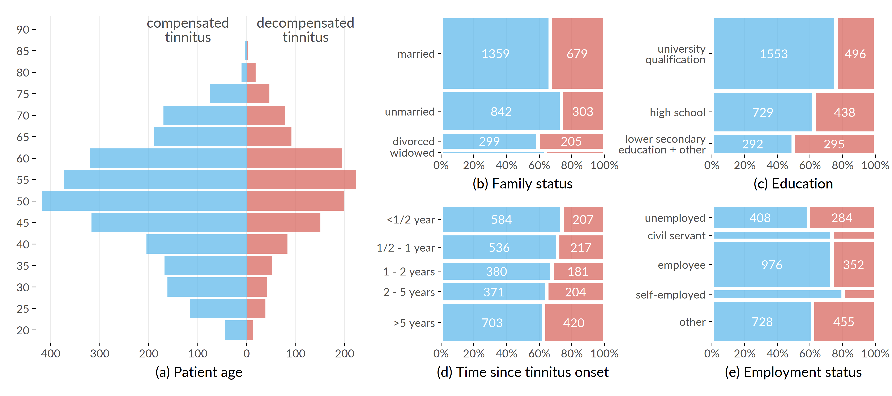
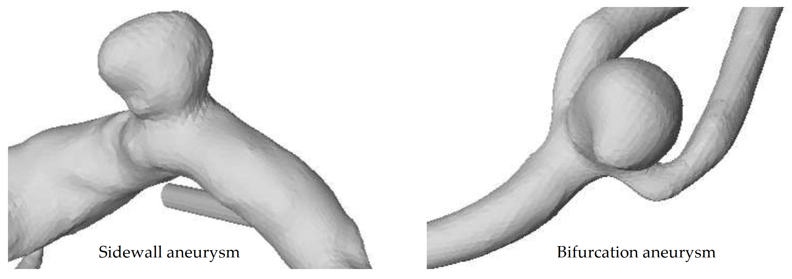

# Medical Background and Datasets {#background}

Medical research on data from clinical and epidemiological studies lays the foundation for decisions about diagnosing and treating multifactorial conditions such as diseases and disorders. 
Major goals are to identify long-term determinants and protective factors for an outcome of interest [@guo2020diabetes; @boehme2017stroke; @oliver2020causes], discover subpopulations with increased disease prevalence [@sanchez2020interpreting; @cimini2021adipose; @cohen2020clinical], and study intervention effects by generating statistical models explaining cause-and-effect relationships [@tsiatis2019dynamic; @hong2019quantile; @guglielmi2019statistical].
Traditional medical data analysis pipelines are usually structured in a _hypothesis-driven_ way as follows [@Klemm14]: 

(1) A medical scientist formulates a hypothesis based on observations in clinical practice or current research. Possible examples include: "How does a risk factor such as alcohol abuse affect the prevalence of a particular outcome?", or "What effect does a novel therapy have on patients with depressive symptoms?"
(2) A small set of relevant variables that can be controlled for confounders is selected to test this hypothesis. Variable selection may include controlling for confounders. The data necessary to test the hypothesis are then collected. 
(3) The strength of associations between the selected variables and the outcome is assessed using regression models and statistical methods.
(4) Based on the results, inferential statistical calculations will be performed, and conclusions will be drawn that may support the implementation of new preventive interventions or the use of appropriate treatments in high-risk patients.

However, with the advent of _big data_ [@oussous2018big] in various fields, including medicine, data volume and heterogeneity are increasing dramatically, making traditional hypothesis-driven workflows increasingly inadequate as important relationships between variables may go undetected [@viceconti2015big]. 
In this thesis, we present methods that deal with different aspects of high-dimensional timestamped medical data. 
We validate our methods on a variety of datasets from diverse study types. 

This chapter is divided into two parts. 
Section&nbsp;\@ref(background-med-research) provides a brief comparison of medical study types. 
In Section&nbsp;\@ref(background-data), we present the studies and the data samples for which we developed the methods proposed in this thesis. 

## Brief Comparison of Medical Study Types {#background-med-research}

_Primary medical research_ can be divided into basic, clinical, and epidemiological studies [@Roehrig:Arztebl2009]. 
The following comparison of these study types is based on the reviews of Thiese [@thiese2014observational] and Röhrig et al. [@Roehrig:Arztebl2009] if not indicated otherwise.

`r start_paragraph("Basic research.")`
Basic medical research (or experimental research) aims to improve the understanding of cellular, molecular, and physiological mechanisms of human health and disease by conducting cellular and molecular investigations, animal studies, drug and material property studies in tightly controlled laboratory environments. 
To study the effects of one or more variables of interest on the outcome, all other variables are usually held constant, and only the variables of interest are varied. 
The carefully standardized experimental conditions of basic medical studies ensure high internal validity, but these conditions often cannot be easily transferred to clinical practice without compromising the results' generalizability. 

`r start_paragraph("Clinical studies.")` Clinical studies are generally classified into _interventional_ (_experimental_) studies and _non-interventional_ (_observational_) studies. 
The general objective of an intervention study is to compare different treatments within a patient population whose members differ as little as possible except for the treatment arm. 
A common example is a pharmaceutical study that aims to validate the efficacy and safety by investigating or establishing a drug's main and side effects, absorption, metabolism, and excretion. 
Selection bias can be avoided by appropriate measures, in particular by randomly assigning patients to groups. 
Treatment may be a medication, surgery, therapeutic use of a medical device (e.g., a stent), physical therapy, acupuncture, psychosocial intervention, rehabilitation, training form, or diet. 
A _randomized controlled trial_ (RCT) is considered the gold standard of study design [@hariton2018]. 
Selection bias is minimized by (a) randomly assigning patients to treatment and control groups and (b) ensuring equal distribution of known and unknown influencing variables (confounders), such as risk factors, comorbidities, and genetic variability. 
RCTs are thus suitable for obtaining an unambiguous answer to a clear question concerning the (causal) efficacy of a treatment. 

Non-interventional clinical trials are patient-based observational studies in which patients either receive an individually defined treatment, or all patients receive the same treatment. 
An example of a non-interventional design is a study investigating the regular use of drugs in therapies.
Here, treatment, diagnosis, and monitoring do not follow a predefined study protocol but rather medical practice alone.
Data analysis is often retrospective. 
Whether a study design is _prospective_ or _retrospective_ depends on the sequence of hypothesis generation and data collection. 
In prospective studies, hypothesis generation comes before data collection. 
First, the hypotheses to be tested are defined, e.g., regarding a new treatment procedure. 
Then, data are collected specifically for hypothesis testing. 
By first formulating testable hypotheses, it is possible to ensure that the research questions can actually be answered with the measured data. 
A retrospective study design means that data collection took place before the study began.

`r start_paragraph("Epidemiological studies.")`
Epidemiological studies are usually interested in the distribution and change over time of the incidence of diseases and their causes in the general population and subpopulations. 
_Cohort studies_ examine individuals, some of whom do not have the health outcomes of interest at the beginning of the observation period and assess exposure status to various health-related conditions [@glenn2005cohort]. 
The included subjects are then followed up over time in _longitudinal_ studies (as opposed to _cross-sectional_ studies), where the outcomes of interest are recorded in multiple _waves_. 
With these data, researchers can establish subgroups of subjects by exposure status, sort them by exposure, and compare the incidence or prevalence of a disease among exposure categories.
Longitudinal studies are further categorized into _trend_ and _panel_ design. 
In a _trend_ study, each wave can involve a different participant sample, i.e., an individual participant is not followed over time.
In contrast, a _panel_ study investigates the same population at multiple points in time which allows to also measure _intra-individual_ temporal changes. 

## Datasets Investigated in This Thesis {#background-data}

In this section, we present the datasets and the associated studies investigated in this thesis, namely 

- the Study of Health in Pomerania in Section&nbsp;\@ref(background-data-ship),
- an observational therapy study on the health of tinnitus patients at baseline and after therapy in Section&nbsp;\@ref(background-data-cha),
- a clinical experiment study on diabetic foot syndrome in Section&nbsp;\@ref(background-data-diab), and
- a retrospective clinical study with image data on intracranial aneurysms in Section&nbsp;\@ref(background-data-aneur).

### The Study of Health in Pomerania (SHIP) {#background-data-ship}

After the reunification of Germany, it was found that life expectancy was significantly lower in the East than in the West [@volzke2015prevalence]. 
Furthermore, there were regional differences within the new states, with the lowest life expectancy found in the Northeast [@volzke2015prevalence; @wiesner2004life]. 
To find causal risk factors of mortality and other conditions in the northeastern German population, the Community Medicine Research Center in Greifswald established the _Study of Health in Pomerania_ (SHIP) [@Voelzke:SHIP11], a longitudinal epidemiological study of two independent cohorts in northeastern Germany. 
SHIP seeks to describe a broad spectrum of health conditions rather than focusing on a specific target disease [@Voelzke:SHIP11]. 
In particular, major study objectives include investigations of the prevalence of common diseases and their risk factors, the correlation and interaction between risk factors and diseases, the progression from subclinical to manifest diseases, the identification of subpopulations with increased health risk, the prediction of concomitant diseases, as well as the usage and costs of medical service.

Cohort inclusion criteria were age from 20 to 79 years, main residency in the study region, and German nationality. 
Participants of SHIP underwent an extensive, recurring (ca. every 5 to 6 years) examination program that encompasses personal interviews, body measurements, exercise electrocardiogram, laboratory analysis, ultrasound examinations, and whole-body magnetic resonance tomography (MRT).
Baseline examinations for the first cohort were performed between 1997 and 2001 (SHIP-0, N = 4308). 
Follow-up examinations were carried out in 2002-2006 (SHIP-1, n = 3300), 2008-2012 (SHIP-2, n = 2333), 2014 - 2016 (SHIP-3, n = 1718) and since 2019 (SHIP-4). 
Figure&nbsp;\@ref(fig:02-ship-sankey) illustrates participant response and age distribution of show-ups across study waves. 
Baseline information for a second, independent cohort (SHIP-Trend-0, N = 4420) was collected between 2008 and 2012, and a follow-up was conducted between 2016 and 2019. 
Major strengths of SHIP are a high level of quality assurance, standardized examination protocols, and a high cohort representativeness.

(ref:02-ship-sankey) **Participation response and age distribution of show-ups across SHIP study waves.** (a) Change in the number of show-ups and non-respondents relative to the cohort size across waves. (b) Age distribution of show-ups for each wave.

```{r 02-ship-sankey, echo=FALSE, fig.align='center', out.width="100%", fig.cap="(ref:02-ship-sankey)"}
knitr::include_graphics("figures/02-ship-sankey.png")
```

The examination program changed across waves. 
For example, MRT was not performed until SHIP-2; liver ultrasound was performed in SHIP-0 and SHIP-2 but not in SHIP-1; dermatologic examinations were performed in SHIP-1 and SHIP-2 but not in SHIP-0. 

Our analyses focus on the disorder _hepatic steatosis_, also known as "fatty liver", characterized by a high accumulation of fat in the liver, occurring in approximately 30% of all adults [@Voelzke:SHIP11; @volzke2005hepatic]. 
Risk factors include alcohol abuse, obesity, metabolic syndrome, and diabetes [@volzke2012multicausality]. 
Liver biopsy is considered the diagnostic gold standard [@antunes2019fatty] but is associated with intermediate risk for the patient. 
Non-invasive diagnostic techniques include MRI, CT, and ultrasound.
Because hepatic steatosis is usually asymptomatic, it often goes undetected, which can develop into more serious diseases, such as steatohepatitis, cirrhosis, hepatocellular carcinoma, or even liver failure [@antunes2019fatty].

We used SHIP data subsets to validate the methods presented in Chapters&nbsp;\@ref(imm), \@ref(sdclu), \@ref(evo), and&nbsp;\@ref(gender).

<!--The variables include socio-demographics, medical tests, ultrasound and whole-body MRT %, as well as variables from interviews on lifestyle, ailments etc
\cite{NiemannEtal:ESWA14,HielscherEtAl:CBMS14}.
%\textcolor[rgb]{0,0,1}{ The first moment, SHIP-0, contains n=4308 participants (recordings from 1997 to 2001); the recordings of the second moment SHIP-1 (n=3300 of the 4308 participants) were made in 2002-2006. MRT was recorded only in the third moment SHIP-2 (2008-2012, n= 2333).}
We consider 462 variables, where measurements of the same variable at different moments are treated as distinct variables. As in \cite{HielscherEtAl:IDA14}, we derive the binary target variable from a continuous variable that measures fat accumulation in the liver: an accumulation of more than 10\% corresponds to the positive class.
%take the variable mrt\_liverfat\_s2 (fat concentration in the liver) as basis to derive a binary classification variable:
%The positive class corresponds to a fat concentration of more than 10\%.
We use a random sample of 888 SHIP participants, 462 female ones (positive: 19\%) and 426 male ones (positive: 35\%).
%According to \cite{NiemannEtal:ESWA14}, learning on the original continuous variable lead to an inferior model, so we do not consider regression hereafter and stick to the transformed binary variable. 
%We consider 462 features, whereby the same feature at different moments (e.g. of the Body Mass Index) is counted as distinct features. 

%The dataset studied in \cite{NiemannEtal:ESWA14,HielscherEtAl:CBMS14,HielscherEtAl:IDA14} consists of 578 participants; we consider 310 more participants, and denote this superset as \subcohort. Following their findings on the differences between female and male participants with respect to the outcome, we also split the dataset into \partitionF (462 female participants, 19\% positive) and \partitionM (426 male participants, 35\% positive) and learn on each partition. 

%The class distribution is the same as for the 578 participants they studied, and so are the distribution of female and male participants and the prevalence of each class for each gender; the identical distributions are a natural consequence of the fact that the additional participants were randomly chosen. 

%\color{blue}SHIP participants undergo an examination program consisting of interviews, exercise tests, laboratory analysis, ultrasound examinations and whole-body magnetic resonance tomography (MRT). \color{black} For the first SHIP cohort, three examination waves, hereinafter denoted as "`moments"', exist: SHIP-0 (1997-2001, n= 4308), SHIP-1 (2002-2006, n= 3300) and SHIP-2 (2008-2012, n= 2333). \color{black}The continuous target variable containing the liver fat concentration (mrt\_liverfat\_s2) is only available in SHIP-2 and for a subset of 888 participants which we denote as \subcohort. Results of examinations which were repeatedly executed across the three study moments 0,1,2 are recorded in \subcohort as different features, e.g. som\_bmi\_s0, som\_bmi\_s1, som\_bmi\_s2 for the somatographic Body Mass Index, accumulating to 462 features. Prediction of the original continuous target feature with regression methods led to lackluster results as shown in \cite{NiemannEtal:ESWA14}. We therefore use the discretized target feature of \cite{HielscherEtAl:CBMS14} and \cite{NiemannEtal:ESWA14} to formulate a binary classification problem.
%%\color{blue}In \cite{NiemannEtal:ESWA14}, the use of the original target variable with regression led to poor results, we therefore discretize the target variable into a positive and negative class, with cut-off value choices as shown in \cite{HielscherEtAl:CBMS14} and \cite{NiemannEtal:ESWA14} to formulate a classification problem. 
%\color{black}Because of differing class distributions and number of features, we consider, as in the aforementioned works, the partition of female participants (\partitionF) and male participants (\partitionM) separately. After splitting the dataset \partitionF contains 462 individuals with a relative negative-class frequency of 0.81 and \partitionM contains 426 individuals with a relative negative-class frequency of 0.65.
%

%\color{blue}
%%SHIP is a population-based project \cite{Voelzke:SHIP11}: persons are chosen who reside in Pomerania (Northeast Germany) and are between 20 and 79 years old. SHIP participants undergo an examination program consisting of interviews, exercise tests, laboratory analysis, ultrasound examinations and whole-body magnetic resonance tomography (MRT). Three examination "`moments"' of the first SHIP cohort exist, SHIP-0 (1997-2001, n= 4308), SHIP-1 (2002-2006, n= 3300) and SHIP-2 (2008-2012, n= 2333). We have the SHIP-2 liver fat concentration only for 578 participants (mrt\_liverfat\_s2). The values of assessments at the three moments 0,1,2 are recorded in \subcohort as different features, e.g. som\_bmi\_s0, som\_bmi\_s1, som\_bmi\_s2 for the somatographic Body Mass Index (see also Figure 2, left upper part). In \cite{NiemannEtAl:ESWA14}, the use of the original target variable with regression led to poor results, we therefore discretize the continuous target variable into a positive and negative class, with cut-off value choices as shown in \cite{HielscherEtAl:cbms14} and \cite{NiemannEtAl:ESWA14} to formulate a classification problem. Like in both works, we also consider the partition of female participants (\partitionF) and male participants (\partitionM) separately, where \partitionF contains 314 individuals with a relative negative-class frequency of 0.81 and \partitionM contains 264 individuals with a relative negative-class frequency of 0.69.
%
%\color{black}-->

### The Charité Tinnitus Patients Observational Therapy Study Dataset (CHA) {#background-data-cha}

<!-- `r start_paragraph("The Charité tinnitus patients observational therapy study dataset (CHA)")`. This dataset contains information on a cohort of a total of 3,971 tinnitus patients who had been treated at the Tinnitus Center of the Charité University Medicine in Berlin between January 2011 and October 2015.  -->
<!-- All patients had been suffering from tinnitus for 3 months or longer, were 18 years of age or older and had sufficient knowledge of the German language.  -->
<!-- Treatment comprised a 7-day multi-modal treatment encompassing tinnitus-specific components, CBT, physiotherapy and information counselling.  -->
<!-- At registration, patients were asked to complete 15 questionnaires on socio-demographics, tinnitus-related distress, frequency, loudness, localization and quality as well as physical and mental health status, including levels of depression and perceived stress.  -->
<!-- Clinicians analyzed the questionnaire answers to derive patient-tailored treatment pathways. -->
<!-- To assess efficacy of the treatment, patients filled the same battery of questionnaires a second time.  -->


Tinnitus is the perception of a phantom sound in the absence of an external sound source. 
It is a complex, multifactorially caused and maintained phenomenon and is estimated to affect 10% to 15% of the adult population [@Baguley:Tinnitus2013].
The associated annual economic burden is 19.4 billion USD in the 
United States [@Bhatt:TinnitusAnxietyDepression2017] and 6.8 billion EUR in the Netherlands alone [@Maes:TinnitusCosts2013].
Clinical evaluation of tinnitus is challenging due to patient heterogeneity in tinnitus perception (laterality, pitch, noise characteristics, frequency, duration, chronicity), risk factors (including hearing loss, temporomandibular joint disorder, aging), comorbidities (including hyperacusis, depression, sleep disorders), perceived distress, and treatment response [@Cederroth2019]. 
These differences complicate the identification of an appropriate and effective treatment modality. 
Currently, there is no treatment gold standard: sound therapy (masking), informational counseling (minimal contact education), cognitive behavioral therapy, and tinnitus retraining have been shown to be effective for some patients, but there is also evidence that not all patients benefit equally from these forms of treatment [@Hobson:SoundTherapy2012; @Kroner:Counseling2003; @Henry:Counseling1996; @Martinez:CBTReview2007; @Phillips:TRT2010].
Due to the heterogeneous nature of the tinnitus symptom and the unclear evidence base regarding its treatment and management, identification of patient subgroups is critical to stratify individual pathophysiology and treatment pathways [@Langguth:LCA2017; @Tyler:TinnitusClustering2008; @Landgrebe:TRI2010].

The _"Charité tinnitus patients observational therapy study dataset" (CHA)_ includes self-report data from 4103 tinnitus patients treated at the Tinnitus Center of Charité Universitätsmedizin Berlin, Germany, between January 2011 and October 2015. 
All patients were 18 years of age or older and had suffered from tinnitus for at least 3 months. 
Exclusion criteria were the presence of acute psychotic illness or addiction, deafness, and insufficient knowledge of the German language. 
Treatment included a 7-day multimodal program with intensive and daily informational counseling, detailed ear-nose-throat psychological diagnosis, cognitive behavioral therapy interventions, hearing exercises, progressive muscle relaxation, and physical therapy.
At baseline (_T0_; before the start of therapy) and after treatment (_T1_), patients were asked to complete several self-report questionnaires.
These questionnaires were selected to obtain a comprehensive assessment of tinnitus, including tinnitus-related distress and the psychosomatic background of tinnitus with anxiety, depression, the general quality of life, and experienced physical impairments.

(ref:02-cha-questionnaires) **Description of questionnaires that form the basis for CHA.** |F|: total number of items, subscales and total scales.

```{r 02-cha-questionnaires, echo=FALSE, warning=FALSE}
`%>%` <- dplyr::`%>%`
kableExtra::kbl(
  tibble::tribble(
    ~"&nbsp;&nbsp;", ~"**Name**", ~"**Scope**", ~"**Subscales**", ~"**|F|**",
    1, "ACSA: Anamnestic Comparative Self-Assessment [@Bernheim:ACSA1993]", "Quality of life", "--", 1,
    #
    2, "ADSL: General Depression Scale [@Radloff:adsl1977; @Hautzinger:ADSL2003]", "Depressive symptoms", "--", 22,
    #
    3, "BI: Berlin Complaint Inventory [@Horhold:BI1997]", "General well-being, autonomic nervous system, pain and emotionality", "Exhaustion, abdominal symptoms, limb pain, heart symptoms", 29,
    #
    4, "BSF: Berlin Mood Questionnaire [@Horhold:BSF1993]", "Mood", "Anger, anxious depression, apathy, elevated mood, fatigue and mindset", 36,
    #
    5, "ISR: ICD-10 Symptom Rating [@Tritt:ICD2008]", "Mental disorders", "Anxiety, depression, obsessive-compulsive syndrome, somatoform syndrome, eating disorder, additional items", 36,
    #
    6, "PHQK: (Short-form) Patient Health Questionnaire [@Spitzer:PHQK1999]", "Symptoms of depression and anxiety", "--", 16,
    #
    7, "PSQ: Perceived Stress Questionnaire [@Fliege:PSQ2005]", "Stress", "Demand, tension, joy, worries",35,
    #
    8, "SES: Pain Perception Scale [@Geissner:SES1996]", "Pain", "Affective pain, sensoric pain", 29,
    #
    9, "SSKAL: Visual Analog Scales Pain", "Pain impairment, frequency and intensity", "--", 3,
    10, "SF8: Short Form 8 Health Survey [@Bullinger:SF2008]", "Health-related quality of life", "Body health, overall health, mental health, physical functioning, role emotional, role physical, vitality, mental component, physical component", 18,
    #
    11, "SOZK: A socio-demographics questionnaire [@brueggemann:sozk-reference]", "Gender, partnership status, education, employment status, among others", "--", 27,
    #
    12, "SWOP: Self-Efficacy- Optimism-Pessimism Scale questionnaire [@Scholler:SWOP1999]", "Self efficacy, optimism, pessimism", "--", 12, 
    #
    13, "TINSKAL: Visual analogue scales", "Tinnitus loudness, frequency and distress", "--", 3,
    #
    14, "TLQ: Tinnitus Localization and Quality questionnaire [@Goebel:TLQ1992]", "Location (left, right, bilateral, entire head) and sound of tinnitus", "--", 8,
    #
    15, "TQ: Tinnitus Questionnaire (German version) [@GoebelHiller:TF1998]", "Tinnitus-related distress and tinnitus severity", "Emotional and cognitive burden, persistence of sound, hearing difficulties, sleep difficulties and somatic complaints", 60
  ) %>%
    dplyr::select(-4),
  booktabs = TRUE, escape = FALSE, linesep = "",
  format = "markdown",
  caption = "(ref:02-cha-questionnaires)"
)
```

(ref:02-cha-patient-demographics-plot) **Patient demographics (CHA).** Overview of patient demographics by degree of tinnitus distress measured before therapy commencement.

```{r 02-cha-patient-demographics-plot, fig.cap="(ref:02-cha-patient-demographics-plot)", out.width="100%", echo=FALSE, fig.scap="fig.scap", eval = TRUE}

```


Table&nbsp;\@ref(tab:02-cha-questionnaires) provides an overview of all questionnaires used in our analyses. 
Most questionnaires contain multiple-choice items with answers on a Likert scale. For example, the "Tinnitus Questionnaire" [@GoebelHiller:TF1998] (TQ) contains 52 statements, such as "I am unable to enjoy listening to music because of the noises.", and respondents can give 3 possible answers: "not true" (coded as 0), "partly true" (1), and "true" (2). 
Some questionnaires also include aggregate variables called "subscales" and "total scores."
For example, the TQ total score (TQ\_distress) is calculated as the sum of 40 item values, with 2 items used twice [@GoebelHiller:TF1998], resulting in a range of values from 0 to 84, with higher values representing higher tinnitus-related distress. 
The cutoff value 46 [@GoebelHiller:TF1998] is used to distinguish between _compensated_ (0-46) and _decompensated_ (47-84) tinnitus. 
Furthermore, the average time to answer an item was recorded for each questionnaire. 
Figure&nbsp;\@ref(fig:02-cha-patient-demographics-plot) provides a graphical representation of demographic data for 3803 (92.7%) patients with complete data for the socio-demographics questionnaire [@brueggemann:sozk-reference] (SOZK) and TQ score. 

We used the CHA dataset to validate the methods developed in Chapters&nbsp;\@ref(phenotypes), \@ref(iml), and&nbsp;\@ref(gender).

### The Diabetic Foot Clinical Experiment Study (DIAB) {#background-data-diab}

<!-- `r start_paragraph("The diabetic foot clinical study dataset (DFD)")`. While SHIP investigates associations between risk factors of common diseases and health-related conditions in general, the "diabetic foot clinical study" [@Niemann:PONE2016;@Niemann:EBioMedicine2020]  -->
<!-- is a case-control study specifically investigating  -->
<!-- investigates differences between diabetes patients diagnosed with severe polyneuropathy and healthy controls. -->
<!-- In a pre-specified sequence of actions alternating between two postures, standing and sitting, custom-made sensor-bearing insoles placed in a closed shoe measured changes of a subject's plantar pressures and temperatures with high frequency over time.  -->
<!-- These measurements allowed for the analysis of pathophysiological and sensation-related differences between the two groups.  -->

_Diabetic foot syndrome_ is an umbrella term for foot-related problems in diabetic patients. 
Up to one in four diabetes patients will develop a foot ulcer during their lifetime [@RN1], with many at risk of amputations in the next four years [@RN2].
More than 85% of foot amputations are due to foot ulcers [@RN3; @RN4]. 
The rate of foot amputations in diabetes patients is estimated to be 17-40 times higher than in the general population [@RN12]. 
DFS patients are predisposed to peripheral sensory neuropathy, which results, for example, in patients being unaware of the temperature of their feet or the pressure applied to them. 
Affected individuals may even injure themselves without realizing it. 
Excessive plantar pressures can exacerbate tissue destruction and increase the lifetime risk of foot ulceration [@SinghEtAl:PreventingFootUlcers2005]. 
However, understanding of the pathomechanisms underlying tissue destruction in the absence of trauma is limited. 

<!--therapeutic footwear-->

At the university hospital of Magdeburg, Germany, an experimental study with 31 healthy volunteers and 30 diabetes patients diagnosed with severe polyneuropathy was conducted to quantify pressure- and posture-dependent changes of plantar temperatures as surrogate of tissue perfusion. 
For this purpose, plantar pressure and temperature changes in the feet were recorded during extended episodes of standing. 
Custom-made shoe insoles [@GruetznerEtAl:SmartDiabeticInsole2015] equipped with eight temperature sensors and eight pressure sensors at preselected positions were used for data acquisition (Figure&nbsp;\@ref(fig:02-df-infrared-sole-sensor-positions-plot)&nbsp;(a)). 
The insoles were positioned into closed protective shoes specifically developed for diabetes patients. 
Within such shoes, the temperature increases over time due to exchange with the person's body temperature and is also affected by the environmental temperature.
To closely monitor the in-shoe temperature changes, one sensor was placed at the bottom of the insole without contact to the feet, which was denoted "ambient temperature sensor". 

(ref:02-df-infrared-sole-sensor-positions-plot) **Positions of pressure- and temperature sensors on insole and temporal, pressure-dependent temperature change.** (a) Sensor positioning on the insole in relation to foot placement. (b) Thermographic infrared images showing a healthy subject in a seated position with no pressure applied to the feet (before) and after placement of a 20 kg weight on both thighs. The measured temperature ranged from 29°C (blue) to 34°C (red). A time-dependent temperature decrease was observed predominantly in the forefoot region, visualized by yellow color during pressure application. A rapid temperature increase was noted within 1 min after pressure relief. MTB: metatarsal bone. The figure is adapted from [@Niemann:EBioMedicine2020].

```{r 02-df-infrared-sole-sensor-positions-plot, fig.cap="(ref:02-df-infrared-sole-sensor-positions-plot)", out.width="100%", echo=FALSE, fig.scap="fig.scap", eval = TRUE}
knitr::include_graphics("figures/02-df-infrared-sole-sensor-positions.png")
```

Data collection began immediately after the shoes were put on. 
Participants were asked to follow a predefined sequence of actions, i.e., alternating between standing (_stance episode_) and sitting (_pause_). 
A session consisted of 6 stance episodes lasting 5, 10, 20, 5, 10, and 20 minutes, respectively, separated by pause episodes lasting 5 minutes each.
Participants were instructed to apply equal pressure to both feet while standing. 
Participants did not receive immediate feedback on the actual application of pressure during the sessions, but they were verbally encouraged by the study nurses to maintain pressure while standing without releasing it. 
In the seated position, participants were instructed to release pressure for 5 minutes while maintaining contact with the insole. 
Participants were explicitly asked to adhere to these instructions, i.e., not to release pressure during a standing episode temporarily. 
The study protocol further included that the measurements were performed twice, once at room temperature of approximately 22°C and once outdoors at an ambient temperature of approximately 16°C. 
The two measurements were performed on two independent days.

The thermographic images in Figure&nbsp;\@ref(fig:02-df-infrared-sole-sensor-positions-plot) (b) visualize exemplary changes in plantar temperature in a healthy subject in a sitting position before pressure application (1), after placing a 20 kg weight on the front of the thigh (2-6), and after removing the additional weight (7-8). 
During pressure application, a gradual temporal decrease in temperature was noted predominantly in the forefoot. 
After pressure relief, a rapid temperature increase was observed within 1 min.

We used the DIAB dataset to validate the methods developed in Chapter&nbsp;\@ref(diabfoot).


<!-- ## MONICA -->

<!-- **MONICA**. This dataset is derived from the Danish population of the WHO project MONICA (Multinational MONItoring of trends and determinants in CArdiovascular disease). -->
<!-- MONICA is a longitudinal epidemiological cohort study focusing on risk factors of cardio-vascular diseases, as well as causes and trends regarding the differences in the mortality between countries [@WHO:MONICA1989].  -->
<!-- Overall, 37 centers from 21 countries participated in the cohort study conducted between 1976 and 2002.  -->
<!-- Accomplishments of the project include the establishment of a profound database for prevention research and improvements on treatment of cardio-vascular diseases due to the identification of risk factors such as increased cholesterol and nicotine levels.  -->
<!-- In the Danish MONICA cohort, over 30,000 residents from the south-western of Copenhagen County, aged between 25 and 74 years, participated in three waves from  1982 to 1991 [@Bronnum:DanMONICA2001].  -->
<!-- The baseline examinations were conducted in 1982-1986 (DAN-MONICA I) with the first two follow-ups in 1986-1987 (DAN-MONICA II) and in 1991-1992 (DAN-MONICA III).  -->
<!-- %Our dataset contains 400 variables from the first three study waves for a random sample of 4,000 participants. -->
<!-- %The variables include questionnaire answers with participant information on socio-demographics, medication, lifestyle and psychological factors, as well as anthropometrics, genetic markers and laboratory values.  -->
<!-- %Our binary target variable \texttt{heart\_blood\_disease} denotes whether at least one of the following disorders or conditions are present in the second follow-up: heart attack, stroke, blood clot in brain, hypertension, other heart disease. % -->
<!-- %Out of 2648 participants, 688 are positive w.r.t. \texttt{heart\_blood\_disease} ($\approx 26\%$). -->

### The Intracranial Aneurysm Angiography Image Dataset (ANEUR) {#background-data-aneur}

<!-- **The intracranial aneurysm angiography image dataset (ANEUR)**. The "intracranial aneurysm angiography image dataset" (ANEUR) contains angiographical image data of 74 patients with a total of 100 intracranial aneurysms [@Niemann:CBMS2018].  -->
<!-- Intracranial aneurysms are pathologic dilations of the intracranial vessel wall, bearing the risk of rupture and thus subarachnoidal hemorrhages with often fatal consequences for the patient.  -->
<!-- Since treatment may cause severe complications as well, the goal is to generate models that can separate between ruptured and non-ruptured aneurysms.  -->

Intracranial aneurysms are pathologic dilations of the intracranial vessel wall, often in the form of a dilation. <!--outward bulging-->
They bear a risk of rupture, leading to subarachnoidal hemorrhages with often fatal consequences for the patient. 
Since treatment can also cause severe complications, extensive studies were conducted to assess the patient-individual rupture risk based on various parameters, including aneurysm symptomatology, size, location, and patient age and sex [@Wermer2007]. 
Further studies identified parameters, such as aspect ratio, undulation index, and nonsphericity index, to be statistically significant with respect to aneurysm rupture status [@Dhar2008; @Xiang2011].
However, although these studies allow for retrospective analysis, the clinician needs further guidance if an asymptomatic aneurysm (as an accidental finding) was detected and the rupture risk should be determined. 

We developed methods for the retrospective _"Intracranial Aneurysm Angiography Image Dataset"_ (ANEUR) comprising 3D rotational angiography data from 74 patients (age: 33-85 years, 17 male and 57 female patients) of the university hospital of Magdeburg, Germany, adding up to a total of 100 intracranial aneurysms. 
We identified two primary goals for this dataset: (i) build models that can accurately predict rupture status based on morphological parameters only, and (ii) assess the importance of these parameters to the models with optimal accuracy. 

Motivated by the results of Baharoglu et al. [@BaharogluEtAl:Neurosurgery2012], who found differences between sidewall and bifurcation aneurysms (cf. Figure&nbsp;\@ref(fig:02-aneur-sw-bf)) in terms of the relationship of several morphological parameters and rupture status, we learn different models for the subset of sidewall aneurysms (9 (37.5%) of 24 ruptured) and the subset of bifurcation aneurysms (29 (46.8%) of 62 ruptured). 
Additionally, we run experiments on a combined group (43 of 100 ruptured) containing 14 additional samples that could not be clearly determined to be either sidewall or bifurcation aneurysms. 

(ref:02-aneur-sw-bf) **Sidewall and bifurcation aneurysms.** Illustration of an aneurysm at the side of the parent vessel wall (left) and an aneurysm at a vessel bifurcation (right). The figure is adapted from [@Niemann:CBMS2018].

```{r 02-aneur-sw-bf, echo=FALSE, fig.align='center', out.width="100%", fig.cap="(ref:02-aneur-sw-bf)"}

```

<!--!!! DEMOGRAPHIC INFORMATION AS IMAGES?-->
<!--Sylvia: erste Ergebnisse von RUSKLAINER zeigen.-->

We used the ANEUR dataset to validate the methods developed in Chapter&nbsp;\@ref(iml).

