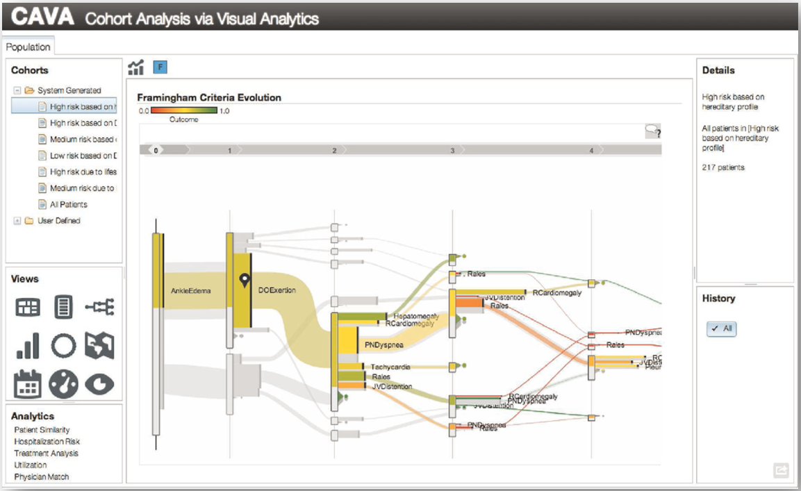
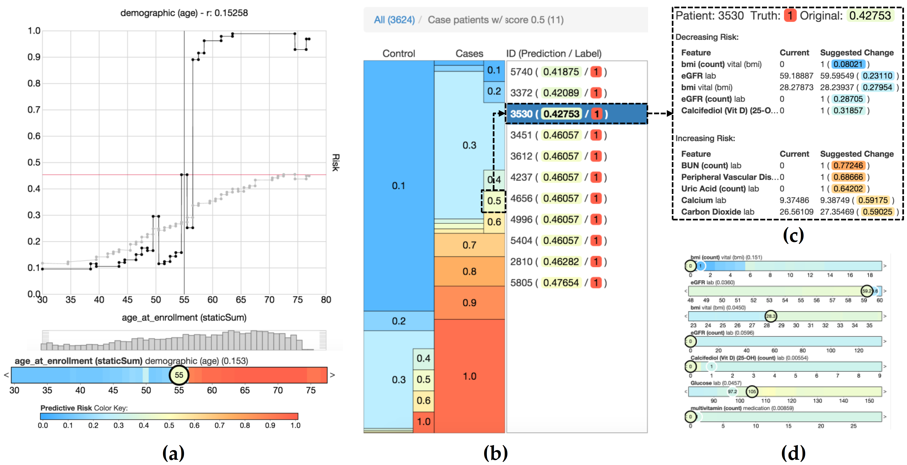
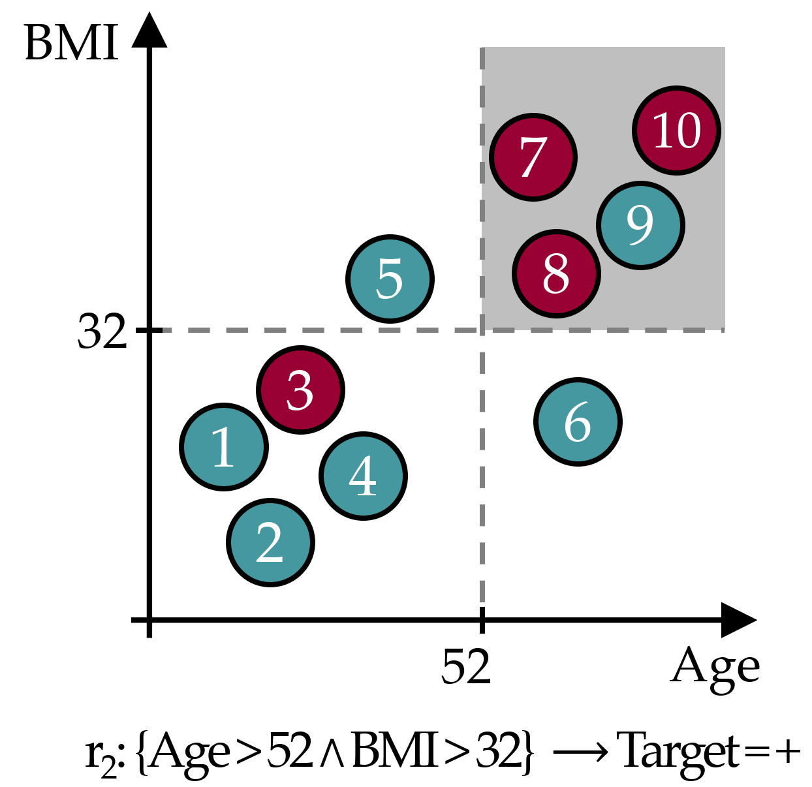
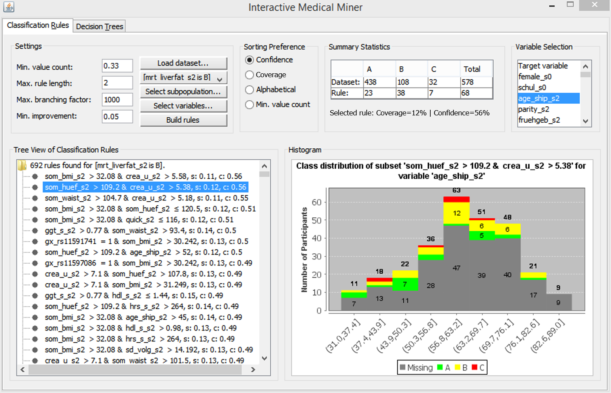
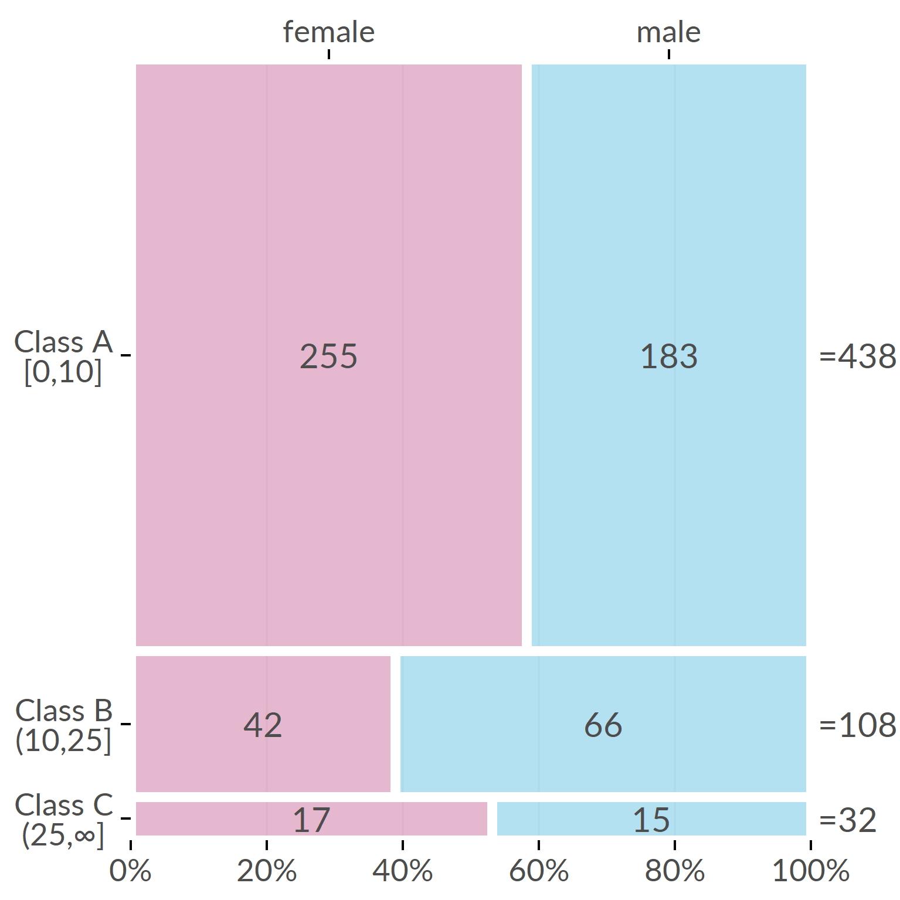
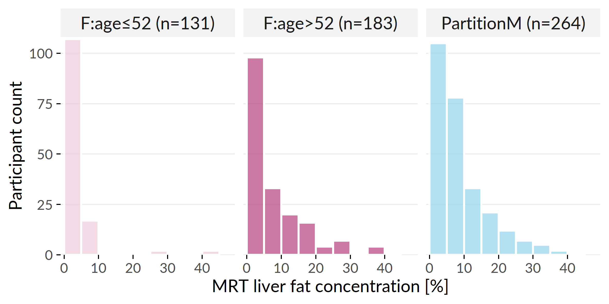
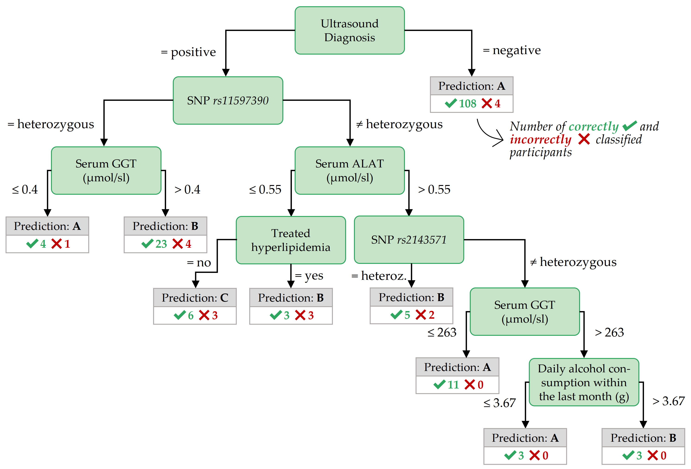
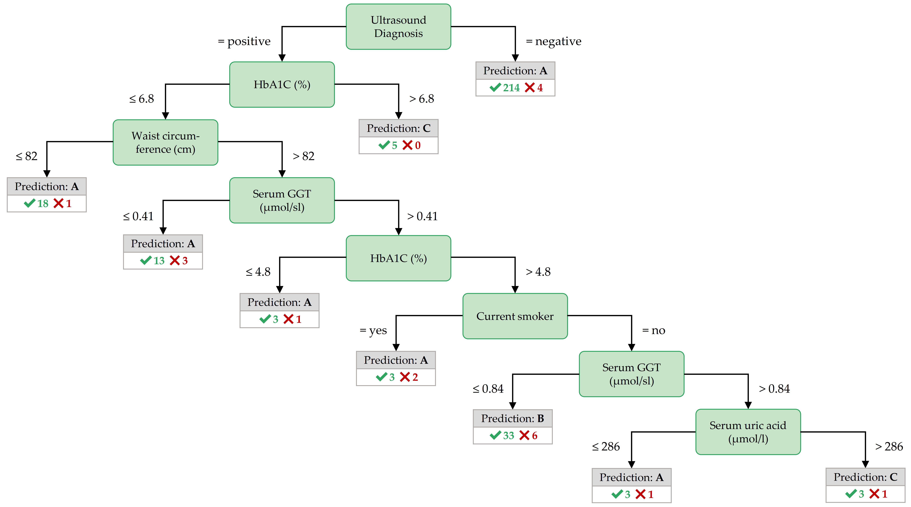
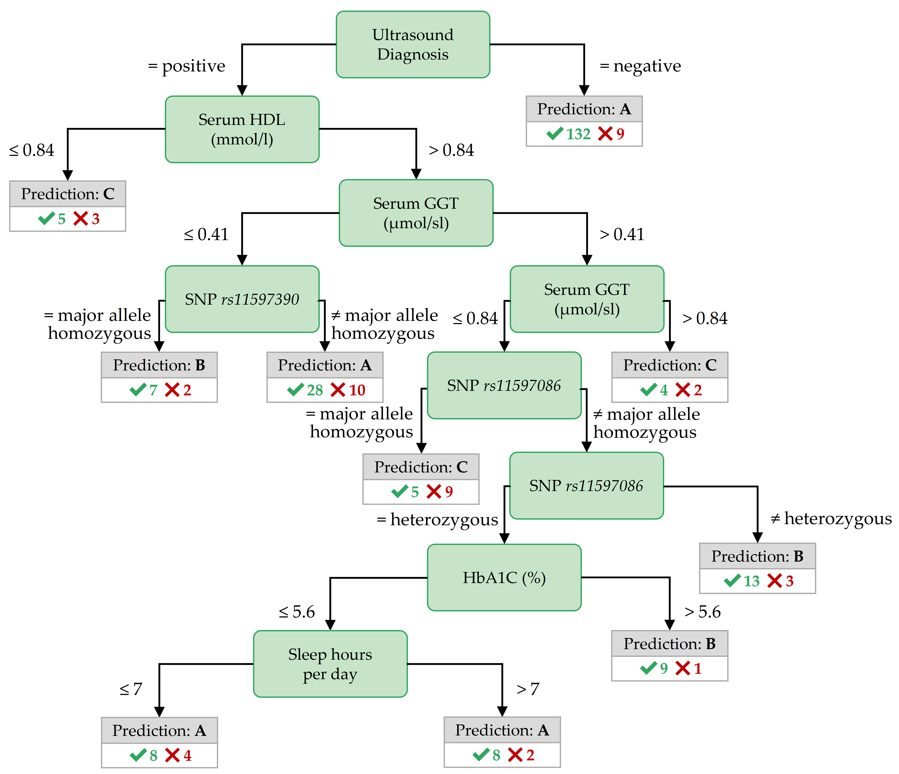

# (PART) Subpopulation Discovery in High-Dimensional&nbsp;Data {-}

# Interactive Discovery and Inspection of Subpopulations {#imm}

```{r 03-setup, eval = FALSE, echo = FALSE, cache = TRUE, message = FALSE, results='asis'}
source("code/00-chapter-start-bib.R")
print_bib(c("Niemann:ESWA2014", "Niemann:IMM2014"), bib = bib)
```


:::: {.infobox .chapter-summary data-latex="{tasks.pdf}"}

#### Brief Chapter Summary {-}

Analysis of population-based cohort data has been mostly hypothesis-driven.
We present a workflow and an interactive application for data-driven analysis of population-based cohort data using hepatic steatosis as an example. 
Our mining workflow includes steps 

i. to discover subpopulations that have different distributions with respect to the target variable, 
ii. to classify each subpopulation taking class imbalance into account, and
iii. to identify variables associated with the target variable. 

We show that our workflow is suited (a) to build subpopulations before classification to reduce class imbalance and (b) to drill-down on the derived models to identify predictive variables and subpopulations worthy of further investigation.

::::

:::: {.lit .chapter-literature data-latex=""}
This chapter is partly based on:

- Uli Niemann, Henry Völzke, Jens-Peter Kühn, and Myra Spiliopoulou. "Learning and inspecting classification rules from longitudinal epidemiological data to identify predictive features on hepatic steatosis". In: _Expert Systems with Applications_ 41.11 (2014), pp. 5405-5415. DOI: [10.1016/j.eswa.2014.02.040](https://doi.org/10.1016%2Fj.eswa.2014.02.040).
- Uli Niemann, Myra Spiliopoulou, Henry Völzke, and Jens-Peter Kühn. "Interactive Medical Miner: Interactively exploring subpopulations in epidemiological datasets." In: _ECML PKDD 2014, Part III, LNCS 8726_. Springer, 2014, pp. 460-463.
DOI: [10.1007/978-3-662-44845-8_35](https://doi.org/10.1007%2F978-3-662-44845-8_35).

::::

<!-- **TODO: Kurze Überleitung** -->

This chapter is organized as follows.
In Section&nbsp;\@ref(imm-intro), we motivate for classification and interactive subpopulation discovery in epidemiological cohort studies and review related work. 
We present our workflow and the interactive assistant in Section&nbsp;\@ref(imm-workflow). 
In Section&nbsp;\@ref(imm-experiments), we report our results and main findings. 
The chapter closes with a summary and a discussion of the main contributions in Section&nbsp;\@ref(imm-conclusion).

## Motivation and Comparison to Related Work {#imm-intro}

Medical decisions about the diagnosis and treatment of multifactorial conditions such as diseases and disorders are based on clinical and epidemiological studies [@elmore2020jekel].
The latter contain information about participants with and without a disease and allow learning of discriminatory models and, in longitudinal designs, understanding disease progression.
For example, several studies identified risk factors (such as obesity and alcohol consumption) and comorbidities (such as cardiovascular disease) associated with hepatic steatosis [@IttermannEtAl:Thyroid2012; @LauEtAl:2010; @StickelEtAl:2011; @Targher:2010; @Markus:2013].
However, these studies identified risk factors and associated outcomes that relate to the _entire_ population. 
Our work arose from the need to identify such factors for subpopulations to promote personalized diagnosis and treatment, as expected in personalized medicine [@Hingorani:2013; @Voelzke:Cardiol2013]. 

### Role of Subpopulations in Classifier Learning for Cohorts

Classification on subpopulations was studied by Zhanga and Kodell [@AIM13], who pointed out that classifier performance on the whole dataset may be low if the entire population is very heterogeneous. 
Therefore, they first trained an ensemble of classifiers and then used each ensemble member's predictions to create a new feature space.
They performed hierarchical clustering to partition the instances into three subpopulations: one where the prediction accuracy is high, one where it is in the intermediate range, and one where it is low. 
Using this approach, Zhanga and Kodell partition the original data set into subpopulations that are easy or hard to classify. 
While the method seems appealing in general, it appears inappropriate for the three-class problem of the SHIP data, which has a highly skewed distribution, so it is clear that the low classification accuracy is caused (in part) by the class imbalance. 
Therefore, we exploratively examined the data set _before_ classification to identify less skewed subpopulations and _after_ classification to determine -- within each subpopulation -- variables strongly associated with the target.

<!-- **Classification Rule Mining.**  -->
Pinheiro et al. performed association rule discovery in patients with liver cancer [@PinheiroEtAl:ICCABS13]. 
The authors pointed out that early detection of liver cancer reduces the mortality rate.
Early detection is still difficult because patients often do not show symptoms in the early stages of liver cancer [@PinheiroEtAl:ICCABS13]. 
Pinheiro et al. used the association rule algorithm FP-growth [@Han:FPGrowth00] to discover high-confidence association rules and high-confidence classification rules related to liver cancer mortality. 
We also considered association rules promising for medical data analysis because they are easy to compute and produce results that are understandable to humans. 
Therefore, we used association rules as the primary method, but for epidemiological data and classification rather than for mortality prediction. 
To use association rules for classification, we specified that the rule's consequence is the target variable. 

<!-- Big survey: Interactive Information Visualization to Explore and Query Electronic Health Records [@rind2013interactive] -->

<!-- Cohort analysis aims to uncover meaningful associations between risk factors (or preventive factors) and an outcome.  -->
<!-- Nowadays, large medical data with comprehensive historical data about patients, possibly over time spans of many years, have become available.  -->
<!-- Domain experts lack the technical expertise to perform tasks such as data management, analysis and summarization on very large datasets.  -->
<!-- For example, whereas in the past it was sufficient to have working knowledge of basic statistics and a spreadsheet software like Microsoft Excel, data storage and retrieving has become technically challenging, as data from heterogeneous sources (tables, images, text and speech recordings) have to be queried.  -->
<!-- Thus, domain experts usually rely on technical experts to help them perform these tasks.  -->
<!-- However, this process is often slow, tedious and expensive.  -->
<!-- It would be better to equip the domain expert with a technical tool that allows them to quickly perform exploratory analyses on their own.  -->

### Workflows for Expert-Machine Interaction for Cohort Construction and Analysis

<!-- CAVA -->
Zhang et al. [@Zhang:CAVA2015] addressed the increasing technical challenges of medical expert-driven subpopulation discovery due to increasingly large and complex medical data, often including information from hundreds of variables for thousands of patients in the form of tables, images, or text. 
In the past, it was sufficient for a physician to have some basic knowledge of statistics and spreadsheet software such as Microsoft Excel to analyze a small table of patient data.
Today, more effective and efficient approaches for managing, analyzing, and summarizing extensive medical data are available [@Zhang:CAVA2015].
However, domain experts typically rely on technical experts to help them perform these tasks. 
This back-and-forth is often slow, tedious, and expensive. 
Therefore, it would be better to provide the domain expert with a technical tool that allows them to perform exploratory analysis by themselves quickly. 
Zhang et al. [@Zhang:CAVA2015] presented CAVA, a system that includes various subgroup visualizations (called "views") and analytical components (called "analytics") for subgroup comparison. 
The main panel in Figure&nbsp;\@ref(fig:03-cava) shows one of the views: a flowchart [@wongsuphasawat2012exploring] of patient subgroups with the same sequence of symptoms. 
The user can obtain additional summaries by interacting with the visualization, for example, by dragging and dropping one of the boxes in the flowchart onto one of the entries in the analysis panel. 
The user can also expand the selected cohort by having the tool search for patients who do not strictly meet the current inclusion criteria but are somewhat _similar_ to the selected patient subpopulation of interest [@ebadollahi2010predicting].

(ref:03-cava) **CAVA's graphical user interface.** The flowchart visualizes subgroups of cardiac patients organized by the common occurrence of symptoms. Arc color represents the hospitalization risk. The user can switch between graphical representations and data processing methods by dragging and dropping. The upper right panel contains detailed information about the currently selected patients. The lower right panel contains a provenance graph that allows the user to undo operations and revisit previous interaction steps. The figure is taken from [@Zhang:CAVA2015].

```{r 03-cava, echo=FALSE, fig.align='center', out.width="100%", fig.cap="(ref:03-cava)"}

```

<!-- PROSPECTOR -->
Krause et al. [@Krause:Prospector2016] argued that model selection should not be based only on global performance metrics such as accuracy, as these statistics do not contribute to a better understanding of the model's reasoning. 
Moreover, a complex but highly accurate model does not automatically guarantee actionable insights. 
Krause et al. propose Prospector [@Krause:Prospector2016], a system that provides diagnostic components for complex classification models based on the concepts of partial dependence (PD) plots [@Friedman:PDP2001]. 
PD plots are a popular tool for visualizing _marginal effects_ of features on the predicted probability of the target. 
Briefly, each point on a PD plot represents the model's average prediction over all observations, assuming that these observations had a fixed value for a feature of interest. 
A feature whose PD curve exhibits a high range or high variability is considered more influential on model prediction than a feature with a flat PD curve. 
Closely related to PD plots are individual conditional expectation (ICE) plots, [@Goldstein:ICE2015] which display a curve for each observation, helping to reveal contrasting subpopulations that might "average out" in a PD plot. 
Prospector combines PD and ICE curves to show the relationship between a feature and model prediction at a (_global_) model level and a (_local_) patient-individual level. 
Besides, a custom color bar is provided as a more compact alternative to ICE curves (Figure&nbsp;\@ref(fig:03-prospector) (a)). 
A stacked bar graph shows the distribution of predicted risk scores for each study group (Figure&nbsp;\@ref(fig:03-prospector) (b)). 
The user can click on a specific decile to obtain a list of individual patients with their exact predicted score and label.
In this way, patients whose prediction scores are close to the decision threshold can be further investigated. 
For each feature, the authors calculate the "most impactful feature change": given a patient's current feature values, they identify a near-counterfactual value that leads to a large change in the predicted risk score by minimizing the difference from the original feature value and maximizing the predicted risk score. 
The top 5 of these so-called "suggested changes" are displayed -- separately for increasing and decreasing disease risk - in a table (cf. Figure&nbsp;\@ref(fig:03-prospector) (c)) and integrated as interactive elements into the IC color bars (cf. Figure&nbsp;\@ref(fig:03-prospector) (d)).
<!--2016_Perer_Prospector_CHI2016-->

(ref:03-prospector) **Selected model diagnostics of Prospector.** (a) The upper plot shows two curves for the characteristic "age": the gray partial dependence (PD) curve represents the marginal prediction of the model over all patients, while the black individual conditional expectation (ICE) curve illustrates the effect of counterfactual ages on the predicted risk of diabetes for an example patient. The histogram shows the age distribution. The color bar below is a compact representation of the ICE curve above; the circled value represents the selected patient's feature value. (b) Stacked bars show the distribution of predicted risk scores for each study group. Clicking on one of the bars opens a table showing the ID, predicted risk, and true label for all patients belonging to the selected decile of predicted risk. (c) Summary table of "most impactful feature changes" for a decreasing (upper group) and an increasing (lower group) predicted risk: each row shows the actual feature value and the "suggested change," i.e., a similar but counterfactual value that would lead to a significant change in predicted risk. (d) Multiple PD color bars augmented with suggested changes (labels outlined in white). The figure is adapted from [@Krause:Prospector2016].

```{r 03-prospector, echo=FALSE, fig.align='center', out.width="100%", fig.cap="(ref:03-prospector)"}

```

Pahins et al. [@Pahins:COVIZ2019] presented COVIZ, a system for cohort construction in large spatiotemporal datasets. 
COVIZ includes components for exploratory data analysis of treatment pathways and event trajectories, visual cohort comparison, and visual querying. 
One of the design goals of COVIZ was to be fast, e.g., by using efficient data structures such as Quantile Data Structure [@de2019real] to ensure low latency for all computational operations and thus suitability for large data sets. 
<!-- A visual-Interactive System for Prostate Cancer Cohort Analysis -->
Bernard et al. [@bernard2015visual] proposed a system for cohort construction in temporal prostate cancer cohort data that included visualizations for subpopulations and individual patients. 
To guide users during exploration, visual markers indicate interesting relationships between attributes derived from statistical tests. 
Recently, Corvo et al. [@Corvo2020] presented a comprehensive visual analytics system for pathological high-throughput data, which encompasses all major steps of a typical data analysis pipeline, such as preprocessing raw histopathology images by interactive segmentation, components for exploratory data analysis, and interactive cohort construction in a high-dimensional feature space, feature engineering which includes extraction of potentially predictive biomarker features, modeling, as well as visualization and summarization of the modeling results. 
Preim and Lawonn provided comprehensive reviews of visual analytics methods and applications in public health [@preim2020survey] and epidemiology [@Preim16] in particular. 

### Previous Work on Subpopulation Discovery with the SHIP Data

<!-- `r start_paragraph("Previous Work on SHIP.")` -->
Since we carry out the proof-of-concept for our workflow on the SHIP data, we list major scientific preparatory work hereafter.
Preim et al. [@Preim:EurographicsMedPrice2019] provided an overview of the research that developed data mining and visual analytics methods to gain insights into the SHIP data.
Among them is the "3D Regression Cube" of Klemm et al. [@Klemm:RegressionHeatmap2015], a system that allows interactive exploration of feature correlations in epidemiological datasets. 
The system generates many multiple linear regression models from different combinations of one dependent and up to three independent variables and displays their goodness of fit in a three-dimensional heat map. 
The system allows the user to modify the regression equation, for example, by changing the number of independent variables, specifying wild cards and interaction terms, fixing one of the variables to reduce computational complexity, or focusing specifically on a variable of interest.
Our approach is also able to identify variables that are strongly associated with the target variable.
However, we search for subpopulation-specific relationships rather than generating a global model for the entire dataset, and we additionally provide predictive value ranges.
Klemm et al. [@Klemm14] presented a system that combines visual representations of non-image and image data. 
They identify clusters of back pain patients for the SHIP data. 
Since we specify hepatic steatosis as the target variable, we instead build supervised models and classification rules that directly capture the relationships between predictors and the target variable.
<!-- S-ADVIsED -->
Alemzadeh et al. [@eurova.20171118] presented S-ADVIsED, a system for interactive exploration of subspace clusters that incorporates various visualization types such as donut diagrams, correlation heatmaps, scatterplot matrices, mosaic diagrams, and error bar graphs. 
While S-ADVIsED requires the user to input mining results obtained in advance outside the system, our tool enables expert-driven interactive _subpopulation discovery_ instead of expert-driven interactive _result exploration_. 
<!-- our tool is more interactive -->
Hielscher et al. [@Hielscher16] developed a semi-supervised constrained-based subspace clustering algorithm to find diverse sets of _interesting_ feature subsets using the SHIP data. 
To guide the search for predictive feature subsets, the expert can provide their domain knowledge in the form of a small number of instance-level constraints, forcing pairs of instances (i.e., study participants) to be assigned either to the same or a different cluster. 
Hielscher et al. [@Hielscher2018] extended their work and introduced a mechanism to validate subpopulations on independent cohorts.

## Subpopulation Discovery Workflow and Interactive Mining Assistant {#imm-workflow}

In this section, we present our subpopulation discovery workflow.
We build classification models on the whole dataset and different partitions, as described in Section&nbsp;\@ref(imm-workflow-classification).
In Section&nbsp;\@ref(imm-workflow-rule-discovery), we introduce relevant underpinnings of classification rule discovery, followed by a description of the primarily used HotSpot [@hotspot2012] algorithm in Section&nbsp;\@ref(imm-workflow-hotspot). 
We present our interactive mining assistant in Section&nbsp;\@ref(imm-workflow-imm).
The dataset used for population partitioning and class separation on the target variable hepatic steatosis comes from the "Study of Health in Pomerania" (SHIP), recall Section&nbsp;\@ref(background-data-ship). 
In Section&nbsp;\@ref(imm-workflow-target), we describe the origin and availability of the target variable.
In Section&nbsp;\@ref(imm-workflow-partitioning), the motivation for data partitioning and the partitioning steps are presented. 

### Classification {#imm-workflow-classification}
For the classification of cohort participants, we focus on algorithms that provide interpretable models, as we aim to identify predictive _conditions_, i.e., variables and values/ranges in the models. 
Therefore, we consider decision trees, classification rules, and regression trees. 
We use the J4.8 decision tree classification algorithm (equivalent to the C4.5 algorithm [@Q92]) from the Waikato Environment for Knowledge Analysis (Weka) Workbench [@FrankEtAl:Weka2016]. 
This algorithm builds a tree successively by partitioning each node (a subset of the dataset) to the variable that maximizes the information gain within that node. 
The original algorithm works only with variables that take categorical values, creating one child node per value. 
However, the Weka implementation also provides an option that forces the algorithm always to create exactly two child nodes: one for the best separating value and one for all other values. 
We use this option in our experiments because it yields better quality trees. 
The Weka algorithm also supports variables that take numeric values: 
A node is split into two child nodes by partitioning the variable's range of values into two intervals.

To deal with the skewed distribution, we consider the following classification variants: 

- _Naive_: the problem of imbalanced data is ignored.
- _InfoGain_: we keep only the top 30 of the 66 variables by sorting the variables on information gain towards the target variable.
- _Oversampling_: We use SMOTE [@CBHea02] to resample the dataset with minority-oversampling: for class B, 100% new instances are generated; for class C, 300% new instances are generated, resulting in the following distribution A: 438, B: 216, C: 128.
- _CostMatrix_: We prefer to misclassify a negative case rather than not detecting a positive case, so we penalize false negatives (FN) more than false positives (FP). 
We use the cost matrix depicted in Table&nbsp;\@ref(tab:03-costmatrix). 

(ref:03-costmatrix) **Cost matrix.** Cost matrix to penalize misclassification under class imbalance.

```{r 03-costmatrix, echo=FALSE}
`%>%` <- dplyr::`%>%`
kableExtra::kbl(
  tibble::tribble(
    ~` `, ~A, ~B, ~C,
    "A", 0, 1, 2,
    "B", 2, 0, 1,
    "C", 3, 2, 0
  ) %>% dplyr::mutate(`  ` = "True", .before = 1),
  align = "c", booktabs = TRUE, linesep = "", caption = "(ref:03-costmatrix)"
) %>%
  kableExtra::kable_classic() %>%
  kableExtra::add_header_above(c(" " = 2, "Predicted" = 3), bold = TRUE) %>%
  kableExtra::column_spec(1, bold = TRUE) %>%
  kableExtra::collapse_rows(columns = 1, valign = "middle", latex_hline = "none") 
```

### Classification Rule Discovery {#imm-workflow-rule-discovery}

Classification rules can reveal interesting relationships between one or more features and the target variable [@Fuernkranz:12; @Herrera11]. 
Compared to model families such as deep neural networks, support vector machines and random forests, classification rules usually achieve lower accuracy. 
However, they are easier to interpret and infer and are therefore more suitable for interactive subpopulation discovery. 
In epidemiological research, interesting subpopulations could subsequently be used to formulate and validate a small set of hypotheses or investigate associations between risk factors for a particular target variable. 
A subpopulation of interest could be formulated as follows: "In the sample of this study, the prevalence of goiter is 32%, whereas the probability in the subpopulation described by _thyroid-stimulating hormone_ less than or equal to 1.63 mU/l and _body mass index_ greater than 32.5 kg/m^2^ is 49%." 

Classification rule algorithms induce descriptions of _interesting_ subpopulations where interestingness is quantified by a quality function. 
A classification rule is an association rule whose consequent is fixed to a specific class value. 
Consider the exemplary classification rule $r_1$:
\begin{equation}
r_1: \underbrace{som\_waist\_s2 < 80 \wedge age\_ship\_s2 > 59 \left(\wedge \ldots \right)}_{\text{Antecedent}} \longrightarrow \underbrace{\vphantom{som\_waist\_s2 < 80 \wedge age\_ship\_s2 > 59 \left(\wedge \ldots \right)}hepatic\_steatosis = pos}_{\text{Consequent}}
(\#eq:03-rule)
\end{equation}

<!-- #### Underpinnings {-} -->

Classification rules are expressed in the form of $r: \text{antecedent} \longrightarrow T=v$. 
The conjunction of _conditions_ (i.e., feature - feature value pairs) left to the arrow constitutes the rule's $\text{antecedent}$ (or left-hand side).
In the $\text{consequent}$ (or right-hand side), $v$ is the requested value for the target variable $T$.

We define $s(r)$ as the subpopulation or _cover set_ of $r$, i.e., the set of instances that satisfy the antecedent of $r$. 
The _coverage_ of $r$, which is the fraction of instances covered by $r$, is then defined as $Cov(r)=|s(r)|/N$, where $N$ is the total number of instances. 
The _support_ of $r$ quantifies the percentage of instances covered by $r$ that additionally have $T=v$, calculated as $Sup(r)=|s(r)_{T=v}|/N$. 
The _confidence_ of $r$ (also referred to as precision or accuracy) is defined as $Conf(r)= |s(r)_{T=v}|/|s(r)|$ and expresses the relative frequency of instances satisfying the complete rule (i.e., both the antecedent and the consequent) among those satisfying only the antecedent. 
The _recall_ or _sensitivity_ of $r$ with respect to $T=v$ is defined as $Recall(r)=Sensitivity(r)=\frac{|s(r)_{T=v}|}{n_{T=v}}$. 
The _Weighted Relative Accuracy_ of a rule is an interestingness measure that balances coverage and confidence gain and is often used as an internal criterion for candidate generation [@Herrera11]. 
It is defined as 

\begin{equation}
WRA(r) = Cov(r)\cdot \left(Conf(r)-\frac{n_{T=v}}{N} \right).
(\#eq:03-wra)
\end{equation}

The _odds ratio_ of $r$ with respect to $T=v$ is defined as 
\begin{equation}
OR(r) = \frac{ |s(r)_{T=v}| }{|s(r)_{T\neq v}|} / \frac{n_{T=v} -  |s(r)_{T=v}| }{ n_{T\neq v} -  |s(r)_{T\neq v}|}.
(\#eq:03-odds)
\end{equation}

<!-- odds.P <- (cov.P / (cov - cov.P)) / (data$Target.P.n / data$Target.N.n) -->

As an example, Figure&nbsp;\@ref(fig:03-rule-intro) illustrates an exemplary rule $r_2$ in a dataset with 10 instances and a binary target, where circles in cyan color represent instances from the negative class and red circles are positive instances. 
The cover set of $r_2$ contains instances 7, 8, 9 and 10, hence $Cov(r_2)$ = 0.40. 
Further, $Sup(r_2)$ = 0.30, $Conf(r_2)$ = 0.75, $WRA(r_2)$ = 0.40 $\cdot$ (0.75 - 0.40) = 0.14 and $OR(r_2)$ = (3/1) / (1/5) = 15.

(ref:03-rule-intro) **Exemplary classification rule.** The gray area represents the data space of the covered instances.

```{r 03-rule-intro, echo=FALSE, fig.align='center', out.width="50%", fig.cap="(ref:03-rule-intro)"}

```

### HotSpot {#imm-workflow-hotspot}

For classification rule discovery, we use the HotSpot [@hotspot2012] algorithm provided for Weka [@FrankEtAl:Weka2016]. 
HotSpot is a beamwidth search algorithm that implements a general-to-specific approach to rule extraction. 
A single rule is constructed by successively adding the condition to the antecedent that locally maximizes confidence. 
Unlike general hill-climbing, which considers only the best rule candidate at each iteration, HotSpot's beam search retains the b highest-ranked candidates and refines them in later steps. 
Consequently, HotSpot reduces the _"myopia"_ [@Fuernkranz:12] from which Hill-Climbing search typically suffers. 
Briefly, hill-climbing approaches consider only the locally optimal candidate at each iteration. 
As a result, a globally optimal rule will not be found if it is not locally optimal in each iteration. 
It is also desirable to generate more than one rule from an application perspective since alternative descriptions of subpopulations can facilitate hypothesis generation.
The beamwidth can be specified as a `maximum branching factor`, i.e., the maximum number of conditions that can be added to a candidate rule.
In each iteration, the rule candidates must satisfy the `minimum value count`,  the sensitivity threshold. 
To avoid adding a condition only leads to a marginal improvement of the confidence, the parameter `minimum improvement`, i.e., the minimum relative improvement of the confidence by adding another condition, can be specified.
The rule search's computational complexity can be reduced by specifying a `maximum rule length`, i.e., the number of conditions in the antecedent.
In our experiments we set the parameters as follows: `maximum branching factor` = 20, `maximum value count` = 1/3, `minimum improvement` = 0.1, `maximum rule length` = 3.

### Interactive Medical Miner {#imm-workflow-imm}

Classification rules can provide valuable insights into potentially prevalent conditions for different subpopulations of the cohort under study. 
However, when the number of rules created is large, as is usually the case with large epidemiological data, the rules' conditions overlap. 
Hence, some conditions are present under each of the classes of the target variable. 
Therefore, the medical expert needs inspection tools to decide which rules are informative and which features should be investigated further. 
Our Interactive Medical Miner (IMM) allows the expert to 

- discover classification rules, 
- inspect the frequency of these rules (a) against each class and (b) against the unlabeled subset of the cohort, and 
- examine the statistics of each rule for the values of selected variables. 

We describe these functionalities below, referring to the screenshot in Figure&nbsp;\@ref(fig:03-imm-modified).

(ref:03-imm-modified) **The user interface of the Interactive Medical Miner.** Classification rules are discovered for class B and shown in the bottom left panel. For the selected rule som\_huef\_s2 > 109 & crea\_u\_s2 > 5.38 $\longrightarrow$ mrt\_liverfat\_s2 = B, the distribution of the participants covered by the rule among all three classes is shown in absolute values (top middle panel) and as a histogram (bottom right panel) with respect to age (top right panel).

```{r 03-imm-modified, echo=FALSE, fig.align='center', out.width="100%", fig.cap="(ref:03-imm-modified)"}

```

The user interface consists of six panels. 
In the "Settings" panel (top left), the medical expert can set the parameters for rule induction before pressing the "Build Rules" button. 
Below this panel, the discovered rules are displayed. 
In the "Sorting preference" panel, the expert can specify whether the rules should be sorted by confidence, by coverage, or rather alphabetically for a better overview of overlapping rules. 

Before rule generation, the user can specify a sub-cohort of the dataset.
By clicking on the button `Select Subpopulation`, a popup window appears, where multiple filter queries in the form of `<variable> <operator> <value>` can be added, e.g., `som_bmi_s2 >= 30`. 
The defined constraints are displayed in a table and can be undone.
Furthermore, the user can select variables for model creation, e.g., exclude a variable that is already known to be highly correlated with another variable that is already considered for model learning.

Mining criteria include the dataset (choose between the whole dataset and one of the partitions), the class for which rules are to be generated (drop-down list "Class"), and the constraints related to this class, i.e., "Minimum number of values" (which can also be specified as a relative value), "Maximum rule length", "Maximum branching factor" and "Minimum improvement". 
As an example of how these parameters affect rule search, consider the selected rule in Figure&nbsp;\@ref(fig:03-imm-modified), som\_huef\_s2 > 109 & crea\_u\_s2 > 5.38 $\longrightarrow$ mrt\_liverfat\_s2 = B, which has a coverage of 0.12 and a confidence of 0.56. 
The sensitivity of 38/108 = 0.352 satisfies the minimum value count threshold of 0.33. 
From the Apriori property, it is evident that each of the two conditions in the antecedent of the rule, namely som\_huef\_s2 > 109 and crea\_u\_s2 > 5.38, must also exceed this threshold. 
The position of a condition within the antecedent indicates at which refinement step the condition was added to the rule candidate. 
For example, the first condition som\_huef\_s2 > 109 with a confidence of 44/107 = 0.41 was extended by the second condition crea\_u\_s2 > 5.38 because the confidence gain exceeds the minimum improvement threshold, i.e., 38/68 - 44/107 = 0.15 > 0.05. 
However, this rule cannot be extended further because the maximum rule length is set to 2. 
The maximum branching factor was conservatively set to 1000 to prevent potentially interesting rules from not being generated due to a small beamwidth. 
The expert can lower this parameter interactively if the number of rules found is too high or rule induction takes too long. 

The output list of an execution run (area below the "Settings") is scrollable and interactive. 
When the expert clicks on a rule, the upper-middle area "Summary Statistics" is updated. 
The first row shows the distribution of cohort participants across classes for the entire dataset.
The second row shows how the participants covered by the rule (column "Total" in the second row) are distributed across classes.
Thus, the expert can specify the discovery of classification rules for one of the classes and then examine how often each rule's antecedent occurs among participants in the other classes. 
For example, a rule that covers most of the participants in the selected class (class B in Figure&nbsp;\@ref(fig:03-imm-modified)) is not necessarily interesting if it also covers a high number of participants in the other classes. 
The rule som\_huef\_s2 > 109 & crea\_u\_s2 > 5.38 $\longrightarrow$ mrt\_liverfat\_s2 = B covers a total of 68 participants, of which 38 are of class B. 
To reduce the number of covered participants from other classes, i.e., to increase the confidence, the user can decrease the minimum value count threshold to allow generating rules with a lower sensitivity but higher homogeneity with respect to the selected class. 

Some of the data may be incomplete. 
For example, not all participants in the cohort underwent liver MRI. 
Therefore, it is also of interest to know the distribution of unlabeled participants who support a given rule's antecedent. 
For this purpose, the "Histogram" panel can be used: The expert selects another feature from the interactive "Variable selection" area in the upper right panel and can then see how the values of this variable are distributed among the study participants -- both labeled and unlabeled; the latter are marked as "Missing" in the color legend. 
For plotting the histograms, we use the free Java chart library JFreeChart [@GilbertJFree]. 
Numerical variables are discretized using "Scott's rule" [@scott1979optimal] as follows: 
let $X_{s(r)}$ be the set of values for a numeric variable $X$ with respect to the cover set $s(r)$. 
The bin width $h$ is then calculated as $h(X_{s(r)})=\frac{\max{X_{s(r)}}-\min{X_{s(r)}}}{3.49\sigma_{s(r)}}\cdot |s(r)|^{\frac{1}{3}}$.

If the expert does not select a variable, the target variable is used by default, and only the distribution of labeled participants is visible. 
The histogram in Figure&nbsp;\@ref(fig:03-imm-modified) shows the age distribution of both labeled and unlabeled participants covered by our example rule som\_huef\_s2 > 109 & crea\_u\_s2 > 5.38 $\longrightarrow$ mrt\_liverfat\_s2 = B. 
The distribution of values among the labeled participants indicates that age may be a risk factor for the indicated subpopulation, as the probability of class B increases with age. 
This visual finding suggests adding the condition age\_ship\_s2 > 56.8 to the antecedent of the rule. 
Indeed, the confidence of this more specific rule increases from 38/68 = 0.56 to 27/40 = 0.675. 
However, as the sensitivity decreases from 38/108 = 0.352 to 27/108 = 0.250, the minimum value count threshold is no longer met. 
Thus, visualizing participant statistics for selected rules can provide clues to subpopulations that should be monitored more closely and clues to how to modify algorithm parameters for subsequent runs, in our example, to decrease the minimum value count to 0.25 and increase the maximum rule length to 3. 

### The Target Variable {#imm-workflow-target}
The target variable is derived from participants' liver fat concentration calculated by magnetic resonance imaging (MRI). 
At the time of writing the original manuscript, MRI results were only available for 578 (from a total of 2333; ca. 24.7%) SHIP-2 participants. 
We use the data from these participants for classifier learning, while our Interactive Medical Miner also contrasts these data with data from the remaining 1755 participants for whom MRI scans were not made available.

After discussions with domain experts, we decided to assign participants with a liver fat concentration of 10% or less to class A ("negative" class, i.e., absence of the disorder); values greater than 10% and less than 25% represent class B (increased liver fat/fatty liver tendency) and values greater than 25% class C (high liver fat). 
We consider classes B and C as "positive". 
The cutoff value of 10% is intentionally higher than the value of 5% proposed by Kühn et al. [@KuehnEtAl:2011] to separate subjects with and without hepatic steatosis because the primary interest from a medical perspective was to identify predictive variables for subjects likely to be ill.
Selecting a high cutoff value exacerbates class imbalance and makes data analysis more difficult. 
Figure&nbsp;\@ref(fig:03-fatty-liver-mosaic) depicts the class distribution stratified by sex. 
Of the 578 participants, 438 belong to class A (approximately 76%), 108 to B (19%), and 32 to C (6%). 
Men were more likely to have elevated or high liver fat concentration than women (30.7% vs. 18.8% in classes B or C).

(ref:03-fatty-liver-mosaic) **Sex-specific distribution of the target variable.** The boxes' relative sizes depict the number of female and male participants for each of the classes.

```{r 03-fatty-liver-mosaic, echo=FALSE, fig.align='center', out.width="50%", fig.cap="(ref:03-fatty-liver-mosaic)"}

```

In addition to the target variable, the data set contains 66 variables extracted from participants' questionnaire responses and medical tests (cf. [@Voelzke:SHIP11]). 
These are variables on socio-demographics (e.g., sex and age), 
self-reported lifestyle indicators (e.g., alcohol and cigarette consumption), single-nucleotide polymorphism (SNP), laboratory measurements (e.g., serum concentrations), and liver ultrasound. 
The two available variables of liver ultrasound are `stea_s2` and `stea_alt75_s2`. 
Both take symbolic values reflecting the probability that the participant has a fatty liver; the latter is a combination of the former and the participant's alanine transaminase (ALAT) concentration; details are in the caption of Table&nbsp;\@ref(tab:03-rule-list-women) and in [@Voelzke:SHIP11]. 
Almost all variables mentioned below have the suffix `_s2` indicating SHIP-2 follow-up measurements, in contrast to SHIP-0 (`_s0`) and SHIP-1 (`_s1`). 
Exceptions are sex, highest school degree, and the 10 SNP variables.

### Partitioning the Dataset into Subpopulations {#imm-workflow-partitioning}
Because the dataset is imbalanced with respect to sex (314 females, 264 males), we decided to partition the dataset before classification. 
First, we examined the class distributions for each sex. 
We observed that the distributions were very different, especially for class B (see Figure&nbsp;\@ref(fig:03-fatty-liver-mosaic)). 
Second, we examined the class distribution by sex and age.
We found that age was associated with the female subpopulation, but not with the male subpopulation. 
Third, we identified a cutoff point for age by introducing a heuristic that determines the age value that minimizes the target variable's standard deviation. 
We then performed supervised learning separately on the partitions of female and male participants, referred to as `PartitionF` and `PartitionM` hereafter. 
We also created an additional learner for the subpopulation of older female participants aged above the cutoff point of 52 (Partition `F:age>52`). 

To understand how age affects the class distribution, we introduced a heuristic that determines the cutoff age value at which `PartitionF` splits into two bins so that the standard deviations of the liver fat concentration in each bin are minimized. 
Let $splitAge$ denote the cutoff value and $X_y=\{x\in\mathtt{PartitionF}|\text{age of } x \leq splitAge\}$, $X_z=\{x\in\mathtt{PartitionF}|\text{age of } x > splitAge\}$ denote the bins. 
Further, let $n$ be the cardinality of $X_y\cup{}X_z$, i.e., of `PartitionF`. 
Then, we define the Sum of Weighted Standard Deviations ($SWSD$) as

\begin{equation}
SwSD\left(X_y,X_z\right) = \frac{|X_y|}{n}\sigma({X_y})+\frac{|X_z|}{n}\sigma({X_z})
(\#eq:03-swsd)
\end{equation}

where $|X_i|$ is the cardinality of $X_i$ and $\sigma(X_i)$ the standard deviation of the original liver fat values.
Our heuristic selects the $\mathsf{splitAge}$ such that $SwSD$ is minimal. 
For `PartitionF`, the minimum value was 7.44 at the age of 52, i.e., close to the onset of menopause.

(ref:03-histogram-partitions-age-liverfat) **Distribution of liver fat concentration for each partition.** Distribution of liver fat concentration in male participants (`PartitionM`), and females younger and older than 52 years. The horizontal axis shows the liver fat concentration in bins of 5%, while the vertical axis indicates the number of participants in each bin. 

```{r 03-histogram-partitions-age-liverfat, echo=FALSE, fig.align='center', out.width="100%", fig.cap="(ref:03-histogram-partitions-age-liverfat)"}

```

The histograms in Figure&nbsp;\@ref(fig:03-histogram-partitions-age-liverfat) depict the differences in the liver fat concentration distributions at the age cutoff value of 52. 
Next to `PartitionM` (n=264), we show the subpartitions $\mathsf{F:age\leq{}52}$ (n=131) and `F:age>52` (n=183) of `PartitionF`. 
Most of the female participants in $\mathsf{F:age\leq{}52}$ have no more than 5% liver fat concentration, and ca. 95% have no more than 10%, i.e., they belong to the negative class A. 
In contrast, ca. 28% of `F:age>52` have a liver fat concentration of more than 10%; they belong to the positive classes B and C.


## Experiments and Findings {#imm-experiments}

<!-- We learned models on the full dataset and on each partition for each of the classification variants described in&nbsp;\@ref(subsub:decisiontrees) and for HotSpot rules. We also studied tree regression on the complete dataset. However, the predicitive power of the regression trees was very poor: either the regression tree consisted solely of one node with the mean of the complete dataset as predictor, i.e. the regression algorithm could not find appropriate split attributes, or two or more leaf nodes had very similar prediction values, whereupon interpreting the tree was very hard. We therefore focussed on classification trees and classification rules. We report on our findings with these methods hereafter. -->

### Results of Decision Tree Classifiers {#imm-experiments-trees}

For the evaluation of decision tree classifiers, we consider accuracy, i.e., the ratio of correctly classified participants, sensitivity and specificity, and the F-measure, i.e., the harmonic mean between precision and recall. 
We consider the two classes B and C together as the positive class for specificity, precision, and recall.

_Oversampling_ achieved the best performance with an accuracy of about 80% and an F-measure score of 62%. 
We found the best decision trees for `F:age>52`, followed by those for `PartitionF`, then `PartitionM`.
The large discrepancy between the accuracy and F-measure scores also appears in the partitions' models, suggesting that the accuracy scores are unreliable in such a skewed distribution. Therefore, we do not report on accuracy below.

On partition `F:age>52`, the overall best decision tree is achieved by the oversampling variant. 
On the larger `PartitionF`, the best performance was achieved by the decision tree created with the InfoGain variant.
In contrast, the best decision tree on `PartitionM` was created with the CostMatrix variant. 
The sensitivity and specificity values for these trees are given in Table&nbsp;\@ref(tab:03-tree-performance-sens-spec), while the trees themselves are shown in Figures&nbsp;\@ref(fig:03-tree-menopause) - \@ref(fig:03-tree-men) and discussed in Section&nbsp;\@ref(imm-experiments-important-features).

(ref:03-tree-performance-sens-spec) **Best decision trees for the three partitions.** Best separation is achieved in `F:age>52`; `PartitionM` is the most heterogeneous one, the performance values are lowest.

```{r 03-tree-performance-sens-spec, echo=FALSE}
`%>%` <- dplyr::`%>%`
kableExtra::kbl(
  tibble::tribble(
    ~partition, ~variant, ~sens, ~spec, ~f1,
    ifelse(knitr::is_html_output(), "<code>F:age&gt;52</code>", "\\texttt{F:age>52}"), "Oversampling", 63.5, 93.9, 81.5,
    ifelse(knitr::is_html_output(), "<code>PartitionF</code>", "\\texttt{PartitionF}"), "InfoGain", 52.4, 94.9, 69.7,
    ifelse(knitr::is_html_output(), "<code>PartitionM</code>", "\\texttt{PartitionM}"), "CostMatrix", 38.3, 86.3, 53.0
  ),
  # make_ttt("F:age\\>52"), "Oversampling", 63.5, 93.9, 81.5,
  #   make_ttt("PartitionF"), "InfoGain", 52.4, 94.9, 69.7,
  #   make_ttt("PartitionM"), "CostMatrix", 38.3, 86.3, 53.0
  escape = FALSE, booktabs = TRUE, 
  col.names = c("Partition", "Variant", "Sensitivity (\\%)", "Specificity (\\%)", "F-measure (\\%)"),
  caption = "(ref:03-tree-performance-sens-spec)"
) %>%
  kableExtra::kable_classic() %>%
  kableExtra::row_spec(0, bold = TRUE)
```

Table&nbsp;\@ref(tab:03-tree-performance-sens-spec) indicates that the decision tree variants perform differently on different partitions. 
Oversampling is beneficial for `F:age>52` because it partially compensates for the class imbalance problem. 
As `PartitionM` has the most heterogeneous class distribution out of all partitions, all variants perform relatively poorly on it.
Hence, we expected most insights from the decision trees on `F:age>52` and `PartitionF`, where better separation is achieved.

(ref:03-tree-menopause) **Best decision tree for `F:age>52`**, achieved by the variant _Oversampling_.

```{r 03-tree-menopause, echo=FALSE, fig.align='center', out.width="100%", fig.cap='(ref:03-tree-menopause)'}

```

(ref:03-tree-women) **Best decision tree for `PartitionF`**, achieved by the variant _InfoGain_.

```{r 03-tree-women, echo=FALSE, fig.align='center', out.width="100%", fig.cap='(ref:03-tree-women)'}

```

(ref:03-tree-men) **Best decision tree for `PartitionM`**, achieved by the variant _CostMatrix_.

```{r 03-tree-men, echo=FALSE, fig.align='center', out.width="100%", fig.cap='(ref:03-tree-men)'}

```

### Discovered Classification Rules {#imm-experiments-rules}

While the classification rules found by HotSpot on the whole dataset were conclusive for class A but not for the positive classes B and C, we omit to report these rules as they are not useful for diagnostic purposes.
The classification rules found on the partitions were more informative. 
However, classification rules with only one feature in the antecedent had low confidence. 
To ensure high confidence, we restricted the output on rules with at least two features in the antecedent. 
To ensure still high coverage, we allowed for at most three features. 
A selection of high confidence and high coverage rules for each partition and class are shown in Tables&nbsp;\@ref(tab:03-rule-list-women) - \@ref(tab:03-rule-list-men), respectively. 
We describe the most important features in the antecedent of these rules in the next subsection, together with the most important features of the best decision trees.

(ref:03-rule-list-women) **Classification rules (`PartitionF`).** Best HotSpot classification rules (_maxLength_ = 3) for `PartitionF` (excerpt). Cov: coverage; Sup: support; Conf: confidence. age\_ship\_s2: age; blt\_beg\_s2: time of blood sampling; ggt\_s\_s2: serum Gamma-glutamyltransferase (GGT; $\mu$mol/sl); gluc\_s\_s2: serum glucose (mmol/l); gx\_rs11597390: genetic marker; hrs\_s\_s2: serum uric acid concentration (µmol/l); ldl\_s\_s2: serum low-density lipoprotein (LDL; mmol/l); sleeph\_s2: sleep hours; sleepp\_s2: sleep problems; som\_bmi\_s0: body mass index; som\_huef\_s0: hip circumference (cm); som\_waist\_s2: waist circumference (cm); stea\_alt75\_s2: hepatic steatosis (ultrasound diagnosis) and alanine aminotransferase (ALAT) concentration $\geq$ 0.55 µmol/sl -- 0 = normal, 1 = hypoechogenic, 2 = hyperechogenic, 3 = questionable; stea\_s2: hepatic steatosis (ultrasound diagnosis); tg\_s\_s2: serum triglycerides (mmol/l); tsh\_s2: thyroid-stimulating hormone (TSH; mu/l).

```{r 03-rule-list-women, echo=FALSE}
`%>%` <- dplyr::`%>%`
kableExtra::kbl(
  tibble::tribble(
    ~`Variable 1`, ~`Variable 2`, ~`Variable 3`, ~`Abs`, ~`Abs`, ~`Rel (\\%)`, ~`Rel (\\%)`,
    "som\\_waist\\_s2 $\\leq$ 80", "--" , "--" , 132, 132, 52 , 100,
    "som\\_bmi\\_s2 $\\leq$ 24.82" , "--" , "--" , 109 , 109 ,  43 , 100,
    "som\\_huef\\_s2 $\\leq$ 97.8" , "--" , "--" , 118 , 117 ,  46 , 99,
    "stea\\_s2 = 0" , "--" , "--" , 218 , 214 ,  84 , 98,
    "stea\\_alt75\\_s2 = 0" , "--" , "--" , 202 , 198 ,  78 , 98,
    "stea\\_s2 = 1" ,  "gx\\_rs11597390 = 1", "age\\_ship\\_s2 > 59" , 20 , 17 ,  40 , 85,
    "stea\\_alt75\\_s2 = 1" , "hrs\\_s\\_s2 > 263" , "age\\_ship\\_s2 > 59" , 20 , 17 ,  40 , 85,
    "stea\\_alt75\\_s2 = 1" , "hrs\\_s\\_s2 > 263" , "ldl\\_s\\_s2 > 3.22" , 20 , 17 ,  40 , 85,
    "stea\\_s2 = 1" , "age\\_ship\\_s2 > 66" , "tg\\_s\\_s2 > 1.58" , 17 , 14 ,  33 , 82,
    "stea\\_s2 = 1" , "age\\_ship\\_s2 > 64" , "hrs\\_s\\_s2 > 263" , 17 ,  14 ,  33 , 82,
    "gluc\\_s\\_s2 > 7" , "tsh\\_s2 > 0.996" , "--" , 6 , 6 ,  35 , 100,
    "som\\_bmi\\_s2 > 38.42" , "age\\_ship\\_s2 $\\leq$ 66" , "asat\\_s\\_s2 > 0.22" , 6 , 6 ,  35 , 100,
    "som\\_bmi\\_s2 > 38.42" , "sleeph\\_s2 > 6" , "blt\\_beg\\_s2 $\\leq$ 38340" , 6 , 6 ,  35 , 100,
    "som\\_bmi\\_s2 > 38.42" , "sleeph\\_s2 > 6" , "stea\\_s2 = 1", 6 , 6 ,  35 , 100,
    "hrs\\_s\\_s2 > 371" , "sleepp\\_s2 = 0" , "ggt\\_s\\_s2 > 0.55", 6 , 6 ,  35 , 	100
  ),
  booktabs = TRUE, escape = FALSE,
  caption = "(ref:03-rule-list-women)"
) %>%
  kableExtra::kable_classic() %>%
  kableExtra::row_spec(0, bold = TRUE) %>%
  kableExtra::pack_rows("Target class: A", 1, 5) %>%
  kableExtra::pack_rows("Target class: B", 6, 10) %>%
  kableExtra::pack_rows("Target class: C", 11, 15) %>%
  # kableExtra::row_spec(5, extra_latex_after = "\\midrule") %>%
  # kableExtra::row_spec(10, extra_latex_after = "\\midrule") %>%
  kableExtra::add_header_above(
    c("Rule antecedent" = 3, "Cov" = 1, "Sup" = 2, "Conf" = 1),
    bold = TRUE
  ) %>%
  kableExtra::kable_styling(latex_options = "hold_position") # HOLD_position is stronger
```

(ref:03-rule-list-menopause) **Classification rules (`F:age>52`).** Best HotSpot classification rules (_maxLength_ = 3) for `F:age>52` (excerpt). Cov: coverage; Sup: support; Conf: confidence. age\_ship\_s2: age; crea\_u\_s2: urine creatinine (mmol/l); fib\_cl\_s2: fibrinogen (Clauss) (g/l); gluc\_s\_s2: serum glucose (mmol/l); ggt\_s\_s2: serum Gamma-glutamyltransferase (GGT; $\mu$mol/sl); gx\_rs11597390: genetic marker; hdl\_s\_s2: high-density lipoprotein (mmol/l); hrs\_s\_s2: serum uric acid concentration (µmol/l); som\_bmi\_s0: body mass index; som\_huef\_s0: hip circumference (cm); som\_waist\_s2: waist circumference (cm); stea\_alt75\_s2: hepatic steatosis (ultrasound diagnosis) and alanine aminotransferase (ALAT) concentration $\geq$ 0.55 µmol/sl -- 0 = normal, 1 = hypoechogenic, 2 = hyperechogenic, 3 = questionable; stea\_s2: hepatic steatosis (ultrasound diagnosis).

```{r 03-rule-list-menopause, echo=FALSE}
`%>%` <- dplyr::`%>%`
kableExtra::kbl(
  tibble::tribble(
    ~`Variable 1`, ~`Variable 2`, ~`Variable 3`, ~`Abs`, ~`Abs`, ~`Rel (\\%)`, ~`Rel (\\%)`,
    "crea\\_u\\_s2 $\\leq$ 5.39", "stea\\_s2 = 0" , "--" , 75 , 75 ,  57 , 100,
    "crea\\_u\\_s2 $\\leq$ 5.39" ," stea\\_alt75\\_s2 = 0" , "--" , 72 , 72 ,  55 , 100,
    "som\\_waist\\_s2 $\\leq$ 80" , "--" , "--" , 54 , 54 ,  41 , 100,
    "som\\_bmi\\_s2 $\\leq$ 24.82" , "--" , "--" , 50 , 50 ,  38 , 100,
    "crea\\_u\\_s2 $\\leq$ 5.39" , "ggt\\_s\\_s2 $\\leq$ 0.43" , "--" , 50 , 50 ,  38 , 100,
    "stea\\_s2 = 1" , "ggt\\_s\\_s2 > 0.48" , "ggt\\_s\\_s2 $\\leq$ 0.63" , 15 , 15 ,  38 , 100,
    "stea\\_s2 = 1" , "gx\\_rs11597390 = 1" , "hdl\\_s\\_s2 $\\leq$ 1.53" , 20 , 19 ,  48 , 95,
    "stea\\_s2 = 1" , "gx\\_rs11597390 = 1" , "fib\\_cl\\_s2 > 3.4" , 15 , 14 ,  35 , 93,
    "crea\\_s\\_s2 $\\leq$ 61" , "som\\_waist\\_s2 > 86" , "stea\\_s2 = 1" , 15 , 14 ,  35 , 93,
    "stea\\_s2 = 1" , "gx\\_rs11597390 = 1" , "hrs\\_s\\_s2 > 261" , 20 , 18 ,  45 , 90,
    "som\\_bmi\\_s2 > 38.42", "age\\_ship\\_s2 $\\leq$ 66" , "--" , 4, 4 ,  33 , 100,
    "som\\_bmi\\_s2 > 38.42" , "stea\\_alt75\\_s2 = 3" , "--" , 4 , 4 ,  33 , 100,
    "som\\_huef\\_s2 > 124" , "stea\\_alt75\\_s2 = 3" , "--" , 4 ,  4 ,  33 , 100,
    "som\\_waist\\_s2 > 108" , "gluc\\_s\\_s2 > 6.2" , "--" , 4 ,  4 ,  33 , 100,
    "stea\\_alt75\\_s2 = 3" , "som\\_bmi\\_s2 > 37.32" , "--" , 4 , 4 ,  33 , 100
  ),
  booktabs = TRUE, escape = FALSE,
  caption = "(ref:03-rule-list-menopause)"
) %>%
  kableExtra::kable_classic() %>%
  kableExtra::row_spec(0, bold = TRUE) %>%
  kableExtra::pack_rows("Target class: A", 1, 5) %>%
  kableExtra::pack_rows("Target class: B", 6, 10) %>%
  kableExtra::pack_rows("Target class: C", 11, 15) %>%
  # kableExtra::row_spec(5, extra_latex_after = "\\midrule") %>%
  # kableExtra::row_spec(10, extra_latex_after = "\\midrule") %>%
  kableExtra::add_header_above(
    c("Rule antecedent" = 3, "Cov" = 1, "Sup" = 2, "Conf" = 1),
    bold = TRUE
  ) %>%
  kableExtra::kable_styling(latex_options = "hold_position") # HOLD_position is stronger
```

(ref:03-rule-list-men) **Classification rules (`PartitionM`).** Best HotSpot classification rules (_maxLength_ = 3) for `PartitionM` (excerpt). Cov: coverage; Sup: support; Conf: confidence. age\_ship\_s2: age; ATC\_C09AA02\_s2: enalapril intake; chol\_s\_s2: serum cholesterol (mmol/l); crea\_u\_s2: urine creatinine (mmol/l); crea\_s\_s2: serum creatinine (µmol/l); fig\_cl\_s2: Fibrinogen (Clauss) (g/l); ggt\_s\_s2: serum Gamma-glutamyltransferase (GGT; $\mu$mol/sl); gout\_s2: treated gout (self-report); hdl\_s\_s2: high-density lipoprotein (mmol/l); hgb\_s2: haemoglobin (g/l); hrs\_s\_s2: serum uric acid concentration (µmol/l); jodid\_u\_s2: urine iodide (µg/dl); quick\_s2: thromboplastin time Quick test (%); sleeph\_s2: sleep hours; stea\_alt75\_s2: hepatic steatosis (ultrasound diagnosis) and alanine aminotransferase (ALAT) concentration $\geq$ 0.55 µmol/sl -- 0 = normal, 1 = hypoechogenic, 2 = hyperechogenic, 3 = questionable; stea\_s2: hepatic steatosis (ultrasound diagnosis); som\_bmi\_s0: body mass index; som\_huef\_s0: hip circumference (cm); som\_waist\_s2: waist circumference (cm); tg\_s\_s2: serum triglycerides (mmol/l).

```{r 03-rule-list-men, echo=FALSE}
`%>%` <- dplyr::`%>%`
kableExtra::kbl(
  tibble::tribble(
    ~`Variable 1`, ~`Variable 2`, ~`Variable 3`, ~`Abs`, ~`Abs`, ~`Rel (\\%)`, ~`Rel (\\%)`,
 "stea\\_alt75\\_s2 = 0" , "--" , "--" , 106 , 101 , 55 , 95, 
 "stea\\_s2 = 0" , "--" , "--" , 138 , 131 , 72 , 95, 
 "ggt\\_s\\_s2 $\\leq$ 0.52" , "--" , "--" , 79 , 73 , 40 , 92, 
 "hrs\\_s\\_s2 $\\leq$ 310" , "ggt\\_s\\_s2 $\\leq$ 0.77" , "--"   , 81 , 74 , 40 , 91, 
 "som\\_waist\\_s2 $\\leq$ 90.8" , "--" , "--" , 79 , 72 , 39 , 91, 
 "som\\_huef\\_s2 > 108.1" , "age\\_ship\\_s2 > 39" , "crea\\_u\\_s2 > 7.59" , 28 , 22 , 33 , 79, 
 "som\\_bmi\\_s2 > 32.29" , "hdl\\_s\\_s2 > 0.94" , "ATC\\_C09AA02\\_s2 = 0" , 29 , 22 , 33 , 76, 
 "som\\_bmi\\_s2 > 32.29" , "hgb\\_s2 > 8.1" , "gout\\_s2 = 0" , 29 , 22 , 33 , 76, 
 "som\\_waist\\_s2 > 109" , "sleeph\\_s2 $\\leq$ 8" , "jodid\\_u\\_s2 > 9.44" , 29 , 22 , 33 , 76, 
 "som\\_huef\\_s2 > 108.1" , "hdl\\_s\\_s2 > 0.97" , "crea\\_u\\_s2 > 5.38" , 29 , 22 , 33 , 76, 
 "ggt\\_s\\_s2 > 1.9" , "crea\\_s\\_s2 $\\leq$ 90" , "quick\\_s2 > 59" , 6 , 6 , 40 , 100, 
 "ggt\\_s\\_s2 > 1.9" , "crea\\_s\\_s2 $\\leq$ 90" , "chol\\_s\\_s2 > 4.3" , 6 , 6 ,  40 , 100, 
 "ggt\\_s\\_s2 > 1.9" , "crea\\_s\\_s2 $\\leq$ 90" , "fib\\_cl\\_s2 > 1.9" , 6 , 6 ,  40 , 100, 
 "ggt\\_s\\_s2 > 1.9" , "crea\\_s\\_s2 $\\leq$ 90" , "crea\\_u\\_s2 > 4.74" , 6 , 6 ,  40 , 100, 
  "ggt\\_s\\_s2 > 1.9" , "tg\\_s\\_s2 > 2.01" , "som\\_waist\\_s2 > 93.5" , 6 , 6 ,  40 , 100
  ),
  booktabs = TRUE, escape = FALSE,
 caption = "(ref:03-rule-list-men)"
) %>%
  kableExtra::kable_classic() %>%
  kableExtra::row_spec(0, bold = TRUE) %>%
  kableExtra::pack_rows("Target class: A", 1, 5) %>%
  kableExtra::pack_rows("Target class: B", 6, 10) %>%
  kableExtra::pack_rows("Target class: C", 11, 15) %>%
  # kableExtra::row_spec(5, extra_latex_after = "\\midrule") %>%
  # kableExtra::row_spec(10, extra_latex_after = "\\midrule") %>%
  kableExtra::add_header_above(
    c("Rule antecedent" = 3, "Cov" = 1, "Sup" = 2, "Conf" = 1),
    bold = TRUE
  ) %>%
  kableExtra::kable_styling(latex_options = "hold_position") # HOLD_position is stronger
```


### Important Features for Each Subpopulation {#imm-experiments-important-features}
The most important features in the decision trees of Figures&nbsp;\@ref(fig:03-tree-menopause) - \@ref(fig:03-tree-men) are those closer to the root. 
For readability, the tree nodes in the figures contain short descriptions instead of the original variable names. 
In all three decision trees, the root node is the ultrasound diagnosis variable stea\_s2. 
A negative ultrasound diagnosis points to negative class A, but a positive ultrasound diagnosis does not directly lead to the positive classes B and C.
The decision trees of the three partitions differ in the nodes placed near the root.

<!-- \subsubsection{Important Features for  `PartitionF`}  -->
`r start_paragraph("Important features for PartitionF.")` In the best decision tree of `PartitionF` (cf. Figure&nbsp;\@ref(fig:03-tree-women)), it can be observed that if the ultrasound report is positive _and_ the HbA1C concentration is more than 6.8%, the class is C. 
The classification rules with high coverage and confidence in Table&nbsp;\@ref(tab:03-rule-list-women)) point to further interesting features: 
a waist circumference of at most 80 cm, a BMI of no more than 24.82 kg/m^2^, a hip circumference of 97.8 cm or less characterize participants of the negative class. 
All 6 participants with a serum glucose concentration greater than 7 mmol/l _and_ a TSH concentration greater than 0.996 mu/l belong to class C. 
Further, severe obesity (a BMI value of more than 38.42 kg/m^2^ points to class C with high confidence -- but only in combination with other variables.

<!-- \subsubsection{Important Features for  `F:age>52`}  -->
`r start_paragraph("Important features for F:age>52")` In contrast to the best tree for `PartitionF`, the best decision tree for the subpartition `F:age>52` (cf. Figure&nbsp;\@ref(fig:03-tree-menopause)) also contains nodes with SNPs, indicating potentially genetic associations to fatty liver for these participants. 
Classification rules with high coverage and confidence for class B also contain SNPs, as shown in Table&nbsp;\@ref(tab:03-rule-list-menopause).
Similar to `PartitionF`, high BMI values point to a positive class when combined with other features.
Table&nbsp;\@ref(tab:03-rule-list-menopause) shows that all four participants with stea_alt75\_s2 = 3 (i.e., a positive ultrasound diagnosis combined with a critical ALAT value) and a BMI larger than 38.42 kg/m^2^ belong to class C. 
A similar association holds for stea\_alt75\_s2 = 3 combined with a high waist circumference (> 124 cm). 
19 out of 20 participants in class B with a positive ultrasound diagnosis, a genetic marker gx\_rs11597390 = 1, and a high-density lipoprotein (HDL) serum concentration of at most 1.53 mmol/l.

<!-- \subsubsection{Important Features for `PartitionM`} -->
`r start_paragraph("Important features for PartitionM.")` The role of the ultrasound report in predicting the negative class is the same for `PartitionM` (cf. Figure&nbsp;\@ref(fig:03-tree-men) as for `PartitionF`).
As with the best tree for `F:age>52`, the best tree for `PartitionM` contains nodes with SNPs and serum Gamma-glutamyltransferase (GGT) value ranges. 
Such features are also in the antecedent of top Hotspot rules (cf. Table&nbsp;\@ref(tab:03-rule-list-men)): a Serum GGT concentration of more than 1.9 $\mu$mol/sl in combination with creatinine concentration of at most 90 mmol/l or a thromboplastin time ratio (quick\_s2) of more than 59% points to class C. 
Similarly, positive ultrasound diagnosis and a serum HDL concentration not exceeding 0.84 mmol/l point to class C.

<!-- \subsubsection{Conclusion on important features}  -->
The decision trees and classification rules provide insights into features that appear diagnostically important. 
However, the medical expert needs additional information to decide whether a feature is worth further investigation. 
Decision trees highlight the importance of a feature only in the context of the subtree in which it is found; a subtree describes a typically very small subpopulation.
In contrast, classification rules provide information about larger subpopulations. 
However, these subpopulations may overlap; for example, the first four rules on class C for `PartitionM` (cf. Table&nbsp;\@ref(tab:03-rule-list-men)) may refer to the same 6 participants. 

Furthermore, unless a classification rule has a confidence value close to 100%, participants in the other classes may also support it. 
Therefore, to decide whether the features in the antecedent of the rule deserve further investigation, the expert also needs knowledge about the statistics of the rule for the other classes. 
To assist the expert in this task, we have proposed the Interactive Medical Miner.
This tool discovers classification rules for each class _and_ provides information about the statistics of these rules for all classes. 

## Conclusion {#imm-conclusion}

To date, analysis of population-based cohort data has been mostly hypothesis-driven.
We have presented a workflow and an interactive application for data-driven analysis of population-based cohort data using hepatic steatosis as an example. 
Our mining workflow includes steps 

i. to discover subpopulations that have different distributions with respect to the target variable, 
ii. to classify each subpopulation taking class imbalance into account, and
iii. to identify variables associated with the target variable. 

Our workflow has shown that it is appropriate (a) to build subpopulations before classification to reduce class imbalance and (b) to drill-down on the derived models to identify important variables and subpopulations worthy of further investigation.

To assist the domain expert with the latter objective (b), we have developed the Interactive Medical Miner, an interactive application that allows the user to explore classification rules further and understand how the cohort participants supporting each rule are distributed across the three classes. 
This exploration step is essential for identifying not-yet-known associations between some variables and the target. 
These variables must then be further investigated -- in hypothesis-driven studies. 
Therefore, our workflow and Interactive Medical Miner carry the potential of data-driven analysis to provide insights into a multifactorial disease and generate hypotheses for hypothesis-driven studies. 
Our Interactive Medical Miner has been extended by Schleicher et al. [@Schleicher:CBMS17], who added panels that include tables showing additional rule statistics such as lift and p-value. 
Besides, a mosaic plot contrasts the class distributions of a subpopulation and its "complements," i.e., subsets of participants who do not meet one or both conditions of a length-2 rule describing that subpopulation.

In terms of the multifactorial disorder of interest, our results confirm the potential of our data-driven approach because most of the variables in the top positions of our decision trees and classification rules have been previously shown to be associated with hepatic steatosis in independent studies. 
In particular, indices of fat accumulation in the body (BMI, waist circumference) and the liver enzyme GGT were proposed by Bedogni et al. [@BedogniEtAl:2006] as a reliable "Fatty Liver Index". 
According to Yuan et al. [@yuan2008population], the SNPs rs11597390, rs2143571, and rs11597086 are among the "Independent SNPs Associated with Liver-Enzyme Levels with Genome-wide Significance in Combined GWAS Analysis of Discovery and Replication Data Sets". 
Regarding the effects of alcohol consumption, toxic effects of alcohol on the liver are well established and ascribe an even more significant role to obesity than heavy alcohol consumption concerning fat accumulation in the liver [@BaumeisterEtAl:2008; @BellentaniEtAl:InternMed2000]. 
Indeed, a variable related to alcohol consumption appears only in our decision tree on `F:age>52` (see Figure&nbsp;\@ref(fig:03-tree-menopause)) and not among our top classification rules, where we tend to see variables associated with a person's weight and obesity (cf. variables som\_bmi\_s2, som\_huef\_s2, som\_waist\_s2 in all figures and tables in Section&nbsp;\@ref(imm-experiments)). 
The subpopulation `F:age>52` itself was identified without prior knowledge of this subpopulation's semantics.
Still, it is noteworthy that the age of 52 years is close to the onset of menopause -- Völzke et al. [@VoelzkeEtAl:Gut2007] showed that menopausal status is associated with hepatic steatosis. 
Our results also verify another fact that was known to medical experts by independent observation: the sonographic variables (cf. stea\_s2, stea\_alt75\_s2 in all figures and tables in Section&nbsp;\@ref(imm-experiments)) is associated with liver fat concentration found on MRI, but ultrasound alone does not predict hepatic steatosis [@BellentaniEtAl:InternMed2000; @BedogniEtAl:2006]. 

Our algorithms not only provide variables associated with the target but also identify the value intervals related to a specific class, see, for example, the value intervals of BMI associated with class B for `PartitionM` (Table&nbsp;\@ref(tab:03-rule-list-men)) and with classes A and C for `F:age>52` (Table&nbsp;\@ref(tab:03-rule-list-menopause)). 
These intervals do not imply that a person with a BMI within the specific interval actually belongs to the corresponding class but can serve as a starting point for hypothesis-driven analyses.

<!-- A limitation of our approach concerns the interaction with the medical expert. The Interactive Medical Miner has been designed with the demands of the medical expert in mind, but it has not yet been evaluated by medical experts. As a result, we maximized flexibility through a set of parameters, but it remains to be shown whether the presentation of these parameters is intuitive to the user. Also, the visualization aids (histograms) are rudimentary and must yet be evaluated with respect to the expert's intuition. To this purpose, we  intend to set up an appropriate environment in which an expert will interact with the tool and will give us feedback. With respect to the concrete findings for hepatic steatosis, a shortcoming is that some confounders for chemical shift MR fat quantifications have not been corrected in the target variable we used (cf. beginning of section \ref{subsec:dataset}), hence the exact value intervals of the associated variables should not be taken at face value. This is not a shortcoming of the approach itself, though; our next step is to apply it on the corrected dataset. -->

Our approach allows us to study subpopulations at two points in time. 
Before the modeling step, we identify subpopulations that have different class distributions. 
During the modeling step, our Interactive Medical Miner highlights the subpopulation that supports each classification rule; these are _overlapping_ subpopulations. 
Overlapping subpopulations are not necessarily a disadvantage, especially for very small subpopulations. 
However, working with overlapping data sets can be unintuitive and tedious for a domain expert. 
In Chapter&nbsp;\@ref(sdclu), we explore the potential of clustering to identify and reorganize _overlapping_ rules to reduce the user's cognitive load by displaying only semantically unique and representative rules.

Although the workflow's main application is a _longitudinal_ cohort study, it does not exploit temporal characteristics in the data. 
However, indicators of lifestyle change are potentially predictive for the later occurrence of a disease.
Chapter&nbsp;\@ref(evo) presents a follow-up method that expands the feature space by extracting temporal variables that describe how a study participant changes over time to derive new informative variables for hypothesis generation. 


<!-- [@qing2020improved] -->

<!-- But like Apriori algorithm, HotSpot algorithm has one obvious shortcoming: support selection needs to be set artificially based on experience and cannot be set accurately according to the actual scale of the problem [3]. If the support threshold is set too low, a cumbersome and complicated tree structure may be generated; if the support threshold is set too high, some associated intervals existing in the rare target attribute values may be ignored. Therefore, in the process of support selection, multiple comparison experiments are needed to determine the optimal support based on the mining results. -->
