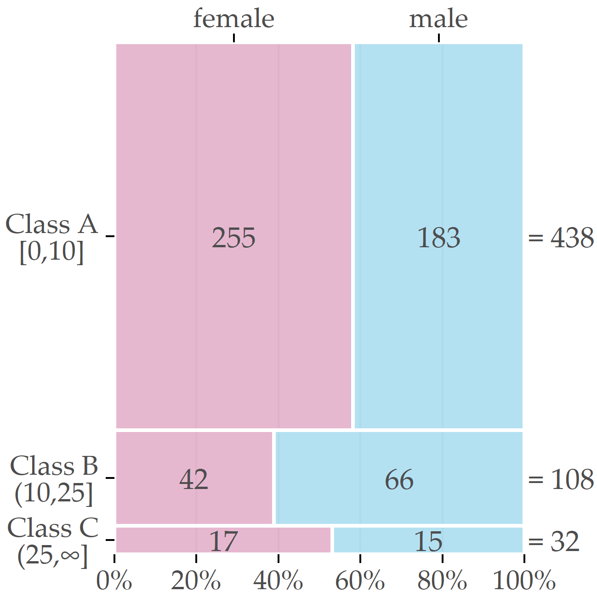

# (PART) SUBPOPULATION DISCOVERY IN HIGH-DIMENSIONAL DATA {-}

# Interactive Discovery and Inspection of Subpopulations {#imm}

```{r 03-setup, eval = FALSE, echo = FALSE, cache = TRUE, message = FALSE, results='asis'}
source("code/00-chapter-start-bib.R")
print_bib("Niemann:ESWA2014", bib = bib)
```


:::: {.infobox .chapter-summary data-latex="{tasks.pdf}"}

#### Brief Chapter Summary {-}

We study the separation between two positive and a negative outcome for a disease in epidemiological data. 
Our goal is to identify compact subpopulations that are as pure as possible with respect to the target variable.

::::

:::: {.infobox .chapter-literature data-latex=""}
This chapter is partly based on:

Uli Niemann, Henry Völzke, Jens-Peter Kühn, and Myra Spiliopoulou. "Learning and inspecting classification rules from longitudinal epidemiological data to identify predictive features on hepatic steatosis". In: _Expert Systems with Applications_ 41.11 (2014), pp. 5405-5415. DOI: [10.1016/j.eswa.2014.02.040](https://doi.org/10.1016%2Fj.eswa.2014.02.040).

::::

## Motivation and Comparison to Related Work

Medical decisions on diagnosis and treatment of multifactorial conditions such as diseases and disorders are based on clinical and epidemiological studies; the latter accommodate information on participants with and without a condition and allow for learning discriminative models and, in the longitudinal design, for understanding the progress of the condition. 
For example, several studies identified risk factors (like obesity or alcohol consumption) and co-morbidities (like cardiovascular diseases) associated with hepatic steatosis ("fatty liver") [@IttermannEtAl:Thyroid2012; @LauEtAl:2010; @StickelEtAl:2011; @Targher:2010; @Markus:2013].
However, these studies identified risk factors and associated outcomes that pertain to the whole population. 
Our work originated from the necessity to identify such factors and outcomes for subpopulations and thus to promote personalized diagnosis and treatment, as expected in personalized medicine [@Hingorani:2013; @Voelzke:Cardiol2013]. 

Classification on subpopulations was studied by Zhanga and Kodell [@AIM13] who pointed out that classifier performance on the whole dataset can be low if the complete population is very heterogeneous. 
Therefore, they first trained an ensemble of classifiers, and then used the predictions of each ensemble member to create a new feature space.
They performed hierarchical clustering to partitioned the instances into three subpopulations: one where the prediction accuracy is high, one where it is intermediate and one where it is low. 
With this approach, Zhanga and Kodell split the original dataset into subpopulations that are easy or difficult to classify. 
While the method seems appealing in general, it appeared unsuitable for the three-class problem of the SHIP data which exhibits a very skewed distribution, hence it is clear that low classification accuracy is (partially) caused by the skew. 
Hence, we studied the dataset exploratively _before_ classification, to identify less skewed subpopulations, and exploratively _after_ classification, to identify - inside each subpopulation - variables which are highly associated to the outcome.

<!-- **Classification Rule Mining.**  -->
Pinheiro et al. performed association rule discovery on patients with liver carcinoma [@PinheiroEtAl:ICCABS13]. 
The authors pointed out that early detection of liver cancer may help reducing the five-year mortality rate, but early detection is difficult, because in the onset of a liver carcinoma, the patient often observes no symptoms [@PinheiroEtAl:ICCABS13]. 
Pinheiro et al. leveraged the association rule algorithm FP-growth [@Han:FPGrowth00] to discover high-confidence association rules and high-confidence classification rules regarding mortality in liver cancer patients. 
We also considered association rules promising for the analysis of medical data, because they are easy to compute and deliver results that are understandable by humans. 
Therefore, we also used association rules as baseline method, though for epidemiological data and for classification rather than mortality prediction. 
To use association rules for classification, we specified that the rule consequent is the target variable. 
<!-- \textcolor{red}{(the rules are then called "classification rules"; we use this term hereafter)}. -->


<!-- TODO: move this paragraph  -->
<!-- \subsubsection{CBMS16} -->
<!-- **Clustering.**  -->
<!-- Clustering algorithms are applied to a variety of application domains. -->
<!-- For example, clustering is traditionally used for the identification of patient groups, who apply pressure on their feet in a similar way [@BennettsEtAl:Biomechanics2013; @DeCockEtAl:FootTypeClusteringPlantarPressure2006; @DeschampsEtAL:KMeansDiabeticFoot2013; @GiacomozziMartelli:PeakPressure2006], whereby k-means is the typically the algorithm of choice. -->
<!-- In [@GiacomozziMartelli:PeakPressure2006], Giacomozzi and Martelli -->
<!-- studied the plantar pressure curves of patients with diabetic foot and of control persons, and clustered them on the similarity of the curves with respect to shape and amplitude. They juxtaposed the clusters with respect to predefined groups: for instance, all persons of the group with increased peak pressure and muscle weakness and/or limited mobility of the joints were in one cluster&nbsp;[@GiacomozziMartelli:PeakPressure2006].  -->
<!-- However, each cluster contained persons from many groups. -->
<!-- Deschamps et al. recorded walking trials for patients and controls and studied the relative regional impulses recorded in six forefoot regions&nbsp;[@DeschampsEtAL:KMeansDiabeticFoot2013]: similarly to [@GiacomozziMartelli:PeakPressure2006], they also found one cluster that consists only of diabetic patients.  -->
<!-- Other scholars focused on patients only and strived to understand the variability of pressure distributions among patients and to stratify the patients on plantar pressure similarity. -->
<!-- De Cock et al. studied the pressure distributions recorded during jogging, whereby they concentrated on recordings of the six forefoot regions&nbsp;[@DeCockEtAl:FootTypeClusteringPlantarPressure2006]: they used k-means with k=4 and then -->
<!-- compared differences in peak pressure and in regional impulse among the identified clusters. -->
<!-- Bennetts et al. studied how patients applied pressure when they stood, and performed clustering on peak pressure  -->
<!-- distinguishing among seven plantar regions [@BennettsEtAl:Biomechanics2013].  -->
<!-- They compared the clusters on mean peak pressure and studied how the number of clusters k affected the results. -->
<!-- Similarly to \cite{BennettsEtAl:Biomechanics2013,DeCockEtAl:FootTypeClusteringPlantarPressure2006}, we focus on patient stratification with clustering. As in \cite{BennettsEtAl:Biomechanics2013,GiacomozziMartelli:PeakPressure2006}, we consider all regions of the foot, not forefoot only. Unlike all aforementioned methods who determined similarity in a single way and then used $k$-means for clustering, we consider alternative ways of modeling similarity with respect to pressure, we juxtapose the clusters built by different clustering algorithms in terms of quality, and -->
<!-- we deliver visualization aids for the inspection of the most representative instance (patient foot) in each cluster. -->
<!-- The tasks of modeling similarity, learning clusters with different algorithms, comparing them and inspecting the results, constitute a complete mining workflow. In \cite{GlasserEtAl:CBMS13,NiemannEtAl:CBMS15}, we proposed workflows that encompass the specification of similarity between instances, the tuning of clustering algorithms (in \cite{NiemannEtAl:CBMS15}) and the assessment of quality. However, these workflows concern the juxtaposition of patients to healthy people, while here we concentrate on the stratification of patients only and build the workflow accordingly. -->


<!-- ANSWER QUESTIONS LIKE -->
<!-- Leverage Partial Dependence Plots to answer the following questions: -->
<!-- What impact does a feature have on an actual patient? -->
<!-- Does the model behave correctly on a case-to-case basis? -->
<!-- What are the most important features for a given patient? -->
<!-- Why are certain patients not being accurately predicted? -->
<!-- Can we identify high impact actionable features? -->

<!-- - Cohort analytics: efficiency and applicability -->
<!--     - Representation of a cohort helps understand the evo- -->
<!-- lution of diseases and treatments for cohort members. The -->
<!-- aggregation of demographics (e.g., age, gender, life status) -->
<!-- and medical actions (e.g., diseases, prognoses, treatments, -->
<!-- marker observations) forms cohorts such as “middle-age -->
<!-- females in Paris with Bronchitis” and “old male patients with -->
<!-- a sudden BMI decrease during hospitalization.” [@Omidvar:CORE2020] -->

<!-- ## General articles -->

<!-- - Improving health and healthcare with interactive visualization methods [@shneiderman2013improving] -->

<!-- Interactive machine learning for health informatics: when do we need the human-in-the-loop?[@holzinger2016interactive] -->
<!-- - interactive machine learning: "human-in-the-loop" -->
<!-- - integration of the knowledge of a domain expert: incomplete data, missing data, noisy data, untidy data -->
<!-- - when is it beneficial to include the domain expert? humans sometimes still outperform ML-algorithms (diagnostic radiologic imaging); ML models perform badly on a number of extrapolation problmes, which otherwise would be very easy to solve for humans; interactive selection of interesting/non-irrelevant features for subspace clustering; similarity measure definition; for clustering where the user gives feedback on an intermediate solution during the algorithm's iterative phase; interactive reinforcment learning; interactive active learning -->

<!-- Big survey: Interactive Information Visualization to Explore and Query Electronic Health Records [@rind2013interactive] -->

<!-- Cohort analysis aims to uncover meaningful associations between risk factors (or preventive factors) and an outcome.  -->
<!-- Nowadays, large medical data with comprehensive historical data about patients, possibly over time spans of many years, have become available.  -->
<!-- Domain experts lack the technical expertise to perform tasks such as data management, analysis and summarization on very large datasets.  -->
<!-- For example, whereas in the past it was sufficient to have working knowledge of basic statistics and a spreadsheet software like Microsoft Excel, data storage and retrieving has become technically challenging, as data from heterogeneous sources (tables, images, text and speech recordings) have to be queried.  -->
<!-- Thus, domain experts usually rely on technical experts to help them perform these tasks.  -->
<!-- However, this process is often slow, tedious and expensive.  -->
<!-- It would be better to equip the domain expert with a technical tool that allows them to quickly perform exploratory analyses on their own.  -->

<!-- CAVA -->
Zhang et al. [@Zhang:CAVA2015] addressed the increasing technical challenges of medical expert-driven subpopulation discovery due to increasingly large and complex medical data which often comprise information of hundrets of variables for thousands of patients in form of tables, images or text. 
Whereas in the past it was sufficient for a physician to have working knowledge of basic statistics and a spreadsheet software like Microsoft Excel to analyze a small table with patient data, nowadays more effective and efficient approaches are required for management, analysis and summarization of very large medical data.  
As a result, domain experts usually rely on technical experts to help them perform these tasks. 
However, this back and forth process is often slow, tedious and expensive. 
Hence, it would be better to equip the domain expert with a technical tool that allows them to quickly perform exploratory analyses on their own. 
Zhang et al. [@Zhang:CAVA2015] presented CAVA, a system that incorporates miscellaneous subgroup visualizations (called "Views") and analytic components (called "Analytics") for subgroup comparison. 
The main panel in Figure \@ref(fig:03-cava) shows one of the Views: a flow diagram [@wongsuphasawat2012exploring] of patient subgroups with the same sequence of symptoms. 
Users can obtain additional summaries by interacting with the visualization, e.g. by placing one of the boxes in the flow diagram onto one of the entries in the Analytics panel via drag-and-drop. 
Further, user can expand the selected cohort by letting the tool search patients who do not strictly match the current inclusion criteria but are somewhat _similar_ to the current patient subpopulation [@ebadollahi2010predicting]. 

(ref:03-cava) CAVA's graphical user interface. The flow chart visualizes cardiac patient subgroups organized by shared symptom occurrence. Color represents hospitalization risk. The user can switch between graphical representations and data processing methods via drag-and-drop operations. The top-right panel provides detailed information for the currently selected patients. The bottom-right panel contains a provenance graph that allows the user to undo operations and to revisit previous interaction steps. (from: [@Zhang:CAVA2015])

```{r 03-cava, echo=FALSE, fig.align='center', out.width="80%", fig.cap="(ref:03-cava)"}
knitr::include_graphics("figures/03-cava.png")
```

<!-- PROSPECTOR -->
Krause et al. [@Krause:Prospector2016] argued that model selection should not be based solely on global performance metrics like accuracy, because these statistics do not contribute to a better understanding of the model's reasoning. 
Furthermore, a complex yet very accurate model does not automatically warrant actionable insights. 
Krause et al. propose Prospector [@Krause:Prospector2016], a system that provides diagnostic components for complex classification models based on the concepts of partial dependence (PD) plots [@Friedman:PDP2001]. 
PD plots are a popular tool to visualize the marginal effect of a feature on the predicted outcome probability. 
Briefly, each point of a PD curve represents the average prediction of the model over all observations, given that these observations had a fixed value for a feature of interest. 
A feature whose PD curve has a high range or variability is considered to be more impactful to the model prediction than a feature with a flat PD curve. 
Closely related to PD plots are individual conditional expectation (ICE) plots [@Goldstein:ICE2015], which display one curve for every observation, and thus help to uncover contrasting subpopulations who might "average out" in a PD plot. 
Prospector combines PD and ICE curves to depict the relationship between a feature and the model prediction on a (_global_) model level and a (_local_) patient-individual level. 
Further, a color bar is provided as more compact alternative to ICE curves (Figure \@ref(fig:03-prospector)) (a). 
A stacked bar chart shows the distribution of predicted risk scores for each study group (Figure \@ref(fig:03-prospector) (b)), and the user can click on a specific decile to get a list of individual patients with their exact prediciton score and label.
In this way, patients whose prediction score is close to the decision boundary can be further investigated. 
The authors calculate for each feature the "most impactful feature change": given the actual feature value of a patient, they identify a near counterfactual value that led to a large change in the predicted risk score, by minimizing difference to the original feature value and maximizing predicted risk score. 
The top-5 of these so called "suggested changes" are displayed -- separately for inreasing and decreasing disease risk -- in a table (cf. Figure \@ref(fig:03-prospector) (c)), and incorporated as interactive elements into the IC color bars (cf. Figure \@ref(fig:03-prospector) (d)).<!--
2016_Perer_Prospector_CHI2016-->

(ref:03-prospector) A selection of Prospector's model diagnostics. (a) The upper chart depicts two curves for the feature "age": the gray partial dependence (PD) curve represents the marginal prediction of the model over all patients whereas the black individual conditional expectation (ICE) curve illustrates the effect of counterfactual age values on the predicted diabetes risk for an example patient. The histogram shows the age distribution. The color bar placed beneath is a compact depiction of the ICE curve above; the encircled value represents the feature value of the selected patient. (b) Stacked bars show the distribution of predicted risk scores for each study group. Clicking on one of the bars opens a table that shows ID, predicted risk and true label for all patients belonging to the selected prediction risk decile. (c) Summary table of the most "impactful feature changes" for decreasing (upper group) and increasing (lower group) predicted risk: each row shows the actual feature value and the "suggested change", i.e., a similar but counterfactual value that led to a considerable change in predicted risk. (d) Multiple PD color bars augmented with suggested changes (white encircled labels). (adapted from: [@Krause:Prospector2016])

```{r 03-prospector, echo=FALSE, fig.align='center', out.width="100%", fig.cap="(ref:03-prospector)"}

```


Pahins et al. [@Pahins:COVIZ2019] presented COVIZ, a system for cohort construction in large spatiotemporal datasets. 
COVIZ comprises mechanisms for explorative data analysis of treatment pathways and event trajectories, visual cohort comparison and visual querying. 
One of COVIZ' design goals is being fast, e.g. by using efficient data structures like Quantile Data Structure [@de2019real] to ensure low latency for all computational operations and hence suitablity for large datasets. 


<!-- A visual-Interactive System for Prostate Cancer Cohort Analysis -->
Bernard et al. [@bernard2015visual] proposed a system for cohort construction in temporal prostate cancer cohort data which comprised visualizations for both subgroups and individual patients. 
To guide users during exploration, visual markers indicate interesting relationships between attributes derived from statistical tests. 

### Other related work

- IIComPath: [@Corvo2020]

### Previous Work on SHIP

<!-- if possible write more on the specific results for ship -->

Klemm et al. [@Klemm:RegressionHeatmap2015] presented a "3D regression cube" system which enables interactive exploration of feature correlations in epidemiological datasets. 
The system generates a large number of multiple regression models from various combinations of one dependent and two independent variables and displays their goodness of fit in a three-dimensional heatmap. 
The system allows the user to modify the regression equation, for example, by changing the number of independent variables, by specifying interaction terms or by fixing one of the variables to reduce computational complexity or to specifically focus on a variable of interest. 
Our approach is also capable of identifying variables that are highly associated with the outcome, but we search for subpopulation-specific relationships instead of generating a global model for the whole dataset, and we further provide predictive value ranges.

Klemm et al. [@Klemm14] presented a system which combines visual representations of non-image and image data. 
They identify clusters of backpain patients on the SHIP data. 
As we fixed hepatic steatosis as outcome, we rather opted to build supervised models and classification rules that directly captured the relationships between predictive variables and the outcome.

<!-- S-ADVIsED -->
Alemzadeh et al. [@eurova.20171118] presented S-ADVIsED, a system for interactive exploration of subspace clusters, incorporating various visualization types, such as donut charts, correlation heatmaps, scatterplot matrices, mosaic charts and error bar graphs. 
While S-ADVIsED requires the user to input the mining results obtained in advance outside of the system, our tool allows for an expert-driven interactive subpopulation discovery.  
<!-- our tool is more interactive -->

Hielscher et al. [@Hielscher16] developed a semi-supervised constrained-based subspace clustering algorithm to find diverse sets of _interesting_ feature subsets using the SHIP data. 
To guide the search for interesting feature subsets, the expert can provide their domain knowledge in form of instance-level constraints, thus forcing pairs of instances to be assigned either to the same or a different cluster. 
Hielscher et al. [@Hielscher2018] extended their work and introduced a mechanism to compare subpopulations between independent cohorts.


As a consequence, thesame group developed a constrained-based technique, where theclustering is guided by a small set of constraints, given by an expert[HNP*18]. As an example, for a few pairs of participants diagnosedwith fatty liver, the expert specifies that these participants must be inthe same clusters, whereas some other pairs of participants are forcedto be in different clusters since one in each pair is diagnosed withthe disorder and the other is not. This semi-supervised subspaceclustering turned out to yield relevant results for epidemiologists[HNP*18].


**TODO:** Preim: Visual analytics of image-centric cohort studies in epidemiology

## Subpopulation Discovery Workflow and Interactive Mining Assistant

Our subpopulation discovery workflow is presented hereafter. 
The dataset used for population partitioning and class sepration on the target variable hepatic steatosis come from the Study of Health in Pomerania (SHIP) which is described in Subsection \@ref(ship). 

In subsection \@ref(imm-target), explains origin and availability of the target variable.
In subsection \@ref(imm-partitioning), the motivation for partitioning of the data and the partitioning steps are presented. 
Then, the used methods for class separation on the whole dataset and on the partitions are discussed in Subsection \@ref(imm-classification).

<!-- SUBSECTION: Description of the SHIP-2 subset: what does the target variable look like? -->
### Target variable {#imm-target}
The target variable is derived from the participant's liver fat concentration computed with magnetic resonance imaging (MRI). 
At the time of writing the original manuscript, MRI results were available only for 578 SHIP-2 participants. 
We use the data of these participants for classifier learning, while our interactive ruleInspector (cf. section **???**) also juxtaposes these data to the data of the remaining 1755 participants, for whom the MRI recordings were not made available.

Participants with a liver fat concentration of 10% or less are mapped to class A ("negative" class, i.e., absence of the disorder), values greater than 10% and lower than 25% are mapped to class B (increased liver fat / fatty liver tendency), and values greater than 25% are mapped to class C (high liver fat). 
We consider classes B and C as "positive". 
Although the cut-off value of 10% is higher than the value of 5% suggested by [@KuehnEtAl:2011] for separation between subjects with and without hepatic steatosis. 
However, the primary interest from the medical perspective was the identification of important variables for individuals that are likely to be ill. 
The selection of a high cut-off value exacerbated class imbalance and made the data analysis more challenging. Figure \@ref(fig:03-fatty-liver-mosaic) depicts the class distribution by gender. 
Out of the 578 participants, 438 belong to class A (ca. 76%), 108 to B (ca. 19%) and 32 to C (ca. 6%). 
Men are more likely to exhibit increased or high liver fat than women (30.7% vs. 18.8% in classes B or C).

(ref:03-fatty-liver-mosaic) Gender-specific distribution of the target variable.

```{r 03-fatty-liver-mosaic, echo=FALSE, fig.align='center', out.width="50%", fig.cap="(ref:03-fatty-liver-mosaic)"}

```

Next to the target variable, the dataset contains 66 variables extracted from participants' questionnaire answers and medical tests (cf. [@Voelzke:SHIP2011]). 
They are variables on sociodemographics (gender, age, etc.), 
variables on consumption behaviour (e.g. alcohol and cigarettes), SNPs (genetic information), variables extracted from laboratory data (e.g.  sera concentrations), and two variables on the results of the liver ultrasound -- `stea_s2` and `stea_alt75_s2`. 
Both variables take symbolic values that reflect the likelihood that the participant has fatty liver; the latter is a combination of the former and the ALAT recording for the participant; details are in (cf. [@Voelzke:SHIP2011]). 
Almost all variables mentioned hereafter have the suffix `_s2` which indicates measurements of the SHIP-2 followup, as opposed to SHIP-0 (`_s0`) and SHIP-1 (`_s1`). 
Exceptions are gender, highest school degree and the 10 SNP variables. 

### Partitioning the Dataset into Subpopulations {#imm-partitioning}
<!-- \label{subsec:partitioning} -->
Since the dataset is imbalanced with respect to gender (314 women, 264 men), we decided to partition the dataset before classification. 
First, we investigated the class distributions in the two partitions on gender. 
We observed that the distributions are very different, most notably with respect to class B (cf. Figure \@ref(fig:03-fatty-liver-mosaic). 
As second step, we studied the class distribution by gender and age, whereupon we detected that age is associated with PartitionF but not with PartitionM. 
Third, we identified a cut-off point for age by introducing a heuristic that identifies the age value which minimizes the standard deviation with respect to the target variable. 
Afterwards, we performed supervised learning separately on the partitions of male and female participants. 
Furthermore, we built an additional learner for the subpopulation of older female participants aged above the cut-off point 52. 

<!-- \subsubsection{Partitioning the Original Dataset on Gender}%2 -->
<!-- \label{subsub:partitionsongender} -->

<!-- In Table ~\@ref(tab:classdistribution), we depict the absolute and relative distribution of the target variable: for the whole dataset, for the subset of female participants and the subset of male participants. These subsets are called $\mathsf{PartitionF}$ and $\mathsf{PartitionM}$ hereafter. The gender-based separation leads to very different target variable distributions: the portion of A participants in $\mathsf{PartitionM}$ is much lower than in $\mathsf{PartitionF}$ (69\,\% vs. 81\,\%). The last entry of Table ~\@ref(tab:classdistribution) is discussed in \@ref(subsub:swsd). -->

<!-- \begin{table}[htb] -->
<!-- \footnotesize -->
<!-- \centering -->
<!-- \begin{tabular}{p{1.7cm}|c|ccc|ccc} -->

<!-- 	&	&	\multicolumn{3}{c|}{absolute} & \multicolumn{3}{|c}{relative} \\ -->
<!-- 	Partition			&	total	&	A	&	B	&	C	&	A	&	B	&	C \\ -->
<!-- 	\hline \hline -->
<!-- 	All										&	578		&	438	&	108	&	32	&	76\,\%	&	19\,\%	&	6\,\% \\ -->
<!-- 	\hline -->
<!-- 	$\mathsf{PartitionM}$								&	264		&	183	&	66	&	15	&	69\,\%	&	25\,\%	&	6\,\% \\ -->
<!-- 	$\mathsf{PartitionF}$							&	314		&	255	&	42	&	17	&	81\,\%	&	13\,\%	&	5\,\% \\ -->
<!-- 	\hline -->
<!-- 	$\mathsf{F:age>52}$		&	183		&	131	&	40	&	12	&	72\,\%	&	22\,\%	&	7\,\% \\	 -->
<!-- \end{tabular} -->
<!-- \caption{Class Distribution on Gender} -->
<!-- \label{tab:classdistribution} -->
<!-- \normalsize -->
<!-- \end{table} -->

<!-- The disparity of the distributions on gender becomes more clear in Figure ~\@ref(fig:boxplot), where the values for median, first and third quartile are different in the two partitions: -->
<!-- (i) the median of $\mathsf{PartitionF}$ is lower than the median of $\mathsf{PartitionM}$ (3.7\,\% vs. 5.9\,\%) and (ii) the difference between the first and the third quartile for $\mathsf{PartitionF}$ is smaller than for $\mathsf{PartitionM}$ (4.2\,\% vs. 7.7\,\%). -->
<!-- The maximum length of the whiskers in this boxplot is defined by $1.5 \cdot \left(q_3-q_1\right)$, where $q_1$ is the value of the first quartile and $q_3$ is the value of the 3rd quartile for the distribution of \textsf{mrt\_liverfat\_s2}: a participant with a liver fat concentration outside the whiskers is then termed an "outlier".  -->
<!-- There are more outliers with very high fat liver concentrations in $\mathsf{PartitionF}$ than in $\mathsf{PartitionM}$ (47 vs. 15). Additionally, if we observe the number of outliers with a fat liver concentration of more than 23.3\,\%, i.e. at the approximate position of the upper whisker in $\mathsf{PartitionM}$, we see that (iii) the absolute number of female participants with even higher concentration is larger than the corresponding number of male participants (19 vs. 15). -->
<!-- These findings lead us to further investigations of the class distribution in the partition $\mathsf{PartitionF}$. -->

<!-- \begin{figure}[htb] -->
<!-- 	\centering -->
<!-- 	\includegraphics[width=0.75\linewidth]{Figures/boxpl.pdf} -->
<!-- 	\caption{Boxplots for $\mathsf{PartitionF}$ and $\mathsf{PartitionM}$} -->
<!-- 	\label{fig:boxplot} -->
<!-- \end{figure} -->


<!-- %--------------------------------------------------------------------------- -->
<!-- % SUBSUBSECTION: Partitioning the one subset on menopause -->
<!-- %--------------------------------------------------------------------------- -->
<!-- \subsubsection{Splitting the Set of Female Participants on Age} -->
<!-- \label{subsub:swsd} -->
To understand how age affects the class distribution, we introduced a heuristic that determines the cutoff age value at which `partitionF` splits into two bins, so that the standard deviations of the liver fat concentration in each bin are minimized. 
Let $\mathsf{splitAge}$ denote the cutoff value and $X_y=\{x\in\mathsf{PartitionF}|\text{age of } x \leq \mathsf{splitAge}\}$, $X_z=\{x\in\mathsf{PartitionF}|\text{age of } x > \mathsf{splitAge}\}$ denote the bins. 
Further, let $n$ be the cardinality of $X_y\cup{}X_z$ i.e. of PartitionF. 
Then, we define the Sum of weighted Standard Deviations ($SwSD$) as

\begin{equation}
SwSD\left(X_y,X_z\right) = \frac{|X_y|}{n}\sigma({X_y})+\frac{|X_z|}{n}\sigma({X_z})
(\#eq:03-swsd)
\end{equation}


where $|X_i|$ is the cardinality of $X_i$ and $\sigma(X_i)$ the standard deviation of the original liver fat values.
Our heuristic selects the $\mathsf{splitAge}$ such that $SwSD$ is minimal. 
For $\mathsf{PartitionF}$, the minimum value was 7.44 at the age of 52,
i.e. close to the onset of menopause.

(ref:03-histogram-partitions-age-liverfat) Distribution of liver fat concentration in male participants, and in female younger and older than 52 years. The horizontal axis shows the liver fat concentration in bins of 5%, while the vertical axis shows the number of participants in each bin. 

```{r 03-histogram-partitions-age-liverfat, echo=FALSE, fig.align='center', out.width="75%", fig.cap="(ref:03-histogram-partitions-age-liverfat)"}
knitr::include_graphics("figures/03-histogram-partitions-age-liverfat.png")
```

<!-- \begin{figure}[htb] -->
<!-- 	\centering -->
<!-- 	\includegraphics[width=0.9\linewidth]{Figures/fatty_liver_distr.pdf} -->
<!-- 	\caption{ -->
<!-- 	Class Distribution on male participants and on females older than 52 and younger: the horizontal axis shows the liver fat concentration in bins of 5\,\%, while the vertical axis shows the ratio of participants in each bin among the participants in the whole partition ($\mathsf{PartitionM}$, $\mathsf{F:age>52}$Leq and $\mathsf{F:age>52}$ respectively) -->
<!-- 	} -->
<!-- 	\label{fig:classdistribution}	 -->
<!-- \end{figure} -->

The histograms in Figure \@ref(fig:03-histogram-partitions-age-liverfat) depict the differences in the liver fat concentration distributions at the age cutoff value of 52. 
Next to $\mathsf{PartitionM}$ (n=264), we show the subpartitions $\mathsf{F:age\leq{}52}$ (n=131) and $\mathsf{F:age>52}$ (n=183) of $\mathsf{PartitionF}$. 
Most of female participants in $\mathsf{F:age\leq{}52}$ have no more than 5% liver fat concentration and ca. 95% have no more than 10%, i.e., they belong to the negative class A. 
In contrast, ca. 28% of the participants in $\mathsf{F:age>52}$ have a liver fat concentration of more than 10%; they belong to the positive classes B and C.

<!-- %--------------------------------------------------------------------------- -->
<!-- % SUBSECTION: Outline of decision trees, Hotspot classification rules, regression trees -->
<!-- %--------------------------------------------------------------------------- -->
<!-- \subsection{Classification Methods} -->
<!-- \label{subsec:classification} -->

For the classification of the cohort participants we concentrated on algorithms that deliver interpretable models, since we wanted to identify predictive _conditions_, i.e., variables and values/ranges in the models. 
Hence, we considered decision trees, classification rules and regression trees. 

<!-- \subsubsection{Decision Trees} -->
<!-- \label{subsub:decisiontrees} -->
We employed the J4.8 decision tree classification algorithm (equivalent to the C4.5 algorithm [@Q92]) of the Waikato Environment for Knowledge Analysis (Weka) workbench [@FrankEtAl:Weka2016]. 
This algorithm builds a tree successively, by splitting each node (subset of the dataset) on the variable that maximizes information gain within that node. 
The original algorithm operates only on variables that take categorical values and creates one child node per value. 
However, the implementation in the Weka library also provides an option that forces the algorithm to always create exactly two child nodes: one for the best separating value and one for all other values. 
We used this option in our experiments, because it delivers trees of better quality. 
Moreover, the Weka algorithm also supports variables that take numeric values: 
a node is split into two child nodes by partitioning the value range of the variable into two intervals. 

To deal with the skewed distribution, we considered the following classification variants: 

- _Naive_: the problem of imbalanced data is ignored.
- _InfoGain_: we keep only the top-30 of the 66 variables, by sorting the variables on information gain towards the target variable.
- _Oversampling_: We use SMOTE [@CBHea02] to resample the dataset with minority-oversampling: for class B, 100% new instances are generated, for class C 300% new instances are generated, resulting in following distribution A:438, B:216, C:128.
- _CostMatrix_: We prefered to misclassify a negative case rather than not detecting a positive case, so we penalized false negatives (FN) more than false positives (FP). 
We used the cost matrix depicted in Table \@ref(tab:03-costmatrix). 

(ref:03-costmatrix) **Cost matrix.** Cost matrix penalizing misclassification under class skew.

```{r 03-costmatrix, echo=FALSE}
`%>%` <- dplyr::`%>%`
kableExtra::kbl(
  tibble::tribble(
    ~` `, ~A, ~B, ~C,
    "A", 0, 1, 2,
    "B", 2, 0, 1,
    "C", 3, 2, 0
  ) %>% dplyr::mutate(`  ` = "True class", .before = 1),
  align = "c", booktabs = TRUE, linesep = "", caption = "(ref:03-costmatrix)"
) %>%
  kableExtra::kable_classic() %>%
  kableExtra::add_header_above(c(" " = 2, "Predicted class" = 3), bold = TRUE) %>%
  kableExtra::column_spec(1, bold = TRUE) %>%
  kableExtra::collapse_rows(columns = 1, valign = "middle", latex_hline = "none") 
```

<!-- \begin{table}[htb] -->
<!-- \centering -->
<!-- \begin{tabular}{l|l|l|l} -->
<!-- Classified as $\Rightarrow$	&	A	&	B	&	C	\\ -->
<!-- \hline -->
<!-- A	&	0	&	1	&	2\\ -->
<!-- B	&	2	&	0	&	1\\ -->
<!-- C & 3 & 2 & 0\\ -->
<!-- \end{tabular} -->
<!-- \caption{Cost Matrix penalizing misclassification under class skew -->
<!-- } -->
<!-- \label{tab:CostMatrix} -->
<!-- \end{table} -->

<!-- \end{description} -->


<!-- %--------------------------------------------------------------------------- -->
<!-- % Classification Rule Discovery -->
<!-- %--------------------------------------------------------------------------- -->
<!-- \subsubsection{Classification Rule Discovery} -->
<!-- \label{subsub:crules} -->
<!-- Classification rules are association rules, the consequent of which consists of one of the classes. -->
<!-- For example, consider following association rules, where $\&$ stands for "AND": -->

<!-- \noindent -->
<!-- $\bullet$ {\small \textsf{stea\_s2~=~1 $\&$ gx\_rs11597390~=~1 $\&$ age\_ship\_s2$~>~59$ $\rightarrow$ class~=~B}} \\ -->
<!-- $\bullet$ {\small \textsf{som\_waist\_s2 $\leq~80$ $\rightarrow$ stea\_s2~=~1}} -->

<!-- The features (variables and value ranges) at the left of the arrow constitute the rule's \emph{antecedent}, while the feature at the right is the rule's \emph{consequent}. The first rule in the example is a \emph{classification rule} referring to class B. -->
<!-- The second rule is not a classification rule, since the variable in the consequent is not a class. -->

<!-- The reader may notice that variables with real values (e.g. age, waist) are restricted within a specific range. This range is chosen by the mining algorithm in such a way as to maximize the support of the rule within the cohort and the confidence of the rule's consequent given the antecedent. The first rule in the example belongs to the results on $\mathsf{PartitionF}$ (see Table \@ref(03-rule-list-women), described in the next section): out of the 20 participants supporting the antecedent, 17 belong to class B. -->
<!-- Note that we use the expressions \emph{"[number] participants support rule [ruledescription] "} and \emph{"[number] participants support the rule's \emph{antecedent}"}. -->

<!-- For classification rule discovery we use the Weka algorithm HotSpot. For each class, this algorithm determines the rules with the best confidence \emph{and} the optimal boundary values for the features in the antecedent. We have wrapped the algorithm into a mechanism that selects for each class only rules supported by at least $\tau$ participants. In our experiments, we use $\tau=\frac{1}{3}$, but our interactive tool (section \@ref(sec:ruleinspector)) allows the expert to set this threshold freely. -->

<!-- %--------------------------------------------------------------------------- -->
<!-- % Regression -->
<!-- %--------------------------------------------------------------------------- -->
<!-- \subsubsection{Regression Trees} -->
<!-- \label{subsub:regression} -->
<!-- We learn regression trees on the original continuous target variable \textsf{mrt\_liverfat\_s2} using the Weka algorithms REPTree (Error Pruning Tree), M5P and MP5Rules.  -->


<!-- !!! Consider adding a pseudo code block here. -->

<!-- (ref:foo) A scatterplot of the data `cars` using **base** R graphics.  -->

<!-- ```{r foo, fig.cap='(ref:foo)'} -->
<!-- plot(cars)  # a scatterplot -->
<!-- ``` -->


<!-- For each class, this algorithm determines the rules with the best confidence \emph{and} the optimal boundary values for the features in the antecedent. We have wrapped the algorithm into a mechanism that selects for each class only rules supported by at least $\tau$ participants. In our experiments, we use $\tau=\frac{1}{3}$, but our interactive tool (section \@ref(sec:ruleinspector)) allows the expert to set this threshold freely. -->

<!-- 	\item Minimum value count: the minimum percentage (or number) of instances supporting the rule AND belonging to specified target class, -->
<!-- 	\item Maximum rule length: the number of variables in the antecedent, -->
<!-- 	\item Maximum branching factor: the maximum number of variables that may be added to an existing classification rule,%; if rule generation takes too long, lower values are recommended, -->
<!-- 	\item Minimum improvement: the minimum relative confidence improvement to be achieved by the addition of a further variable to the classification rule.%; if this improvement is not achieved, the rule is not expanded. -->


<!-- Class implementing an Apriori-type algorithm. Iteratively reduces the minimum support until it finds the required number of rules with the given minimum confidence. -->
<!-- The algorithm has an option to mine class association rules. It is adapted as explained in the second reference. -->


<!-- SYNOPSIS -->
<!-- HotSpot learns a set of rules (displayed in a tree-like structure) that maximize/minimize a target variable/value of interest. With a nominal target, one might want to look for segments of the data where there is a high probability of a minority value occuring (given the constraint of a minimum support). For a numeric target, one might be interested in finding segments where this is higher on average than in the whole data set. For example, in a health insurance scenario, find which health insurance groups are at the highest risk (have the highest claim ratio), or, which groups have the highest average insurance payout. -->

### Classification Rule Discovery {#imm-classification}

Classification rules can uncover interesting relationships between one or more features and the outcome [@Fuernkranz:12; @Herrera11]. 
Compared to model families such as deep neural networks, support vector machines and random forests, classification rules achieve inferior accuracy most of the time. 
However, they are easier to interpret and reason about, and hence lend themselves better for interactive subpopulation discovery. 
In epidemiological research, interesting subpopulations could be subsequently used to formulate and validate a small set of hypotheses or just to explore associations between risk factors for a specific outcome. 
An interesting subpopulation could be phrased as "In the sample of this study, the prevalence of goiter is 32%, while the likelihood in the subpopulation described by _thyroid-stimulating hormone_ smaller equal 1.63 mU/l and _body mass index_ greater than 32.5 kg/m^2^ is 49%". 

Classification rule algorithms induce descriptions of ``_interesting_'' subpopulations of the data where interestingness is quantified by a quality function. 
A classification rule is an association rule whose consequent is fixed to a specific class value. 
Consider the exemplary classification rule $r_1$:
<!-- , where $\wedge$ represents the logical conjunction operator:  -->

<!-- $$ -->
<!-- r_1: \underbrace{\text{som_waist_s2} < 80 \wedge \text{age_ship_s2} > 59 \left(\wedge \ldots \right)}_{\text{Antecedent}} \longrightarrow \underbrace{\vphantom{\text{som_waist_s2} < 80 \wedge \text{age_ship_s2} > 59 \left(\wedge \ldots \right)}\text{hepatic_steatosis = pos}}_{\text{Consequent}} -->
<!-- (\#eq:rule) -->
<!-- $$ -->

\begin{equation}
r_1: \underbrace{som\_waist\_s2 < 80 \wedge age\_ship\_s2 > 59 \left(\wedge \ldots \right)}_{\text{Antecedent}} \longrightarrow \underbrace{\vphantom{som\_waist\_s2 < 80 \wedge age\_ship\_s2 > 59 \left(\wedge \ldots \right)}hepatic\_steatosis = pos}_{\text{Consequent}}
(\#eq:03-rule)
\end{equation}

#### Underpinnings {-}

Classification rules are expressed in the form of $r: \text{antecedent} \longrightarrow T=v$. 
The conjunction of _conditions_ (i.e. feature - feature value pairs) left to the arrow constitutes the rule's $\text{antecedent}$ (or left hand site).
In the $\text{consequent}$ (or right hand side), $v$ is the requested value for the target variable $T$.

We define $s(r)$ as the subpopulation or _cover set_ of $r$, i.e. the set of instances that satisfy the antecedent of $r$. 
The _coverage_ of $r$, which is the fraction of instances covered by $r$, is then defined as $Cov(r)=|s(r)|/N$, where $N$ is the total number of instances. 
The _support_ of $r$ quantifies the percentage of instances covered by $r$ that additionally have $T=v$, calculated as $Sup(r)=|s(r)_{T=v}|/N$. 
The _confidence_ of $r$ (also referred to as precision or accuracy) is defined as $Conf(r)= |s(r)_{T=v}|/|s(r)|$ and expresses the relative frequency of instances satisfying the complete rule (i.e., both the antecedent and the consequent) among those satisfying only the antecedent. 
The _recall_ or _sensitivity_ of $r$ with respect to $T=v$ is defined as $Recall(r)=Sensitivity(r)=\frac{|s(r)_{T=v}|}{n_{T=v}}$. 
The _Weighted Relative Accuracy_ of a rule is an interestingness measure which balances coverage and confidence gain and is often used as internal quality criterion for candidate generation [@Herrera11]. 
It is defined as $WRAcc(r) = Cov(r)\cdot \left(Conf(r)-\frac{n_{T=v}}{N} \right)$. 
<!-- The _odds ratio_ of $r$ with respect to $T=v$ is defined as  -->
<!-- $OR(r)$ -->

<!-- odds.P <- (cov.P / (cov - cov.P)) / (data$Target.P.n / data$Target.N.n) -->

As an example, Figure \@ref(fig:03-rule-intro) illustrates an exemplary rule $r_2$ in a dataset with 10 instances and a binary target, where circles in cyan color represent instances from the negative class and red circles are positive instances. 
The cover set of $r_2$ contains instances 7, 8, 9 and 10, hence $Cov(r_2)=0.40$. 
Further, $Sup(r_2)=0.30$, $Conf(r_2)=0.75$ and $WRAcc(r_2)=0.4\cdot\left(0.75-0.4\right)=0.14$.

```{r 03-rule-intro, echo=FALSE, fig.align='center', out.width="50%", fig.cap="Exemplary classification rule."}
knitr::include_graphics("figures/03-rule-intro.png")
```


### HotSpot {#hotspot}

For classification rule discovery we use the algorithm HotSpot^[https://weka.sourceforge.io/packageMetaData/hotSpot/1.0.4.html] provided in the Waikato Environment for Knowledge Analyis (WEKA) workbench [@FrankEtAl:Weka2016]. 
HotSpot is a beam search algorithm that implements a general-to-specific approach for extracting rules. 
A single rule is constructed by successively adding the condition to the
antecedent that locally maximizes confidence. 
<!-- greedy -->
Contrary to general hill-climbing which considers only the best rule candidate at each iteration, HotSpot's beam search keeps the $b$ highest ranked candidates and refines them in later steps. 
Consequently, HotSpot reduces the _"myopia"_ [@Fuernkranz:12] hill-climbing search typically suffers from. 
Briefly, hill-climbing approaches consider only the locally optimal candidate at each iteration. 
As a consequence a globally optimal rule is not found if it is not locally optimal in every iteration. 
From an application point of view, it is also desirable to generate more than one rule, as alternative descriptions of subpopulations can facilitate hypothesis generation. 
The beam width can be specified as `maximum branching factor`, the maximum number of conditions that may be added to a rule candidate.
In every iteration, rule candidates must satisfy the `minimum value count` which is the sensitivity threshold. 
To avoid adding a condition that leads only to a marginal improvement in confidence, the parameter `minimum improvement`, i.e. the minimum relative improvement in confidence by adding a further condition can be specified.
Computational complexity of the rule search can be reduced by specifying a `maximum rule length`, which is the number of conditions in the antecedent. 

**describe parametrization in experiments**


### Interactive Medical Miner

Classification rules can provide valuable insights on potentially prevalent conditions for different subpopulations of the cohort under study. 
However, if the number of rules produced is large, as it is usually the case in large epidemiological data, the conditions of the rules overlap and some conditions are present under each of the target feature's classes. 
Hence, the medical expert needs inspection aids to decide which rules are informative and which features should be studied further. 
Our Interactive Medical Miner (IMM) allows the expert to (a) discover classification rules subject to frequency constraints, inspect the frequency of those rules (b) towards each class and (c) against the unlabeled part of the cohort, and (d) study the statistics of each rule for the values of selected variables. 
We describe these functionalities below, referring to the screenshot in Figure \@ref(fig:03-imm-modified).

(ref:03-imm-modified) The Interactive Medical Miner: classification rules are discovered for class B and shown in the bottom left panel. For the selected rule som\_huef\_s2 > 109 & crea\_u\_s2 > 5.38 $\longrightarrow$ mrt\_liverfat\_s2 = B, the distribution of the participants covered by the rule among all three classes is shown in absolute values (top middle panel) and as histogram (bottom right panel) with respect to age (top right panel).

```{r 03-imm-modified, echo=FALSE, fig.align='center', out.width="90%", fig.cap="(ref:03-imm-modified)"}
knitr::include_graphics("figures/03-imm-modified.png")
```

The user interface consists of six panels. 
The "Settings" panel (upper left) allows the medical expert to set the parameters for rule induction before pressing the button "Build Rules". 
Below this panel, the discovered rules are displayed. 
The panel "Sorting preference" allows the expert to specify whether rules should be sorted by confidence, by coverage, or rather alphabetically for better overview of overlapping rules. 

The mining criteria include the dataset (choosing between the whole dataset versus one of the partitions), the class for which rules should be generated (drop-down list "Class") and the constraints with respect to this class, i.e., `min value count` (which can also be given as relative number), `maximum rule length`, `maximum branching factor` and `minimum improvement`. 
As an example how these parameters affect the rule search, consider the selected rule in Figure xxx, som\_huef\_s2 > 109 & crea\_u\_s2 > 5.38 $\longrightarrow$ mrt\_liverfat\_s2 = B, which has a coverage of 0.12 and a confidence of 0.56. 
The sensitivity of 38/108 = 0.352 satisfies the minimum value count threshold of 0.33. 
From the Apriori property, it is apparent that each of the two conditions in the rule's antecedent, namely som\_huef\_s2 > 109 and crea\_u\_s2 > 5.38 must also exceed this threshold. 
The position of a condition within the antecedent indicates at which refinement step it was added to the rule candidate. 
For example, the first condition som\_huef\_s2 > 109 with a confidence of 44/107 = 0.41 was expanded by the second condition crea\_u\_s2 > 5.38, because the gain in confidence exceeds the minimum improvement threshold, i.e., 38/68 - 44/107 = 0.15 > 0.05. 
This rule, however, cannot be further expanded because the maximum rule length is set to 2. 
The maximum branching factor was set conservatively to 1000, to prevent potentially interesting rules from not being generated due to small beam width. 
The parameter can be lowered interactively, if the number of discovered rules is to high or rule induction takes too long. 

The output list of an execution run (area below the "Settings") is scrollable and interactive. 
When the expert clicks on a rule, the top middle area "Summary Statistics" is updated. 
The first row shows the distribution of the cohort participants among the classes for the whole dataset, while the second row shows how the participants covered by the rule (column "Total" in the second row) are distributed among the classes.
Hence, the expert can specify the discovery of classification rules for one of the classes and then study how often the antecedent of each rule appears among the participants in the other classes. 
A rule that covers most of the participants of the selected class (class B in Figure \@ref(fig:03-imm-modified)) is not necessarly interesting, for example, if it covers also a high number of participants of the other classes. 
The rule som\_huef\_s2 > 109 & crea\_u\_s2 > 5.38 $\longrightarrow$ mrt\_liverfat\_s2 = B covers 68 participants in total, 38 of them having class B. 
To lower the number of covered participants from other classes , i.e., to increase confidence, the user can lower the minimum value count, to allow for the generation of rules with lower sensitivity, but more homogeneity with respect to the selected class. 

Some of the data might be incomplete. For example, not all participants in the cohort have been subjected to liver MRI. 
Hence, it is also of interest to know the distribution of the unlabeled participants who support the antecedent of a given rule. 
The "Histogram" panel can be used to this purpose: the expert chooses a further feature from the interactive area "Variable selection" in the upper right panel and can then see how the values of these variable are distributed among the study participants - both the labeled ones and the unlabeled ones; the latter are marked as "Missing" in the color legend. 
For plotting the histograms we make use of the free Java chart library JFreeChart \cite{GilbertJFree}. 
Numeric variables are discretized using "Scott's rule" [@scott1979optimal] as follows: 
let $X_{s(r)}$ be the set of values for a numeric variable $X$ with respect to the cover set $s(r)$. 
The bin width $h$ is then calculated as $h(X_{s(r)})=\frac{\max{X_{s(r)}}-\min{X_{s(r)}}}{3.49\text{sd}_{s(r)}}\cdot |s(r)|^{\frac{1}{3}}$.  

If the expert does not choose any variable, the target variable is used by default, and only the distribution of the labeled participants is visible. 
The histogram in Figure \@ref(fig:03-imm-modified) shows the age distribution of both labeled and unlabeled participants covered by our example rule som\_huef\_s2 > 109 & crea\_u\_s2 > 5.38 $\longrightarrow$ mrt\_liverfat\_s2 = B. 
The value distribution among the labeled participants reveals that ageing might be a risk factor for the displayed subpopulation as the likelihood of class B increases with higher age. 
This visual finding suggests adding the condition age\_ship\_s2 > 56.8 to the rule's antecedent. 
Indeed, the confidence of this more specific rule increases from 38/68 = 0.56 to 27/40 = 0.675. 
However, since the sensitivity reduces from 38/108 = 0.352 to 27/108 = 0.250, the minimum value count threshold is no longer satisfied. 
Hence, the visualization of the participants' statistics for selected rules can deliver indications on subpopulations that should be monitored closer, and hints on how to alter the algorithm parameters for subsequent runs, in our example, to lower the minimum value count to 0.25 and to increase the maximum rule length to 3. 

## Experiments and Findings

<!-- We learned models on the full dataset and on each partition for each of the classification variants described in \@ref(subsub:decisiontrees) and for HotSpot rules. We also studied tree regression on the complete dataset. However, the predicitive power of the regression trees was very poor: either the regression tree consisted solely of one node with the mean of the complete dataset as predictor, i.e. the regression algorithm could not find appropriate split attributes, or two or more leaf nodes had very similar prediction values, whereupon interpreting the tree was very hard. We therefore focussed on classification trees and classification rules. We report on our findings with these methods hereafter. -->

### Results of Decision Tree Classifiers

<!-- \label{subsec:DTs} -->
For the evaluation of decision tree classifiers, we consider accuracy, i.e., the ratio of correctly classified participants, sensitivity and specificity, and the $F_1$ score, i.e., the harmonic mean between precision and recall. 
For **specificity**, precision and recall, we consider the two classes B and C together as positive class.

_Oversampling_ achieved best performance with an accuracy of ca. 80% and an $F_1$score of 62%. 
The best decision trees were found for partition $\mathsf{F:age>52}$, followed by those for $\mathsf{PartitionF}$, then $\mathsf{PartitionM}$.
**The large discrepancy between accuracy and $F_1$score appears also in the models of the partitions, underlying that accuracy scores are unreliable in such a skewed distribution. Therefore, we do not report on accuracy hereafter.**

On partition $\mathsf{F:age>52}$, the overall best decision tree is achieved by the oversampling variant. 
On the larger $\mathsf{PartitionF}$, best performance was achieved by the decision tree produced with the InfoGain variant, while the best decision tree on $\mathsf{PartitionM}$ was built with the CostMatrix variant. 
Sensitivity and specificity values for these trees are shown in Table \@ref(tab:03-tree-performance-sens-spec), while the trees themselves are depicted in Figures \@ref(fig:03-tree-menopause) - \@ref(fig:03-tree-men) respectively and discussed in Section \@ref(imm-important-features).

(ref:03-tree-performance-sens-spec) Best decision trees for the three partitions: best separation is achieved in $\mathsf{F:age>52}$; $\mathsf{PartitionM}$ is the most heterogeneous one, the performance values are lowest.

```{r 03-tree-performance-sens-spec, echo=FALSE}
`%>%` <- dplyr::`%>%`
kableExtra::kbl(
  tibble::tribble(
    ~partition, ~variant, ~sens, ~spec, ~f1,
    "$\\mathsf{F:age}>\\mathsf{52}$", "Oversampling", 63.5, 93.9, 81.5,
    "$\\mathsf{PartitionF}$", "InfoGain", 52.4, 94.9, 69.7,
    "$\\mathsf{PartitionM}$", "CostMatrix", 38.3, 86.3, 53.0
  ),
  escape = FALSE, booktabs = TRUE, 
  col.names = c("Partition", "Variant", "Sensitivity (\\%)", "Specificity (\\%)", "F1 score (\\%)"),
  caption = "(ref:03-tree-performance-sens-spec)"
) %>%
  kableExtra::kable_classic() %>%
  kableExtra::row_spec(0, bold = TRUE)
```

Table \@ref(tab:03-tree-performance-sens-spec) indicates that the decision tree variants perform differently on different partitions. 
Oversampling is beneficial for $\mathsf{F:age>52}$, because it partially compensates the skew problem. 
As $\mathsf{PartitionM}$ has the most heterogeneous class distribution out of all paritions, all variants perform relatively poor on it.
Hence, we expected most insights from the decision trees on $\mathsf{F:age>52}$ and $\mathsf{PartitionF}$, where better separation is achieved.

(ref:03-tree-menopause) **Best decision tree for $\mathsf{F:age>52}$**, achieved by the variant _Oversampling_.

```{r 03-tree-menopause, echo=FALSE, fig.align='center', out.width="100%", fig.cap='(ref:03-tree-menopause)'}
knitr::include_graphics("figures/03-tree-menopause.png")
```

(ref:03-tree-women) **Best decision tree for $\mathsf{PartitionF}$**, achieved by the variant _InfoGain_.

```{r 03-tree-women, echo=FALSE, fig.align='center', out.width="100%", fig.cap='(ref:03-tree-women)'}
knitr::include_graphics("figures/03-tree-women.png")
```

(ref:03-tree-men) **Best decision tree for $\mathsf{PartitionM}$**, achieved by the variant _CostMatrix_.

```{r 03-tree-men, echo=FALSE, fig.align='center', out.width="100%", fig.cap='(ref:03-tree-women)'}
knitr::include_graphics("figures/03-tree-men.png")
```

### Discovered Classification Rules

While the classification rules found by HotSpot on the whole dataset were conclusive for class A but not for the positive classes B and C, we omit reporting these rules as they are not useful for diagnostic purposes.
The classification rules found on the partitions were more informative. 
However, classification rules with only one feature in the antecedent had low confidence. 
To ensure high confidence, we restricted the output on rules with at least two features in the antecedent. 
To ensure a still high coverage, we allowed for at most three features. 
A selection of high confidence and high coverage rules for each partition and class are shown in Tables \@ref(tab:03-rule-list-women) -- \@ref(tab:03-rule-list-men), respectively. 
We describe the most important features in the antecedent of these rules in the next subsection, together with the most important features of the best decision trees.

(ref:03-rule-list-women) Best HotSpot classification rules (_maxLength_ = 3) for $\mathsf{PartitionF}$ (excerpt).

```{r 03-rule-list-women, echo=FALSE}
`%>%` <- dplyr::`%>%`
kableExtra::kbl(
  tibble::tribble(
    ~`Variable 1`, ~`Variable 2`, ~`Variable 3`, ~`Abs`, ~`Abs`, ~`Rel [\\%]`, ~`Rel [\\%]`,
    "som\\_waist\\_s2 $\\leq$ 80", "--" , "--" , 132, 132, 52 , 100,
    "som\\_bmi\\_s2 $\\leq$ 24.82" , "--" , "--" , 109 , 109 ,  43 , 100,
    "som\\_huef\\_s2 $\\leq$ 97.8" , "--" , "--" , 118 , 117 ,  46 , 99,
    "stea\\_s2 = 0" , "--" , "--" , 218 , 214 ,  84 , 98,
    "stea\\_alt75\\_s2 = 0" , "--" , "--" , 202 , 198 ,  78 , 98,
    "stea\\_s2 = 1" ,  "gx\\_rs11597390 = 1", "age\\_ship\\_s2 > 59" , 20 , 17 ,  40 , 85,
    "stea\\_alt75\\_s2 = 1" , "hrs\\_s\\_s2 > 263" , "age\\_ship\\_s2 > 59" , 20 , 17 ,  40 , 85,
    "stea\\_alt75\\_s2 = 1" , "hrs\\_s\\_s2 > 263" , "ldl\\_s\\_s2 > 3.22" , 20 , 17 ,  40 , 85,
    "stea\\_s2 = 1" , "age\\_ship\\_s2 > 66" , "tg\\_s\\_s2 > 1.58" , 17 , 14 ,  33 , 82,
    "stea\\_s2 = 1" , "age\\_ship\\_s2 > 64" , "hrs\\_s\\_s2 > 263" , 17 ,  14 ,  33 , 82,
    "gluc\\_s\\_s2 > 7" , "tsh\\_s2 > 0.996" , "--" , 6 , 6 ,  35 , 100,
    "som\\_bmi\\_s2 > 38.42" , "age\\_ship\\_s2 $\\leq$ 66" , "asat\\_s\\_s2 > 0.22" , 6 , 6 ,  35 , 100,
    "som\\_bmi\\_s2 > 38.42" , "sleeph\\_s2 > 6" , "blt\\_beg\\_s2 $\\leq$ 38340" , 6 , 6 ,  35 , 100,
    "som\\_bmi\\_s2 > 38.42" , "sleeph\\_s2 > 6" , "stea\\_s2 = 1", 6 , 6 ,  35 , 100,
    "hrs\\_s\\_s2 > 371" , "sleepp\\_s2 = 0" , "ggt\\_s\\_s2 > 0.55", 6 , 6 ,  35 , 	100
  ),
  booktabs = TRUE, escape = FALSE,
  caption = "(ref:03-rule-list-women)"
) %>%
  kableExtra::kable_classic() %>%
  kableExtra::row_spec(0, bold = TRUE) %>%
  kableExtra::pack_rows("Target class: A", 1, 5) %>%
  kableExtra::pack_rows("Target class: B", 6, 10) %>%
  kableExtra::pack_rows("Target class: C", 11, 15) %>%
  # kableExtra::row_spec(5, extra_latex_after = "\\midrule") %>%
  # kableExtra::row_spec(10, extra_latex_after = "\\midrule") %>%
  kableExtra::add_header_above(
    c("Rule antecedent" = 3, "Cov" = 1, "Sup" = 2, "Conf" = 1),
    bold = TRUE
  )
```


(ref:03-rule-list-menopause) Best HotSpot classification rules (_maxLength_ = 3) for $\mathsf{F:age>52}$ (excerpt).

```{r 03-rule-list-menopause, echo=FALSE}
`%>%` <- dplyr::`%>%`
kableExtra::kbl(
  tibble::tribble(
    ~`Variable 1`, ~`Variable 2`, ~`Variable 3`, ~`Abs`, ~`Abs`, ~`Rel [\\%]`, ~`Rel [\\%]`,
    "crea\\_u\\_s2 $\\leq$ 5.39", "stea\\_s2 = 0" , "--" , 75 , 75 ,  57 , 100,
    "crea\\_u\\_s2 $\\leq$ 5.39" ," stea\\_alt75\\_s2 = 0" , "--" , 72 , 72 ,  55 , 100,
    "som\\_waist\\_s2 $\\leq$ 80" , "--" , "--" , 54 , 54 ,  41 , 100,
    "som\\_bmi\\_s2 $\\leq$ 24.82" , "--" , "--" , 50 , 50 ,  38 , 100,
    "crea\\_u\\_s2 $\\leq$ 5.39" , "ggt\\_s\\_s2 $\\leq$ 0.43" , "--" , 50 , 50 ,  38 , 100,
    "stea\\_s2 = 1" , "ggt\\_s\\_s2 > 0.48" , "ggt\\_s\\_s2 $\\leq$ 0.63" , 15 , 15 ,  38 , 100,
    "stea\\_s2 = 1" , "gx\\_rs11597390 = 1" , "hdl\\_s\\_s2 $\\leq$ 1.53" , 20 , 19 ,  48 , 95,
    "stea\\_s2 = 1" , "gx\\_rs11597390 = 1" , "fib\\_cl\\_s2 > 3.4" , 15 , 14 ,  35 , 93,
    "crea\\_s\\_s2 $\\leq$ 61" , "som\\_waist\\_s2 > 86" , "stea\\_s2 = 1" , 15 , 14 ,  35 , 93,
    "stea\\_s2 = 1" , "gx\\_rs11597390 = 1" , "hrs\\_s\\_s2 > 261" , 20 , 18 ,  45 , 90,
    "som\\_bmi\\_s2 > 38.42", "age\\_ship\\_s2 $\\leq$ 66" , "--" , 4, 4 ,  33 , 100,
    "som\\_bmi\\_s2 > 38.42" , "stea\\_alt75\\_s2 = 3" , "--" , 4 , 4 ,  33 , 100,
    "som\\_huef\\_s2 > 124" , "stea\\_alt75\\_s2 = 3" , "--" , 4 ,  4 ,  33 , 100,
    "som\\_waist\\_s2 > 108" , "gluc\\_s\\_s2 > 6.2" , "--" , 4 ,  4 ,  33 , 100,
    "stea\\_alt75\\_s2 = 3" , "som\\_bmi\\_s2 > 37.32" , "--" , 4 , 4 ,  33 , 100
  ),
  booktabs = TRUE, escape = FALSE,
  caption = "(ref:03-rule-list-menopause)"
) %>%
  kableExtra::kable_classic() %>%
  kableExtra::row_spec(0, bold = TRUE) %>%
  kableExtra::pack_rows("Target class: A", 1, 5) %>%
  kableExtra::pack_rows("Target class: B", 6, 10) %>%
  kableExtra::pack_rows("Target class: C", 11, 15) %>%
  # kableExtra::row_spec(5, extra_latex_after = "\\midrule") %>%
  # kableExtra::row_spec(10, extra_latex_after = "\\midrule") %>%
  kableExtra::add_header_above(
    c("Rule antecedent" = 3, "Cov" = 1, "Sup" = 2, "Conf" = 1),
    bold = TRUE
  )
```

(ref:03-rule-list-men) Best HotSpot classification rules (_maxLength_ = 3) for $\mathsf{PartitionM}$ (excerpt).

```{r 03-rule-list-men, echo=FALSE}
`%>%` <- dplyr::`%>%`
kableExtra::kbl(
  tibble::tribble(
    ~`Variable 1`, ~`Variable 2`, ~`Variable 3`, ~`Abs`, ~`Abs`, ~`Rel [\\%]`, ~`Rel [\\%]`,
 "stea\\_alt75\\_s2 = 0" , "--" , "--" , 106 , 101 , 55 , 95, 
 "stea\\_s2 = 0" , "--" , "--" , 138 , 131 , 72 , 95, 
 "ggt\\_s\\_s2 $\\leq$ 0.52" , "--" , "--" , 79 , 73 , 40 , 92, 
 "hrs\\_s\\_s2 $\\leq$ 310" , "ggt\\_s\\_s2 $\\leq$ 0.77" , "--"   , 81 , 74 , 40 , 91, 
 "som\\_waist\\_s2 $\\leq$ 90.8" , "--" , "--" , 79 , 72 , 39 , 91, 
 "som\\_huef\\_s2 > 108.1" , "age\\_ship\\_s2 > 39" , "crea\\_u\\_s2 > 7.59" , 28 , 22 , 33 , 79, 
 "som\\_bmi\\_s2 > 32.29" , "hdl\\_s\\_s2 > 0.94" , "ATC\\_C09AA02\\_s2 = 0" , 29 , 22 , 33 , 76, 
 "som\\_bmi\\_s2 > 32.29" , "hgb\\_s2 > 8.1" , "gout\\_s2 = 0" , 29 , 22 , 33 , 76, 
 "som\\_waist\\_s2 > 109" , "sleeph\\_s2 $\\leq$ 8" , "jodid\\_u\\_s2 > 9.44" , 29 , 22 , 33 , 76, 
 "som\\_huef\\_s2 > 108.1" , "hdl\\_s\\_s2 > 0.97" , "crea\\_u\\_s2 > 5.38" , 29 , 22 , 33 , 76, 
 "ggt\\_s\\_s2 > 1.9" , "crea\\_s\\_s2 $\\leq$ 90" , "quick\\_s2 > 59" , 6 , 6 , 40 , 100, 
 "ggt\\_s\\_s2 > 1.9" , "crea\\_s\\_s2 $\\leq$ 90" , "chol\\_s\\_s2 > 4.3" , 6 , 6 ,  40 , 100, 
 "ggt\\_s\\_s2 > 1.9" , "crea\\_s\\_s2 $\\leq$ 90" , "fib\\_cl\\_s2 > 1.9" , 6 , 6 ,  40 , 100, 
 "ggt\\_s\\_s2 > 1.9" , "crea\\_s\\_s2 $\\leq$ 90" , "crea\\_u\\_s2 > 4.74" , 6 , 6 ,  40 , 100, 
  "ggt\\_s\\_s2 > 1.9" , "tg\\_s\\_s2 > 2.01" , "som\\_waist\\_s2 > 93.5" , 6 , 6 ,  40 , 100
  ),
  booktabs = TRUE, escape = FALSE,
 caption = "(ref:03-rule-list-men)"
) %>%
  kableExtra::kable_classic() %>%
  kableExtra::row_spec(0, bold = TRUE) %>%
  kableExtra::pack_rows("Target class: A", 1, 5) %>%
  kableExtra::pack_rows("Target class: B", 6, 10) %>%
  kableExtra::pack_rows("Target class: C", 11, 15) %>%
  # kableExtra::row_spec(5, extra_latex_after = "\\midrule") %>%
  # kableExtra::row_spec(10, extra_latex_after = "\\midrule") %>%
  kableExtra::add_header_above(
    c("Rule antecedent" = 3, "Cov" = 1, "Sup" = 2, "Conf" = 1),
    bold = TRUE
  )
```


### Important Features for Each Subpopulation {#imm-important-features}
<!-- \label{subsec:features} -->
The most important features in the decision trees of Figures \@ref(fig:03-tree-menopause) - \@ref(fig:03-tree-men) are those closer to the root. 
For better readability, the tree nodes in the figures contain short descriptions instead of the original variable names. 
In all three decision trees, the root node is the ultrasound diagnosis variable stea_s2. 
A negative ultrasound diagnosis points to the negative class A, but
a positive ultrasound diagnosis does not directly lead to one of the positive classes B and C.
The decision trees of the three partitions differ in the nodes placed near the root.

<!-- \subsubsection{Important Features for  $\mathsf{PartitionF}$}  -->
In the best decision tree of $\mathsf{PartitionF}$ (cf. Figure \@ref(fig:03-tree-women)) we observe that
if the ultrasound report is positive _and_ the HbA1C concentration is more than 6.8%, the class is C. 
The classification rules with high coverage and confidence in Table \@ref(tab:03-rule-list-women)) point to further interesting features: 
a waist circumference of at most 80 cm, a BMI of no more than 24.82 kg/m^2^, a hip circumference of 97.8 cm or less characterize participants of the negative class. 
All 6 participants with a serum glucose concentration greater than 7 mmol/l _and_ a TSH concentration greater than 0.996 mu/l belong to class C. 
Further, severe obesity (a BMI value of more than 38.42 kg/m^2^ points to class C with high confidence -- but only in combination with other variables.

<!-- \subsubsection{Important Features for  $\mathsf{F:age>52}$}  -->
In contrast to the best tree for $\mathsf{PartitionF}$, the best decision tree for the subpartition $\mathsf{F:age>52}$ (cf. Figure ~\@ref(fig:03-tree-menopause)) also contains nodes with SNPs, indicating potentially genetic associations to fatty liver for these participants. 
Classification rules with high coverage and confidence for class B also contain SNPs, as can be seen in Table ~\@ref(tab:03-rule-list-menopause).
Similarly to $\mathsf{PartitionF}$, high BMI values point to a positive class when combined with other features: in Table \@ref(tab:03-rule-list-menopause), we see that all four participants with stea_alt75_s2 = 3 (i.e. a positive ultrasound diagnosis combined with a critical ALAT value) and a BMI larger than 38.42 kg/m^2^ belong to class C. 
A similar association holds for stea_alt75_s2 = 3 combined with a high waist circumference (> 124 cm). 
19 out of 20 participants in class B having a positive ultrasound diagnosis, a genetic marker gx_rs11597390 = 1 and a serum HDL concentration of at most 1.53 mmol/l.

<!-- \subsubsection{Important Features for $\mathsf{PartitionM}$} -->
The role of the ultrasound report in predicting the negative class is the same for $\mathsf{PartitionM}$ (cf. Figure \@ref(fig:03-tree-men) as for $\mathsf{PartitionF}$.
As with the best tree for $\mathsf{F:age>52}$, the best tree for $\mathsf{PartitionM}$ contains nodes with SNPs and serum GGT value ranges. 
Such features are also in the antecedent of top Hotspot rules (cf. Table ~\@ref(tab:03-rule-list-men)): 
a Serum GGT concentration of more than 1.9\,$\mu$mol/sl in combination with creatinine concentration of at most 90 mmol/l or a thromboplastin time ratio (quick_s2) of more than 59% point to class C. 
Similarly, positive ultrasound diagnosis and a serum HDL concentration not exceeding 0.84 mmol/l point to class C.

<!-- \subsubsection{Conclusion on important features}  -->
The decision trees and classification rules give insights into features that seem diagnostically important. 
However, the medical expert needs additional information to decide whether a feature is worth further investigation. 
In particular, decision trees highlight the importance of a feature only in the context of the subtree it is located; a subtree describes a subpopulation that is usually very small. 
In contrast, classification rules return information on larger subpopulations. 
However, these subpopulations may overlap; for example, the first four rules on class C for $\mathsf{PartitionM}$ (cf. Table \@ref(tab:03-rule-list-men)) may refer to the same 6 participants. 
Moreover, unless a classification rule has a confidence close to 100 %, there may be participants in the other classes that also support it. 
Hence, to decide whether the features in the rule's antecedent deserve further investigation, the expert also needs insights on the rule's statistics for the other classes as well. 
To assist the expert in this task, we propose the Interactive Medical Miner, a tool that discovers classification rules for each class _and_ delivers information on the statistics of these rules for all classes. 

#### Enhancements

In [@Niemann:IMM2014], we added functionalities to specify a (sub-)cohort of the dataset, for example, to focus on the subset of female participants. 
In an additional window, the expert can specify filtering queries in the form of `Variable` `Operator` `Value`. 
The defined restrictions are shown in a table where the user can undo previous constraints. 
<!-- or: filtering steps -->
Further, the user can (de-)select variables for model generation. 
For example, the expert might exclude a variable that is known to be highly correlated with another variable that is already considered for model learning.

[@Schleicher:CBMS17] added panels that contain tables displaying additional rule statistics such as lift and p-value. 
Further, a mosaic chart juxtaposes the class distributions of a subpopulation and its "complements" which are subgroups of participants who do not match one or both of the conditions of the length-2 rule which describes that subpopulation. 


In this paper, we study SD on a binary target variable problem (positive or negative outcome). A subpopulation of $r$, $s(r)$ is the set of instances that satisfy the antecedent of a rule $r$, also known as cover set of $r$. % %
%A subpopulation comprises of instances that fulfill the logical condition of a rule's antecedent; ae a rule is described as:  
%
%Further, $|s(r)_{T=v}|$ is the number of instances that additionally belong to the value for the target variable in $s(r)$, the support set; $n$ is the total number of instances in the dataset; $n_{T=v}$ is the total number of instances which exhibit the target variable value of interest. %
%

The conjunction of feature - feature value pairs of left to the arrow constitute the rule's _antecedent_ (or left hand site), while the pair of target feature - target feature value right to the arrow is the rule's _consequent_ (or right hand side). 
The rule in Equation \@ref(eq:03-rule) is a _classification rule_ referring to class B.


Features with continuous values (e.g. age, waist) are restricted within a specific range. 
This range is chosen by the algorithm in such a way as to maximize the support of the rule within the cohort and the confidence of the rule's consequent given the antecedent. The first rule in the example belongs to the results on $\mathsf{PartitionF}$ (see Table \@ref(tab:03-rule-list-women), described in the next section): out of the 20 participants supporting the antecedent, 17 belong to class B.
Note that we use the expressions \emph{"[number] participants support rule [ruledescription] "} and \emph{"[number] participants support the rule's \emph{antecedent}"}.

For classification rule discovery we use the Weka algorithm HotSpot. For each class, this algorithm determines the rules with the best confidence \emph{and} the optimal boundary values for the features in the antecedent. We have wrapped the algorithm into a mechanism that selects for each class only rules supported by at least $\tau$ participants. In our experiments, we use $\tau=\frac{1}{3}$, but our interactive tool (section \@ref(sec:ruleinspector)) allows the expert to set this threshold freely.


## Conclusions on ...

[@qing2020improved]

<!-- But like Apriori algorithm, HotSpot algorithm has one obvious shortcoming: support selection needs to be set artificially based on experience and cannot be set accurately according to the actual scale of the problem [3]. If the support threshold is set too low, a cumbersome and complicated tree structure may be generated; if the support threshold is set too high, some associated intervals existing in the rare target attribute values may be ignored. Therefore, in the process of support selection, multiple comparison experiments are needed to determine the optimal support based on the mining results. -->
