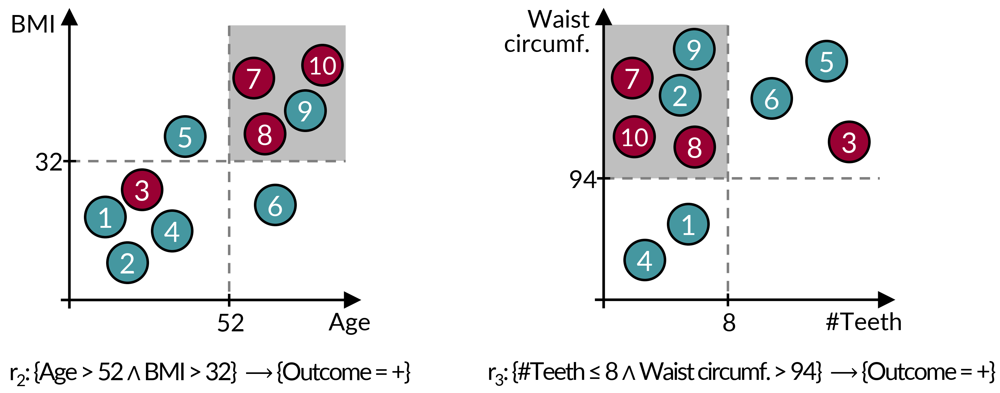
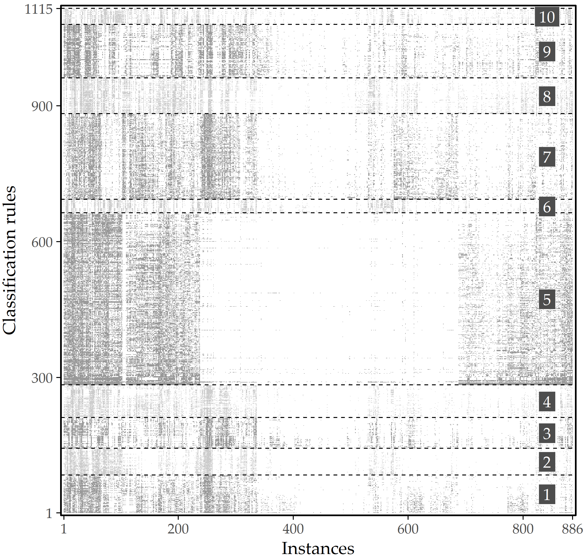
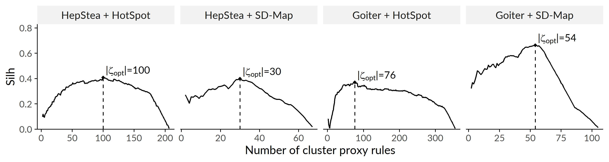
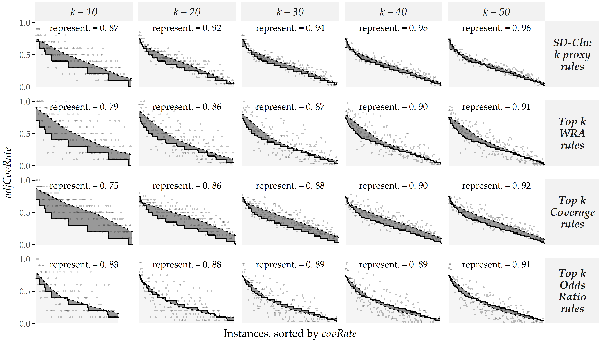

# Identifying Distinct Subpopulations {#sdclu}

```{r 04-setup, eval = FALSE, echo = FALSE, cache = TRUE, message = FALSE, results='asis'}
source("code/00-chapter-start-bib.R")
print_bib("Niemann:CBMS2017", bib = bib)
```


:::: {.infobox .chapter-summary data-latex="{tasks.pdf}"}

#### Brief Chapter Summary {-}

We study redundancy in large rule sets describing subpopulations. 
We present a workflow that extracts a smaller number of representative rules. 
These rules are selected to avoid instance overlap as much as possible, thus covering different concepts in the data space. 
We evaluate our workflow on samples of SHIP with hepatic steatosis and goiter as target variables.

::::

:::: {.infobox .chapter-literature data-latex=""}
This chapter is partly based on:

Uli Niemann, Myra Spiliopoulou, Bernhard Preim, Till Ittermann, and
Henry Völzke. “Combining Subgroup Discovery and Clustering to Identify
Diverse Subpopulations in Cohort Study Data”. In: _Proc. of IEEE Int.
Symposium on Computer-Based Medical Systems (CBMS)_. 2017, pp. 582-587.
DOI: [10.1109/CBMS.2017.15](https://doi.org/10.1109%2FCBMS.2017.15).

::::

<!-- - **distinctiveness**, interestingness, concepts -->

Epidemiologists search for significant relationships between risk factors and outcome in large and heterogeneous datasets that encompass participant health information gathered from questionnaires and medical examinations. 
In the previous chapter, we described a expert-driven workflow that can help epidemiologists to automatically detect such relationships in form of classification rules, which are descriptions of risk factors and predictive value ranges in for a specific subpopulation and an outcome of interest. 
However, rule induction algorithms often produce large and overlapping rule sets requiring the expert to manually pick the most interesting rules and to remove less interesting or redundant rules. 
This post-filtering step is time-consuming and tedious. 
This chapter presents a clustering-based algorithm that hierarchically reorganizes large rule sets and summarizes all important concepts while maintaining _distinctiveness_ between the clusters. 
For each cluster, a representative rule is shown to the expert who in turn can drill-down to other cluster members. 
We evaluate our algorithm on two subsets of SHIP where the outcomes hepatic steatosis and goiter serve as target variable, respectively. 
Further, we report on effectiveness of our algorithm and we present selected subpopulations. 

This chapter presents SD-Clu, an approach that combines subgroup discovery with clustering to return a set of $k$ representative classification rules. 
Building up on a set of potentially highly overlapping rules generated by a SD algorithm, we leverage hierarchical agglomerative clustering to find groups of rules that cover different sets of instances. 
For each cluster, we nominate one rule as the group's representative that exhibits best trade-off between  rule confidence and coverage towards the target variable. 
We define similarity between a pair of subgroups based on the fraction of mutually covered instances and individually covered instances. 
Rules covering (almost) the same instances are likely to be condensed into the same cluster and thus more likely to be represented by a proxy rule. 
We evaluate our algorithm on two samples from _SHIP_ investigating the diseases hepatic steatosis and goiter.

Section&nbsp;\@ref(sdclu-intro) serves as motivation for the related field of subgroup discovery and redundancy of classification rules. 
<!-- Section&nbsp;\@ref(sec:fundamentals) briefly reviews fundamental notations and quality measures of SD.  -->
Section&nbsp;\@ref(sdclu-method) presents our SD-Clu algorithm that generates distinct rules. 
Section&nbsp;\@ref(sdclu-experiments) contains the experimental setup. 
In Section&nbsp;\@ref(sdclu-results), we describe our evaluation results. 
In Section&nbsp;\@ref(sdclu-discussion), we discuss our findings regarding hepatic steatosis and goiter on the SHIP data. 
In Section&nbsp;\@ref(sdclu-conclusions), we summarize our contributions.
<!-- and provide an outlook for future work. -->

## Motivation and Comparison to Related Work {#sdclu-intro}

Subgroup discovery (SD) algorithms aim to uncover _interesting_ relationships between one or more conditions (variables and value ranges) and a target variable in the form of classification rules&nbsp;[@Herrera11; @Atzmueller15]. 
Compared to more accurate but predominantly opaque black-box models such as neural networks, support vector machines, or random forests, SD algorithms provide higher confidence and interpretability of results, making them highly suitable for domain expert-guided subpopulation discovery. 
SD algorithms have been used in several medical studies where descriptive knowledge needed to be inferred, e.g., to extract potential drug targets from multi-relational data sources for the treatment of dementia&nbsp;[@Nguyen:Nature15], to identify predictive auditory-perceptual, speech-acoustic, and articulatory-kinematic features of preschool children with speech sound disorders&nbsp;[@Vick14], and to discover discriminative features in patient subpopulations with different admission times to psychiatric emergency departments&nbsp;[@Carmona11].

However, SD methods often yield large sets of rules that domain experts are not willing to tediously go through all of them to manually separate interesting from irrelevant and redundant rules.
A common observation is that there are groups of rules that cover almost the same set of instances, as shown in Figure&nbsp;\@ref(fig:04-rule-redundancy). 
Instead of presenting _all_ rules found by an SD algorithm at once, we propose to organize rule sets hierarchically so that the domain expert is able to explore a compact set of different concepts, equipped with mechanisms to drill down to specific rules of interest. 

(ref:04-rule-redundancy) **Example of two _redundant_ rules.** Both $r_1$ and $r_2$ cover the instances 7,8,9,10; $r_2$ additionally covers instance 2. The cover set overlap is due to the high correlation between _\#Teeth_ and _Age_, and between _BMI_ and _Waist circumference_. Both rules describe the same concept, i.e., _elderly overweight people have a higher risk of the outcome_. 

```{r 04-rule-redundancy, echo=FALSE, fig.align='center', out.width="80%", fig.cap="(ref:04-rule-redundancy)"}

```

Similar to the HotSpot algorithm described in Section&nbsp;\@ref(imm-workflow-hotspot), popular SD algorithms such as SubgroupMiner&nbsp;[@Kloesgen:SubgroupMiner2002], 
SD&nbsp;[@Gamberger:SD02] and CN2-SD&nbsp;[@Lavravc:CN2-SD04] use a fixed beam width to limit the number of further expanded subgroup candidates at each iteration. 
A post-pruning step can be applied to reduce the cardinality of the rule set -- e.g., to return the _top-k_ rules -- using a quality criterion such as the weighted relative accuracy or the p-value of a statistical test. 
Even when both beam-width search and top-$k$ pruning are applied, the result often still contains redundant rules. 
This is due to the correlation between the (non-target) variables, which leads to a large number of variations of a given finding, cf. Figure&nbsp;\@ref(fig:04-rule-overlap-heatmap) for an illustrative example. 
In particular, top-$k$ pruning leads to different variations of the same concepts (i.e. large instance overlap)&nbsp;[@VanLeeuwen:DSSD12].

<!-- These rules share probably a high number of instances based on the high correlation of anthropometric measurements and there might be multiple other similar rules describing the same \emph{concept}.  -->

(ref:04-rule-overlap-heatmap) Graphical representation of 1115 HotSpot rules found on SHIP data on 886 labeled instances. A gray cell indicates that the instance at that x-position is covered by the rule at the associated y-position. Instances and rules are sorted by agglomerative hierarchical clustering. When partitioning into 10 clusters based on the covered instances, the rules in each cluster describe similar subpopulations. 

```{r 04-rule-overlap-heatmap, echo=FALSE, fig.align='center', out.width=if(knitr::is_latex_output()){"60%"}else{"80%"}, fig.cap="(ref:04-rule-overlap-heatmap)"}

```

Unlike SD, which generates multiple rules that overlap in terms of their coverage sets, predictive rule learning algorithms such as CN2&nbsp;[@Clark:CN289] or RIPPER&nbsp;[@Cohen:RIPPER95] are designed to generate rules that capture different spaces in the data. 
They work iteratively according to a divide-and-conquer strategy&nbsp;[@Fuernkranz:12]: 
First, a rule that maximizes the quality function of the algorithm is generated on the set of instances not yet covered. 
Second, all covered instances are removed from the training set. 
This process of rule induction and removal of instances from the training set is repeated until all instances are covered by at least one rule. 
The output of this algorithm is often a decision list. 
To classify an instance, the prediction of the first rule that covers the instance is used. 
While these algorithms avoid the problem of rule redundancy, important concepts may remain uncovered. 
For example, the algorithm might induce a rule that includes instances with a high BMI, but it might not be able to find a slightly weaker association with income because those instances are immediately removed from the instance candidate space.
In addition, the coverage of rules generally decreases with each iteration.
Rules with low coverage are negligible in epidemiological studies because they may represent spurious correlations of the study sample.

Instead of simply eliminating covered instances from rule induction of subsequent iterations, _weighted coverage approaches_ take into account how many times instances have been covered so far in the rule candidate expansion step&nbsp;[@Lavravc:CN2-SD04]. 
While this leniency over removing instances allows for a larger number of rules, a new hyperparameter is introduced to control the tradeoff between reusing already covered instances and minimum rule confidence. 
This parameter is unintuitive and difficult to set, especially for domain experts. 
Moreover, both traditional predictive rule learning algorithms and their weighted covering extensions introduce order dependencies between rules: a rule depends on all previous rules in the rule list and the instances of the target variable it covers, and it may not make sense to interpret a single rule.  

## Finding Distinct Classification Rules {#sdclu-method}

In this section, we present our algorithm SD-Clu, which combines subgroup discovery with clustering to return a set of $k$ distinct classification rules. 
The algorithm consists of three main steps. 
First, the SD algorithm generates a set of potentially highly overlapping rules. 
Using hierarchical agglomerative clustering, this set of rules is then grouped into a set of distinct rule clusters covering different sets of instances. 
For each cluster, the rule that has the best tradeoff between confidence and coverage of the target variable is appointed as the representative of the group. 
Rules covering the same instances are grouped in the same cluster and are therefore represented by the same proxy rule. 

### Rule clustering 

We use the same notation for classification rule discovery as in Section&nbsp;\@ref(imm-workflow-classification).
Agglomerative hierarchical clustering iteratively merges similar instances to clusters, in a bottom-up way. 
The order of merging two clusters depends on the linkage strategy: in _complete linkage_ the distance between two clusters is defined as the maximum distance between any two of their instances. 
The pair of clusters minimizing this maximum distance are selected for merging. 
A dendrogram is a tree representation of this stepwise process. 
Optionally, a parameter $k$ can be specified to obtain a specific partitioning. 
We define rule similarity for clustering on the basis of the mutually covered instances as an adaption of the Sørensen–DICE coefficient&nbsp;[@Dice45]. 
The distance between two rules $r_1$, $r_2$ with corresponding subpopulations $s(r_1)$, $s(r_2)$ is given as
\begin{equation}
\text{dist}(r_1,r_2) = 1 - \frac{2\cdot\left|s(r_1)\cap s(r_2)\right|}{\left|s(r_1)\right| + \left|s(r_2)\right|}.
(\#eq:dice)
\end{equation}
The number of clusters can be specified as parameter $k$. 
Alternatively, we describe an approach that derives an appropriate $k$ from the rule set using a cluster quality function such as the Silhouette coefficient. 
For a clustering $\xi$ and a set of rules $R$, the Silhouette coefficient is calculated as 
\begin{equation}
\text{Silh}(R,\xi) = \frac{1}{|R|}\sum_{r\in R}{\frac{b(r)-a(r)}{\max\left\{a(r), b(r)\right\}}}
(\#eq:silh)
\end{equation}
where 
\begin{equation}
a(r)=\frac{\sum_{y\in{}Y}\text{dist}(r,y)}{|Y|-1}
(\#eq:silh-a)
\end{equation}
is the average dissimilarity between $r$ and the other rules in the cluster $Y\in\xi$ which contains $r$, while 
\begin{equation}
b(r)=\frac{\sum_{y\in{}Z}\text{dist}(r,y)}{|Z|}
(\#eq:silh-b)
\end{equation}
is the average dissimilarity between $r$ and the rules in the cluster $Z\in\xi$ which is the closest to the cluster $Y$ containing $r$. 
Then, we traverse the dendrogram bottom-up, compute the Silhouette for each set of clusters $\xi$ and select as $\xi_{opt}$ the set of clusters with the best Silhouette value. 
The optimal number of clusters is then the cardinality $|\xi_{opt}|$. 
Finally, we map each cluster $Y\in\xi_{opt}$ to a representative rule. 
To do so, we invoke the rule interestingness measure _Weighted Relative Accuracy_ (WRA hereafter) which balances coverage and confidence gain and is defined as 
\begin{equation}
WRA(r)=Cov(r)\cdot\left(Conf(r)-\frac{n_{T=v}}{N}\right)
(\#eq:wra)
\end{equation}
where $N$ is the total number of instances in the dataset and $n_{T=v}$ is the number of instances with the target variable value of interest. 
We compute WRA for each rule $r\in{Y}$ and select as cluster proxy $cp(Y)$ the rule for which WRA is maximum.

### Representativeness of a set of cluster proxies

The rule proxies should be a good representation of the total rule set. 
Thus, each instance should be covered equally often by the cluster proxies compared to the total rule set. 
Hence, we define representativeness as difference between the average fraction of proxy rules the instances are covered by and the total average fraction of rules the instances are covered by. 
If the difference between the two ratios is small, then the representativeness of the cluster proxy rules is high.

Typically, the set of rule clusters $\zeta$ for a set of rules $R$ will be the optimal set of clusters, as described in the previous subsection, but it can be any set of clusters chosen by the user, as long as it contains all rules in $R$. 
For $\zeta$, let $R_{\zeta}=\{cp(Y)|Y\in\zeta\}$ denote the set of cluster proxy rules. 
To quantify how representative such a set of rules is, we proceed as follows. 
First, let $U\subseteq{}R$ be an arbitrary subset of the complete set of rules, and let $x$ be an instance. 
The _coverage rate_ of $x$ towards $U$ is calculated as
\begin{equation}
covRate(x,U) = \frac{\sum_{r\in{}U}isCovered(x,r)}{|U|}
(\#eq:covRate)
\end{equation}
where $isCovered(x,r)$ is equal to 1, if $r$ covers $x$, i.e., $x\in s(r)$, and 0 otherwise.
We observe that for a set of rules $U$, an instance $x$ cannot be covered by more than $|U|$ rules. 
Let $R_x$ be the set of rules that cover instance $x$, i.e., for $R_x=\{r\in{}U | isCovered(x,r)=1 \}$.
For the whole set of instances $X$ we create bins:
\begin{equation}
bin_i(U)= \{x \in{}X | |R_x|=i \}.
(\#eq:bini)
\end{equation}
Further, let $bin_0(U)= \{x \in{}X | \forall r\in U : isCovered(x,r)=0 \}$.
Evidently, an instance $x$ can be covered by $0, 1, \ldots, |U|$ rules, i.e. $covRate(x,U)$ can take one of $|U|+1$ values. 
In contrast, $covRate(x,R)$ can take one of $|R|+1$ values, a usually much larger number. We therefore map the possible values of $covRate(x,R)$ into the much smaller set of possible values by rounding, computing:
\begin{equation}
adjCovRate(x,U, R)=\frac{\lfloor covRate(x,R)\cdot|U| \rceil}{|U|}
(\#eq:adjCovRate)
\end{equation}
where $\lfloor\rceil$ is the rounding operator. 
Then, for the complete set of instances $X$, a set of induced rules $R$, the clustering $\zeta$ over $R$ and the set of cluster proxy rules $R_{\zeta}$, the _representativeness_ of $R_{\zeta}$ is defined as
\begin{equation}
representativeness(R_{\zeta},R)=1-
\frac{1}{|X|}\sum_{x\in{}X} |adjCovRate(x,U,R) - covRate(x,R_{\zeta})|.
(\#eq:representativeness)
\end{equation}

## Experimental Setup {#sdclu-experiments}

`r start_paragraph("Datasets.")` 
To evaluate our method, we used data from the SHIP study. 
For a description of SHIP, see Section&nbsp;\@ref(background-data-ship). 
We considered hepatic steatosis (see section&nbsp;\@ref(imm-workflow-target)) and goiter as target variables. 
For the sample `HepStea`, we derived a binary outcome variable by discretizing the liver fat concentration obtained from the MRI report so that study participants with a concentration no greater than 10% were assigned to the negative class and values greater than 10% were assigned to the positive class indicating the presence of the disease. 
Of 886 participants for whom the MRI report from SHIP-2 was available at that time, 694 (78.3%) were negative and 192 (21.7%) were positive. 
We considered 99 variables selected exclusively from SHIP-0 to assess their long-term effects as expressed 10 years later in SHIP-2. 
For the `Goiter` sample, the outcome variable was derived by thyroid ultrasound. 
The presence of goiter was defined for a thyroid volume greater than 18ml in women and 25ml in men&nbsp;[@Gutekunst:88]. 
Of the 4400 participants for whom the outcome variable is available in TREND-0, 3010 belong to the negative class (68.4%) and 1390 (31.6%) to the positive class.
Apart from the target variable, we use a total of 182 variables that were pre-selected by a medical expert as potential risk factors. 

`r start_paragraph("SD algorithms.")`
For subgroup discovery, the two algorithms HotSpot&nbsp;[@Hall:Weka09] (cf. Section&nbsp;\@ref(imm-workflow-hotspot) and SD-Map&nbsp;[@Atzmueller:SD-Map:06] are used. 
SD-Map is an exhaustive algorithm that adapts the popular FP-Growth association rule learning method&nbsp;[@Han:FPGrowth00]. 
Rules that fall below a minimum coverage threshold are pruned. 
A deep-first search is performed for candidate generation. 
Rules are ranked according to a user-defined quality function. 
We used the implementation from the VIKAMINE framework&nbsp;[@Atzmueller:VIKAMINE12]. 
The implementation of SD-Map only supports categorical variables. 
Therefore, each numeric variable was discretized using the minimum description length based approach of Fayyad and Irani&nbsp;[@Fayyad:MDL93]. 
For SD-Map, we set the minimum coverage threshold to 0.05 to avoid overfitting rules that are too small. 
We use WRA as a quality function and define a minimum threshold of 0.025. 
For HotSpot, we set the support threshold of a rule to be above 0.05. 
The beam width is set to 500. 
In addition, to avoid rather meaningless literals, we restrict the extension of a rule body with another literal to a relative confidence gain of at least 0.3. 
To avoid having many overly specific rules that cover only a small number of study participants, we limit the length of a rule body, i.e., the number of literals to 3.

## Results {#sdclu-results}

In Figure&nbsp;\@ref(fig:04-silh-comparison), we show the optimal number of clusters for each combination of study sample and SD algorithm. 
Table&nbsp;\@ref(tab:04-silh) shows the optimal $k$ and the ratio of proxy rules vs. total number of rules. 
For example, clustering with optimal silhouette coefficient for the algorithm HotSpot on `Goiter` has 76 clusters and thus 76 rule cluster proxies (cf. Table&nbsp;\@ref(tab:04-silh)), which is only 21.3% of the total number of rules. 
Thus, if only the cluster proxies are displayed to the expert at the beginning, the time needed to check the rules is reduced. 

(ref:04-silh-comparison) **Silhouette coefficients ($Silh$) of SD-Clu using complete linkage for each combination of dataset and algorithm.** The cardinality of the clustering with the highest $Silh$ score ($|\zeta_{opt}|$) is indicated by a dashed vertical line.

```{r 04-silh-comparison, echo=FALSE, fig.align='center', out.width="100%", fig.cap="(ref:04-silh-comparison)"}

```

(ref:04-silh) **Statistics of best runs per dataset and algorithm.** Number of rules $|R|$, optimal Silhouette coefficient $Silh(\zeta_{opt})$, the corresponding cardinality of the optimal clustering $|\zeta_{opt}|$ and percentage of cluster proxies relative to the total number of rules for every combination of data sample and SD algorithm.

```{r 04-silh, echo=FALSE}
`%>%` <- dplyr::`%>%`
knitr::kable(
  tibble::tribble(
    ~Dataset, ~Algorithm, ~`$|R|$`, ~`$Silh(\\zeta_{opt})$`, ~`$|\\zeta_{opt}|$`, ~`$\\frac{|\\zeta_{opt}|}{|R|} [\\%]$`, 
    "HepStea", "HotSpot", 208, 0.41, 100, 48.1, 
    "HepStea", "SD-Map", 68, 0.40, 30, 44.1, 
    "Goiter", "HotSpot", 356, 0.37, 76, 21., 
    "Goiter", "SD-Map", 106, 0.66, 54, 51.6
  ),
  escape = FALSE, booktabs = TRUE, linesep = "",
  caption = "(ref:04-silh)"
) %>%
  kableExtra::kable_classic() #%>%
  # kableExtra::row_spec(0, bold = TRUE)
```

The optimal cardinality of $|\zeta_{opt}|$ shown in Figure&nbsp;\@ref(fig:04-silh-comparison) could be used as a suggestion, but the expert is free to specify the number of rules they wishes to obtain. 
For example, if the expert considers $|\zeta_{opt}|$ = 100 too large for HotSpot on `HepStea`, the diagram would show them that a reduction to $|\zeta_{opt}|$ = 58 is possible, reducing $Silh$ only slightly from 0.48 to 0.37. 
Also in the other direction: if $|\zeta_{opt}|$ is rather low, the diagram shows that a small increase does not change $Silh$ much; therefore, the added rules may also be important. 
The expert could even analyze the diagram to derive a range instead of a single value, e.g., the range where $Silh$ is above 90% of its maximum. 

To assess the representativeness of the cluster proxies, we compare them with three baseline criteria that return the top $k$ rules according to odds ratio (baseline 1), coverage (baseline 2), and WRA (baseline 3). 
Figure&nbsp;\@ref(fig:04-representativeness-hepStea-hotSpot) juxtaposes the representativeness of SD-Clu and the three baselines for different numbers of rules $k$ returned to the expert for the HotSpot algorithm on the sample `HepStea`. 
The plots are arranged by rule selection method (rows) and number of representative rules $k$ returned to the expert (columns). 
Each graph shows the $adjCovRate$ (y-axis) of instances (x-axis) with respect to $R$ (solid black curve). 
The instances are sorted by the number of rules in $R$ they are covered by, with their respective $covRate$ shown as dots. 
The dotted curve represents a locally weighted scatterplot smoothing (LOWESS) of the points. 
Ideally, both curves are close to each other, meaning that the instances are covered by approximately the same proportion of rules in the cluster proxy as the proportion of rules in general. 


(ref:04-representativeness-hepStea-hotSpot) **Evaluation of $representativeness$ on `HepStea` using the HotSpot algorithm.** $representativeness$ of SD-Clu and three baseline approaches for different numbers of clusters $k$ on the `HepStea` sample using HotSpot. Points depict an instance's $adjCovRate$ with respect to the set of representative rules of the approach (row) and $k$ (column). Instances are sorted by $covRate$ with respect to $R$ , i.e., the set of all rules) in descending order, shown by a solid black curve. A dotted curve depicts a LOWESS regression fit on the points. The similarity between solid and dotted curve illustrates $representativeness$ of the top-$k$ rules of the respective approach. This is illustrated by the dark gray area in-between solid curve and dotted curve where smaller areas are better and reflect higher $representativeness$ values. 

<!-- **TODO: PUT THE PLOTS OF THE OTHER PARTITIONS INTO THE APPENDIX** -->

```{r 04-representativeness-hepStea-hotSpot, echo=FALSE, fig.align='center', out.width="100%", fig.cap="(ref:04-representativeness-hepStea-hotSpot)"}

```

For all approaches, $representativeness$ improves with increasing number of representative rules $k$. 
For example, $representativeness$ increases from 0.87 to 0.96 for SD-Clu and $k=10$ to $k=50$ which means that the absolute difference between $adjCovRate$ of $\zeta$ and $covRate$ of $R$ over all instances successively decreases. 
Further, for a given $k$, the representative rules of the baselines are less representative than SD-Clu's cluster proxy rules, e.g. 0.91, 0.92, 0.91 vs. 0.96 for $k=50$, respectively (cf. 5th column of plot matrix in Figure&nbsp;\@ref(fig:04-representativeness-hepStea-hotSpot)). 

### Discussion of Findings {#sdclu-discussion}

Tables&nbsp;\@ref(tab:04-findings-hep-stea) and&nbsp;\@ref(tab:04-findings-goiter) show the antecedent, support, and confidence of cluster proxy rules found by two algorithms for `HepStea` and `Goiter` with $k$=5.
The prevalence of hepatic steatosis or goiter is significantly higher in each of the subpopulations described by these rules than in the corresponding overall population. 
These subpopulations are characterized by known risk factors for hepatic steatosis, such as large waist circumference and BMI, blood pressure and hypertension, advanced age, and high values in some of the medical tests (ALAT and LDL). 
Furthermore, apolipoprotein A1 (ApoA1), a major protein component of high-density lipoprotein (HDL) particles in plasma, was found to be associated with outcome in elderly patients (see fourth hotspot rule in Tables&nbsp;\@ref(tab:04-findings-hep-stea)). 
Lipoprotein metabolism is considered the main process contributing to the development of fatty liver&nbsp;[@jiang2013lipoprotein]. 
In addition, Poynard et al&nbsp;[@poynard1986apolipoprotein] found that patients with hepatic steatosis had higher levels of ApoA1 than patients with hepatic fibrosis, who in turn had higher levels than patients with cirrhosis. 
The fifth hotspot rule describes a subpopulation with elevated levels of liver high-sensitivity C-reactive protein (CRP) (approximately 0.80-quantile) and elevated levels of uric acid (approximately 0.36-quantile). 
Lizardi-Cervera et al.&nbsp;[@lizardi2007association] reported increased levels of ultra-sensitive CRP in subjects with hepatic steatosis independent of other metabolic states. 
Similarly, Keenan et al.&nbsp;[@keenan2012relation] found elevated uric acid levels in patients with hepatic steatosis independent of metabolic syndrome. 

(ref:04-findings-hep-stea) **Representative rules (`HepStea`).** Proxy rules for $k$ = 5 on the `HepStea` sample learned and the positive outcome as target. 

```{r 04-findings-hep-stea, echo=FALSE}
`%>%` <- dplyr::`%>%`
kableExtra::kbl(
  tibble::tribble(
    # ~`test`, ~`Antecedent of cluster proxy $r$`, ~`$Sup(r)$`, ~`$Conf(r)$`, ~`$Lift(r)$`,
    ~`\\#`, ~`Antecedent of cluster proxy`, ~`Sup`, ~`Conf`, ~`Lift`,
    "1", "increased waist circumference = TRUE", 0.72, 0.37, 1.69,
    "2", "hypertension = TRUE", 0.60, 0.33, 1.54,
    "3", "age > 44 $\\wedge$ apolipoprotein A1 $\\leq$ 1.56 g/l", 0.37, 0.41, 1.90,
    "4", "physical health score $\\leq$ 47.3 $\\wedge$ increased waist circumference = TRUE", 0.29, 0.48, 2.12,
    "5", "high-sensitivity C-reactive protein > 2.8 mg/l $\\wedge$ uric acid > 246 \u03BCmol/l", 0.29, 0.46, 2.21,
    
    "1", "diastolic blood pressure > 79.75 mmHg $\\wedge$ hip circumference > 98.05 cm $\\wedge$ cholesterol-HDL-quotient > 3.015", 0.67, 0.40, 1.85,
    "2", "increased waist circumference = TRUE $\\wedge$ diastolic blood pressure > 79.75 mmHg $\\wedge$ body mass index > 26.3 kg/m²", 0.58, 0.45, 2.07,
    "3", "waist circumference > 88.15 cm $\\wedge$ diastolic blood pressure > 79.75 mmHg $\\wedge$ body mass index > 26.3 kg/m²", 0.59, 0.46, 2.11,
    "4", "body mass index > 26.3 kg/m² $\\wedge$ alanin-aminotransferase > 0.385 \u03BCkatal/l $\\wedge$ diastolic blood pressure > 79.75 mmHg", 0.55, 0.48, 2.20,
    "5", "body mass index > 26.3 kg/m² $\\wedge$ uric acid > 278.5 \u03BCmol/l $\\wedge$ alanin-aminotransferase > 0.385 \u03BCkatal/l $\\wedge$ treated urinary tract diseases = TRUE", 0.54, 0.46, 2.34
  ),
  booktabs = TRUE, escape = FALSE,
  caption = "(ref:04-findings-hep-stea)"
) %>%
  kableExtra::kable_classic() %>%
  kableExtra::column_spec(2, width = "10cm") %>%
  kableExtra::row_spec(0, bold = TRUE) %>%
  kableExtra::pack_rows("HotSpot", 1, 5) %>%
  kableExtra::pack_rows("SD-Map", 6, 10)
```

Similarly, the identified subpopulations for goiter (see Table&nbsp;\@ref(tab:04-findings-goiter)) are characterized by common risk factors such as increased weight and body mass index and participants prescribed angiotensin II receptor blockers (see second HotSpot rule).
Furthermore, the first HotSpot rule describes participants with intima-media thickness greater than 0.73 mm (approximately 0.80-quantile). 
Previous studies found associations between intima-media thickness and thyroid-stimulating hormone&nbsp;[@takamura2009thyroid] and subclinical hypothyroidism
[@gao2013carotid; @unal2017association]. 
The condition of the third HotSpot rule describes the duration of an ECG phase. 
Jabbar et al&nbsp;[@jabbar2017thyroid] summarize in their review that pathological thyroid hormone levels increase the risk of cardiovascular disease. 
This association appears to be especially true in the elderly&nbsp;[@fazio2004effects].
The fourth rule suggests that certain thrombocyte levels indicate increased thyroid volume, which confirms Erikci et al&nbsp;[@erikci2009effect] who found that hypothyroid patients had higher platelet volume and platelet distribution width than a control group. 

(ref:04-findings-goiter) **Representative rules (`Goiter`).** Proxy rules for $k$=5 on the `Goiter` sample learned and the positive outcome as target.

```{r 04-findings-goiter, echo=FALSE}
`%>%` <- dplyr::`%>%`
kableExtra::kbl(
  tibble::tribble(
    # ~`\\#`, ~`Antecedent of cluster proxy $r$`, ~`$Sup(r)$`, ~`$Conf(r)$`, ~`$Lift(r)$`,
    ~`\\#`, ~`Antecedent of cluster proxy`, ~`Sup`, ~`Conf`, ~`Lift`,
    "1", "intima-media thickness > 0.73 mm", 0.27, 0.43, 1.34,
    "2", "intake of angiotensin II receptor blocker = TRUE", 0.10, 0.62, 1.90,
    "3", "duration of QRS complex on ECQ > 114 ms $\\wedge$ discouraged and sad mood = \"never\" $\\wedge$ body mass index > 26.65 kg/m²", 0.06, 0.87, 2.68,
    "4", "education level = 8 $\\wedge$ thrombocytes < 209 Gpt/l", 0.11, 0.62, 1.92,
    "5", "aorta descendens thickness > 2.79 mm $\\wedge$ thyroid-stimulating hormone $\\leq$ 1.05 mU/l $\\wedge$ hemoglobin > 8.8 mmol/l", 0.06, 0.88, 2.73,
    
    "1", "intima media thickness > 0.55 mm $\\wedge$ proton pump inhibitors intake = FALSE $\\wedge$ age > 38.5", 0.68, 0.44, 1.34,
    "2", "duration of ECG P wave > 111 ms $\\wedge$ age > 38.5 $\\wedge$ proton pump inhibitors intake = FALSE", 0.60, 0.45, 1.38,
    "3", "hip circumference > 98.75 cm $\\wedge$ age > 38.5 $\\wedge$ proton pump inhibitors intake = FALSE", 0.60, 0.44, 1.34,
    "4", "increased waist circumference = TRUE $\\wedge$ age > 38.5 $\\wedge$ proton pump inhibitors intake = FALSE", 0.59, 0.44, 1.34,
    "5", "increased waist circumference = TRUE $\\wedge$ intima media thickness > 0.55 mm $\\wedge$ proton pump inhibitors intake = FALSE", 0.51, 0.46, 1.41
  ),
  booktabs = TRUE, escape = FALSE,
  caption = "(ref:04-findings-goiter)"
) %>%
  kableExtra::kable_classic() %>%
  kableExtra::column_spec(2, width = "10cm") %>%
  kableExtra::row_spec(0, bold = TRUE) %>%
  kableExtra::pack_rows("HotSpot", 1, 5) %>%
  kableExtra::pack_rows("SD-Map", 6, 10) 
```


## Conclusions on identifying distinct subpopulations {#sdclu-conclusions}

SD-Clu tackles the problem of high instance overlap in sets of rules generated by subgroup discovery algorithms. 
By limiting the number of rules time spent for rule inspection is reduced.
SD-Clu nominates a representative rule from a hierarchical clustering from a large set of rules, and thus returns rules that express distinct concepts, i.e., rules that cover different sets of instances. 
The introduced _representativeness_ measure assesses whether instances are similarly often covered by representatives as by the total rule set. 
SD-Clu was evaluated on two samples from an epidemiological study where an optimal set of _proxy_ rules was selected that (i) contains considerably less rules than the total rule set and (ii) is more representative compared to the baseline approaches, respectively.
