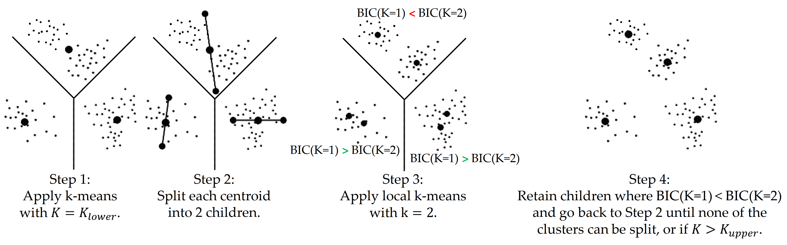
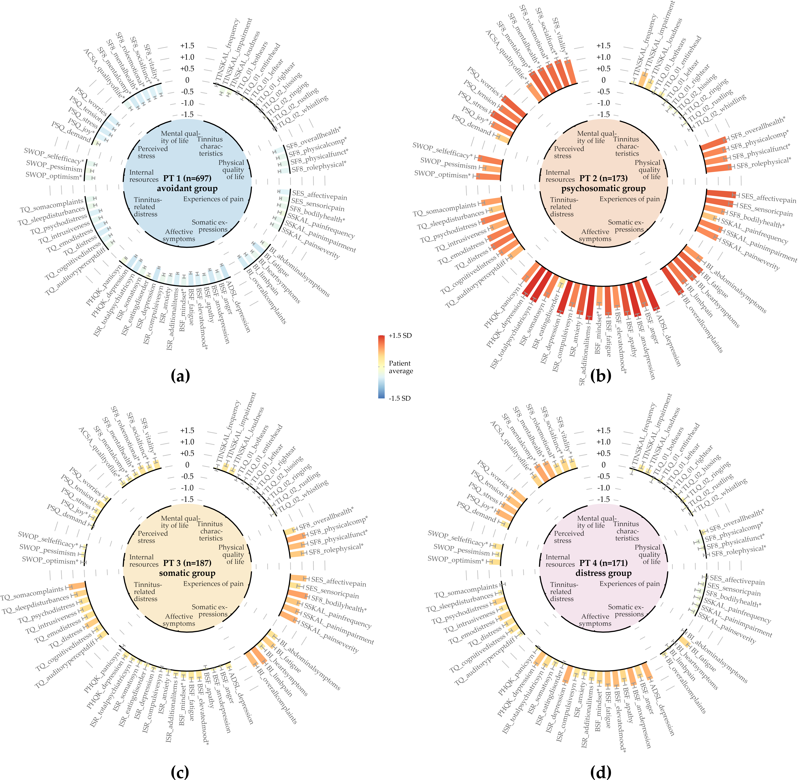
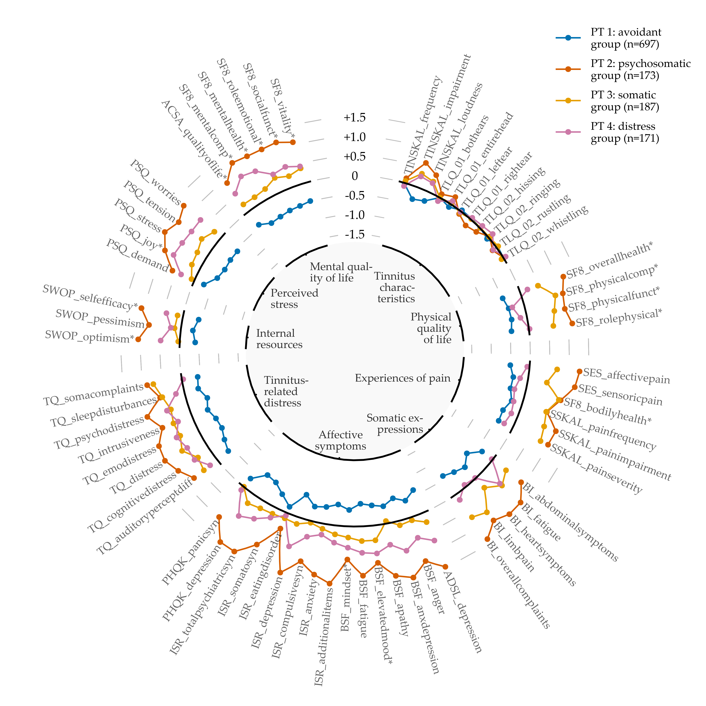
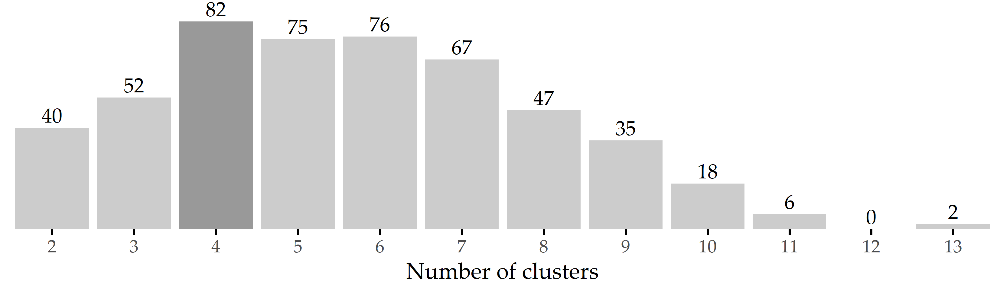
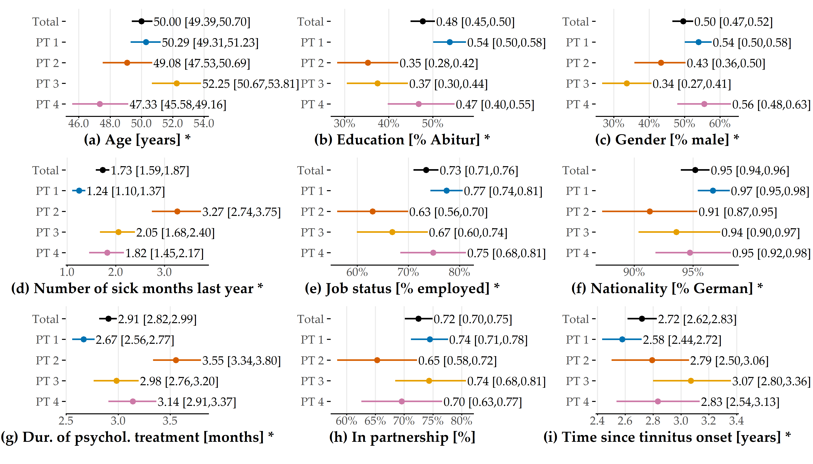
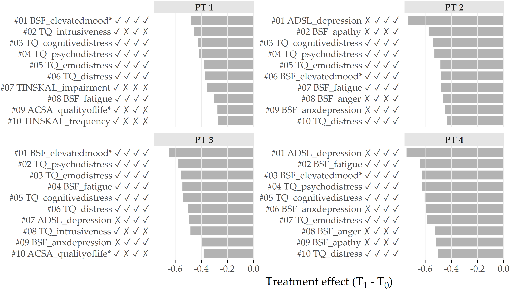

# Visual Identification of Informative Features {#phenotypes}

```{r 05-setup, eval = FALSE, echo = FALSE, cache = TRUE, message = FALSE, results='asis'}
source("code/00-chapter-start-bib.R")
print_bib("Niemann:SREP_Pheno2020", bib = bib)
```

:::: {.infobox .chapter-summary data-latex="{tasks.pdf}"}

#### Brief Chapter Summary {-}

<!-- **TODO: VLT. ALS AUFZÄHLUNG** -->
Knowledge of different disease phenotypes can help understand (a) which patient subpopulations seek treatment and (b) the response to treatment within each subgroup.
We present a workflow to (i) determine distinct phenotypes of medical conditions in high-dimensional data, (ii) visualize these phenotypes to explore and compare essential subpopulation characteristics, and (iii) interactively inspect them and their change over time with an interactive web application.
We evaluate our workflow on the CHA data by identifying four distinct phenotypes of tinnitus patients.

::::

:::: {.lit .chapter-literature data-latex=""}
This chapter is partly based on:

Uli Niemann, Petra Brueggemann, Benjamin Boecking, Matthias Rose, Myra Spiliopoulou, and Birgit Mazurek. "Phenotyping chronic tinnitus patients using self-report questionnaire data: cluster analysis and visual comparison". In: _Scientific Reports_ 10 (2020), pp. 1-10. DOI: [10.1038/s41598-020-73402-8](https://doi.org/10.1038%2Fs41598-020-73402-8).

::::

The supervised methods for subpopulation discovery described in the previous chapters show great potential for applications with one or a small number of well-defined target variables. 
However, some medical conditions are multifaceted and are not well understood yet. 
For example, chronic tinnitus is a complex, multifactorial and heterogeneous disorder [@Cederroth2019]. 
Clinical assessment and selection of a suitable treatment is difficult because not all patients benefit equally from each type of intervention [@hesse2016evidence; @theodoroff2014individual; @Tyler:TinnitusClustering2008].
Due to the large number and heterogeneity of available assessment tools, _phenotyping_ appears promising to (a) describe the subpopulations of patients seeking treatment and (b) understand the response to treatment within each subpopulation [@Langguth:LCA2017; @Tyler:TinnitusClustering2008; @Schecklmann:BrainResearch2012]. 
Clinical acceptance of these empirical results can be further strengthened by comprehensive visualizations that intuitively illustrate each phenotype's major characteristics and differences between multiple phenotypes. 

This chapter describes a workflow to 

- determine distinct phenotypes of medical conditions with a parameter-free clustering algorithm in high-dimensional data,
- visualize these phenotypes to explore and compare essential subpopulation characteristics, and
- inspect them further in an interactive web application.

Our workflow's effectiveness is demonstrated on the CHA dataset (Section&nbsp;\@ref(background-data-cha)) by exploring phenotypes of tinnitus patients.

This chapter is organized as follows.
Section&nbsp;\@ref(phenotypes-motivation) describes the clinical value of patient stratification, briefly reviews previous approaches for the example disorder, and discusses significant challenges for phenotyping in high-dimensional data.
We present all our workflow components in Section&nbsp;\@ref(phenotypes-phenotyping), namely the clustering algorithm, our novel visualization types, and our web application.
Section&nbsp;\@ref(phenotypes-features) lists the features used for clustering and provides details on the CHA data subset used for workflow evaluation. 
In Section&nbsp;\@ref(phenotypes-results), we present the discovered tinnitus phenotypes and describe their characteristics.  
In Section&nbsp;\@ref(phenotypes-discussion), we discuss our findings from the medical perspective and compare them to related work. 
Finally, we conclude the chapter with a summary and outlook in Section&nbsp;\@ref(phenotypes-conclusion). 

## Motivation and Comparison to Related Work {#phenotypes-motivation}

Challenges for management and treatment of tinnitus are primarily caused by its clinical heterogeneity, including individual perception, risk factors, comorbidities, degrees of perceived stress, and treatment response (cf. Section&nbsp;\@ref(background-data-cha)). 
These factors make it difficult for clinicians (a) to choose _the_ treatment which is most effective for an individual patient and (b) to design a unified treatment strategy from which all patients equally benefit. 
The awareness of the existence of distinct patient subgroups may stimulate the development of more effective therapy modules [@genitsaridi2020review]. 
Since clinically relevant subgroups have not been established yet, clustering emerges as a promising approach to identify characteristic tinnitus _phenotypes_ in a data-driven and hypothesis-free way. 

Previous studies found subgroups of tinnitus patients with cluster analysis based on a small number of audiometric features [@Langguth:LCA2017], a combination of features extracted from self-reports, audiometry, and psychoacoustics [@Tyler:TinnitusClustering2008], or neuroimaging data and 
socio-demographics [@Schecklmann:BrainResearch2012]. 
Although each of these studies provided insights into tinnitus subgroup patterns,  acceptance among medical scholars may be increased by presenting the clustering results with intuitive visualizations that show individual subgroup patterns and enable the visual juxtaposition of multiple subgroups in high-dimensional data. 

Addressing this requirement, Schlee et al. [@Schlee:RadarVis2017] proposed a compact radar graph to compare of the degree of health burden between individuals or subgroups based on measurements from self-report questionnaires. 
While their visualization could be applied to any disease domain, Schlee et al. demonstrated its efficacy showing subgroup differences regarding measurements of tinnitus distress and associated comorbidities. 
However, they did not aim to visualize clustering results.
Instead, they restricted themselves to pre-defined cohorts by graphically comparing female against male patients and patients with low tinnitus frequency against patients with high tinnitus frequency. 

`r start_paragraph("Challenges for clustering in high-dimensional data.")`
There are several challenges when clustering on high-dimensional medical datasets:

- How can we determine an appropriate number of clusters in the absence of a ground truth?
- How can we represent high-dimensional data compactly but also faithfully?
- How can we visualize essential characteristics of high-dimensional clusters? 

We present related work for each challenge below.

<!-- ### PreambleHerausforderungen 1 k, 2 post-hoc evaluation of cluster quality, 3 dimensionality reduction, 4 visualization -->

`r start_paragraph("Determination of an appropriate number of clusters in the absence of a ground truth.")`
Practical considerations of data clustering include how to set the number of clusters $k$. 
Since a ground truth is often not available, several heuristics to automatically determine $k$ have been proposed. 
A popular approach is the so-called "elbow" method, which involves running the clustering algorithm with different $k$ values, cf. Section&nbsp;\@ref(evo-concept-clustering) for the application of the elbow method for density-based clustering. 
The number of clusters is plotted against cluster _compactness_. 
In the popular k-means algorithm, cluster compactness is quantified by the total within-sum of squares (WSS), the sum of squared distances between each observation and its centroid over all clusters. 
As WSS or similar goodness of fit measures increase monotonically with increasing $k$, the idea of the elbow method is to identify the curve's characteristic "knee point", which is the first point from which adding another cluster leads only to a _minor_ improvement in compactness. 
Because the plot is not guaranteed to exhibit such a distinctive knee point and universal compactness thresholds do not exist, this approach is sometimes impracticable.
Another popular clustering evaluation measure is the Silhouette coefficient (see Section&nbsp;\@ref(sdclu-method-proxy-rules)), which favors clusterings that assign similar objects to the same cluster and dissimilar objects to a different cluster.
Instead of evaluating clustering quality post-hoc, we decided to leverage an algorithm that automatically determines a suitable number of subgroups already _during_ clustering.

`r start_paragraph("Dimensionality reduction.")`
Dimensionality reduction (DR) techniques are often used to project the original high-dimensional data onto a low-dimensional projection that allows simple visualization types such as scatterplots to be used. 
Ideally, the DR projection preserves the original data's essential structures, such as relative pairwise distance, clusters, outliers, and correlations. 
Principal Component Analysis [@Hotelling:PCA1933] (PCA) is a seminal DR algorithm that generates linear, orthogonal combinations of the original dimensions. 
Each new dimension, called principal component, contains a loading indicating how much variability of the data it covers. 
Typically, the first two or three dimensions that carry the highest loads are selected for visualization. 
PCA is not robust to outliers and cannot capture nonlinear relationships. 
Multidimensional scaling [@Gower:MDS1966] (MDS) is another early DR technique that emphasizes the preservation of pairwise distances, i.e., objects close to each other in high-dimensional space should also be close to each other in low-dimensional projected space.
For complex, arbitrarily shaped structures, pairwise distances may be subject to the curse of dimensionality, leading to poor results. 
$t$-stochastic neighborhood embedding [@VanDerMaaten:tSNE2008] ($t$-SNE) and Uniform Manifold Approximation and Projection [@mcinnes2018umap] (UMAP) are nonlinear dimensionality reduction methods that represent a matrix of pairwise similarities. 
The idea is to preserve both global structures such as clusters and local structures such as distances and neighbors. 
Both $t$-SNE and UMAP can produce superior projections compared to traditional linear techniques, provided their hyperparameters are appropriately tuned. 
However, a shortcoming of these techniques is that the degree of preservation or contribution of the original features cannot be measured. 
Moreover, a projection cannot be applied to new observations; instead, a new projection must be recomputed. 
Because of their stochasticity, different runs with the same hyperparameters may yield different results. 
Medical researchers are usually interested in understanding the relationship between the original variables and the new dimensions to draw actionable conclusions from the patterns found in the projected space.
Since the semantics of the original dimensions are lost in DR, we prefer to maintain the high-dimensional space for clustering and visualization. 

`r start_paragraph("Visualization of high-dimensional clusters.")`
Visualizing clusters in high-dimensional data is challenging. 
Scatterplot matrices (SPLOMs) can intuitively represent the 
relationship between all pairs of features as a matrix of two-dimensional scatterplots [@Im:GPLOM2013; @Klemm:RegressionHeatmap2015]. 
However, as the number of features increases, the number of scatterplots grows quadratically, leading to scalability problems such as overplotting. 
Several advanced visualization techniques have been proposed as a remedy, from merely adding transparency or colors to points to more sophisticated density contours, hexagon binning, layers with aggregated geometric features (minimal spanning trees, alpha shapes, convex hulls), animation, or combinations of several techniques such as 
splatterplots [@Mayorga:Splatterplots2013]. 
However, SPLOMs and other traditional visualization techniques such as parallel coordinate graphs [@Hartigan:PCC1975] are still more suitable for low-dimensional data. 
In general, the focus of phenotype visualization is not to represent the specifics of individual subjects but to show the most important general characteristics of each subpopulation.
Therefore, to represent patterns in high-dimensional space, we do not create multiple, often cluttered subplots, as the above approaches do, but we represent essential phenotype characteristics in a single visualization.
We further provide a web application to explore one and juxtapose multiple phenotypes interactively.

## Discovery and Visualization of Phenotypes {#phenotypes-phenotyping}

We propose a workflow for determining, visualizing, and inspecting essential phenotypes for a medical condition in high-dimensional datasets.
In the following, we present the individual steps of our workflow.
Section&nbsp;\@ref(phenotypes-phenotyping-xmeans) describes the clustering algorithm X-means, which internally determines an appropriate number of phenotypes.
Then, we present our solution for visualizing these phenotypes with radial bar graphs and radar graphs in Section&nbsp;\@ref(phenotypes-phenotyping-vis).
Section&nbsp;\@ref(phenotypes-phenotyping-app) describes our web application which combines these visualizations with interactive elements for further phenotype inspection and comparison. 

### X-means Clustering {#phenotypes-phenotyping-xmeans}

X-means [@Pelleg:xmeans2000] is a parameter-free adaption of the popular k-means algorithm, which incorporates the Bayesian information criterion [@Schwarz:BIC1978] (BIC) to find a good tradeoff between a low total sum of squares and a small number of clusters. 

Let $\mathcal{D}$ be the dataset with $d$ dimensions and let $D$ be a subset of $\mathcal{D}$, i.e., $D\subseteq \mathcal{D}$. 
A k-means clustering on $D$ creates the set of clusters 
$\mathcal{C}=\left\{C_1,\ldots,C_k,\ldots,C_K\right\}$, where $c_k$ is the centroid of cluster $k$, $r_k$ is the number of objects in $D$ assigned to $C_k$ and $p$ is the number of free parameters, i.e., $p = (d+1) \cdot K$. 
The BIC of a cluster $C_k$ using the Schwarz criterion is calculated as 

\begin{equation}
\text{BIC}(C_k) = \hat{l}_k(\mathcal{D}) - \frac{p_k}{2} \cdot \log |\mathcal{D}| 
(\#eq:05-bic)
\end{equation}

where $\hat{l}_k(\mathcal{D})$ is the log-likelihood of $\mathcal{D}$ according to $C_k$. 
The point probabilities are computed as 
\begin{equation}
\hat{P}(x_i)=\frac{r_{(i)}}{|\mathcal{D}|}\cdot \frac{1}{\sqrt{2\pi}\hat{\sigma}}\text{exp}\left(\frac{1}{2\hat{\sigma}^2}||x_i-c_{(i)}||\right)
(\#eq:05-point-probs)
\end{equation}
<!-- !!! herausfinden ob -1/2 im exponent -->
where the maximum likelihood estimate for the variance (under the identical spherical Gaussian assumption) is 
\begin{equation}
\hat{\sigma}^2=\frac{1}{|\mathcal{D}|-K}\sum_{i=1}^{|\mathcal{D}|}\left(x_i - \mu_{(i)}\right)^2.
(\#eq:05-mle)
\end{equation}
The log-likelihood of $\mathcal{D}$ according to $\mathcal{C}$ is 
\begin{equation}
l(\mathcal{D})=\log\prod_{i=1}^{|\mathcal{D}|} P(x_i)=\sum_{i=1}^{|\mathcal{D}|}\left(\log \frac{1}{\sqrt{2\pi}\hat{\sigma}} - \frac{1}{2 \sigma^2} ||x_i-c_{(i)}||^2 + \log \frac{r_{(i)}}{|\mathcal{D}|}  \right).
(\#eq:05-log-likelihood)
\end{equation}

The main steps of the X-means algorithm are summarized in Figure&nbsp;\@ref(fig:05-xmeans). 
At the start, an initial partitioning is generated by ordinary k-means with $K$ = $K$~lower~, where $K$~lower~ is a lower bound for the number of clusters. 
Then, each cluster is bisected; the resulting two child centroids are placed in the opposite direction along a randomly chosen vector by a distance proportional to the cluster radius. 
For each pair of child clusters, a local k-means clustering with $K=2$ is run. 
If the new partitioning's BIC score exceeds the BIC score of the parental one, the child centroids are kept; otherwise, the parent centroid is retained. 
The iterative steps are repeated until there is no cluster whose bisection leads to a better BIC score or until the number of clusters exceeds an optional upper bound $K$~upper~. 
We used the R implementation of Ishioka [@Ishioka:xmeansimplementation2005]. 
Since we did not aim to restrict the solution space with respect to the number of clusters, we set $K$~lower~ to 2, i.e., the lowest possible value, and we did not set $K$~upper~. 
<!-- Numbering of clusters as cluster 1, cluster 2, etc. was done arbitrarily.  -->

(ref:05-xmeans) **Principal steps of X-means (simplified).** The figure is adapted from [@Pelleg:xmeans2000].

```{r 05-xmeans, echo=FALSE, fig.align='center', out.width="100%", fig.cap="(ref:05-xmeans)"}

```

`r start_paragraph("Stability of the clustering result.")`
Like its predecessor, X-means is also a non-deterministic algorithm since the initial centroids' positions are set randomly, leading to different clustering results.
To assess the stability the total cluster number, we performed an internal validation where we recorded the number of clusters generated by X-means on 500 bootstrap samples. 

### Phenotype Visualization with Radial Bar Graphs and Radar Graphs {#phenotypes-phenotyping-vis}

`r start_paragraph("Requirements for phenotype visualization.")`
Together with domain experts, we transformed the visualization challenges (recall Section&nbsp;\@ref(phenotypes-motivation)) into the following requirements:

- represent high-dimensional data with dozens of features,
- preserve the semantics of the original features,
- allow for a comparison of multiple clusters at a glance, and
- contrast cluster characteristics with the overall patient mean.

Following these requirements, we implemented (a) a radial bar graph as a visualization of a single cluster (Figure&nbsp;\@ref(fig:05-all-radial-barcharts-export)) and (b) a radial line graph visualization for comparing multiple clusters at once (Figure&nbsp;\@ref(fig:05-radar)). 
The radial bar graph is used to compare observations assigned to a single cluster with the overall population. 
The mean values of the features within a cluster are represented by bars arranged in a radial layout. 
Each bar begins at the black "zero line", representing the feature means of the entire population, i.e., all subjects used for clustering. 
Because features are standardized (i.e., z-scored) before clustering, bars inclined to the outside represent feature averages above the population average, and bars inclined to the inside represent feature averages below the population average. 
For example, a bar whose top is positioned at -1 characterizes a feature average within a cluster that is one standard deviation smaller than the population average.
In addition to the combination of bar height and bar direction, within-cluster averages are also mapped to the bar color by a sequential color gradient from dark blue (lower boundary) to yellow (population average) to light red (upper boundary). 
Gray error lines at the top of a bar represent the within-cluster standard error. 
To allow quick feature localization, features can be grouped into (expert-defined) categories, displayed in the inner circle along with the cluster name and the number of subjects assigned. 

<!-- Tinnitus experts provided these categories which were (in clockwise order):  -->
<!-- tinnitus characteristics,  -->
<!-- physical quality of life,  -->
<!-- experiences of pain,  -->
<!-- somatic expressions,  -->
<!-- affective symptoms,  -->
<!-- tinnitus-related distress,  -->
<!-- internal resources,  -->
<!-- perceived stress, and  -->
<!-- mental quality of life. -->

(ref:05-all-radial-barcharts-export) **Radial bar graphs for each of the four phenotypes (PT).** (a) PT 1 characterizes the subpopulation with the lowest health burden. (b) PT 2 includes the most suffering subjects, in whom all mean values of psychosomatic and somatic characteristics exceed the population mean by more than 0.5 standard deviations (SD). (c) PT 3 indicates somatic indicator scores above the population mean. (d) PT 4 indicates subjects with elevated distress scores, including subjective stress and perceived quality of life. Bars are arranged in a circular layout, with the bar's height and direction representing the within-cluster feature average and the gray line centered at the top of the bar illustrating the 95% confidence interval. The characteristics were grouped into nine categories defined by tinnitus experts. The categories are shown inside the inner circle. See Appendix&nbsp;\@ref(appx-pheno) for a feature description. The figure is adapted from [@Niemann:SREP_Pheno2020].

```{r 05-all-radial-barcharts-export, echo=FALSE, fig.align='center', out.width="100%", fig.cap="(ref:05-all-radial-barcharts-export)"}

```

The radial line graph (Figure&nbsp;\@ref(fig:05-radar)) allows a comparison of all clusters in a single display. 
Instead of bars, the feature averages are represented as points. 
Line segments connect points of the same cluster and feature category. 
Points and line segments are colored according to their respective cluster. 

(ref:05-radar) **Radial line graph for phenotypes comparison.** Points show within-phenotype feature averages. Points depicting features of the same category are connected with line segments. Points and lines are colored by cluster. See Figure&nbsp;\@ref(fig:05-all-radial-barcharts-export) for a description of the phenotypes and Appendix&nbsp;\@ref(appx-pheno) for a description of the features. The figure is adapted from [@Niemann:SREP_Pheno2020].

```{r 05-radar, echo=FALSE, fig.align='center', out.width="100%", fig.cap="(ref:05-radar)"}

```

### Interactive Exploration of Phenotypes {#phenotypes-phenotyping-app}

We provide an interactive application with phenotype visualizations as a web application^[A demo is available at <https://unmnn.de/phs/app/>.] (Figure&nbsp;\@ref(fig:05-gui-pheno)). 
The following interactive components have been added to the visualizations described in Section&nbsp;\@ref(phenotypes-phenotyping-vis).
Hovering over a bar, line, or feature label opens a tooltip with additional cluster summaries and compact feature descriptions.
Clicking on a bar or label triggers an additional plot showing the original (unscaled) distribution of the respective feature stratified by cluster and, if selected, after treatment. 
For continuous features, semi-transparent boxplots are placed on top of violin plot [@Hintze:Violin1998] layers. 
For categorical features, points and error lines show the percentages of each category and the 95% confidence interval.
While clustering is performed on static data, we added an option to display also indicators of temporal change, which helps, for example, to discover potential differences in response to treatment between the phenotypes visually. 
To this end, we extended the radial bar graph by showing cluster averages 
at two time points (T0 and T1) with adjacent bars.
<!-- before treatment (T0) and after treatment (T1) as adjacent bars.  -->
A line connects the ends of a pair of bars with an arrowhead pointing from the T0 score to the T1 score.
The connecting lines and feature labels are colored according to their relative value change from T0 to T1.
Given the user-defined parameter $\Delta$, i.e., the minimum relative difference between T0 and T1 considered as a change, elements are colored

- red if the T1 score is greater than the T0 score by at least $\Delta$, 
- green if the T1 score is smaller than the T0 score by at least $\Delta$, and
- black otherwise. 

(ref:05-gui-pheno) **The user interface of the phenotype exploration application.** Interactive components enhance the radial bar graphs: hovering over a bar or feature label opens a tooltip with additional cluster summaries and a compact feature description. Clicking on a feature updates the right plot showing the distribution of the selected feature stratified by cluster, and if selected, also after treatment. Continuous features are shown using semi-transparent boxplots placed on violin plot [@Hintze:Violin1998] layers. In contrast, for nominal features, category proportions alongside their 95% confidence intervals are displayed as points and error lines, respectively. 

```{r 05-gui-pheno, echo=FALSE, fig.align='center', out.width="100%", fig.cap="(ref:05-gui-pheno)"}
knitr::include_graphics("figures/05-gui-pheno.png")
```

## Selection of Measurement Instruments {#phenotypes-features}

Discussions with tinnitus experts about the selection of measurement instruments (hereafter denoted as _features_) for clustering the CHA data resulted in two main requirements:
(1) The selected features should cover the clinical heterogeneity of tinnitus to a high degree. 
(2) If available, more robust compound scores should be preferred over single items from a questionnaire. 

From the routine questionnaire assessment battery (cf. Section&nbsp;\@ref(background-data-cha)), we selected a total of 64 features^[The complete list of features is provided in Appendix&nbsp;\@ref(appx-pheno).] from 14 questionnaires. 
These include all questionnaire total scores, all questionnaire subscale scores, and all items of questionnaires that have neither subscales nor total scores. 
The features measure 
general tinnitus characteristics, 
physical quality of life, 
pain experiences, 
somatic expressions, 
affective symptoms, 
tinnitus-related distress, 
internal resources, 
perceived stress, and 
mental quality of life. 
  
From a total of 4103 patients, data from 2875 (70.1%) was incomplete and therefore excluded. 
The N = 1228 patients included in the final sample were only slightly, yet significantly younger than the excluded ones ($\mu$~included~ = 50.0, $\sigma$~included~ = 11.9; $\mu$~excluded~ = 51.7, $\sigma$~excluded~ = 13.6; $t$(2630.8) = 4.0, p \(<\) 0.01). 
Additionally, for 989 of the included patients (80.5%), post-treatment data were also available and used to explore treatment effect differences between clusters visually. 
Since most of the features have greater scores for higher health burden, we reversed the remaining features with greater scores for a higher quality of life. 
A feature $X$ is reversed as $X_{reversed} = \max{(X)} - X$.
The asterisk suffix in a feature name (e.g., ACSA\_qualityoflife\*) denotes a reversed feature. 
Due to widely differing value ranges, each feature was standardized via z-score scaling. 
A feature $X$ with expected value $E(X)=\mu$ and variance $Var(X) = \sigma^2$ was standardized into $Z = \frac{X - \mu}{\sigma}$.
For $Z$, it holds that $\mu$ = 0 and $\sigma^2$ = 1.

## Results {#phenotypes-results}

According to X-means, four clusters (also referred to as phenotypes hereafter) represent an optimal solution for the CHA data. 
This result is confirmed by bootstrap validation: Figure&nbsp;\@ref(fig:05-bootstrap-eval) shows that four clusters are formed most frequently (82 times; 16.4%) among the 500 runs.

(ref:05-bootstrap-eval) **Results of internal validation.** Bars show the frequency of the number of clusters generated by X-means for 500 bootstrap samples. The most common cluster number was 4, which occurred in 82 samples (16.4%).

```{r 05-bootstrap-eval, echo=FALSE, fig.align='center', out.width="100%", fig.cap="(ref:05-bootstrap-eval)"}

```

Phenotype 1 (PT 1) represents the largest subgroup (697 of 1228 patients; 56.8%), characterized by substantially below-average symptom expression on tinnitus-related and more general psychosomatic symptom indices, including affective symptoms, perceived stress, tinnitus-related distress, and somatic symptoms, as well as (above-average) quality of life and internal resources (Figure&nbsp;\@ref(fig:05-all-radial-barcharts-export) (a)). 
Because this group of patients is potentially more help-seeking, presents to the clinic more frequently, and wishes to participate in multimodal treatment, it can be assumed that they experience psychological distress but strive to present as unburdened as possible. 
Therefore, this phenotype is referred to as the _"avoidance group"_. 
Patients in this subgroup have comparatively high levels of education, employment, and duration of illness and psychotherapeutic treatment (Figure&nbsp;\@ref(fig:05-inter-group-socio) (b), (e), (i), and (g)). 

PT 2 included 173 patients (14.1\%) who reported the highest emotional and somatic burden among all PTs (Figure&nbsp;\@ref(fig:05-all-radial-barcharts-export) (b)). 
More specifically, PT 2 represents a patient subgroup with high 
psychosomatic comorbidity and is therefore referred to as the _"psychosomatic group"_. 
This patient subgroup shows a high tinnitus burden besides clinically relevant impairment in all affective indices, including depression, anxiety, and perceived stress. 
These affective symptoms appear to be consistent with somatoform expressions of distress, including somatic symptoms. 
Patients in this subgroup report severely reduced quality of life and coping behaviors, with more pessimism, less experienced self-efficacy, and optimism. 
Relative to the overall population, this subgroup has a higher percentage of women, patients who live alone, are unemployed, or have an overall lower educational status. 
Patients in this cluster also report consulting more physicians, taking more sick days, and using more psychotherapy. 
PT 2 patients reported that the tinnitus noise was audible throughout the head (i.e., not unilateral) with a higher percentage than the other groups. 

PT 3 contains 187 patients (15.2\%) characterized by above-average scores of features measuring somatic complaints and near-average scores for affective symptoms (Figure&nbsp;\@ref(fig:05-all-radial-barcharts-export) (c)). 
Because the pain scores SF8\_bodilyhealth\* and SSKAL\_painfrequency were similar in magnitude to PT2, this patient subgroup is referred to as the _"somatic group"_. 
PT 3 includes the oldest subgroup, with the largest percentage of female patients and the largest reported time since tinnitus onset. 

In contrast to PT3, PT 4 (n=171; 13.9\%) has above-average values for affective scores, quality-of-life components, and perceived stress (Figure&nbsp;\@ref(fig:05-all-radial-barcharts-export) (d)), e.g., mental component summary score (SF8\_mentalcomp\*; 0.85) and anxious depression score (BSF\_anxdepression; 0.79). 
Therefore, PT 4 is referred to as the _"distress group"_. 
PT 4 represents the youngest of the four subgroups (mean 47.3 years), with the largest share of male patients (Figure&nbsp;\@ref(fig:05-inter-group-socio) (c)). 

(ref:05-inter-group-socio) **Inter-phenotype comparison of demographic characteristics.** Summaries are given as _mean [95% confidence interval]_ for the entire population and each of the four phenotype subpopulations. Confidence intervals were estimated using nonparametric Basic Bootstrap Sampling [@Davidson:Bootstrap1997] with 2000 samples each. The Kruskal-Wallis test was used to compare differences between phenotypes for continuous features (such as age), and Pearson's chi-square test was used for categorical features (such as gender). An asterisk indicates statistical significance ($\alpha$ = 0.05). Correction for multiple comparisons was not performed due our approach's exploratory nature. The figure is adapted from [@Niemann:SREP_Pheno2020]. 

```{r 05-inter-group-socio, echo=FALSE, fig.align='center', out.width="100%", fig.cap="(ref:05-inter-group-socio)"}

```

Figure&nbsp;\@ref(fig:05-treatment-effects) depicts the top 10 features with the greatest average change between T1 and T0 per cluster. 
For PT 1 and PT 3, BSF\_elevatedmood* decreased the most, namely by 0.48 $\pm$ 0.75 and 0.65 $\pm$ 0.85 ($Z$ units), respectively. 
For PT 2 and PT 4, the top-ranked feature is ADSL\_depression with an average difference between T1 and T0 of 0.73 $\pm$ 0.88 and 0.74 $\pm$ 0.83, respectively. 
Six out of these ten features were among the top 10 features for all clusters, including BSF\_elevatedmood*, TQ\_cogintivedistress, TQ\_psychodistress, TQ\_emodistress, TQ\_distress, and BSF\_fatigue. 

(ref:05-treatment-effects) **Cluster-specific top 10 features with highest average treatment effect magnitude.** Bars depict the intra-cluster average differences between the measurements at T1 and T0 based on the standardized values. Lower values represent better treatment effectiveness. The symbols right to the feature names indicate whether the feature is among the top 10 features for the cluster at position i. For example, the character string `r if(knitr::is_latex_output()){"\\ding{51} \\ding{55} \\ding{51} \\ding{55}"}else{"\U2713 \U2717 \U2713 \U2717"}` for TQ\_intrusiveness (ranked 2nd for PT 1) means that the feature is among the top 10 for PT 1 and PT 3, but not for PT 2 and PT 4. 

<!-- **TODO: transform x-axis title to caption to centerize**  -->

```{r 05-treatment-effects, echo=FALSE, fig.align='center', out.width="100%", fig.cap="(ref:05-treatment-effects)"}

```

## Discussion of Findings {#phenotypes-discussion}

### Juxtaposition of the Phenotypes

Our clusters comparison showed that some questionnaires and characteristics differed considerably between patient phenotypes. 
In particular, patient subgroups differed substantially in coping behaviors, stress, tinnitus burden, perceived pain, discomfort, and perception of life quality. 
In contrast, patients did not appear to differ concerning localization and noise. 
Regarding the separability between phenotypes, the predominantly high correlations between features within the same category suggest that phenotyping is also possible with fewer questionnaires, especially since some of the questionnaires overlap semantically, e.g., PHQK\_depression, ISR\_depression, ADSL\_depression, among others. 

### Interpretation of the Phenotypes from the Medical Perspective

We discussed the phenotypes' clinical relevance with three of the five tinnitus experts who co-authored the original publication [@Niemann:SREP_Pheno2020].

PT 1 (_avoidant group_) represents more than half of the patient sample. 
Besides the actual tinnitus symptom, patients in this subgroup reported few other affective or psychosomatic symptoms. 
Because of these patients' biased presentation (_"everything is fine if it were not for the tinnitus"_), clinicians might easily be led to believe that assessment of possible other factors contributing to individual distress is unnecessary. 
However, clinical experience suggests a thorough assessment of other psychosocial stressors. 
The psychosocial resourcefulness of this subgroup enables patients to seek help quickly and in a solution-oriented manner. 
Adequate tinnitus-specific counseling and individualized (online) therapy modules that include audiological, psychological, or relaxation techniques may represent an adequate treatment strategy for this patient subgroup. 

PT 2 (_psychosomatic group_) represents 15% of patients with high tinnitus distress and clinically relevant impairment across all affective indices, including depression, anxiety, and perceived stress. 
These affective symptoms appear to interact strongly with somatoform expressions of distress, including physical complaints and somatic symptoms. 
Patients in this subgroup reported greatly reduced quality of life and coping behaviors, higher pessimism, lower experienced self-efficacy, and optimism.
The frequently asked question is whether increased tinnitus-related distress contributes to an increase in depression or vice versa. 
In this group, depressive or anxious symptoms may be considered a crucial underlying factor in overall symptom distress, and treatment must initially focus on improving mood and alleviating depression. 
Here, tinnitus-related distress may need to be viewed in a broader context of medical and psychological contributing factors that require patient-specific conceptualization. 

PT 3 (_somatic group_) represents a patient subgroup 
characterized by somatopsychic symptom expression, i.e., physical symptoms that may reflect stress or underlying medical conditions. 
To meet this patient subgroup's needs, multimodal interventions may include a proportion of body-oriented procedures such as relaxation exercises or physiotherapy. 
However, their effects should be interpreted in terms of both direct and indirect psychological effects (e.g., through increased well-being or affection from others). 

Patients in PT 4 (_distress group_) reported above-average perceived stress, accompanied by physical exhaustion and anxious-depressed mood. 
This group includes younger, more employed, and more male patients who reported chronic distress and may be susceptible to burnout syndrome with subjectively reduced mental performance ("hamster wheel"), which describes life situations even in the absence of tinnitus distress. 
Multimodal therapy should initially focus on stress regulation techniques, including relaxation or individually tailored behavior modification approaches. 
Like PT 2, which has a high psychosomatic burden, patients in PT 4 could also benefit from longer psychotherapeutic or multimodal treatment procedures (inpatient or rehabilitative). 

### Comparison to Related Work on Tinnitus Phenotypes

Without a "ground truth" and given that different sets of available measurements were used, it is difficult to compare our results with similar studies. 
An advantage of our approach is the inclusion of a wide range of self-report questionnaire assessments. 
Other studies also used audiometry [@Tyler:TinnitusClustering2008; @Langguth:LCA2017], and cardiac imaging data [@Schecklmann:BrainResearch2012]. 
PT 2 (psychosomatic distress group) seems to be associated with the "constant distressing tinnitus" subgroup reported by Tyler et al. [@Tyler:TinnitusClustering2008], as the mean scores of tinnitus-related health distress were much larger than in the other subgroups. 
Obviously, selecting a meaningful set of characteristics is central to the effectiveness of any cluster analysis. 

The closest to our radial bar graph visualization is the radar graph proposed by Schlee et al. [@Schlee:RadarVis2017], whose solution tends to overplot when more than two subsets need to be displayed simultaneously.
Therefore, we did not fill areas spanned by connected points with color to 
avoid that one polygon completely overlaps another. 
Furthermore, inferences about the radar map [@Schlee:RadarVis2017] depend heavily on the arrangement of features since the primary criterion for comparison is the polygons' shapes. 
Their solution to compute an arrangement that yields areas that achieve a maximum mean area difference between subgroups and a minimum area variance within subgroups only partially solves the problem.
Still, only a moderate number of up to about 20 features can be represented. 
We chose to organize the 64 features according to expert-determined categories, e.g., quality of life, making it easier to find features and compare similar features. 

## Conclusion {#phenotypes-conclusion}

We have presented a workflow for determining, visualizing, and inspecting essential phenotypes of a medical condition in high-dimensional datasets using the example of tinnitus.
Although we have demonstrated our workflow's usefulness on a specific disorder, it can be easily adapted to any other medical condition.

To reduce the amount of input necessary from the medical expert, we leverage a parameter-free clustering algorithm for phenotype discovery.
Although the optimal number of clusters is four for our dataset, we expect that this number may be different for a different sample of tinnitus patients even with the same clustering algorithm. 
Figure&nbsp;\@ref(fig:05-bootstrap-eval) shows a high variance in the number of clusters returned by X-means on different bootstrap samples. 
Considering the only slightly lower occurrence of 5 and 6 clusters, our clustering result is certainly not set in stone. 
Instead of using X-means, we could have evaluated k-means with different k using a cluster quality function. 
The suitability of such a more heuristic approach is investigated in Chapter&nbsp;\@ref(diabfoot).

Our novel visualization types provide the medical expert with a quick overview of the most important characteristics of and differences between subpopulations. 
These are integrated into and a web application with interactive functionalities for cluster inspection and juxtaposition.
Both the visualization and the application are not tinnitus-specific but can be used to display a compact summary for any condition or subset of index symptoms. 
Whether clinicians will adopt the visualizations to guide appropriate tinnitus management strategies remains to be tested.
In a preliminary user study, clinicians suggested that graphical summaries of possible patient subtypes could ease the challenge of assigning an appropriate treatment strategy for specific combinations of symptom presentations.

In Chapter&nbsp;\@ref(iml), we revisit the CHA data and focus on supervised subpopulation discovery and post-hoc interpretation of classification models by the example of tinnitus-related distress and depression, respectively.
In future work, we will validate these phenotypes on a different cohort of tinnitus patients. 
Furthermore, we will explore other clustering algorithm families.
For example, _self-organizing maps_ [@kohonen2012self] seem to be a suitable candidate, as they already offer dedicated visualizations [@wehrens2018flexible] out of the box, and their extension for timestamped data [@sarlin2013self] may allow us to study phenotype changes over time.

By excluding patients who did not complete all questionnaires at T0, there may be a selection bias. 
Possible reasons for non-completion include unfamiliarity with the technical equipment used to record item responses, loss of motivation due to the relatively large number of questionnaires, and collisions with other baseline studies in the laboratory. 
Nevertheless, the analysis of all 15 questionnaires led to insights into these questionnaires' contributions to phenotyping, possibly allowing a reduction in the number of questionnaires.
Because our results reflect only a snapshot of the patients' situation at baseline, a patient may transition from one phenotype to another at later stages of life, depending on tinnitus management. 
Therefore, the next step would be to investigate the effects of treatment on these phenotypes in more detail and determine whether some patient phenotypes benefit more than others. 
