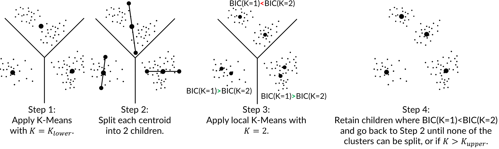
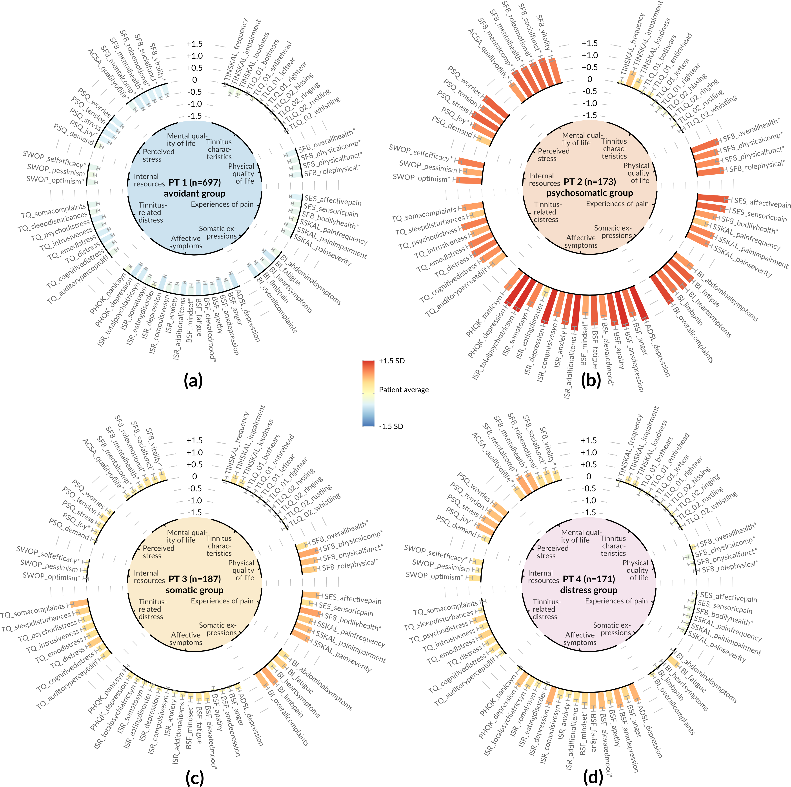
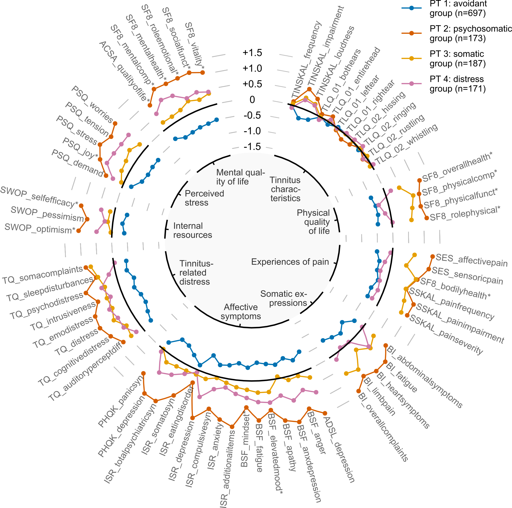
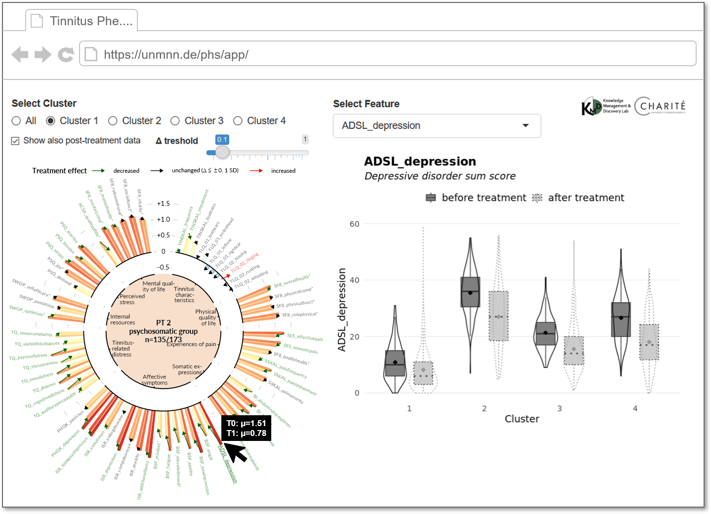
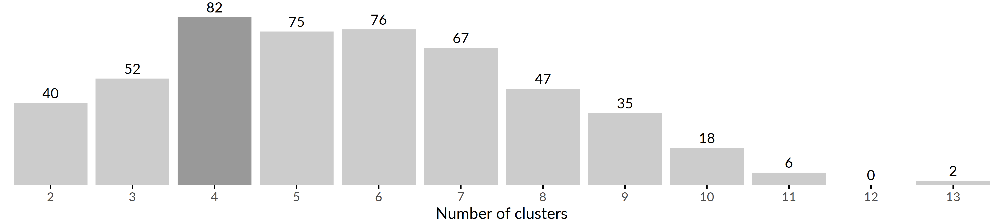
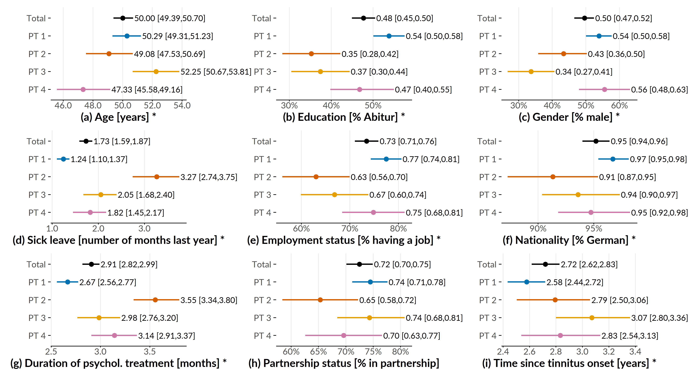
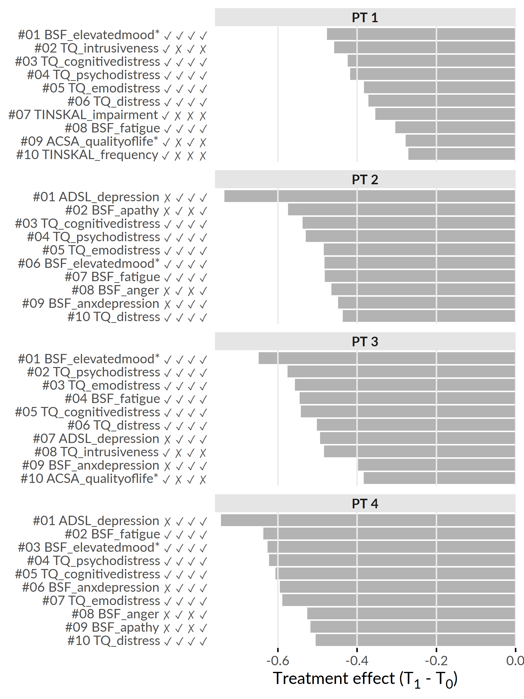

# Visual Identification of Informative Features {#phenotypes}

```{r 06-setup, eval = FALSE, echo = FALSE, cache = TRUE, message = FALSE, results='asis'}
source("code/00-chapter-start-bib.R")
print_bib("Niemann:SREP_Pheno2020", bib = bib)
```


:::: {.infobox .chapter-summary data-latex="{tasks.pdf}"}

#### Brief Chapter Summary {-}

We identify distinct tinnitus phenotypes by clustering screening data using a parameter-free algorithm that leverages the Bayesian information criterion to determine a suitable number of subgroups.
We present novel radial bar and radial line visualizations to juxtapose phenotypes in a high-dimensional feature space and to explore phenotype-specific idiosyncrasies.
We provide a web application with enhanced versions of these visualizations that also depict treatment effects.

::::

:::: {.infobox .chapter-literature data-latex=""}
This chapter is partly based on:

Uli Niemann, Petra Brueggemann, Benjamin Boecking, Matthias Rose, Myra Spiliopoulou, and Birgit Mazurek. "Phenotyping chronic tinnitus patients using self-report questionnaire data: cluster analysis and visual comparison". In: _Scientific Reports_ 10.1 (2020), p. 16411. DOI: [10.1038/s41598-020-73402-8](https://doi.org/10.1038%2Fs41598-020-73402-8).

::::

<!-- The term medical condition is a nosological broad term that includes all diseases, disorders, injuries and syndromes, and it is specially suitable in the last case, in which it is not possible to speak about a single disease associated to the clinical course of the patient.  -->

<!-- Based on&nbsp;[@Niemann:Pheno2020; @Niemann:SREP2020; @Niemann:PONE2020; @Niemann:Frontiers2020] -->

<!-- ## Phenotyping -->

The supervised methods of classification and subgroup discovery described in the previous chapters show great potential for applications where there is one or a small number of well-defined target variables. 
However, some medical conditions have heterogeneous appearances which are not well understood yet. 
For example, chronic tinnitus is a complex, multi-factorial and heterogeneous symptom. 
Clinical assessment and selection of a suitable therapy strategies are difficult as not all patients benefit equally from treatment. 
Due to the large number and heterogeneity of available assessment tools, unsupervised methods like cluster analysis appear to be promising approaches to extract clinically relevant tinnitus phenotypes. 
Clinical acceptance of these empirical results can be further strengthened by a comprehensive visualization which intuitively illustrate major characteristics of a phenotype and differences between multiple phenotypes. 
In this chapter, we describe a workflow (1) to identify distinct tinnitus phenotypes by a parameter-free clustering algorithm and (2) to visualize these subgroups to explore phenotype idiosyncrasies. 
In Section&nbsp;\@ref(phenotypes-motivation), we describe the clinical value of patient subgroup stratification, briefly review previous approaches and list requirements for a clustering solution. 
We specify the features used for clustering in Section&nbsp;\@ref(phenotypes-features), give an overview of the clustering algorithm in Section&nbsp;\@ref(phenotypes-xmeans), introduce our cluster visualization in Section&nbsp;\@ref(phenotypes-visualization) and our interactive web application in Section&nbsp;\@ref(phenotypes-app). 
In Section&nbsp;\@ref(phenotypes-results), we present the phenotypes and describe their major characteristics.  
The medical interpretation of our findings was developed together with tinnitus experts and is provided in Section&nbsp;\@ref(phenotypes-clinical-interpretation). 
Further, we discuss the strength and weaknesses of our workflow in Section&nbsp;\@ref(phenotypes-discussion).
Finally, we conclude the chapter with a summary in Section&nbsp;\@ref(phenotypes-conclusions). 

## Motivation and Comparison to Related Work {#phenotypes-motivation}

Challenges for management and treatment of tinnitus are caused to a large extent by its clinical heterogeneity, which includes individual perception, risk factors, comorbidities, degrees of perceived stress and treatment response (cf. Section&nbsp;\@ref(background-data-cha)). 
These factors make it difficult for clinicians (a) to choose _the_ treatment which is most effective for an individual patient, and (b) to design a unified treatment strategy all patients equally benefit from. 
The awareness of the existence of distinct patient subgroups may stimulate the development of more effective therapy modules. 
Since clinically relevant subgroups have not been established yet, clustering emerges as a promising approach to identify characteristic tinnitus _phenotypes_ in a data-driven and hypothesis-free way. 

Previous studies found subgroups of tinnitus patients with cluster analysis based on a small number of audiometric features&nbsp;[@Langguth:LCA2017], a combination of features extracted from self-reports, audiometry and psychoacoustics&nbsp;[@Tyler:TinnitusClustering2008], or neuroimaging data and 
socio-demographics&nbsp;[@Schecklmann:BrainResearch2012]. 
Although each of these studies provided insights in tinnitus subgroup patterns,  acceptance among medical scholars may be increased by presenting the clustering results with intuitive visualizations that show individual subgroup patterns and enable the visual juxtaposition of multiple subgroups with respect to high-dimensional data. 

Addressing this requirement, Schlee et al.&nbsp;[@Schlee:RadarVis2017] proposed a compact radar chart visualization that allows to compare the degree of health burden between individuals or subgroups based on measurements from self-report questionnaires. 
While their visualization could be applied to any disease domain, Schlee et al. demonstrated its efficacy showing subgroup differences with respect to measurements of tinnitus distress and associated comorbidities. 
However, they did not aim to visualize clustering results, but restricted themselves to pre-defined cohorts by graphically comparing female against male patients, and patients with low tinnitus frequency against patients with high tinnitus frequency. 

## Selection of Measurement Instruments {#phenotypes-features}

Discussions with tinnitus experts about the selection of measurement instruments (hereafter denoted as _features_) for clustering resulted in two main requirements: 
(1) features should cover the clinical heterogeneity of tinnitus to a great degree, and 
(2) if available, more robust compound scores should be preferred over single items from a questionnaire. 
From the routine questionnaire assessment battery (cf. Section&nbsp;\@ref(background-data-cha)), we selected a total of 64 features^[The complete list of features is provided in Appendix&nbsp;\@ref(appx-pheno).] from 14 questionnaires. 
These include all questionnaire total scores, all questionnaire subscale scores and all items of questionnaires that have neither subscales nor total scores. 
The features measure 
(general) tinnitus characteristics, 
physical quality of life, 
experiences of pain, 
somatic expressions, 
affective symptoms, 
tinnitus-related distress, 
internal resources, 
perceived stress, and 
mental quality of life. 
  
From a total of 4,103 patients, data from 2,875 (70.1%) was incomplete and therefore excluded. 
The N=1,228 patients included in the final sample were only slightly, yet significantly younger than the excluded ones ($\mu$~included~ = 50.0, $\sigma$~included~ = 11.9; $\mu$~excluded~ = 51.7, $\sigma$~excluded~ = 13.6; $t$(2630.8) = 4.0, p \(<\) 0.01). 
Additionally, for 989 of the included patients patients (80.5%) post-treatment data were also available and used to visually explore treatment effect differences between clusters. 
Since most of the features have greater scores for higher health burden, we reversed the remaining features with greater scores for higher quality of life. 
A feature $X$ is reversed as $X_{reversed} = \max{(X)} - X$.
The asterisk suffix in a feature name (e.g. ACSA\_qualityoflife\*) denotes a reversed feature. 
Due to widely differing value ranges, each feature was standardized via z-score normalization. 
A feature $X$ with expected value $E(X)=\mu$ and variance $Var(X) = \sigma^2$ is  standardized into $Z = \frac{X - \mu}{\sigma}$.
For $Z$, it holds true that $\mu$ = 0 and $\sigma^2$ = 1.

## Identification of Tinnitus Phenotypes using Clustering {#phenotypes-xmeans}

Practical considerations of data clustering include how to set the number of clusters $K$. 
Since a ground truth is often not available, several heuristics to automatically determine $K$ have been proposed. 
A popular approach is the so called "elbow" method which involves running the clustering algorithm with different values for $K$ (cf. Section&nbsp;\@ref(evo-concept-clustering) for the application of the elbow method for density-based clustering). 
The number of clusters is plotted against cluster _compactness_. 
In the popular $K$-means algorithm, cluster compactness is quantified by total within-sum of squares (WSS), the sum of squared distances between each observation and its centroid over all clusters. 
As WSS or similar goodness of fit measures increase monotonically with increasing $K$, the idea of the elbow method is to identify the curve's characteristic "knee point" which is the first point from which adding another cluster leads only to a _minor_ improvement in compactness. 
Because the plot is not guaranteed to exhibit such a distinctive knee point and universal compactness thresholds do not exist, this approach is sometimes impracticable.
Another popular clustering evaluation measure is the Silhouette coefficient which favor clusterings where similar objects are assigned to the same cluster and dissimilar objects are assigned to different cluster.

Instead of a evaluating clustering quality post-hoc, we decided to chose an algorithm which internally identifies an appropriate number of clusters. 
X-means&nbsp;[@Pelleg:xmeans2000] is a parameter-free adaption of the popular K-means algorithm which incorporates the Bayesian information criterion&nbsp;[@Schwarz:BIC1978] (BIC) to find a good trade-off between low total sum of squares and a small number of clusters. 

Let $\mathcal{D}$ be the dataset with $d$ dimensions and let $D$ be a subset of $\mathcal{D}$, i.e., $D\subseteq \mathcal{D}$. 
A K-means clustering on $D$ creates the set of clusters 
$\mathcal{C}=\left\{C_1,\ldots,C_k,\ldots,C_K\right\}$, where $c_k$ is the centroid of cluster $k$, $r_k$ is the number of objects in $D$ assigned to $C_k$ and $p$ is the number of free parameters, i.e., $p = (d+1) \cdot K$. 
The BIC of a cluster $C_k$ using the Schwarz criterion is calculated as 

\begin{equation}
\text{BIC}(C_k) = \hat{l}_k(\mathcal{D}) - \frac{p_k}{2} \cdot \log |\mathcal{D}| 
(\#eq:06-bic)
\end{equation}

where $\hat{l}_k(\mathcal{D})$ is the log-likelihood of $\mathcal{D}$ according to $C_k$. 
The point probabilities are computed as 
\begin{equation}
\hat{P}(x_i)=\frac{r_{(i)}}{|\mathcal{D}|}\cdot \frac{1}{\sqrt{2\pi}\hat{\sigma}}\text{exp}\left(\frac{1}{2\hat{\sigma}^2}||x_i-c_{(i)}||\right)
(\#eq:06-point-probs)
\end{equation}
<!-- !!! herausfinden ob -1/2 im exponent -->
where the maximum likelihood estimate for the variance (under the identical spherical Gaussian assumption) is 
\begin{equation}
\hat{\sigma}^2=\frac{1}{|\mathcal{D}|-K}\sum_{i=1}^{|\mathcal{D}|}\left(x_i - \mu_{(i)}\right)^2.
(\#eq:06-mle)
\end{equation}
The log-likelihood of $\mathcal{D}$ according to $\mathcal{C}$ is 
\begin{equation}
l(\mathcal{D})=\log\prod_{i=1}^{|\mathcal{D}|} P(x_i)=\sum_{i=1}^{|\mathcal{D}|}\left(\log \frac{1}{\sqrt{2\pi}\hat{\sigma}} - \frac{1}{2 \sigma^2} ||x_i-c_{(i)}||^2 + \log \frac{r_{(i)}}{|\mathcal{D}|}  \right).
(\#eq:06-log-likelihood)
\end{equation}

The main steps of the X-means algorithm are summarized in Figure&nbsp;\@ref(fig:06-xmeans). 
At the start, an initial partitioning is generated by ordinary K-means with $K$ = $K$~lower~, where $K$~lower~ is a lower bound for the number of clusters. 
Then, each cluster is bisected; the resulting two child centroids are placed in opposite direction along a randomly chosen vector by a distance proportional to the cluster radius. 
For each pair of child clusters, a local K-means clustering with $K=2$ is run. 
If the BIC score of the new partitioning exceeds the BIC score of the parental one, the child centroids are kept, otherwise the parent centroid is retained. 
The iterative steps are repeated until there is no cluster whose bisection leads to a better BIC score, or until the number of clusters exceeds an optional upper bound $K$~upper~. 
We used the R implementation of Ishioka&nbsp;[@Ishioka:xmeansimplementation2005]. 
Since we did not aim to restrict the solution space with respect to the number of clusters, we set $K$~lower~, i.e., the lowest possible value, and we did not set $K$~upper~. 
<!-- Numbering of clusters as cluster 1, cluster 2, etc. was done arbitrarily.  -->
For internal validation, we recorded the number of clusters produced by $X$-means on 500 bootstrap samples. 

(ref:06-xmeans) **Principal steps of X-means (simplified).** Adapted from&nbsp;[@Pelleg:xmeans2000].

```{r 06-xmeans, echo=FALSE, fig.align='center', out.width="100%", fig.cap="(ref:06-xmeans)"}

```

## Visualisation of Phenotypes {#phenotypes-visualization}

Visualizing clusters in high-dimensional data is challenging. 
Scatterplot matrices (SPLOMs) can intuitively represent the 
relationship between all pairs of features as a matrix of two-dimensional scatterplots&nbsp;[@Im:GPLOM2013; @Klemm:RegressionHeatmap2015]. 
However, as the number of features increases, the number of scatterplots grows quadratically, leading to scalability problems such as overplotting. 
Several advanced visualization techniques have been proposed as a remedy, from simply adding transparency or colors to points to more sophisticated density contours, hexagon binning, layers with aggregated geometric features (Minimal Spanning Trees, Alpha Shape, Convex Hull), animation, or combinations of several techniques such as 
splatterplots&nbsp;[@Mayorga:Splatterplots2013]. 
However, SPLOMs and other traditional visualization techniques such as parallel coordinate graphs&nbsp;[@Hartigan:PCC1975] are still more suitable for low-dimensional data. 

Dimensionality reduction (DR) techniques are often used to project the original data onto a low-dimensional projection that allows the above visualization types to be used. 
Ideally, this projection preserves the most important structures of the original data, such as relative pairwise distance, clusters, outliers, and correlations. 
Principal Component Analysis&nbsp;[@Hotelling:PCA1933] (PCA) is a seminal DR algorithm that generates linear, orthogonal combinations of the original dimensions. 
Each new dimension, called a principal component, contains a loading indicating how much variability in the data it covers. 
Typically, the first two or three dimensions that carry the highest charges are selected for visualization. 
PCA is not robust to outliers and cannot capture nonlinear relationships. 
Multidimensional scaling&nbsp;[@Gower:MDS1966] (MDS) is another early DR technique that emphasizes the preservation of pairwise distances, ie, 
Objects that are close to each other in high-dimensional space should also be close to each other in low-dimensional projected space.
For complex, arbitrarily shaped structures, pairwise distances may be subject to the curse of dimensionality, leading to poor results. 
$t$-stochastic neighborhood embedding&nbsp;[@VanDerMaaten:tSNE2008] ($t$-SNE) and Uniform Manifold Approximation and Projection&nbsp;[@mcinnes2018umap] (UMAP) are nonlinear dimensionality reduction methods that represent a matrix of pairwise similarities. 
The idea is to obtain both global structures such as clusters and local structures such as distances and neighbors. 
Both $t$-SNE and UMAP can produce superior projections compared to traditional linear techniques, provided their hyperparameters are appropriately tuned. 
However, a shortcoming of these techniques is that the mapping to the original features cannot be quantified. 
Moreover, a projection cannot be applied to new observations; instead, a new projection must be recomputed. 
Because of their stochasticity, different runs with the same hyperparameters may yield different results. 
Since the semantics of the original dimensions are lost, we decided that DR methods are not suitable for this application. 

<!-- 1. Hyperparameters really matter -->

<!-- Choosing good values isn't easy, and depends on both the data and your goals (eg, how tightly packed the projection ought to be). This is where UMAP's speed is a big advantage - By running UMAP multiple times with a variety of hyperparameters, you can get a better sense of how the projection is affected by its parameters. -->
<!-- 2. Cluster sizes in a UMAP plot mean nothing -->

<!-- Just as in t-SNE, the size of clusters relative to each other is essentially meaningless. This is because UMAP uses local notions of distance to construct its high-dimensional graph representation. -->
<!-- 3. Distances between clusters might not mean anything -->

<!-- Likewise, the distances between clusters is likely to be meaningless. While it's true that the global positions of clusters are better preserved in UMAP, the distances between them are not meaningful. Again, this is due to using local distances when constructing the graph. -->
<!-- 4. Random noise doesn’t always look random. -->

<!-- Especially at low values of n_neighbors, spurious clustering can be observed. -->
<!-- 5. You may need more than one plot -->

<!-- Since the UMAP algorithm is stochastic, different runs with the same hyperparameters can yield different results. Additionally, since the choice of hyperparameters is so important, it can be very useful to run the projection multiple times with various hyperparameters. -->

Discussions with tinnitus experts led to the following cluster visualization requirements:

- keep original (interpretable) features,
- represent high-dimensional data with dozens of features,
- compactly compare multiple clusters at a glance,
- Contrast cluster characteristics with the overall patient mean.

Following these requirements, we implemented (a) a radial bar chart as a visualization of a single cluster (Figure&nbsp;\@ref(fig:06-all-radial-barcharts-export)) and (b) a radial line chart visualization for comparing multiple clusters at once&nbsp;\@ref(fig:06-radar). 
The radial bar chart is used to compare observations assigned to a single cluster with the overall population. 
The mean values of the features within a cluster are represented by bars arranged in a radial layout. 
Each bar begins at the black "zero line," which represents the feature means of the entire population, i.e., all subjects used for clustering. 
Because features are standardized (i.e., z-scored) prior to clustering, bars inclined to the outside represent feature averages above the population average and bars inclined to the inside represent feature averages below the population average. 
For example, a bar whose top is positioned at -1 characterizes a feature average within a cluster that is 1 standard deviation smaller than the population average.
In addition to the combination of bar height and bar direction, within-cluster averages are also mapped to the bar color by a sequential color gradient from dark blue (lower boundary) to yellow (population average) to light red (upper boundary). 
Gray error lines at the top of a bar represent the within-cluster standard error. 
To allow quick feature localization, features were grouped into expert-defined categories, which are displayed in the inner circle along with the cluster name and the number of subjects assigned. 

<!-- Tinnitus experts provided these categories which were (in clockwise order):  -->
<!-- tinnitus characteristics,  -->
<!-- physical quality of life,  -->
<!-- experiences of pain,  -->
<!-- somatic expressions,  -->
<!-- affective symptoms,  -->
<!-- tinnitus-related distress,  -->
<!-- internal resources,  -->
<!-- perceived stress, and  -->
<!-- mental quality of life. -->

(ref:06-all-radial-barcharts-export) **Radial bar graphs for each of the 4 phenotypes (PT).** (a) PT 1 characterizes the subgroup with the lowest health burden. (b) PT 2 includes the most suffering subjects, in whom all mean values of psychosomatic and somatic characteristics exceed the population mean by more than 0.5 standard deviations (SD). (c) PT 3 indicates somatic indicator scores above the population mean. (d) PT 4 indicates subjects with elevated distress scores, including subjective stress and perceived quality of life. Bars are arranged in a circular layout, with the height and direction of a bar representing the within-cluster feature average and the gray line centered at the top of the bar illustrating the 95% confidence interval. The characteristics were grouped into 9 categories defined by tinnitus experts. The categories are shown inside the inner circle. See Appendix&nbsp;\@ref(appx-pheno) for a feature description. Adapted from&nbsp;[@Niemann:SREP_Pheno2020].

```{r 06-all-radial-barcharts-export, echo=FALSE, fig.align='center', out.width="100%", fig.cap="(ref:06-all-radial-barcharts-export)"}

```

The radial line chart (\@ref(fig:06-radar)) allows a comparison of all clusters in a single display. 
Instead of bars, the feature mean values are represented as points. 
Points of the same cluster and feature category are connected by line segments. 
Points and line segments are colored according to their respective cluster. 

(ref:06-radar) **Radial line chart for phenotypes comparison.** Points show within-phenotype feature averages. Points depicting features of the same category are connected with line segments. Points and lines are colored by cluster. See Figure&nbsp;\@ref(fig:06-all-radial-barcharts-export) for a description of the phenotypes and Appendix&nbsp;\@ref(appx-pheno) for a description of the features. Adapted from&nbsp;[@Niemann:SREP_Pheno2020].

```{r 06-radar, echo=FALSE, fig.align='center', out.width="100%", fig.cap="(ref:06-radar)"}

```

## Interactive Components and Exploration of Treatment Effects {#phenotypes-app}

We provide an interactive demo of the cluster solutions and visualizations as a web application^[The demo is available at <https://unmnn.de/phs/app/>.] (Figure&nbsp;\@ref(fig:06-gui-pheno)). 
The following interactive components have been added: 
hovering over bars, lines, or feature labels in the visualizations opens tooltips with additional cluster summaries and compact feature descriptions.
Clicking on a feature triggers an additional plot showing the original (unscaled) distribution of the selected feature stratified by clusters and, if selected, also after treatment. 
For continuous features, semi-transparent boxplots are displayed on violin plot&nbsp;[@Hintze:Violin1998] layers. 
For categorical traits, the points and error lines represent the category proportions and 95% confidence intervals, respectively. 
While clustering was performed on baseline data only, we included treatment effect indicators to allow visual detection of potential differences between clusters in treatment efficacy. 
To this end, we extended the radial bar chart by plotting cluster averages before treatment (T0) and after treatment (T1) as adjacent bars. 
The ends of a pair of bars are connected by a line with an arrowhead pointing from the T0 score to the T1 score. 
To highlight large treatment effects, the connecting lines and feature labels are colored according to their relative decrease from T0 to T1. 
Given the user-defined parameter $\Delta$, i.e., the minimum relative magnitude of the difference between T0 and T1 considered as a change, elements were colored (a) red if the T1 score was greater than the T0 score by $\Delta$ or more, (b) green if the T0 score was less than the T0 score by $\Delta$ or less, and (c) black, respectively. 

(ref:06-gui-pheno) **User interface of interactive demo.** Radial bar charts were enhanced by interactive components: hovering over a bar or feature label opens a tooltip with additional cluster summaries and a compact feature description. Clicking on a feature updates the right plot showing the distribution of the selected feature stratified by cluster, and if selected, also after treatment. Continuous features are shown using semi-transparent boxplots placed on violin plot&nbsp;[@Hintze:Violin1998] layers whereas for nominal features, category proportions alongside their 95% confidence intervals are displayed as points and error lines, respectively. 

```{r 06-gui-pheno, echo=FALSE, fig.align='center', out.width="100%", fig.cap="(ref:06-gui-pheno)"}

```

## Results {#phenotypes-results}

Four clusters (also referred to as phenotypes hereafter) represent an optimal solution for the present data according to $X$-means (cf. Figure&nbsp;\@ref(fig:06-bootstrap-eval)). 

(ref:06-bootstrap-eval) **Results of internal validation.** Bars show the distribution of the number of clusters generated by $X$-means for 500 bootstrap samples. The most common cluster number was 4, which occurred in 82 samples (16.4%).

```{r 06-bootstrap-eval, echo=FALSE, fig.align='center', out.width="100%", fig.cap="(ref:06-bootstrap-eval)"}

```

Phenotype 1 (PT 1) represents the largest subgroup (697 of 1,228 patients; 56.8%), characterized by substantially below-average symptom expression on tinnitus-related and more general psychosomatic symptom indices, including affective symptoms, perceived stress, tinnitus-related distress, and somatic symptoms, as well as (above-average) quality of life and internal resources (Figure&nbsp;\@ref(fig:06-all-radial-barcharts-export) (a)). 
Because this group of patients is potentially more help-seeking, presents to the clinic more frequently, and wishes to participate in multimodal treatment, it can be assumed that they experience psychological distress but strive to present as unburdened as possible. 
Therefore, this phenotype is referred to as the _"avoidance group"_. 
Patients in this subgroup have comparatively high levels of education, employment, and duration of illness and psychotherapeutic treatment (Figure&nbsp;\@ref(fig:06-inter-group-socio)). 

PT 2 included 173 patients (14.1\%) who reported the highest emotional and somatic burden among all PTs (Figure&nbsp;\@ref(fig:06-all-radial-barcharts-export) (b)). 
More specifically, PT 2 represents a patient subgroup with high 
psychosomatic comorbidity and is therefore referred to as the _"psychosomatic group"_. 
This patient subgroup shows high tinnitus burden in addition to clinically relevant impairment in all affective indices, including depression, anxiety, and perceived stress. 
These affective symptoms appear to be consistent with somatoform expressions of distress, including somatic symptoms. 
Patients in this subgroup report greatly reduced quality of life and coping behaviors, with more pessimism, less experienced self-efficacy, and optimism. 
Relative to the overall population, this subgroup has a higher proportion of women, patients who live alone, are unemployed, or have an overall lower educational status. 
Patients in this cluster also report consulting more physicians, taking more sick days, and using more psychotherapy. 
PT 2 patients reported that the tinnitus noise was audible throughout the head (i.e., not unilateral) with a higher percentage than the other groups. 

PT 3 contains 187 patients (15.2\%) characterized by above-average scores of traits measuring somatic complaints and near-average scores for affective symptoms (Figure&nbsp;\@ref(fig:06-all-radial-barcharts-export) (c)). 
Because the pain scores SF8\_bodilyhealth\* and SSKAL\_painfrequency were similar in magnitude to PT2, this patient subgroup is referred to as the _"somatic group"_. 
PT 3 includes the oldest subgroup, with the largest proportion of female patients and the largest reported time since tinnitus onset. 

In contrast to PT3, PT 4 (n=171; 13.9\%) has above-average values for affective scores, quality-of-life components, and perceived stress (Figure&nbsp;\@ref(fig:06-all-radial-barcharts-export) (d)), e.g., mental component summary score (SF8\_mentalcomp\*; 0.85) and anxious depression score (BSF\_anxdepression; 0.79). 
Therefore, PT 4 is referred to as the _"distress group"_. 
PT 4 represents the youngest of the 4 subgroups (mean 47.3 years), with the largest proportion of male patients (Figure&nbsp;\@ref(fig:06-inter-group-socio)). 

(ref:06-inter-group-socio) **Inter-phenotype comparison of demographic characteristics.** Summaries are given as means [95% confidence interval] for the entire population and for each of the 4 phenotypes. Confidence intervals were estimated using nonparametric Basic Bootstrap Sampling&nbsp;[@Davidson:Bootstrap1997] with 2,000 samples each. The Kruskal-Wallis test was used for statistical comparison of differences between phenotypes for continuous features (such as age), and Pearson's chi-square test was used for categorical features (such as sex). An asterisk indicates statistical significance ($\alpha$ = 0.05). Correction for multiple comparisons was not performed due to the exploratory nature of the study. Adapted from&nbsp;[@Niemann:SREP_Pheno2020]. 

```{r 06-inter-group-socio, echo=FALSE, fig.align='center', out.width="100%", fig.cap="(ref:06-inter-group-socio)"}

```

Figure&nbsp;\@ref(fig:06-treatment-effects) depicts the top-10 features with highest average change between T1 and T0 per cluster. 
For PT 1 and PT 3, BSF\_elevatedmood* decreased the most, namely by 0.48 $\pm$ 0.75 and 0.65 $\pm$ 0.85 ($Z$ units), respectively. 
For PT 2 and PT 4, the top-ranked features is ADSL\_depression with an average difference between T~1~ and T~0~ of 0.73 $\pm$ 0.88 and 0.74 $\pm$ 0.83, respectively. 
Six out of these ten features were among the top-10 features for all clusters, including BSF\_elevatedmood*, TQ\_cogintivedistress, TQ\_psychodistress, TQ\_emodistress, TQ\_distress and BSF\_fatigue. 

(ref:06-treatment-effects) **Cluster-specific top-10 features with highest average treatment effect magnitude.** Bars depict the intra-cluster average differences between the measurements at T1 and T0 based on the standardized values. Lower values represent better treatment effectiveness. The symbols right to the feature names indicate whether the feature is among the top-10 features for the cluster at position i. For example, the character string `r if(knitr::is_latex_output()){"\\ding{55} \\ding{51} \\ding{55} \\ding{51}"}else{"\U2717 \U2713 \U2717 \U2713"}` for TQ\_intrusiveness (ranked 2nd for PT 1) means that the feature is among the top-10 for PT 1 and PT 3, but not for PT 2 and PT 4. 

```{r 06-treatment-effects, echo=FALSE, fig.align='center', out.width=if(knitr::is_latex_output()){"64.3%"}else{"100%"}, fig.cap="(ref:06-treatment-effects)"}

```

## Clinical Value {#phenotypes-clinical-interpretation}

We discussed the clinical relevance of the phenotypes with three of the five tinnitus experts who co-authored the original publication&nbsp;[@Niemann:SREP_Pheno2020]. 

PT 1 (_avoidant group_) represents more than half of the patient sample. 
Besides the actual tinnitus symptom, patients in this subgroup reported few other affective or psychosomatic symptoms. 
Because of the biased presentation of these patients (_"everything is fine if it weren't for the tinnitus"_), clinicians might easily be led to believe that assessment of possible other factors contributing to individual distress is unnecessary. 
However, clinical experience suggests a thorough assessment of other psychosocial stressors. 
The psychosocial resourcefulness of this subgroup enables patients to seek help quickly and in a solution-oriented manner. 
Adequate tinnitus-specific counseling and individualized (online) therapy modules that include audiological, psychological, or relaxation techniques may represent an adequate treatment strategy for this patient subgroup. 

PT 2 (_psychosomatic group_) represents 15% of patients with high tinnitus distress and clinically relevant impairment across all affective indices, including depression, anxiety, and perceived stress. 
These affective symptoms appear to interact strongly with somatoform expressions of distress, including physical complaints and somatic symptoms. 
Patients in this subgroup reported greatly reduced quality of life and coping behaviors, higher pessimism, lower experienced self-efficacy, and optimism.
The frequently asked question is whether increased tinnitus-related distress contributes to an increase in depression or vice versa. 
In this group, depressive or anxious symptoms may be considered a crucial underlying factor in overall symptom distress, and treatment must initially focus on improving mood and alleviating depression. 
Here, tinnitus-related distress may need to be viewed in a broader context of medical and psychological contributing factors that require patient-specific conceptualization. 

PT 3 (_somatic group_) appears to represent a patient subgroup that is 
characterized by somatopsychic symptom expression, i.e., physical symptoms that may reflect stress and/or underlying medical conditions. 
To meet the needs of this patient subgroup, multimodal interventions may include a proportion of body-oriented procedures such as relaxation exercises or physiotherapy, but their effects should be interpreted in terms of both direct and indirect psychological effects (e.g., through increased well-being or affection from others). 

Patients in PT 4 (_distress group_) reported higher than average perceived stress, accompanied by physical exhaustion and anxious-depressed mood. 
This group is more likely to include younger, employed, and male patients who reported chronic distress and may be susceptible to a burnout syndrome with subjectively reduced mental performance ("hamster wheel"), which is used to describe life situations even in the absence of tinnitus distress. 
Multimodal therapy should initially focus on stress regulation techniques, including relaxation or individually tailored behavior modification approaches. 
Similar to PT 2, which has a high psychosomatic burden, patients in PT 4 could also benefit from longer psychotherapeutic or multimodal treatment procedures (inpatient or rehabilitative). 

## Discussion {#phenotypes-discussion}

Although for our dataset the optimal number of clusters was four, we expect that this number may be different for a different sample of tinnitus patients even with the same clustering algorithm. 
Figure&nbsp;\@ref(fig:06-bootstrap-eval) shows a high variance in terms of the number of clusters returned by $X$-means on different bootstrap samples. 
Considering the only slightly lower occurrence of 5 and 6 clusters, our clustering result is certainly not set in stone. 

Nonetheless, comparison of all clusters showed that some questionnaires and characteristics differed considerably between patient phenotypes. 
In particular, patient subgroups differed substantially in terms of coping behaviors, stress, tinnitus burden, perceived pain, discomfort, and perception of quality of life. 
In contrast, patients did not appear to differ with respect to localization and noise. 
Regarding the separability between phenotypes, the mostly high correlations between feature within the same category suggest that phenotyping is also possible with fewer questionnaires, especially since some of the questionnaires overlap semantically, e.g. PHQK\_depression, ISR\_depression, ADSL\_depression, etc. 

Without a "ground truth" and because of the different sets of available measurements, it is difficult to compare our results with those of similar studies. 
The greatest strength of our workflow was the inclusion of a wide range of self-report questionnaire assessments. 
Other studies also used audiometry&nbsp;[@Tyler:TinnitusClustering2008; @Langguth:LCA2017] and cardiac imaging data&nbsp;[@Schecklmann:BrainResearch2012]. 
Nevertheless, PT 2 (psychosomatic distress group) seems to be associated with the "constant distressing tinnitus" subgroup reported by Tyler et al.&nbsp;[@Tyler:TinnitusClustering2008], as the mean scores of tinnitus-related health distress were much larger than in the other subgroups. 
Clearly, the selection of a meaningful set of characteristics is central to the effectiveness of a cluster analysis. 
<!-- Schlee et al. argued against the usage of single-item features  -->
<!-- like visual analogue scale measurements because of their higher susceptibility to  -->
<!-- random measurement errors, lower test-retest reliability and higher vulnerability to  -->
<!-- unknown biases[@Schlee:RadarVis2017]. % -->
<!-- Due to the exploratory nature of our study, we decided to include both single-item  -->
<!-- measurements and compound scores. %  -->
<!-- We assigned 11 out of 15 single-item measurements into the category ``Tinnitus  -->
<!-- characteristics''. % -->
<!-- Figure\@ref(fig:radar) (top-right) shows their low discriminative power, as all phenotypes'  -->
<!-- means are close to the population average, with the exception of  -->
<!-- \textsf{TINSKAL\_impairment} and \textsf{TINSKAL\_loudness}.  -->
<!-- \changemarker{ -->
<!-- Future research might focus on identifying a subset of key questionnaires alongside a simple computational tool that will enable clinicians to match individual patients with one or more of the here identified phenotypes. -->
<!-- } -->

The closest to our radial bar chart visualization is the radar chart proposed by Schlee et al.&nbsp;[@Schlee:RadarVis2017], whose solution tends to overplot when more than two subsets need to be displayed simultaneously.
Therefore, we did not fill areas spanned by connected points with color to 
avoid that one polygon completely overlaps another. 
Furthermore, inferences about the radar map&nbsp;[@Schlee:RadarVis2017] depend heavily on the arrangement of features, since the main criterion for comparison is the shapes of the polygons. 
Their solution to compute an arrangement that yields areas that achieve a maximum mean area difference between subgroups and a minimum area variance within subgroups only partially solves the problem, since still only a moderate number of up to about 20 features can be represented. 
We chose to organize the 64 features according to expert-determined categories, e.g., quality of life, which makes it easier to find features and compare similar features. 

In addition, our visualization is tinnitus-specific but can be used to display a compact summary for any condition or subset of index symptoms. 
Whether the visualizations will be adopted by clinicians to guide appropriate tinnitus management strategies is adopted remains to be tested. 
In a preliminary user study, clinicians suggested that graphical summaries of possible patient subtypes could ease the challenge of assigning an appropriate treatment strategy for specific combinations of symptom presentations.
<!-- % \todo{Müssen wir unsere Feature-Auswahl begründen?}\paragraph{Zitat aus Schlee et al.&nbsp;[@Schlee:RadarVis2017]:} \textcolor{red}{...One important consideration for the optimal use of this visualization method is the selection of measurement instruments. For example, single-item visual analog or numeric rating scales tend to be viewed as inferior because (i) they are more vulnerable to random measurement errors, which are more likely to be eliminated with multiple items, (ii) the reliability statistic ``internal consistency'' cannot be computed, and (iii) they are more vulnerable to unknown biases in meaning and interpretation....} -->

By excluding patients who did not complete all questionnaires at T0, there may be a selection bias. 
Possible reasons for noncompletion include unfamiliarity with the technical equipment used to record item responses, loss of motivation due to the relatively large number of questionnaires, and collisions with other baseline studies in the laboratory. 
Nevertheless, the analysis of all 15 questionnaires led to insights into the 
contributions of these questionnaires to phenotyping, possibly allowing a reduction in the number of questionnaires. 
Because our results reflect only a snapshot of the patients' situation at baseline, a patient may transition from one phenotype to another at later stages of life, depending on tinnitus management. 
Therefore, a next step would be to investigate the effects of treatment on these phenotypes in more detail and to find out whether some patient phenotypes benefit more than others. 

## Conclusions {#phenotypes-conclusions}

We presented a workflow to find distinct tinnitus phenotypes by clustering using an algorithm that internally determines the optimal number of clusters. 
We visualized the characteristics of each phenotype and the differences between multiple phenotypes using radial bar and line graphs. 
We also provided a web application where phenotypes can be further explored with their treatment effects. 
To our knowledge, this is the first approach that combines clustering of tinnitus patients with comprehensive visualization of subgroups in high-dimensional data and interactive components for exploration of patterns and treatment effects. 
