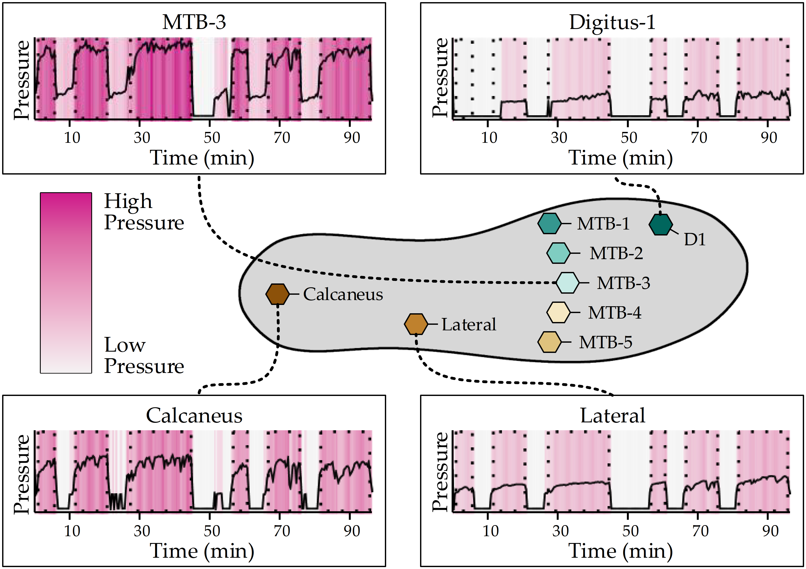
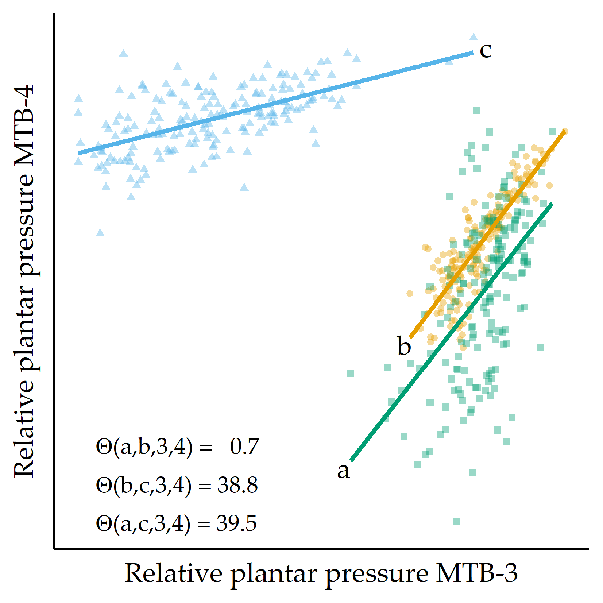
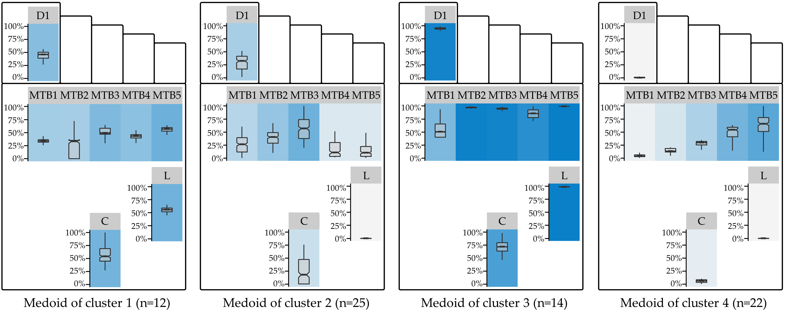
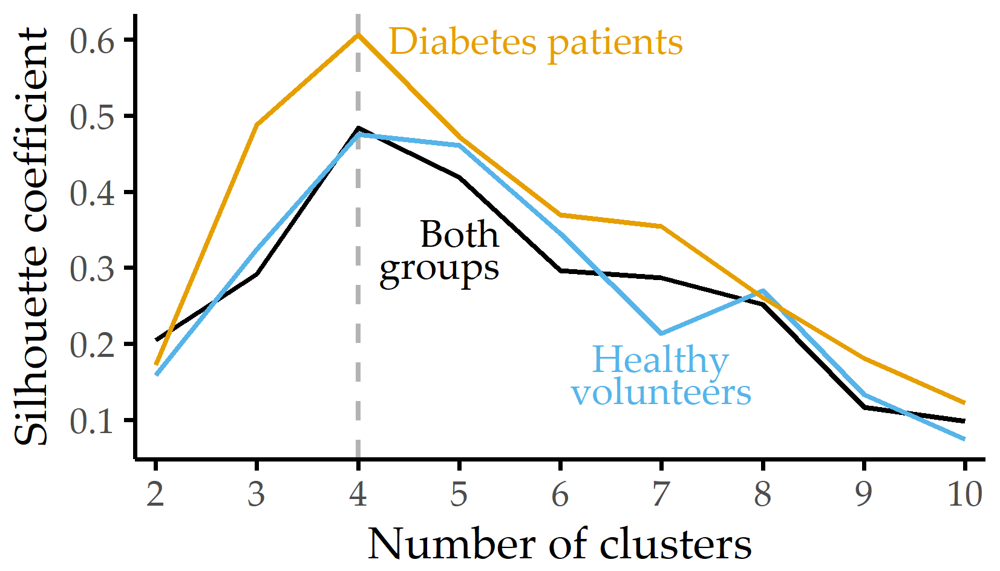
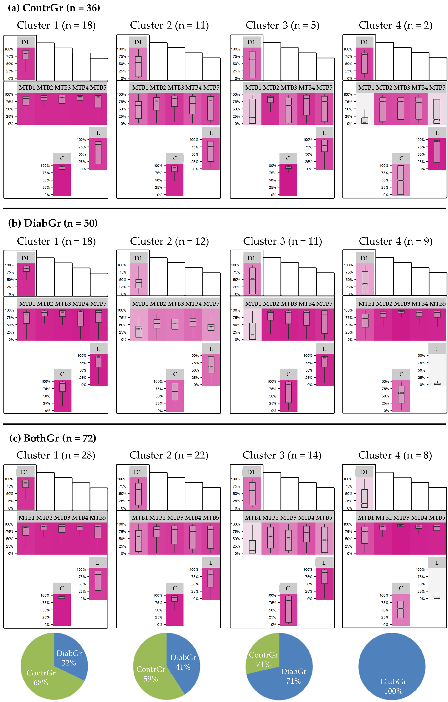
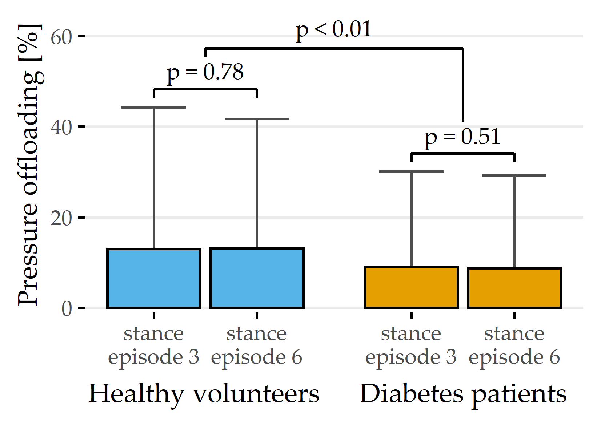
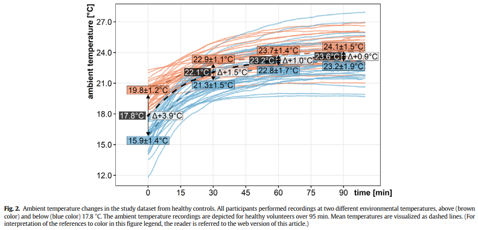
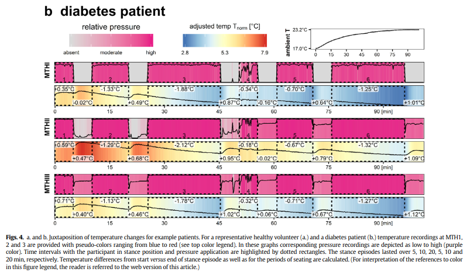

# Feature Extraction from Short Temporal Sequences for Clustering {#diabfoot}

```{r 07-setup, eval = FALSE, echo = FALSE, cache = TRUE, message = FALSE, results='asis'}
source("code/00-chapter-start-bib.R")
print_bib(c("Niemann:CBMS2016",
            "Niemann:PONE2016", 
            "Niemann:EBioMedicine2020")
          , bib = bib)
```

:::: {.infobox .chapter-summary data-latex="{tasks.pdf}"}

#### Brief Chapter Summary {-}

Embedded mHealth devices continuously record vital functions. 
These temporal sequences arrive mostly as raw sensor measurements, requiring the extraction of meaningful features.
We propose similarity measures for short temporal sequences to build representations of distinct subpopulations. 
We validate our approach by identifying characteristic plantar pressure profiles from recordings of a controlled experiment with diabetic foot syndrome patients and non-diabetic volunteers. 

::::

:::: {.lit .chapter-literature data-latex=""}
This chapter is partly based on:

- Uli Niemann, Myra Spiliopoulou, Fred Samland, Thorsten Szczepanski, Jens Grützner, Antao Ming, Juliane Kellersmann, Jan Malanowski, Silke Klose, and Peter R. Mertens. "Learning Pressure Patterns for Patients with Diabetic Foot Syndrome". In: _Computer-Based Medical Systems (CBMS)_. 2016, pp. 54-59. DOI: [10.1109/CBMS.2016.31](https://doi.org/10.1109%2FCBMS.2016.31).
- Uli Niemann, Myra Spiliopoulou, Thorsten Szczepanski, Fred Samland, Jens Grützner, Dominik Senk, Antao Ming, Juliane Kellersmann, Jan Malanowski, Silke Klose, and Peter R. Mertens. "Comparative Clustering of Plantar Pressure Distributions in Diabetics with Polyneuropathy May Be Applied to Reveal Inappropriate Biomechanical Stress". In: _PLOS ONE_ 11.8 (2016), pp. 1-12. DOI: [10.1371/journal.pone.0161326](https://doi.org/10.1371%2Fjournal.pone.0161326).
- Uli Niemann, Myra Spiliopoulou, Jan Malanowski, Juliane Kellersmann, Thorsten Szczepanski, Silke Klose, Eirini Dedonaki, Isabell Walter, Antao Ming, and Peter R. Mertens. "Plantar temperatures in stance position: A comparative study with healthy volunteers and diabetes patients diagnosed with sensoric neuropathy". In: _EBioMedicine_ 54.102712 (2020), pp. 1-11. DOI: [10.1016/j.ebiom.2020.102712](https://doi.org/10.1016%2Fj.ebiom.2020.102712).

::::

Nowadays, mHealth devices, such as smart wearables, are ubiquitous in everyday life [@gerhardt2018mhealth].
These embedded systems continuously record and process various vital functions and send feedback to the user, for example, via popup notifications or dashboard reports.
Thus, they are designed to help live healthier by contributing to more effective exercise or a better diet.
mHealth solutions are also increasingly being used in clinical settings.
Pattern recognition in timestamped mHealth data is used to timely detect adverse health events.

For example, in diabetes patients with sensory neuropathy, repeated excessive pressure loads can aggravate plantar tissue destruction and ultimately lead to foot ulcers, in the worst case, even to amputation [@RN7].
Since frequent clinical examinations would be too costly and bothersome for the patient [@ming2019study], sensor-equipped systems for the patient's shoe insoles are developed.
These systems measure foot pressures and temperatures continuously and transmit recordings wirelessly to a smart device, which processes the data to send offloading instructions when potentially harmful pressures are detected [@abbott2019] or temperature differences between left and right foot exceed pre-specified thresholds [@ming2019study]. 
However, a universal pressure threshold with high sensitivity and specificity with respect to ulcer development has not yet been determined [@Waldecker:FootAnkleSurgery2012; @fernando2018importance]. 
Besides, when a significant difference in temperature between the left and right foot is noted, it is often already too late to warn the patient, as ulceration has already begun.
Evidence suggests that there are subpopulations with distinct plantar pressure patterns requiring different preventive measures, for example, different _peak pressure_ thresholds [@GiacomozziMartelli:PeakPressure2006; @DeCockEtAl:FootTypeClusteringPlantarPressure2006; @BennettsEtAl:Biomechanics2013; @DeschampsEtAL:KMeansDiabeticFoot2013].

In the previous chapters, we presented methods for analyzing static data (Chapters&nbsp;\@ref(imm)--\@ref(phenotypes)) and timestamped data (Chapter&nbsp;\@ref(evo)) with a small number of time points. 
Raw mHealth data comprises hundreds or more time points, thus requiring the extraction of meaningful features before any actual data analysis.
This chapter proposes similarity measures for short temporal sequences to create representations of distinct subpopulations from mHealth data. 
The DIAB data described in Section&nbsp;\@ref(background-data-diab) serve as proof-of-concept validation. 

This chapter is organized as follows.
Section&nbsp;\@ref(diabfoot-intro) describes the medical background of diabetic foot syndrome and reviews previous subtyping approaches to detect plantar pressure patterns.
Section&nbsp;\@ref(diabfoot-approach) presents our approaches for modeling regional plantar pressure similarity and identifying distinct foot profiles by clustering. 
We report on our results in Section&nbsp;\@ref(diabfoot-results) and compare them to similar studies in Section&nbsp;\@ref(diabfoot-discussion). 
We conclude the chapter in Section&nbsp;\@ref(diabfoot-conclusion). 

<!-- **SPÄTER**In an experimental study, using a sensor-equipped insole connected to a smartphone app via Bluetooth, plantar pressure measurements were taken in neuropathic diabetic patients and healthy volunteers at a frequency of a few seconds. -->
<!-- A key objective is to detect plantar pressure profiles, i.e., different pressure loading patterns within the study group.  -->
<!-- The knowledge of distinct subpopulations could be used in the long term for early warning of improper loading or developing foot complications such as ulcerations. -->

## Medical Background {#diabfoot-intro} 

<!-- - health monitoring liegt im trend -> smart wearables -->
<!-- - aufzeichnen von Herzfrequenz -->
<!-- - für diabetiker vielversprechend um frühzeitig gefährliche Veränderungen am Fuß zu erkennen -->

Diabetic foot syndrome (DFS) has a substantial negative impact on life quality [@RN1]. 
Affected patients have higher mortality [@RN1; @moulik2003amputationmortality] and are at higher risk of foot ulcerations [@SinghEtAl:PreventingFootUlcers2005]. 
More than 85% of foot amputations relate to foot ulcers [@RN3; @RN4]. 

Peripheral sensory neuropathy is most predisposing for foot problems in diabetes patients [@RN7]. 
In sensory neuropathy, damaging events and injuries go unnoticed, and continued insults can exacerbate tissue destruction.
However, understanding of the underlying pathomechanisms of tissue destruction in the absence of trauma is limited.

Lower extremity (micro)blood flow of diabetes patients was compared with healthy controls to establish a causal relationship between decreased blood flow and the occurrence of diabetic foot syndrome [@RN11; @RN12; @RN13; @RN14; @RN15; @RN16].
Persistent elevated plantar pressure is a major risk factor for ulceration in diabetes patients [@VevesEtAl:Diabetologia1992; @ArmstrongEtAl:CriticalLevelOfPlantarPressure1998; @LaveryEtAl:DiabetesCare2003].
Custom-made footwear and orthopedic shoes are used for ulcer prevention and individual therapy [@Frykberg:DiabeticFootGuideline2006; @CavanaghEtAl:OffLoading2010; @Rizzo:DiabeticFootwear2012]. 
However, a pressure threshold with high sensitivity and specificity with respect to ulcer development has not yet been determined [@Waldecker:FootAnkleSurgery2012; @fernando2018importance]. 
Researchers also investigate how pressure is applied to each foot region. 
Bennetts et al. [@BennettsEtAl:Biomechanics2013] suggested differences between foot types and biomechanics that result in differences in pressure distribution between regions of the same foot. 
Deschamps et al. [@DeschampsEtAL:KMeansDiabeticFoot2013] proposed a stratification of patients based on their plantar pressure pattern homogeneity. This approach may avoid the pitfall of smoothing away variations within a pathophysiological subgroup.

In the absence of a ground truth, clustering is often used to derive subgroups of patients who share similarities in pressure distribution, usually focusing on _peak plantar pressure_, i.e., the maximum observed pressure recorded for a single measurement, for example, the maximum pressure at a sensor during a step [@GiacomozziMartelli:PeakPressure2006; @DeCockEtAl:FootTypeClusteringPlantarPressure2006; @BennettsEtAl:Biomechanics2013; @DeschampsEtAL:KMeansDiabeticFoot2013].
Giacomozzi and Martelli [@GiacomozziMartelli:PeakPressure2006] examined the plantar pressure curves of DFS patients and control subjects. 
They performed clustering based on the curves' similarity in shape and amplitude. 
They juxtaposed the clusters to predefined subgroups: For example, all subjects in the group with increased peak pressure and muscle weakness or limited joint mobility were assigned to one cluster [@GiacomozziMartelli:PeakPressure2006].
De Cock et al. [@DeCockEtAl:FootTypeClusteringPlantarPressure2006] examined peak pressure measured at different foot regions during jogging and identified four pressure patterns with different pressure centers. 
For example, the "M2 pattern" is the cluster where the maximum of the mean total regional impulse is located at the second metatarsal bone. 
Bennetts et al. [@BennettsEtAl:Biomechanics2013] considered seven plantar regions and formed subgroups of patients with similar peak pressure distributions in these regions.
Deschamps et al. [@DeschampsEtAL:KMeansDiabeticFoot2013] focused only on plantar forefoot peak pressure distribution and studied both patients and controls.
They formed clusters of patients with similar forefoot pressure distributions and identified a cluster consisting only of diabetes patients. 

Similar to [@BennettsEtAl:Biomechanics2013; @DeCockEtAl:FootTypeClusteringPlantarPressure2006], we focus on patient stratification with clustering. 
As in [@BennettsEtAl:Biomechanics2013; @GiacomozziMartelli:PeakPressure2006], we consider all foot regions, not just the forefoot. 
In contrast to all the aforementioned methods that determined similarity in a single way and then used k-means for clustering, we present alternative ways of modeling similarity in terms of plantar pressure and we contrast the clusters formed by different clustering algorithms in terms of their quality.
Besides, we provide visualization aids for inspecting the most representative instance (patient foot) in each cluster.

Initially, the study experiment was performed exclusively on patients. 
Volunteer data became available only gradually. 
Hence, this chapter is divided into two parts: 
In part A, we present alternative distance measures for regional plantar pressure load and evaluate them by clustering experiment data from diabetes patients.
In part B, we use the best distance measure from part A to cluster the subgroups of diabetes patients, healthy volunteers, and a combined group separately.

## Modeling Similarity of Regional Plantar Pressure {#diabfoot-approach}

Our approach includes feature extraction (Section&nbsp;\@ref(diabfoot-approach-feature-extraction)), 
plantar pressure distribution similarity modeling (Section&nbsp;\@ref(diabfoot-approach-similarity-measures)), 
clustering of study participant feet (Section&nbsp;\@ref(diabfoot-approach-clustering)), clustering evaluation (Section&nbsp;\@ref(diabfoot-approach-evaluation)), and visualization.
We present these steps below.

### Feature Extraction from Short Time Series {#diabfoot-approach-feature-extraction}

The pressure measurements for one foot of an example participant are shown in Figure&nbsp;\@ref(fig:07-kontur).
For each experiment, each foot, and each of the eight sensors, the pressure recordings result in a time series. 
Within each time series, _stance episodes_, i.e., phases in which the patient was standing, are indicated by dashed boxes.
During these episodes, the example patient applied more pressure to the central sensors MTB-3 and Calcaneus than Digitus-1 and Lateral, suggesting a balanced pressure pattern.

(ref:07-kontur) **Insole sensor locations and pressure time curve examples.** Sensor locations on the insole (center) and four pressure time curves of representative foot regions of an example patient. Dotted boxes highlight time intervals where the patient was asked to stand and apply pressure. These lasted over 5, 10, and 20 minutes, respectively. D1: Digitus-1; MTB: metatarsal bone. The figure is adapted from [@Niemann:PONE2016].

```{r 07-kontur, echo=FALSE, fig.align='center', out.width="100%", fig.cap="(ref:07-kontur)"}

```

For each session $i$, i.e., for each experiment, participant and foot separately, the minimum and maximum observed pressure values over all sensors were identified, $r_{i}^{\text{min}}$ and $r_{i}^{\text{max}}$, respectively. 
Then, within each session $i$ and for each sensor $s$ each observed pressure value $r_{i,s}$ was normalized into the _relative plantar pressure_ (RPP) value

\begin{equation}
r^*_{i,s}=(r_{i,s}-r_{i}^{\text{min}})/(r_{i}^{\text{max}}-r_{i}^{\text{min}}).
(\#eq:rpp)
\end{equation}

<!-- , and the median $\text{median}(i,s)$ for each sensor $s$ over all  _stance episodes_ of session $i$ was derived.  -->
<!-- The median was opted instead of the average, to minimize the impact of outlier values, that might be caused e.g. through unconscious movements of the participants while they were standing.  -->
<!-- Thus, a session $i$ was modeled as a vector of the 8 median values of the sensors. -->

### Distance Measures {#diabfoot-approach-similarity-measures}

We consider three alternative ways of modeling plantar pressure similarity:

- similarity based on relative plantar pressure,
- similarity based on pressure distribution in pairs of sensors, and 
- similarity based on centers of pressure.

`r start_paragraph("Similarity based on relative plantar pressure.")`
We define the distance $d_{\text{RPP}}$ between sessions $i,j$ as Euclidean distance between the mean RPP over the eight plantar regions: 

\begin{equation}
d_{\text{RPP}}(i,j) = \sqrt{\sum_{s} \left( \mu(r^*_{i,s}) - \mu(r^*_{j,s}) \right)^2},
(\#eq:simrpp)
\end{equation}

where $\mu(r^*_{i,s})$ is the average RPP in session $i$ at region $s$.

`r start_paragraph("Similarity based on pressure distribution in pairs of sensors.")`
For each pair of regions $s,t$ of a session $i$, a simple linear regression model $X_t = \beta_0+\beta_1X_s$ is derived, capturing the linear relationship between the plantar pressure recordings at $s$ and those at $t$.
Figure&nbsp;\@ref(fig:07-simpairs) shows an example of the MTB-3 and MTB-4 sensors with three feet. 
While _a_ generally applied less pressure than _b_, the linear relationship between the recordings at MTB-3 and MTB-4 is similar, as indicated by the nearly parallel regression fit. 
Compared to _a_ and _b_, the regression fit of c has a smaller slope, indicating an increase in pressure at MTB-3 is associated with a smaller increase in pressure at MTB-4.
The regression lines also differ in the goodness of fit.
For example, the residual values are, on average, smaller for _b_ than for _c_. 

(ref:07-simpairs) **Example of three RPP distributions.** For three example feet a, b, and c, RPP values for MTB-3 (x-axis) and MTB-4 (y-axis) are shown. Regression lines are fitted to each set of points. The angular distance values $\Theta(\cdot)$ are small for the pairs of regression lines (a,b), while $\Theta(a,c)$ and $\Theta(b,c)$ are large, quantifying that the slope of the fit for c is different from the fit for a and b, respectively. MTB: metatarsal bone.

```{r 07-simpairs, echo=FALSE, fig.align='center', out.width=if(knitr::is_latex_output()){"50%"}else{"70%"}, fig.cap="(ref:07-simpairs)"}

```

Two feet are similar if the slopes of most of the $\binom{8}{2}$ 
regression lines are similar, taking into account the goodness of fit of each line. 
Let $i$ be a session, and let $s,t$ be two plantar regions. 
The regression line's slope between $s$ and $t$ for session $i$ is denoted as $m(i,s,t)$ and the Pearson correlation coefficient as $cor(i,s,t)$, quantifying the goodness of fit of the regression lines. 
The dissimilarity between two sessions $i,j$ for these two regions is then defined as the difference between the slopes of the regression lines $m(i,s,t)$ and $m(j,s,t)$, given by 

\begin{equation}
\Theta(i,j,s,t) = \tan^{-1}\left(\frac{m(i,s,t)-m(j,s,t)}{1+m(i,s,t)\cdot m(j,s,t)}\right).
(\#eq:theta)
\end{equation}

We then sum the angular distances over all pairs of plantar regions to obtain a value expressing the distance between two feet $d_{\text{pairs}}(i,j)$, defined as 

\begin{equation}
d_{\text{pairs}}=1-\sum_{r}\sum_{s} \Theta(i,j,s,t)\cdot \frac{|cor(i,s,t)| + |cor(j,s,t)|}{2}
(\#eq:simpairs)
\end{equation}
(if $i\neq j$; otherwise 0), where $cor(i,s,t)$ is the Pearson correlation coefficient between the plantar pressure records of $r$ and $s$ for foot $i$.
Because the angular distance depends on the goodness of fit of the regression, angular distances of more reliable regression lines were assigned a higher weight in the distance calculation.

<!-- $f (x) = \left\{ -->
<!-- \begin{array}{ll} -->
<!-- 5 & x \geq 0 \\ -->
<!-- 23 & \, \textrm{sonst} \\ -->
<!-- \end{array} -->
<!-- \right. $ -->

`r start_paragraph("Similarity based on centers of pressure.")`
<!-- \paragraph{Similarity on centers of pressure}  -->
For the third variant of similarity, we cluster the average RPPs in each region. 
Two feet are similar when most of the k centroids are similar. 
For each region, we call k-means multiple times with different k and select the run with the optimal Silhouette coefficient. 
However, due to a possibly different number of clusters for the different regions, we consider that the distance between two centroids may be smaller for a clustering with many clusters than for a clustering with only a few clusters. Therefore, we add a weighting factor so that the $d_{\text{centers}}(i,j)$ is defined as:

\begin{equation}
d_{\text{centers}}(i,j) = \sum_{s}{}\left|ctr(i,s) - ctr(j,s)\right| \cdot \log(|C(s)|)/\sum_{t}\log(|C(t)|)
(\#eq:simcenters)
\end{equation}
where $ctr(i,r)$ is the centroid of the cluster to which $i$ has been assigned with respect to clustering for sensor $s$ and $|C(s)|$ is the number of clusters for the clustering of $s$.

### Identifying Foot Profiles by Clustering {#diabfoot-approach-clustering} 
To identify distinct pressure pattern subgroups, we carry out k-medoids [@Kaufman:PAM87], DBSCAN [@EsterEtAl:DBSCAN96], and agglomerative hierarchical clustering.

`r start_paragraph("k-medoids.")` 
Like k-means and X-means (recall Section&nbsp;\@ref(phenotypes-phenotyping-xmeans)), a k-medoids cluster is represented by an instance for which the sum of the distances to all observations of the same cluster is minimal. 
The difference between a k-means centroid and a k-medoids medoid is that the latter must be an actual observation.
In contrast, a centroid is an artificial observation derived from mean values. 
Compared to k-means, k-medoids can be more robust to outliers [@SinghEtAl:k-meansMedoidsComparison2011] and has, at least for this application, an arguably more intuitive cluster representation: The 
medoid can be interpreted as the most representative foot in the cluster, whereas a centroid can be very different from the pressure distribution of any patient within the cluster. 
Thus, this notation allows us to use clustering to examine temporal patterns of plantar pressure by visualizing the cluster medoids' RPP time curve.

`r start_paragraph("DBSCAN.")` 
DBSCAN [@EsterEtAl:DBSCAN96] partitions instances into clusters based on their estimated density distribution and builds clusters of arbitrary shape and size. Pressure distributions of feet that differ considerably from any cluster are declared as outliers, which may be abnormal pressure patterns of patients potentially requiring medical supervision. 
DBSCAN has two parameters: the radius $eps$ defining the "neighborhood" of an instance and the minimum number $minPts$ of neighbors for an instance to be a core point (recall Section&nbsp;\@ref(evo-concept-clustering)).

`r start_paragraph("Hierarchical clustering.")`
In agglomerative hierarchical clustering, similar instances are iteratively merged into clusters in a bottom-up fashion. 
The order in which two clusters are merged depends on the linkage strategy: In _complete linkage_, the distance between two clusters is defined as the maximum distance between a pair of instances (one from each cluster). 
The two clusters that minimize this maximum distance are selected for merging.
Using a dendrogram, it is possible to break down the "tree" of clusters to understand the progressive merging process. 
Optionally, a parameter $k$ can be specified to obtain a specific partitioning with $k$ clusters.

### Evaluation Setup {#diabfoot-approach-evaluation}

`r start_paragraph("Preprocessing.")` 
Some of the sensor recordings were identified as noisy or erroneous. 
To reduce the impact of such _extreme_ recordings, these values were replaced with the median of all recordings for the sensor in that session. 
Following the _inner fence_ outlier definition in boxplots  [@hoaglin2003john], a value $x$ was flagged as extreme if it fell outside the range $[Q_1 - 1. 5 \cdot (Q_3 - Q_1), Q_3 + 1.5 \cdot (Q_3 - Q_1)]$, where $Q_i$ is the $i$^th^ quartile and $(Q_3 - Q_1)$ is the interquartile range over all sensors in $i$. 
Then the time curves were smoothed using locally weighted scatterplot smoothing (LOWESS) [@Cleveland:LOWESS1981] with a smoother span of 5%.
Recordings from all stance episodes were used for distance calculation and clustering. 

`r start_paragraph("Experimental setup.")` 
For part A, we use the three distance measures from Section&nbsp;\@ref(diabfoot-approach-similarity-measures) to cluster the participant feet, using the algorithms k-medoids, DBSCAN, and hierarchical agglomerative clustering (Section&nbsp;\@ref(diabfoot-approach-clustering)).
For DBSCAN, we estimate an appropriate value of $eps$ using the elbow method presented in Section&nbsp;\@ref(evo-concept-clustering), where $k$ is set to $minPts$. 
For hierarchical clustering, we cut the dendrogram to obtain $k$ clusters.
Cluster quality was measured by the Silhouette coefficient (recall Section&nbsp;\@ref(sdclu-method-proxy-rules)). 
For k-medoids, we vary k from 2 to 10. 
For DBSCAN, we set $minPts$ from 2 to 10 and automatically determine $eps$. 
For hierarchical clustering, we set the number of clusters from 2 to 10 and use single linkage, complete linkage, and average linkage, respectively. 
For part B, we restrict to the best performing combination of distance measure and clustering algorithm of part A. 

`r start_paragraph("Included datasets.")` 
In part A, foot insole sensor recordings of 20 patients (5 female, 15 male, 66.2 &plusmn; 8.4 years) with type 1 or type 2 diabetes and sensomotoric peripheral polyneuropathy were available. 
19 participants performed the experiment twice, the remaining participant only once. 
For 34 of these 39 experiments, recordings of both feet were available, reaching a total of 73 experiment datasets.

For part B, data for 25^[The data for this chapter became available only gradually. Data analysis for part B was conducted after part A. At that time, additional data of diabetes patients were available. We only considered data from patients for whom recordings for both feet were available.] diabetes patients (6 females, 19 males, age 64.8 &plusmn; 9.8 years) and 18 non-diabetic healthy volunteers (10 females, 8 males, age 62.9 &plusmn; 7.6 years) were available.
For all 43 sessions, both feet' sensor recordings were available, which were used independently, reaching a total of 86 session datasets.

## Validation on DIAB {#diabfoot-results}

### Results on Part A

Table&nbsp;\@ref(tab:07-results-cbms) shows the clustering results. 
The maximum Silhouette score is achieved by k-medoids with $d_{\text{RPP}}$ (k = 4; Silh = 0.78). 
The number of clusters found by the 3 clustering algorithms differs: while k-medoids finds 4 clusters for each distance measure, DBSCAN returns one large cluster and some outliers (i.e., noise points); for hierarchical clustering, the number of clusters varies the most, from 2 to 10. 
k-medoids outperforms DBSCAN and agglomerative hierarchical clustering for all three distance measures. 
Besides, $d_{\text{RPP}}$ outperforms all other distance measures with respect to the three algorithms.

(ref:07-results-cbms) **Clustering results (part A).** Optimal number of clusters $k_{opt}$ and Silhouette coefficient $Silh_{opt}$ for each distance measure and algorithm.

```{r 07-results-cbms, echo=FALSE}
`%>%` <- dplyr::`%>%`
kableExtra::kbl(
  tibble::tribble(
    ~"algo", ~"kopt", ~"silhopt", 
    "k-medoids", "4", 0.78,
    "DBSCAN", "1 + 14 noise points", 0.57,
    "Hierarchical (single linkage)", "2", 0.40,
    
    "k-medoids", "4", 0.31,
    "DBSCAN", "1 + 2 noise points", 0.13,
    "Hierarchical (average linkage)", "3", 0.18,
    
    "k-medoids", "4", 0.45,
    "DBSCAN", "1", 0.12,
    "Hierarchical (average linkage)", "10", 0.18
  ),
  align = "lrr", booktabs = TRUE, linesep = "", escape = FALSE,
  col.names = c("Algorithm", "$k_{opt}$", "$Silh_{opt}$"),
  caption = "(ref:07-results-cbms)"
) %>%
  kableExtra::kable_classic() %>%
  kableExtra::pack_rows("$d_{\\text{RPP}}$", 1, 3, escape = FALSE) %>%
  kableExtra::pack_rows("$d_{\\text{pairs}}$", 4, 6, escape = FALSE) %>%
  kableExtra::pack_rows("$d_{\\text{centers}}$", 7, 9, escape = FALSE) #%>%
  # kableExtra::row_spec(0, bold = TRUE) # probleme mit build
```

For the best clustering ($d_{\text{RPP}}$, k-medoids), a boxplot-based visualization of the RPP distributions of the medoids for each sensor is shown in Figure&nbsp;\@ref(fig:07-cbms-clusters). 
While the RPP distribution of medoid 1 is balanced, medoid 2 has a pressure focus on the centrally located MTB-3; medoid 3 has an overall higher pressure load, especially for Digitus-1, MTB-2, MTB-3, MTB-5, and Lateral, while medoid 4 represents a "skewed" pattern with increasing pressure from the medial to the lateral forefoot (as measured at MTB-5). 
The substantial differences in the RPP distribution of these medoids suggest high variability in how DFS patients apply pressure to their feet. 
Determining patient subpopulations serves as a basis for reducing the risk of DFS-related foot complications by supporting early detection, treatment, and prevention [@BarnEtAl:PLOS15; @WaaijmanEtAl:RiskFactorsUlcerRecurrence; @Bus:OffloadingDiabeticFoot2012; @DeschampsEtAL:KMeansDiabeticFoot2013; @LaveryEtAl:DiabetesCare2003; @CavanaghEtAl:OffLoading2010], for example, by personalized footwear tailored to patient needs [@BennettsEtAl:Biomechanics2013]. 

(ref:07-cbms-clusters) **Cluster medoids of the best clustering.** Visualization of the RPP distribution of the medoids of the best clustering ($d_{\text{RPP}}$; k = 4). The boxplot panel background color represents the median RPP, from light gray (low median RPP) to dark blue (high median RPP). D1: Digitus-1; MTB: metatarsal bone; C: Calcaneus.

```{r 07-cbms-clusters, echo=FALSE, fig.align='center', out.width="100%", fig.cap="(ref:07-cbms-clusters)"}

```

The optimal clustering resulted in 4 subgroups. 
This number is consistent with the results of Deschamps et al. [@DeschampsEtAL:KMeansDiabeticFoot2013] (for the diabetes group) and De Cock et al. [@DeCockEtAl:FootTypeClusteringPlantarPressure2006]. 
Furthermore, some of our findings are similar to the study of Bennetts et al. [@BennettsEtAl:Biomechanics2013].
The RPP distribution of the second cluster's medoid corresponds to the "central pattern" of De Cock et al. [@DeCockEtAl:FootTypeClusteringPlantarPressure2006] and cluster 2 of Deschamps et al. [@DeschampsEtAL:KMeansDiabeticFoot2013]. 
Being the medoid of the largest of the four clusters (n = 25 out of 73 feet (ca. 34%)), it is characterized by low to medium RPP the with focal point of pressure on the central forefoot regions MTB-3. 
Our fourth medoid is similar to cluster 4 of Deschamps et al. [@DeschampsEtAL:KMeansDiabeticFoot2013]. 
However, while cluster 4 is the second largest in our study (n = 22 feet (ca. 30%)), the relative proportion in Deschamps et al. [@DeschampsEtAL:KMeansDiabeticFoot2013] is much smaller (n = 30 of 194 feet (ca. 15%)). 
While RPP pressure is rather low in the medial regions, median RPP gradually increases toward the lateral forefoot regions. 
The balanced, moderate pressure on all regions of the first medoid (n = 12 (ca. 16%)) represents a well-distributed pressure loading pattern. 
It is similar to the largest cluster (cluster 4) of Bennets et al. [@BennettsEtAl:Biomechanics2013]. 
The overall high pressure loading of the third medoid may be an indicator of an adverse posture. 
Patients from cluster 3 (n = 14 (ca. 19%)) may be overloading their feet and should therefore be warned more urgently than the other subgroups. 

<!-- The similarities in some clusters we found and clusters found in [@DeCockEtAl:FootTypeClusteringPlantarPressure2006; @DeschampsEtAL:KMeansDiabeticFoot2013; @BennettsEtAl:Biomechanics2013] suggest that some patients exert pressure in specific regions and in a very pronounced manner.  -->
<!-- However, not all findings can be replicated due to differences in study protocol.  -->


<!-- k-medoids clustering was run for $k=\left\{2,3,\ldots,10\right\}$. The optimal number of clusters was determined by the Silhouette coefficient $Silh$ which is defined as -->
<!-- \begin{equation} -->
<!-- Silh = 1/n\sum_{p=1}^{n}\frac{b(p)-a(p)}{\max\left\{a(p),b(p)\right\}}, -->
<!-- \end{equation} -->
<!-- where $a(p)$ is the average distance between a instance $p$ and all other instances of the same cluster (cluster peers), $b(p)$ is the average distance from $p$ to the instances of the nearest cluster and $n$ is the total number of instances in the dataset. The value of $Silh$ ranges from $-1$ to $1$. Values near $1$ are preferred since they express a high compactness of cluster peers and a large distance of instances to other clusters. When on average instances are closer to another cluster's instances than to their cluster peers, $Si$ becomes negative indicating that the cluster membership assignment is inappropriate. % -->
<!-- %A drawback of the silhouette coefficient is the disregard of cluster size. -->

<!-- % -->
<!-- Clustering was consecutively performed for the diabetic group (\Diabetics, number of session datasets $n=50$), controls (healthy volunteers, number of session datasets $n=36$) and a combination of both groups where a random sample of diabetes patients was randomly selected (\BothGroups, number of session datasets $n=36+36=72$). % -->
<!-- Clustering and best clustering selection have been performed in R version 3.2.2. -->

### Results on Part B
Figure&nbsp;\@ref(fig:07-pone-silhouette) shows the Silhouette coefficient and the optimal number of clusters for each subgroup. 
Patients, controls, and the combination of both groups can be best described with four plantar pressure profiles. 
For the clustering with the optimum k of each group, a summary of the relative plantar pressure distribution for the session datasets of each cluster is provided in Figure&nbsp;\@ref(fig:07-pone-clusters). 

(ref:07-pone-silhouette) **Silhouette coefficient for different numbers of clusters.** Silhouette coefficient for each group and k-medoids clustering using the distribution of eight plantar pressure regions with the number of clusters k set between 2 and 10. For each group, the best clustering is obtained with k = 4 clusters.

```{r 07-pone-silhouette, echo=FALSE, fig.align='center', fig.cap="(ref:07-pone-silhouette)", out.width=if(knitr::is_latex_output()){"50%"}else{"70%"}}

```

(ref:07-pone-clusters) **Summary visualization of intra-cluster RPP distributions.** Relative plantar pressure distribution for each cluster and sensor over the whole session (including pauses). Panel background of boxplots depicts median relative plantar pressure with a linear color gradient, from light gray (low relative plantar pressure) to violet (high relative plantar pressure). Pie charts show the percentages of healthy volunteers and diabetes patients for each cluster in the combined group. D1: Digitus-1; MTB: metatarsal bone; C: Calcaneus. The figure is adapted from [@Niemann:PONE2016].

```{r 07-pone-clusters, echo=FALSE, fig.align='center', out.width="100%", fig.cap="(ref:07-pone-clusters)"}

```

`r start_paragraph("Healthy volunteers.")` 
<!-- For the group of healthy volunteers, the optimum number of clusters was four. -->
For cluster 1, representing 50% of the volunteer participants, the median RPP is high in all regions. 
Clusters 2 and 3 show some variability for pressure in the forefoot regions. 
Cluster 4, characterized by low median RPP at MTB-1 and MTB-5, describes only 2 of 36 feet in the volunteer group.

`r start_paragraph("Diabetes patients.")` 
<!-- Fordiabetes patients, four distinct pressure distributions were identified by k-medoids with  -->
Cluster 1 is the largest subgroup and is characterized by high plantar pressure (median RPP above 80%). 
Cluster 2 represents an evenly balanced median RPP profile. 
Here, median relative plantar pressures for Digitus-1, MTB-1, and MTB-5 range from 30% to 50% of maximum, while median relative plantar pressures for the central forefoot (MTB-2, MTB-3, MTB-4), Lateral, and Calcaneus were recorded between 50% and 75%. 
For cluster 3, the median RPP is above 80% of all regions' maximum values except for the medial regions Digitus-1 and MTB-1.
The latter cluster has the highest variance of all four clusters, with a high difference between the first and third quartiles for several regions. 
For cluster 4, high median relative plantar pressures are perceived at all MTB sensors (RPP \> 75%) and almost no pressure on Lateral (median RPP \< 2%). 

When we perform clustering on the combination of both groups, some clusters of the diabetes patients merge with the ones of controls. 
The optimal number of clusters to describe the pressure distribution best remains 4.
Clusters 1-3 contain both patients and controls, but cluster 4 summarizes pressure distribution patterns only found in diabetes patients with severe polyneuropathy.

Table&nbsp;\@ref(tab:07-pone-comparison) summarizes the data for diabetes patients and healthy volunteers within the combined group's four clusters.
In clusters 1-3, the mean values of weight, height, and BMI for patients are higher than those for volunteers.
Since cluster 4 has the highest values for height, weight, and BMI, it can be assumed that these anthropometric characteristics also influence the measured pressure values and that the class separation cannot be explained exclusively by pathology.

(ref:07-pone-comparison) **Baseline characteristics.** Characteristics of diabetes patients (P) and healthy volunteers (V) with respect to the clustering on the combined group.

```{r 07-pone-comparison, echo=FALSE}
`%>%` <- dplyr::`%>%`
kableExtra::kbl(
  tibble::tribble(
    ~"characteristic", ~"p1", ~"v1", ~"p2", ~"v2", ~"p3", ~"v3", ~"p4", ~"v4", 
    "n", "9", "19", "9", "13", "10", "4", "8", "0",
    "Sex (f/m)", "2/7", "9/10", "4/5", "8/5", "4/6", "3/1", "1/7", "--", 
    "Age (years)", "61 $\\pm$ 9", "64 $\\pm$ 7", "68 $\\pm$ 5", "60 $\\pm$ 9", "68 $\\pm$ 8", "67 $\\pm$ 6", "63 $\\pm$ 10", "--",
    "Height (cm)", "178 $\\pm$ 5", "172 $\\pm$ 8", "173 $\\pm$ 5", "169 $\\pm$ 12", "173 $\\pm$ 6", "166 $\\pm$ 11", "178 $\\pm$ 6", "--",
    "Weight (kg)", "97 $\\pm$ 22", "79 $\\pm$ 13", "85 $\\pm$ 15", "76 $\\pm$ 11", "92 $\\pm$ 15", "69 $\\pm$ 18", "100 $\\pm$ 18", "--",
    "BMI", "31 $\\pm$ 6", "27 $\\pm$ 3", "28 $\\pm$ 4", "27 $\\pm$ 4", "31 $\\pm$ 5", "25 $\\pm$ 6", "31 $\\pm$ 4", "--" 
  ),
  escape = FALSE,
  align = "lcccccccc", booktabs = TRUE, linesep = "", 
  col.names = c("Characteristic", rep(c("P", "V"), 4)),
  caption = "(ref:07-pone-comparison)"
) %>%
  kableExtra::kable_classic() %>%
  kableExtra::add_header_above(c(" " = 1, "Cluster 1" = 2, "Cluster 2" = 2, "Cluster 3" = 2, "Cluster 4" = 2), bold = TRUE) %>%
  kableExtra::row_spec(0, bold = TRUE) 
```

## Discussion of the Findings from the Medical Perspective {#diabfoot-discussion}

Four pressure clusters each were identified for healthy volunteers and diabetes patients. 
These clusters reflect the way the groups distribute pressure to foot regions vulnerable for ulceration. 
The ultimate goal of these profiles is to reduce ulcer risk: while clinical examination remains essential, pressure distribution analysis, as proposed here, can serve as the basis for preventive strategies [@BarnEtAl:PLOS15; @WaaijmanEtAl:RiskFactorsUlcerRecurrence; @Bus:OffloadingDiabeticFoot2012; @DeschampsEtAL:KMeansDiabeticFoot2013; @DahmenEtAl:TherapeuticFootwear2001; @LaveryEtAl:DiabetesCare2003; @CavanaghEtAl:OffLoading2010], including the manufacturing of footwear tailored to patient needs [@BennettsEtAl:Biomechanics2013].
An interesting finding is that an unsupervised procedure alone, i.e., without using the target variable (presence of diabetes), generated a cluster consisting exclusively of diabetes patients, see Figure \@ref(fig:07-pone-clusters)&nbsp;(c). 

This result is remarkable because the study protocol, with its strict sequence of standing and sitting episodes, specifies exactly when and for how long pressure loads are to be applied.
Furthermore, during the experiment, participants were instructed to adhere to the protocol, i.e., to apply pressure continuously during the standing episodes.
It is possible that the diabetes patients adhered more strictly to the study protocol due to their neuropathy. 
It can also be assumed that a pain-related fatigue effect occurs more frequently during the second loading phase over 20 min (stance episode 6) compared to the first (stance episode 3), indicated by a larger percentage of recordings of pressure release. 
To quantify these changes, we calculated the percentage of recordings in which the participants released pressure during stance episodes 3 and 6 (Figure&nbsp;\@ref(fig:07-press-variance)). 
No significant intra-group differences between stance episodes 3 and 6 were found. 
However, the mean percentage of pressure release recordings was significantly different (p \< 0.01) between healthy volunteers and diabetes patients with sensoric polyneuropathy.

(ref:07-press-variance) **Average percentage of recordings without pressure application during 20-minute standing episodes.** Intermittent pressure release in diabetes patients with neuropathy occurs less frequently than in healthy controls. The underlying dataset is from our previous publication [@Niemann:EBioMedicine2020] where 114 propensity-score matched observations (57 from volunteers, 57 from diabetes patients) are analyzed. For intra- and inter-group statistical comparison, a two-sided Student's t-test is used. The figure is adapted from [@Niemann:EBioMedicine2020].

```{r 07-press-variance, echo=FALSE, fig.align='center', out.width=if(knitr::is_latex_output()){"50%"}else{"70%"}, fig.cap="(ref:07-press-variance)"}

```

Comparing the clusters for healthy subjects and diabetes patients revealed a high overlap in the plantar pressure distribution. 
For example, cluster 1 and cluster 3 of healthy subjects and diabetes patients are characterized by almost identical pressure loading patterns. 
To investigate whether a group-specific pressure distribution could be identified, a cluster analysis was performed for the combination of both groups. 
A random sample of diabetes patients was selected to ensure a balanced distribution between the two groups. 
The observed pressure patterns in Figure \@ref(fig:07-pone-clusters)&nbsp;(c) support the assumption of common pressure patterns: clusters 1, 2, and 3 comprise the pressure distributions of both groups. 
However, cluster 4 was unique to diabetes patients. 
This pattern is characterized by the lowest median relative plantar pressure on the Lateral and Calcaneus.

Also, unlike other studies, we avoided k-means because it is sensitive to outliers and because cluster centroids are composite objects, not true feet; rather, we provide a cluster's medoid, which is the most representative foot in the cluster, while a cluster centroid (under k-means) is a derived vector of averages that may be very different from any patient's pressure distribution inside the cluster.

Some of the observed differences compared to related studies could be because of differences in study participants, population sizes, experimental protocols, and measurement devices [@DeCockEtAl:FootTypeClusteringPlantarPressure2006; @BennettsEtAl:Biomechanics2013; @DeschampsEtAL:KMeansDiabeticFoot2013]. 
For example, neither the medial M1 pattern nor the M2 pattern of [@DeCockEtAl:FootTypeClusteringPlantarPressure2006], which focuses on either MTB-1 or MTB-2, could be replicated. 
Besides, some of the results were not observed in previous studies, such as the pattern disparity between lateral and other regions in cluster 4 (diabetes patients).

<!-- As shown in Fig~\ref{fig:BoxplotGrid_all}~C, one cluster (cluster~4)  consists only of patient sessions, accounting for ca. 22\% of sessions of diabetics. However, all other clusters contain both diabetics and controls. Does this imply	that diabetics apply pressure in a similar way as controls in more than 78\% of the sessions? Fig~\ref{fig:Si} provides an indication that this is not necessarily the case. In particular, Fig~\ref{fig:Si} shows that the quality of clusters over the control group is lower than the quality of the clusters over the patients, implying that controls exhibit much more diversity in plantar pressure distribution than patients. Hence, when clustering patients and controls together, the idiosyncrasies of the controls lead to clusters of poor quality, from which conclusions on the similarity between patients and controls should not be drawn. This is also supported by Fig~\ref{fig:PCA_Scatter_Best_Results_each_Group}~C, where we see that the clusters built over both groups together are very close to each other, even overlapping. -->

Our main finding is that a group of patients (cluster 4) applies plantar pressure in a way that is not found in healthy volunteers.
To draw conclusions from the other clusters, it is necessary to consider a larger sample of healthy individuals, which would allow reducing idiosyncrasies possibly found here and form homogeneous clusters of healthy individuals. 

The study protocol's simplicity makes it easily reproducible, but the protocol cannot capture the complexity of foot movement in everyday life.
Thus, a limitation of the study is to only detect differences in pressure distribution that can be detected by changes in posture.
When patients apply pressure in an uncontrolled environment, the variance between their pressure profiles will inevitably increase. 
Therefore, a study that considers more effortful activities of the patients (running, cycling, climbing stairs, etc.) is needed to complement the results.

Another limitation of the results is the small sample size, which prevented examining differences between female and male participants because the gender samples would have been too small for generalization. 

Finally, a long-term follow-up would allow us to determine which patients eventually develop ulceration. 
This would provide a critical endpoint and evaluate whether certain clusters are associated with a higher risk of developing diabetic foot syndrome.

## Conclusion {#diabfoot-conclusion}

We have proposed three similarity measures for short temporal sequences extracted from raw mHealth data to create representations of distinct subpopulations via clustering.
The DIAB data served for proof-of-concept validation.
The similarity measures were based on (i) relative plantar pressure, (ii) pressure distribution in pairs of sensors, and (iii) centers of pressure.
We found four distinct subpopulations of plantar pressure patterns.

Our approach needs to be validated on larger cohorts. 
The modeling of similarity can be transferred from pressure to temperature recordings in the plantar regions, possibly closing the gap in early detection of tissue damage and ulcer formation. 
The formation of a diabetes patient cluster emphasizes pathological differences, i.e., impaired sensation and microcirculatory defects leading to tissue damage.
Our results may lay the groundwork for approaches to identify pressure (and temperature) patterns predictive for emerging foot problems with diabetes in the future. 

(ref:07-ambient) **Change of temperature during the experiment.** An increase of temperature within the in-shoe environment was measured by the ambient sensor. All participants performed recordings at two different environmental temperatures, above (brown color) and below (blue color) 17.8 °C. The ambient temperature recordings are depicted for healthy volunteers over 95 min. Mean temperatures are visualized as dashed lines.

```{r 07-ambient, echo=FALSE, fig.align='center', out.width=if(knitr::is_latex_output()){"70%"}else{"100%"}, fig.cap="(ref:07-ambient)", eval = FALSE}

```

(ref:07-example-temp-pressure-changes) WEGLASSEN. SHOW UNADJUSTED TEMPERATURE

```{r 07-example-temp-pressure-changes, echo=FALSE, fig.align='center', out.width="100%", fig.cap="(ref:07-example-temp-pressure-changes)", eval = FALSE}

```
