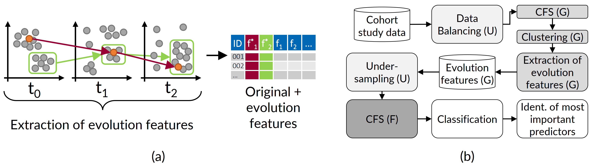
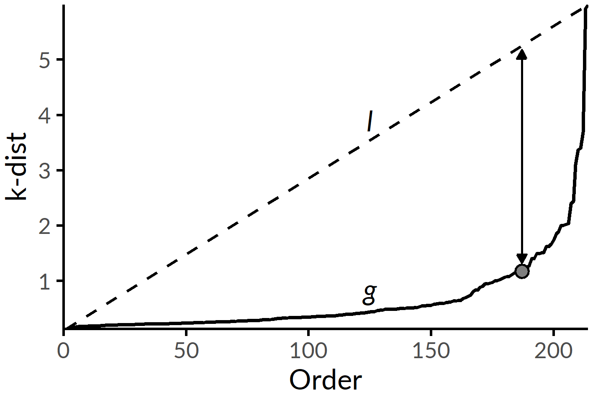
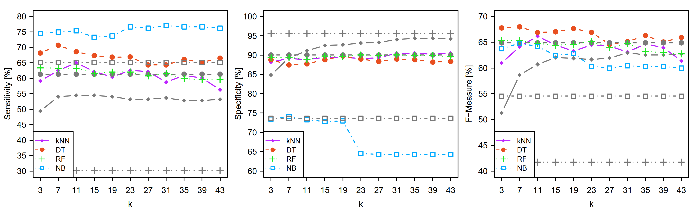
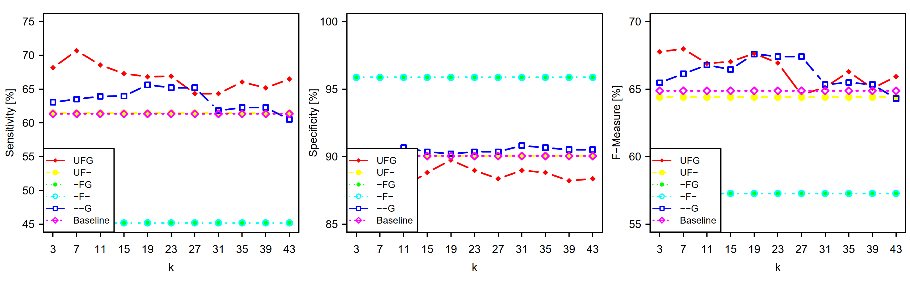
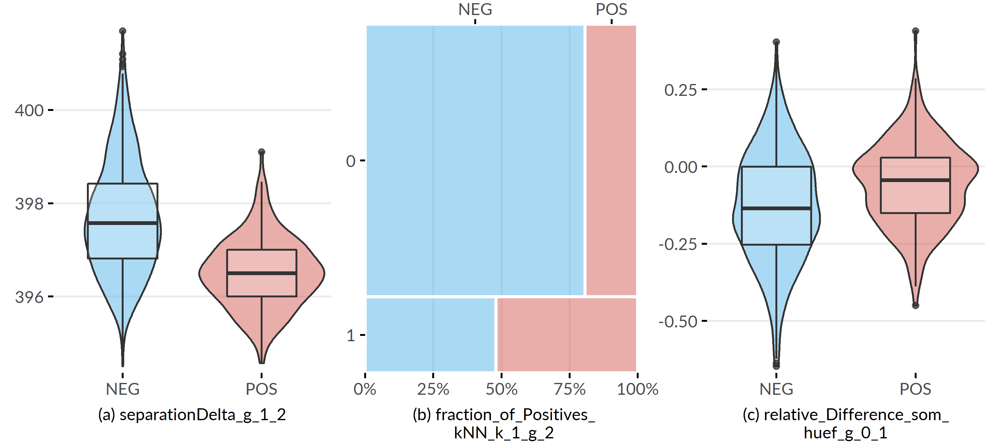
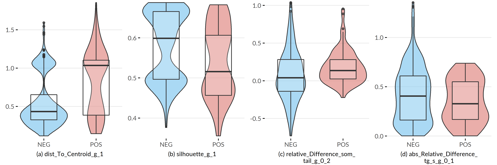
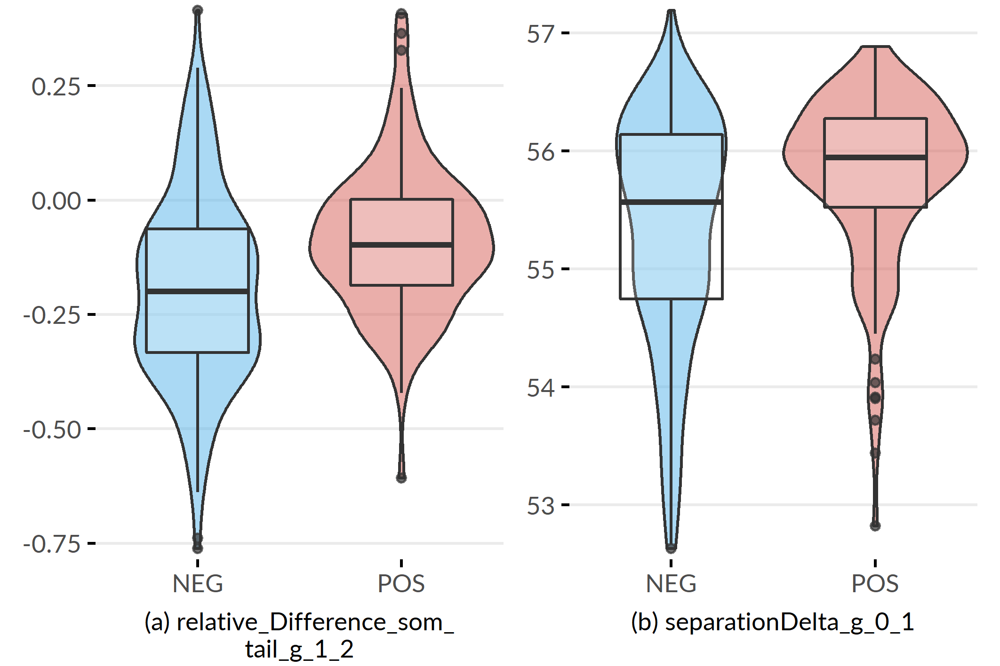

# (PART) EXPLOITING DYNAMICS {-}

# Constructing Evolution Features to Capture Study Participant Change over Time {#evo}

```{r 07-setup, eval = FALSE, echo = FALSE, cache = TRUE, message = FALSE, results='asis'}
source("code/00-chapter-start-bib.R")
print_bib("Niemann:CBMS2015", bib = bib)
```

:::: {.infobox .chapter-summary data-latex="{tasks.pdf}"}

#### Brief Chapter Summary {-}

<!-- Executive Summary -->

We present a framework for cohort analysis in longitudinal cohort studies which constructs "evolution features" from latent temporal information describing the change of cohort participants over time. 
We show that exploiting these novel features improves the generalization performance of classification models. 
We report on results for SHIP and the outcome "fatty liver".


::::

:::: {.infobox .chapter-literature data-latex=""}
This chapter is partly based on:

Uli Niemann, Tommy Hielscher, Myra Spiliopoulou, Henry Völzke, and Jens-Peter Kühn. "Can we classify the participants of a longitudinal epidemiological study from their previous evolution?". In: _Proc. of IEEE Int. Symposium on Computer-Based Medical Systems (CBMS)_. 2015, pp. 121-126. DOI: [10.1109/CBMS.2015.12](https://doi.org/10.1109%2FCBMS.2015.12).

::::

We begin the chapter with work related to the construction of temporal representations in medical data (Section&nbsp;\@ref(evo-intro)). 
In Section&nbsp;\@ref(evo-concept) we present our evolution feature framework including a full workflow that encompasses steps for the extraction of evolution features, dealing with class imbalance and feature selection. Subsequently, we describe our evaluation setup (Section&nbsp;\@ref(evo-evaluation)) and present our results (Section&nbsp;\@ref(evo-results)). 
Finally, in Section&nbsp;\@ref(evo-conclusions) we conclude this chapter and give answers to the aforementioned research questions.

<!-- Ch7 extends Ch3 and Ch4 by considering subpopulation-discovery in the temporal context -->

<!-- %The authors of [@NiemannEtal:ESWA14] propose a workflow for generating classification rules and decision trees to learn the outcome of hepatic steatosis. For this challenge they use data from the Study of Health in Pomerania (SHIP) [@Voelzke:SHIP2011_abbr]. In this paper, we use a superset of this study data and aim to improve classification quality by additionally extracting features from the evolution of the study participants. Leveraging temporal information from time-series is extensively studied in literature. -->
<!-- %In [@KremplEtAl:PKDD11], the authors model the evolution of individuals in a stream-mining environment under concept drift. They identify groups of similar evolving individuals on the basis of multivariate measurements obtained at irregular time-intervals. They use online-trajectory-clustering, assuming that measurements are generated by a Gaussian mixture model. In comparison to our approach, they work within a true stream environment with access to a higher number of measurements for individuals, whereas in an epidemiological data environment the number of measurements is too small across large time-frames and is therefore not suitable for this kind of learning. -->

## Motivation and Comparison to Related Work {#evo-intro}

<!-- %Medical Mining supports personalized clinical decision making by discovering hidden knowledge from accumulated medical data. -->
Epidemiological studies serve as basis for the identification of risk factors associated with a medical condition. 
Machine learning is still rather little used in epidemiology, mainly due to the hypothesis-driven nature of their research. 
However, examples of machine learning applications are the identification of health failure subtypes&nbsp;[@austin2013using] and the discovery of factors (including biomarkers) that modulate a medical outcome&nbsp;[@Raju2014; @valavanis2013derivation]. 
In longitudinal cohort studies measurements are performed in multiple study waves, hence researchers obtain access to sequences of recordings. 
In the context of machine learning, extracting and leveraging the inherent temporal information from these sequences may increase model performance and thus, the understanding of the medical condition of interest. 

In clinical applications temporal information is often exploited, predominantly for the analysis of patient records. 
For example, Pechenizkiy et al.&nbsp;[@PechenizkiyEtAl:CBMS10] analyzed streams of recordings to predict patient rehospitalization after a health failure treatment. 
Sun et al.&nbsp;[@SunEtAl:ICDM10] computed the similarity between streams of patients from patient monitoring data. 
Combi et al.&nbsp;[@CombiEtAl:2010] reported on streams of life signals, in particular on the temporal analysis of the timestamped medical records of hospital patients.
However, participants of an epidemiological, population-based study are not hospital patients -- they are a random sample of the studied population, often with skewed class distribution.
In a _longitudinal_ study of this kind, recordings for the same cohort member are made at each moment.
Hielscher et al.&nbsp;[@HielscherEtAl:IDA14] presented a feature engineering approach to extract temporal information from multiple, but few patient recordings in a longitudinal epidemiological study. 
First, for each assessment clusters of feature-value sequences associated with the target variable are found. 
Afterwards, original and sequence features are used in conjunction for classification.
Hielscher et al.&nbsp;[@HielscherEtAl:IDA14] showed that classification performance increases when features with temporal information are incorporated into the feature space. 
Instead of modeling the individual change of measurement values, our approach involves deriving multivariate change descriptors.
<!-- Hielscher et al.&nbsp;[@HielscherEtAl:IDA14] performed feature engineering on the set of measurements for each assessment collected over multiple wave.  -->
<!-- They showed that classification performance increases when features with temporal information are incorporated into the feature space.  -->
<!-- However, they did not consider modeling the change of subgroups of similar cohort participants over time as.  -->
<!-- TODO: checken ob das klar ist, nachdem die intro eingefügt wurde. -->
Patient evolution with clustering was studied by Siddiqui et al. [@SiddiquiEtAl:BIH14] who proposed a method that predicts the evolution of a patient from timestamped data by clustering them on similarity and predicting cluster movement in the multi-dimensional space. However, the patient data considered in [@SiddiquiEtAl:BIH14] are labeled at each moment.
 <!-- TODO: checken ob das klar ist, nachdem die intro eingefügt wurde. -->

<!-- Hypothesis-based studies on SHIP are numerous, -->
<!-- %(leading to hundreds of publications each year), -->
<!-- while mining studies are rare. For the outcome ``hepatic steatosis'', in [@NiemannEtal:ESWA14,HielscherEtAl:CBMS14] we concentrate on SHIP-2, while in [@HielscherEtAl:IDA14] we exploit the unlabeled recordings of the first two moments but do not model the evolution of the cohort members. -->
<!-- %For our method, we borrow the distance function and the dimensionality reduction step of [@HielscherEtAl:IDA14]. -->
<!-- %, but we first create an enhanced set of dimensions that describe the evolution of cohort members and of their clusters. -->


<!-- %for dimensionality reduction, but we cluster the participants at each moment and derive indices describing the evolution of these clusters. We show that these new variables improve classification quality. -->

Our workflow combines labeled and unlabeled timestamped data from a longitudinal study to improve classification performance on skewed data. 
As the target variable, we study the multi-factorial disorder hepatic steatosis (fatty liver) on a sample of participants from the longitudinal population-based "Study of Health in Pomerania" (SHIP)&nbsp;[@Voelzke:SHIP11], see Section&nbsp;\@ref(background-data-ship). 
For the SHIP cohort, the assessments (interviews, medical tests, etc.) were recorded in three _moments_ (SHIP-0, SHIP-1 and SHIP-2), that are ca. 5 years apart. 
Temporal information is often used when analyzing patient data in a hospital, but there the time granularity is different. 
For example, in an intensive care unit, timestamped data are collected at a fast pace, i.e., every minute or even every second. 
In contrast, the participants of a longitudinal epidemiological study are monitored for a period of months or even years. 
This implies that measurements of the same assessment in an epidemiological dataset are few and possibly far apart. 
The large time span between two consecutive recordings complicates the application of methods designed for data that arrive with a higher frequency. 
For example, a participant may exhibit alcohol abuse or become pregnant, stop smoking and start again, take antibiotics that affect the liver, or experience other lifestyle changes that turn the medical recordings taken 5 years ago irrelevant for the learning of the participant's current health state. 
Another patient may have no changes in lifestyle and no illnesses, so their past data reflect only aging. 
<!-- So, how much can we rely on historical data? -->

A further challenge is that only the recordings in SHIP-2 are labeled. 
A reliable estimate of the fat accumulation in the liver was computed from magnetic resonance tomography images. 
In SHIP-0, MRT was unavailable. 
Instead, liver fat accumulation was derived from ultrasound -- a procedure with lower clinical accuracy. 
In SHIP-1, the calculation was omitted altogether. 
As a consequence, for a given SHIP participant a class label is available in SHIP-2, no label in SHIP-1 and a partially reliable indicator in SHIP-0. 
Since hepatic steatosis is a reversible disorder, label imputation -- by means of a growth model&nbsp;[@SingerWillelt03] -- is not possible; participant evolution must be learned with only one moment with labeled data.

<!-- %To summarize, the classification problem we are called to solve under exploitation of historical information is unconventional: the outcome (fatty liver in our study) is reversible, and is only recorded reliably in the third moment and less reliably in the first one. -->
<!-- %%not a conventional classification problem: each cohort participant should have a label at each wave, but this is not the case. The outcome (fatty liver in our study) is computed by a modern, reliable medical test that was not available in the past. Hence, all cohort participants are labeled at a specific moment, and none has a label at the past moments. Since the moments are very far apart, there is no reliable way of imputing labels to the old data: for no participant can we say that s/he was suffering under fatty liver 10 or 5 years ago. -->
<!-- %Hence, we have to exploit unlabeled historical data for a classification problem. -->

<!-- %Next, the set of variables recorded for the cohort participants changes from one moment to the next. This is the result of changes in the protocol of the epidemiological study: MRT of the liver became part of the protocol for the third wave; ultrasound of the liver was part of the protocol in the first wave and in the third one, but not in the second. Hence, we have to exploit historical data, where some variables are completely absent in some moment. -->
<!-- %%Moreover, the size of the cohort decreases with time. In a hospital setting, new patients arrive every moment, and learned models can be updated with fresh data. A cohort consists of a fixed set of participants; when some of them exit the cohort, they cannot be replaced. Hence, our classification problem involves a large first wave of participants, some of which are no more there in the next waves. Note that the class labels are available only for the participants that were present in the third wave. -->
<!-- %So, our research task is to exploit the incomplete historical data of cohort participants for a classification problem, for which we have labels at one (the most recent) moment, knowing that the (unknown) label of a given cohort participant at any past moment may have been different from her current, known label. -->

<!-- %a different task, though. Hospital records refer to patients, whilst a "cohort" of an epidemiological study consists of persons with and without the "outcome" (the disease). The learning goal is class separation with emphasis on finding the variables that contribute to separation. The cohort participants in "cross-sectional" epidemiological studies are so chosen, as to have classes of equal strength; participants of "population-based" studies are randomly selected, so that the prevalence of the disease (positive class) is as in the population under study. In a "longitudinal" study, cohort members are observed over several moments (in "waves"). For example, the first cohort of the longitudinal population-based study we use [@Voelzke:SHIP2011_abbr] consists of three waves. \footnote{There is a second cohort, currently consisting of only one wave. That cohort is not relevant hereafter.} -->

<!-- %Data mining on longitudinal epidemiological data is much less studied. This is greatly due to the fact that epidemiological research is almost solely hypothesis-driven and thus disagrees fundamentally with the concept of data-driven knowledge discovery. -->
<!-- %%On the other hand, data miners often associate epidemiology with the study of the diffusion of diseases (epidemies). As pointed out by Marathe and Vulikanti in [@MaratheVulikanti:CACM2013] in their work on "Computational Epidemiology", informatics can greatly contribute to the work of epidemiology scholars on understanding and controling the spatiotemporal diffusion of disease through populations. However, epidemiological research encompasses much more topics, on which data mining can play a fundamental role. -->
<!-- %As stated by Preim et al. [@Preim:2014], epidemiology is "a scientific discipline that provides reliable knowledge for clinical medicine focusing on prevention, diagnosis and treatment of diseases." In this study, we propose a mining approach for the diagnosis of a disease (fatty liver, officially named "hepatic steatosis") from longitudinal population-based data. -->

<!-- %To exploit time in an epidemiological study, we must deal with a \emph{missing data} problem. In particular, the set of variables recorded at each moment, the "protocol", may change. Advances in medical research and technology, like the invention of magnetic resonance tomography (MRT), lead to the inclusion of new variables, while the recording of other variables is discontinued. In the epidemiological study we use, liver sonography was included in the first and third wave, liver MRT from the third wave on. Hence, even the sequence of recordings for the target variable may be incomplete, preventing insights on presence and progression of the disease. %at each moment. -->
<!-- %%, nor reconstruct the association of some other variable with the target \emph{over time}. -->
<!-- %%(e.g. if the sequence of sonography recordings or of blood pressure recordings is not complete). -->

We address these challenges as follows. 
First, we group study participants at each moment on similarity, thus building clusters of cohort members that have similar recordings at one of the three moments. 
Then, we connect the clusters across time, thus capturing the transition of each cluster from one study wave to the next. 
These transitions reflect the _evolution of subgroups_, not individuals. 
Hence, next to the single labeled recording per cohort participant, we also exploit the earlier, unlabeled recordings, the description of the cluster they are assigned to and information on how the clusters evolve over time. 
We show that this new, augmented dataset, combining labeled and unlabeled data on individuals and on subgroups, improves classification and delivers additional insights on some factors associated to hepatic steatosis.

## Evolution Features {#evo-concept}

We leverage latent temporal information of a longitudinal cohort study dataset by extracting informative features based on the individual change of participants and the transition of their respective clusters over time. 
For this purpose, we exploit the similarity among participants at each moment, as surrogate to the labels which are not available in the first two moments, assuming that similar participants evolve similarly.
<!-- damit ist gemeint: cluster quality like homogeneity -->
We call these new features _"evolution features"_.
Our approach is illustrated in Figure \@ref(fig:07-concept-workflow)&nbsp;(a). 
We monitor the individual change of participants across the study waves, trace the change of the clusters separately, extract new features (from labeled _and_ unlabeled data) and augment the original data space with our new descriptors of change.
The complete classification workflow is depicted in Figure \@ref(fig:07-concept-workflow)&nbsp;(b). 

(ref:07-concept-workflow) **Concept of evolution feature extraction for classification performance improvement**. (a) Clustering of longitudinal cohort data and subsequent generation of evolution features from the change of individuals (red) and whole clusters (green). (b) Overview of the classification workflow. 

<!-- **TODO: explain parentheses** -->

```{r 07-concept-workflow, echo=FALSE, fig.align='center', out.width="100%", fig.cap="(ref:07-concept-workflow)"}

```

In the following, we describe the clustering of study participants (Section&nbsp;\@ref(evo-concept-clustering)), the generation of evolution features (Section&nbsp;\@ref(evo-concept-evo-features)), our strategy of undersampling the majority class to balance class distribution (Section&nbsp;\@ref(evo-concept-undersampling)) and our feature selection strategy to extract a subset of _informative_ features as input for classification (Section&nbsp;\@ref(evo-concept-feature-selection)).

<!-- \subsection{Clustering and Generation of Evolution Features} -->
### Clustering {#evo-concept-clustering}
For clustering, we prefer density-based clustering over partitional algorithms (like K-means), because our data contain extreme cases, the clusters may be arbitrarily shaped and of different sizes, and we cannot determine their number in advance.
At each moment $t$, we run the DBSCAN&nbsp;[@EsterEtAl:DBSCAN96] algorithm to cluster the set $Z(t)$ of recordings of all cohort members observed at $t$. 
For participant $x$, $v(x,f,t)$ denotes the value of $x$ for feature $f\in$ feature-set $F$ at $t$, and $obs(x,F,t)$ the set of all feature recordings for $x$ at $t$ (cf. notation in Table&nbsp;\@ref(tab:07-nomenclature)).

(ref:07-nomenclature) **Symbols and basic functions.**

```{r 07-nomenclature, echo=FALSE}
`%>%` <- dplyr::`%>%`
eq <- ifelse(knitr::is_latex_output(), "\\ref{eq:heom-adjusted}", "\\@ref(eq:heom-adjusted)")
tibble::tribble(
  ~term, ~meaning,
  "$x$", "a study participant from cohort $X$",
  "$t$", "a study moment, one of $\\{t,\\ldots,t_T\\}$",
  "$t$", "a study moment, one of $\\{t,\\ldots,t_T\\}$",
  "$f$", "a feature from the set of all features $F$",
  "$v(x,f,t)$", "the value of $x$ for feature $f$ at moment $t$",
	"$obs(x,F,t)$", "all measurements for $x$ at $t$, i.e., $\\{v(x,f,t)|f\\in{}F\\}$",
	"$Z(t)$", "all observations at $t$, i.e., $\\{obs(x,F,t)| x \\in X\\}$",
  "$c(x,t)$", "cluster membership of $x$ at $t$; if $x$ is an outlier at $t$, then $c(x,t)$ is empty",
# %	$peers(x,t)$ & peers of $x$ at $t$, cf. Eq. \\ref{eq:peers} 
# %	$c(x,t) = \\emptyset$	&	if $c(x,t)=\\emptyset$, then $x$ is an outlier at $t$
	"$d(x,z,t)$", paste0("distance between $x$ and $z$ at $t$ (cf. Eq. ", eq, ")"),
	"$kNN(x,k,t)$", "the set of $k$ nearest neighbors of $x$ at  $t$",
  "$centr(x,t)$", "centroid of $c(x,t)$"
  ) %>%
  purrr::set_names(c("Term", "Description")) %>%
  kableExtra::kbl(escape = FALSE, booktabs = TRUE, linesep = "",
                  caption = "(ref:07-nomenclature)") %>%
  kableExtra::kable_classic() %>%
  kableExtra::row_spec(0, bold = TRUE)
```

<!-- \paragraph{Distance function} -->
`r start_paragraph("Distance function.")` 
For the distance between participants $x,z$ at $t$, we use the _adjusted heterogeneous Euclidean overlap metric_&nbsp;[@HielscherEtAl:IDA14; @Wilson97], which weights the difference between two values $x,z$ for feature $f$ by the feature's information gain $G(f)$, scaled to the largest observed value $G^*$, defined as:
\begin{equation}
d(x,z,t)=\sqrt{\sum_{f \in F} \left(\frac{G(f)}{G^*}\cdot \delta\left(v(x,f,t),v(z,f,t)\right)\right)^2}.
(\#eq:heom-adjusted)
\end{equation}
For continuous features, $\delta(a,b)$ is the min-max-scaled difference between the values $a,b$, i.e., $(a-b)/(\max(f)-\min(f))$. 
For nominal features, $\delta(a,b)$ is 0 if $a=b$, and 1 otherwise.

<!-- \paragraph{Specifying the DBSCAN parameters} -->
`r start_paragraph("DBSCAN Parameter setting.")`
DBSCAN relies on two parameters: the radius $eps$ of the neighborhood around a data point, and the minimum number $minPts$ of neighbors for a point to be a core point.
We use the "elbow" heuristic of &nbsp;[@EsterEtAl:DBSCAN96] which determines a suitable $eps$ value for a given $minPts$ value, and is illustrated in Figure&nbsp;\@ref(fig:07-k-dist-graph). 
More specifically, we define a parameter $k$, and compute for each $x\in{}Z(t)$ the distance k-dist$(x,k)$ to its k-th nearest neighbor.
We sort these distances, draw the k-dist$(x,k)$ graph _g_ and span the line _l_ connecting the smallest k-dist() value to the largest one. 
Then, we set $eps$ to the k-dist value with maximum distance between _g_ and _l_.

(ref:07-k-dist-graph) **Setting $eps$ based on the k-dist graph for a given $minPts$.** The k-dist graph _g_ depicts the sorted distances to the points' k-th next neighbors. A suitable $eps_{opt}$ can be identified at the position with maximum distance between the k-dist and the line _l_ that connects the first and the last point of _g_. For DBSCAN clustering with $minPts$ = k, $eps_{opt}$, points with k-dist $\leq$ $eps_{opt}$ will become core points, else border or noise points.

```{r 07-k-dist-graph, echo=FALSE, fig.align='center', out.width=if(knitr::is_latex_output()){"43%"}else{"75%"}, fig.cap="(ref:07-k-dist-graph)"}

```

<!-- \paragraph{Tracing evolution}  -->
### Constructing Evolution Features {#evo-concept-evo-features}
Table&nbsp;\@ref(tab:07-tab-evo-features) provides a description of all evolution features. 
For each cohort member $x$ and moment $t$, we record the cluster containing $x$ (feature 1 in Table&nbsp;\@ref(tab:07-tab-evo-features)), 
(2) the distance of $x$ to this cluster's centroid, 
(3) the fraction of positively labeled participants among the $k$ nearest neighbors of $x$, 
(4) the (graph-based) cohesion&nbsp;[@TanDMbook] and (5) Silhouette coefficient&nbsp;[@TanDMbook] of $x$, and (6) the (graph-based) separation&nbsp;[@TanDMbook] of $x$ to cohort participants outside this cluster. 
We compute the difference of the cohesion, silhouette and separation values from $t$ to all later moments $\{t' \in T|t'>t\}$ (7-9), and also check how much the values of these metrics change as $x$ moves from $c(x,t)$ to $c(x,t')$ (10-12).
We record whether $x$ is an outlier, i.e., a DBSCAN noise point at some moment (13). 
For $t$ and $\{t' \in T|t'>t\}$, we compute the fraction of cohort members who are in the same cluster as $x$ in $t$ and $t'$ (14), and the fraction of common $k$ nearest neighbors (15), and the change of the distance between $x$ and its centroid at $t$, from $t$ to $t'$ (16).
We further record changes in the sequence of values for a feature, including real (17), absolute (18) and relative (19) differences between the values at two moments.
We measure how a cluster shrinks/grows from $t$ to $t'$ (20), and how much its members move (on average) closer or far apart from their previous positions (21-23).
In that way, we extract information about the evolution of the participants, distinguishing among those that evolve smoothly and those that switch among clusters. 
We transfer this information to evolution features, thus enriching the feature space with information from the unlabeled moments.

(ref:07-tab-evo-features) **Overview of extracted features.** The first group of features (I) comprises the cluster membership and aggregated distance information for each participant and for each moment; feature group II is on changes in the participant's position (in the hyperspace) relative to the cluster and to its closest neighbors; feature group III captures changes in the values of the participant's recordings; feature group IV refers to changes in the clusters.

```{r 07-tab-evo-features, echo=FALSE}
`%>%` <- dplyr::`%>%`
eq <- ifelse(knitr::is_latex_output(), "\\ref{eq:heom-adjusted}", "\\@ref(eq:heom-adjusted)")
fix_ttt <- function(x) {
  if(knitr::is_latex_output()){
    stringr::str_replace_all(x, "`(.+?)`", "\\\\texttt\\{\\1\\}") %>%
      stringr::str_replace_all("\\[@(.+?)\\]", "\\\\cite\\{\\1\\}")
    } else {
      stringr::str_replace_all(x, "\\\\", "")
    }
}
tibble::tribble(
  ~no, ~term, ~meaning,
  "1", fix_ttt("`Cluster\\_t`"), "Cluster ID of $x$ at $t$",
  #
  "2", fix_ttt("`dist\\_To\\_Centroid\\_t`"), "distance of $x$ to the centroid of cluster $c(x,t)$, denoted as $\\widehat{c(x,t)}$",
  #
  "3" , fix_ttt("`fraction\\_Of\\_POS\\_kNN\\_`$k$`\\_t`"), "fraction of the $k$ nearest neighbors of $x$ at $t$ from the positive class",
  #
  "4-6", fix_ttt("`a\\_t := a(x,t,c(x,t))`"), fix_ttt("where $a$ is one of {cohesion, silhouette, separation} [@TanDMbook]; cohesion$_t$ is the cohesion of $x$ at $t$ w.r.t. the members of $c(x,t)$ -- and similarly for silhouette and for separation"),
  #
  "7-9", fix_ttt("`a\\_Delta\\_t\\_t'`"), "difference $a_{t} - a_{t'}$ for $a$ as above",
  #
  "10-12", fix_ttt("`a\\_Movement\\_t\\_t'`"), "difference $a(x,t,c(x,t)) - a(x,t',c(x,t))$ for $a$ as above, referring to the same cluster $c(x,t)$ at two moments $t,t'$; at $t'$, $x\\in{}c(x,t')$, which does not need to be the same as $c(x,t)$",
  #
  "13", fix_ttt("`was\\_becomes\\_Outlier\\_t\\_t'`"), "4-valued flag on whether $x$ was outlier in both $t, t'$, only in $t$, only in $t'$ or in neither$t, t'$",
  #
  "14", fix_ttt("`same\\_Cluster\\_t\\_t'`"), "$c(x,t)\\cap{}c(x,t')\\setminus\\{x\\}$: set of cohort members that are in the same cluster as $x$ in $t$ and in $t'$",
  #
  "15", fix_ttt("`same\\_kNN\\_`$k$`\\_t\\_t'`"), "$kNN(x,k,t)\\cap{}kNN(x,k,t')$, i.e., the set of cohort members who are among the $k$ nearest neighbors of $x$ in both $t$ and in $t'$; they do not need to be in the same cluster as $x$",
  #
  "16", fix_ttt("`shift\\_To\\_Old\\_Centroid\\_t\\_t'`"), "difference $d(x,\\widehat{c(x,t)},t')-(x,\\widehat{c(x,t)},t)$",
  #
  "17-19" , fix_ttt("`A\\_Diff\\_f\\_t\\_t'`"), "difference between $v(x,f,t)$ and $v(x,f,t')$ for feature $f$, where $A$ is either real difference, absolute difference or relative difference to $v(x,f,t)$",
  #
  "20", fix_ttt("`smaller\\_Cluster\\_Fraction\\_t\\_t'`"), "difference of the size of cluster $c$ at $t'$ with respect to the size it had at $t$; $c$ is matched to the clusters of $t$ on the basis of member overlap",
  #
  "21-23", fix_ttt("`movement\\_d\\_t\\_t'`"), paste0("distance $d$ between the locations of the members of cluster $c$ at $t$ and their locations at $t'$, where $d$ is one of Euclidean distance, HEOM distance (cf. Eq. ",
                                                 eq, ", Cosine similarity")
) %>%
  kableExtra::kbl(
    col.names = c("\\#", "Name", "Description"), 
    escape = FALSE, booktabs = TRUE, linesep = "",
    valign = "t",
    caption = "(ref:07-tab-evo-features)"
    ) %>%
  kableExtra::kable_classic() %>%
  # kableExtra::column_spec(2, extra_css = "vertical-align:top;") %>%
  kableExtra::column_spec(3, latex_column_spec = "p{8cm}") %>%
  kableExtra::pack_rows("I: Features for participant $x$ at each moment", 1, 4, escape = FALSE) %>%
  kableExtra::pack_rows("II: Evolution features linked to each participant $x$", 5, 10, escape = FALSE) %>%
  kableExtra::pack_rows("III: Evolution features associated w. the value of each original feature $f$ for participant $x$", 11, 11, escape = FALSE, latex_wrap_text = TRUE) %>%
  kableExtra::pack_rows("IV: Evolution features linked to a whole cluster $c$", 12, 13, escape = FALSE) %>%
  kableExtra::row_spec(0, bold = TRUE)
```

### Undersampling {#evo-concept-undersampling}
For imbalanced data, feature selection and classification are often biased in favor of the majority class&nbsp;[@leevy2018survey]. 
To avoid this problem, prior to the application of CFS we undersample the majority class and generate a balanced data set to select features informative with respect to all classes.
<!-- Let $X_{min}$ and $X_{max}$ be the set of participants belonging to the minority and majority class respectively. We iteratively select participants $x \in X_{max}$ at random and remove the participant from the set, setting $X_{max} = X_{max} \setminus{} x$ until $|X_{max}| = |X_{min}|$ holds true. Then, the feature selection algorithm is given the set $X_{min} \cup X_{max}$ as input.For some positive participatns, some features have extreme values \cite{NiemannEtal:ESWA14}. Oversampling would -->
<!-- % it is reported that some features show extreme values for some positive participants. -->
<!-- amplify the impact of such extrema. So, we rather undersample the negative class by random selection. % and removal. -->
<!-- %The positive class is underrepresented. -->
<!-- %In medical research for diagnostics, the data are often skewed, since the positive outcome is usually more rare than the healthy state. -->
<!-- %We undersample the negative class by random selection and removal of participants. -->
<!-- This also allows us to suppress heterogeneities in the negative class. -->

### Feature Selection {#evo-concept-feature-selection}
We use the feature selection method of Hielscher et al.&nbsp;[@HielscherEtAl:CBMS14] as follows. 
First, we invoke correlation-based feature selection&nbsp;[@hall2000correlation] (CFS), which builds up a feature set by iteratively inserting to it the feature that adds most "merit" to it. 
The merit $M_F$ of a feature set $F$ is computed by calculating the information gain for each pair of features in $F$ (lower gain corresponds to low correlation and is thus preferred) and for each feature in $F$ towards the target variable (higher gain is better).
Continuous features are first discretized with the entropy-based method of Hielscher et al.&nbsp;[@Fayyad:MDL93]. 
We discretize only for feature selection; for clustering and classification we use the original values.

As shown in Figure&nbsp;\@ref(fig:07-concept-workflow), we perform feature selection twice. 
The first time, we consider only features recorded in all moments. 
This is essential for evolution tracing: we can only compute distances between objects in clusters located in the same topological space. 
After generating the evolution features, we build up the complete set of features, also considering those not recorded in each moment. 
On this set we perform feature selection again, to discard unpredictive (original or evolution) features. 
This final feature set is then used for classification. 

## Evaluation Setup {#evo-evaluation}
We evaluate our workflow with 10-fold cross-validation on four off-the-shelf classification algorithms: random forest&nbsp;[@Breiman:RandomForests2001] (RF), C4.5 decision tree&nbsp;[@Quinlan:C4.5.1993], Na&iuml;ve Bayes&nbsp;(NB) and k-nearest neighbor (kNN). 
Next, we compare the generalization performance for each algorithm when it is used alone (_baseline_ variant) vs. when incorporated into our workflow (_worflow-enhanced_ variant).
Further, we study the impact of different combinations of the three workflow components _undersampling_ (`U`), _feature selection_ (`F`) and _incorporation of generated evolution features_ (`G`). 
As shown in Table&nbsp;\@ref(tab:07-workflow-variants), `Baseline` simply invokes the classification algorithm; we use the classification algorithms which achieves the highest F-measure scores. 
The variant `U-G` performs undersampling and uses the generated evolution features for classification. 
Since we undersample only for feature selection and then build the classification models on the original dataset, so `U-G` is identical to `--G` and `U--` is identical to the `Baseline` variant, so we omit to explicityl list `U-G` and `U--`.

The main parameter is $k$ which is the number of neighbors of a data point: we set $minPts$ = $k$ and use $k$ to derive the values of the DBSCAN parameter $eps$ (cf. Section&nbsp;\@ref(evo-concept-clustering)) and of the parameters for the features `same_kNN_`$k$`_t_1_t_2` and `fraction_Of_POS_kNN_`$k$`_t` (cf. Table&nbsp;\@ref(tab:07-tab-evo-features)). 
Further, the number of nearest neighbors for the k-NN classification algorithm is also set to $k$. 
We vary $k$ to measure its impact on classification performance. 

Following the findings in Chapters&nbsp;\@ref(imm) and&nbsp;\@ref(sdclu) on the differences between female and male participants with respect to the outcome, we run the experiments on the whole dataset (_Partition~all~_), and on the partitions of female (_Partition~f~_) and of male (_Partition~m~_) participants. 
Finally, we list the most important features found in _Partition~all~_ and its two subsets.
<!-- Due to space limits, we present only the experiments on the complete dataset \footnote{The experiments on the two partitions are under \url{http://bit.ly/1Dd82KE}.}. -->
<!-- %Following the findings of \cite{NiemannEtal:ESWA14,HielscherEtAl:CBMS14,HielscherEtAl:IDA14} on the differences between female and male participants with respect to the outcome, we also run our workflow on the partitions of female and male participants; these results are in a supplement  \footnote{ \url{http://www.kmd.ovgu.de/xyz}}. -->
<!-- %which consider a subset of \subcohort, -->
<!-- %we split the dataset into \partitionF (462 female participants, 19\% positive) and \partitionM (426 male participants, 35\% positive) and learn on each partition\footnote{Due to lack of space, we elaborate on results for \partitionF and \partitionM in an external appendix which is accessible at \url{http://www.kmd.ovgu.de/xyz}.}, as in \cite{HielscherEtAl:CBMS14,NiemannEtal:ESWA14}. -->
<!-- %%We experimented with the complete dataset and with the partitions of female and male participants -->
<!-- In subsection \ref{subsec:findings}, we report on important features for the complete dataset \emph{and} for the two partitions. -->

<!-- %We run our experiments on the complete dataset \partitionA and on the subsets of female and male participants, \partitionF and \PartitionM. We then study the impact of the workflow components on sensitivity, accuracy and F-measure. We report only on \PartitionA, due to lack of space\footnote{\textcolor[rgb]{0,0,1}{The description of the results as well as the corresponding figures for the two subsets \partitionF and \partitionM can be accessed at \url{http://www.kmd.ovgu.de/xyz}}}. Finally, we list the most important features found in \partitionA and its two subsets. -->

(ref:07-workflow-variants) **Workflow variants.** `UFG` is the complete workflow.

```{r 07-workflow-variants, echo=FALSE}
`%>%` <- dplyr::`%>%`
yes <- "&#x2713;"
no <- "&#x2717;"
if(knitr::is_latex_output()) {
  yes <- "\\ding{51}"
  no <- "\\ding{55}"
}
tibble::tribble(
  ~components, ~us, ~fs, ~evo,
  "UFG", yes, yes, yes,
  "UF-", yes, yes, no,
  "-FG", no, yes, yes,
  "-F-", no, yes, no,
  ifelse(knitr::is_latex_output(), "-{}-G", "\\-\\-G"), no, no, yes,
  "Baseline", no, no, no,
) %>%
  purrr::set_names(c("Workflow components", "Under-sampling", "Feature selection", "Evolution features")) %>%
  kableExtra::kbl(escape = FALSE, booktabs = TRUE, linesep = "",
                  align = "cccc",
                  caption = "(ref:07-workflow-variants)") %>%
  kableExtra::kable_classic() %>%
  kableExtra::row_spec(0, bold = TRUE) %>%
  kableExtra::column_spec(column = 1:4, width = "2.5cm") %>%
  kableExtra::column_spec(column = 1, width = "2.5cm", monospace = TRUE) 
```

## Results {#evo-results}
Figure&nbsp;\@ref(fig:07-perf-wf-classifiers) shows sensitivity (left), specificity (center) and F-measure (right) for the simple classifiers (gray curves) and their workflow-enhanced counterparts (same line style, colored), for different $k$.
<!-- We consider high sensitivity and F-measure as more important than specificity towards the majority class. -->
<!-- %A good classifier has high sensitivity and F-measure, and good specificity. %is not be misled by the majority class. -->
Overall, each workflow-enhanced variant outperforms its simple counterpart with respect to sensitivity and F-measure, and outperforms or performs slightly worse with respect to specificity.
The workflow-enhanced Naive Bayes performs best with respect to sensitivity for any $k$ and best for $k=31$.
Decision trees exhibit highest F-measure, with improvements on sensitivity and F-Measure compared to its simple variant, albeit specificity being sligthly worse; improvements are less for large $k$. 
Random Forests benefit the most from our workflow, with an absolute improvement in F-measure of over 30% (green vs gray "+" curves in right part of Figure&nbsp;\@ref(fig:07-perf-wf-classifiers)).
One explanation for the rather poor sensitivity of the simple RF variant is the large number of trees (100) learned on data samples containing very few positive examples, and RF could be trapped by the many majority class examples. 
This is consistent with the specificity curve (almost straight line around 95%) of simple RF, while the F-measure is slightly above 40%. 
Our workflow improves RF sensitivity (63%) and F-measure (65%), while specificity remains high (90%).
Overall, the impact of $k$ on the three measures is limited for all algorithms except of the workflow-enhanced and the baseline k-NN which is naturally affected stronger by the value of $k$ than any other algorithm. 
Therefore, the workflow-enhanced variants outperform their simple counterparts in terms of sensitivity and F-measure. For some algorithms, our workflow prevents overfitting of the negative class.

(ref:07-perf-wf-classifiers) **Comparison of classification performance between workflow and baseline.** Sensitivity (true positive rate), specificity (false positive rate) and F-measure scores of different classifiers when varying the number k of neighbors to a cohort member which impacts the clustering result. For each classifier two performance curves are shown: a colored one for the workflow-enhanced version and a gray one for the baseline counterpart. Higher values are better for all measures. From [@Niemann:CBMS2015].

```{r 07-perf-wf-classifiers, echo=FALSE, fig.align='center', out.width="100%", fig.cap="(ref:07-perf-wf-classifiers)"}

```

The workflow component-specific analysis results in Figure&nbsp;\@ref(fig:07-perf-wf-components) show that our complete workflow `UFG` and the variants `UF-` and `--G` outperform `---` in sensitivity and F-measure. 
The variants `-F-` and `-FG` perform well only regarding specificity, which suggests that feature selection may not be fruitful without undersampling for datasets with class imbalance.

(ref:07-perf-wf-components)  **Comparison of classification performance for workflow components.** Sensitivity, specificity and F-measure scores for each workflow variant and the baseline using decision tree for learning. From [@Niemann:CBMS2015].

```{r 07-perf-wf-components, echo=FALSE, fig.align='center', out.width="100%", fig.cap="(ref:07-perf-wf-components)"}

```

`r start_paragraph("Important features.")` The performance of the workflow variants which include feature selection indicates that a small number of features is sufficient for class separation. 
Hereafter, for each partition we report on the evolution features selected for classification and among the top-15 features according to information gain. 
Figure&nbsp;\@ref(fig:07-imp-features-all) shows that for Partition~All~ 3 out of these 15 features are generated evolution features. 
The boxplots (a) and (c) in Figure&nbsp;\@ref(fig:07-imp-features-all) refer to differences between values recorded in two moments. 
The feature `separationDelta_g_1_2` measures the difference in cluster separation for each participant based on the cluster assignment in moment 1 and 2, and corresponds to entry #9 in Table&nbsp;\@ref(tab:07-tab-evo-features). 
Participants of the positive exhibit a higher median in `separationDelta_g_1_2` than participants of the negative class indicating that clusters harboring mostly positive participants cover larger, more sparse areas.  
The feature `relative_Difference_som_huef_g_0_1` (#19) quantifies the difference in a participant's hip circumference between SHIP-0 and SHIP-1, relative to the value in SHIP-0. 
While on average study participants from both classes lose weight when they grow older, negative participants reduce more weight compared to positive participants (cf. Figure \@ref(fig:07-imp-features-all)&nbsp;(c)), which in general reflects differences in life styles.
The mosaic chart in Figure \@ref(fig:07-imp-features-all)&nbsp;(b) for feature `fraction_of_Positives_kNN_1_g_2` (#3) indicates that the _nearest neighbor_ of a participant with fatty liver is more likely to also exhibit the disorder than it is for a non- fatty liver participant. 

(ref:07-imp-features-all) **Visualization of selected evolution features which contribute most to class separation for the whole dataset Partition~All~.** 

```{r 07-imp-features-all, echo=FALSE, fig.align='center', out.width="75%", fig.cap="(ref:07-imp-features-all)"}

```

For Partition~F~, 5 out of the top-15 features are evolution features, cf. Figure&nbsp;\@ref(fig:07-imp-features-women). 
Compared with female participants without the disorder, female subjects with fatty liver exhibit a larger distance to the centroid of their cluster in SHIP-1 (#2), a lower silhouette coefficient in SHIP-1 (#5), a higher difference in waist circumference between SHIP-0 and SHIP-2 (#19), and a lower relative difference in serum triglycerides concentration between SHIP-0 and SHIP-1 (#19). 

(ref:07-imp-features-women) **Visualization of selected evolution features which contribute most to class separation for Partition~F~.** 

```{r 07-imp-features-women, echo=FALSE, fig.align='center', out.width="100%", fig.cap="(ref:07-imp-features-women)"}

```

For Partition~M~, 2 out of the top-15 features are evolution features (Figure&nbsp;\@ref(fig:07-imp-features-men)), including the relative difference in waist circumference between SHIP-1 and SHIP-2 (#19) and difference in separation between SHIP-0 and SHIP-1 (#6). 
For both features, patients exhibiting the disorder have greater values. 

(ref:07-imp-features-men) **Visualization of selected evolution features which contribute most to class separation for Partition~M~.** 

```{r 07-imp-features-men, echo=FALSE, fig.align='center', out.width="50%", fig.cap="(ref:07-imp-features-men)"}

```

## Conclusions from Exploiting Study Participant Evolution {#evo-conclusions}

<!-- **TODO:LINK TO RESEARCH QUESTIONS** -->
<!-- **TODO: say that in the original submission, we also report on static features** -->

We proposed a workflow for the the classification of longitudinal cohort study data which exploits inherent temporal information by clustering the cohort participants at each moment, linking the clusters and tracing participant evolution over the moments of the study. 
From the clusters and their transitions we extract _evolution features_, which are added to the feature space and subsequently used for classification. 
The workflow improves the generalization performance with respect to sensitivity and F-measure scores. 
The generated evolution features contribute to this improvement, even when they are used alone and without undersampling of the skewed data.
We show that the _change_ of the values of somatographic variables and cluster quality indices over time are predictive. 

<!-- , but our approach is appropriate for classification of longitudinal epidemiological data on further disorders. -->
