# (PART) POST-MINING FOR INTERPRETATION {-}

# Post-Hoc Interpretation of Classification Models {#iml}

```{r 08-setup, eval = FALSE, echo = FALSE, cache = TRUE, message = FALSE, results='asis'}
source("code/00-chapter-start-bib.R")
print_bib(
  c(
    "Niemann:CBMS2018", 
    "Niemann:SREP2020", 
    "Niemann:PONE2020"
  ),
  bib = bib
)
```

:::: {.infobox .chapter-summary data-latex="{tasks.pdf}"}

#### Brief Chapter Summary {-}

Complex _black-box_ models can have high predictive performance but are difficult to interpret. 
We propose an end-to-end data analysis workflow for high-dimensional medical data that includes steps for data augmentation, modeling, interleaving model training with feature elimination, and post-hoc analysis of the trained models.
Our approach delivers statistics and visualizations representing global feature importance, instance-individual feature importance, and subpopulation-specific feature importance.
We validate our workflow on three modeling tasks: (i) tinnitus-related distress after treatment in tinnitus patients, (ii) depression at baseline in tinnitus patients, and (iii) rupture risk in intracranial aneurysms.

::::

:::: {.lit .chapter-literature data-latex=""}
This chapter is partly based on:

- Uli Niemann, Philipp Berg, Annika Niemann, Oliver Beuing, Bernhard Preim, Myra Spiliopoulou, and Sylvia Saalfeld. "Rupture Status Classification of Intracranial Aneurysms Using Morphological Parameters". In: _Computer-Based Medical Systems (CBMS)_. 2018, pp. 48-53. DOI: [10.1109/CBMS.2018.00016](https://doi.org/10.1109%2FCBMS.2018.00016).
- Uli Niemann, Benjamin Boecking, Petra Brueggemann, Wilhelm Mebus, Birgit Mazurek, and Myra Spiliopoulou. "Tinnitus-related distress after multimodal treatment can be characterized using a key subset of baseline variables". In: _PLOS ONE_ 15.1 (2020), pp. 1-18. DOI: [10.1371/journal.pone.0228037](https://doi.org/10.1371%2Fjournal.pone.0228037).
- Uli Niemann, Petra Brueggemann, Benjamin Boecking, Birgit Mazurek, and Myra Spiliopoulou. "Development and internal validation of a depression severity prediction model for tinnitus patients based on questionnaire responses and socio-demographics". In: _Scientific Reports_ 10 (2020), pp. 1-9. DOI: [10.1038/s41598-020-61593-z](https://doi.org/10.1038%2Fs41598-020-61593-z).

::::

In medical applications, understanding and clearly communicating the results of a machine learning model is critical to deriving actionable knowledge that can ultimately be used to improve disease prevention, diagnosis, and treatment [@tonekaboni2019clinicians]. 
<!-- For example, in Chapter&nbsp;\@ref(imm), we built classification rules from which we extracted features and feature-value pairs that are most associated with the target variable.  -->
<!-- **ADD 2 MORE EXAMPLES FROM PREVIOUS CHAPTERS**.  -->
Obtaining results that both data scientists and medical experts easily understand helps formulate new hypotheses regarding the relationship between potential risk or protective factors and the target; the significance of these relationships can be tested in follow-up studies. 
Current state-of-the-art machine learning algorithms produce models with superior performance compared to simpler but interpretable models, such as decision trees, rule lists, or linear regression fits. 
However, because these opaque _black boxes_ involve many complex feature interactions or decisions, some of which are non-linear, it is often difficult to explain them understandably.
Arising from the need to provide understandable insights into otherwise opaque models, the _interpretability_ community of machine learning has gained traction, intending to resolve the dilemma of choosing between moderately accurate but interpretable models and highly accurate but opaque black-box models [@molnar2020interpretable; @adadi2018peeking; @carvalho2019machine]. 
This chapter describes an end-to-end data analysis workflow for high-dimensional medical data that includes steps for data augmentation, modeling, interleaving model training with feature elimination, and post-hoc analysis of the trained models. 
<!-- A variety of learners are used for classification, from simple interpretable models to complex black boxes.  -->
We validate our approach on three datasets.

This chapter is organized as follows. 
Section&nbsp;\@ref(iml-motivation) describes reasons for using interpretable machine learning methods and provides methodological underpinnings of selected pioneering methods. 
Subsequently, we present the components of our mining workflow in Section&nbsp;\@ref(iml-workflow). 
<!-- which includes correlational analysis, image preprocessing, feature selection, classification of high-dimensional medical data, hyperparameter tuning, model evaluation and our approach of putting interpretation methods into use.  -->
In Section&nbsp;\@ref(iml-validation), we validate our workflow on three datasets. 
Section&nbsp;\@ref(iml-discussion) discusses our findings from the medical perspective.
Section&nbsp;\@ref(iml-conclusion) concludes the chapter.

## Motivation and Methodological Underpinnings {#iml-motivation}

Current state-of-the-art machine learning algorithms, such as gradient boosting [@Friedman:PDP2001] for tabular data and deep learning [@Goodfellow:DL2016] for unstructured data (images, videos, audio recordings), are designed to support medical decision-making.
These methods produce models which typically achieve better predictive performance than simpler models such as decision trees, rule lists, or linear regression fits.
However, they are also more complex, making it more difficult to understand why a prediction was made.
Thus, medical experts may face the dilemma of choosing either an opaque black-box model with high predictive power or a simple, less accurate model that can be explained to the domain expert.
Especially in high-risk domains such as healthcare, where misconceptions can have serious consequences, the ability to explain a model's reasoning is a highly desirable (sometimes mandatory) property of any decision-support system [@guidotti2018survey; @molnar2020interpretable].

As a result, methods that explain the predictions of complex machine learning models have attracted increasing attention in recent years [@carvalho2019machine; @adadi2018peeking]. 
Existing methods are classified according to different criteria [@molnar2020interpretable].
For example, a distinction is made between _intrinsically interpretable models_ and _post-hoc explanations_.
The former often entails limiting model complexity by choosing algorithms that produce transparent models, such as decision trees or linear regression models.
Decision trees, for example, can be intuitively visualized with node-link diagrams.
Features in split conditions near the tree root generally have a higher impact on predictions than features occurring at lower tree levels or within leaf nodes.
Quantitative measures calculate the overall importance of a feature by the decrease in impurity or variance in nodes where the feature occurs compared to parent nodes [@kazemitabar2017variable]. 
Furthermore, the data partitions created by a decision tree can be described by understandable conditions such as "body mass index > 30", and the decision paths from the root to leaf nodes provide insights into feature interactions.
Moreover, they can be used for contrasting predictions for individual instances, e.g., by considering alternative feature values and their effects on model prediction (_"If the patient had a body mass index of 25 instead of 30, what difference in terms of prediction would that have."_).
Disadvantages are that decision trees cannot capture linear, non-axis-parallel relationships between predictors and response, and they can be unstable for small value changes in training data [@hastie2009elements]. 
Therefore, they may be unsuitable for complex learning tasks. 

If a more sophisticated model is trained, post-hoc methods can be applied to examine the model after training.
These methods' outputs can be _feature summary statistics_, _model internals_, _individual observations_, and _feature summary visualizations_ [@molnar2020interpretable].
In general, feature summary statistics are individual scores that express the overall importance of a feature to the model prediction or the strength of the feature's interaction with the other features.
Examples of model internals are the coefficients of a linear model or weight vectors of a neural network.
Individual observations can describe representatives (or prototypes) of observation subgroups for which the model provides consistent predictions for all subgroup members. 
Individual observations can also provide counterfactual explanations, e.g., to determine the minimum change that will cause the model to predict a different class for a particular observation of interest.

### Selected Model Interpretation Methods

We discuss partial dependence plots [@Friedman:PDP2001] (PDP), Local Interpretable Model-Agnostic Explanations [@RibeiroEtAl:KDD2016] (LIME), and Shapley Additive Explanations [@Lundberg:SHAP2017] (SHAP), with emphasis on the interpretation of their outputs.

`r start_paragraph("Partial dependence plots.")` Visualizations of feature summaries typically depict trends in the relationship between a subset of features and the predicted response, often in the form of curves or surface plots.
The _partial dependence plot_ [@Friedman:PDP2001] (PDP) is a widely used tool for visually depicting the marginal effect of one or more predictors on the predicted response of a model.
As an example, the PDP in Figure \@ref(fig:08-pd-intro)&nbsp;(a) shows a roughly S-shaped relationship between the predictor and the response estimated by the model. 
<!-- example: drug effectiveness -->

(ref:08-pd-intro) **Illustrations of a partial dependence plot (PDP) and an individual conditional expectation (ICE) plot on artificial data.** (a) PDP for a predictor on an artificial dataset. Points represent a sample of the predictor distribution. (b) PDP augmented with ICE curves. There are two distinct subsets of observations for which the PD is different in the upper half of the predictor distribution.

```{r 08-pd-intro, echo=FALSE, fig.align='center', out.width="75%", fig.cap="(ref:08-pd-intro)"}
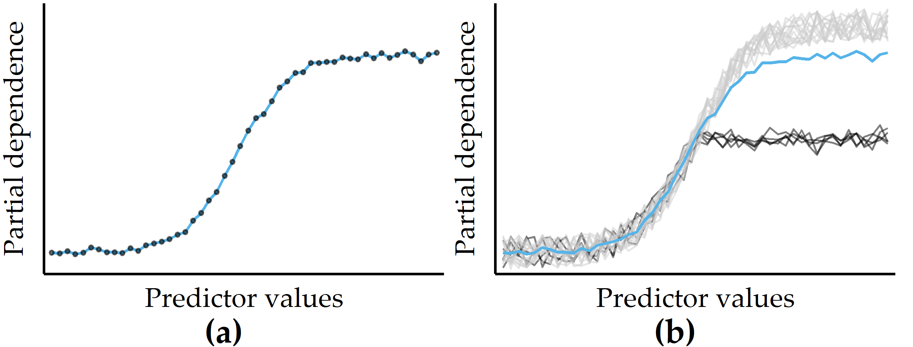
```

Let $\zeta$ be the classification model (or any general function that returns a single real value) and let $F=Q\cup R$ be the total set of features, where $Q$ is the chosen subset of features and $R$ is the complement subset.
According to Friedman [@Friedman:PDP2001], the partial dependence $PD$ of a model $\zeta$ on $Q$ can be represented as

\begin{equation}
PD(Q)=\mathbb{E}_{R}\left[\zeta(X)\right]=\int\zeta(Q,R)p_R(R)\,dR.
(\#eq:pd)
\end{equation}

Here, $p_R(R)$ is the marginal probability density of $R$, i.e., $p_R(R)=\int p(X)\,dQ$, where $p(X)$ is the joint density of dataset $X$.
When this complement marginal density $p_R(R)$ is estimated from the training data, $PD$ can be approximated as

\begin{equation}
PD(Q)=\frac{1}{N}\sum_{i=1}^N \zeta(Q,R_{i})
(\#eq:pd-approx)
\end{equation}

where $R_i$ are the actual values of the complementary features for observation $i$, and $N$ is the total number of observations in the training data.
The cardinality of $Q$ is usually chosen to be either equal to 1 or 2.
The results are visualized as a line chart (if \(|Q|=1\)) or a contour chart (if \(|Q|=2\)).
In practice, a random sample is often drawn from the dataset to reduce computation time.

Because averaging across all observations removes information about variability, PD curves can obscure the potentially distinct observation subgroups with substantially different effects between predictors and model output.
As a remedy, Goldstein et al. [@Goldstein:ICE2015] proposed _individual conditional expectation_ (ICE) plots to show a curve for each observation.
Figure \@ref(fig:08-pd-intro)&nbsp;(b) illustrates an example of a small number of observations (black curves) that differ from the rest because their PD is constant for the second half of the predictor distribution.
<!-- In case of large datasets, sampling can help to solve the problem of overplotting. -->

`r start_paragraph("LIME.")` Another criterion for distinguishing model interpretation methods is whether their explanations are _global_ or _local_, i.e., whether the explanations apply to all observations, only one or a small number of selected observations.
_Local Interpretable Model-Agnostic Explanations_ [@RibeiroEtAl:KDD2016] (LIME) is a popular local post-hoc interpretation method.
LIME's central assumption is that a complex model is linear on a local scale [@RibeiroEtAl:KDD2016].
Thus, to explain the predictions of a black-box model for a particular observation of interest $i$, LIME generates a surrogate model that is intrinsically interpretable and whose predictions are similar to the predictions of the black-box model in the "proximity" of $i$.
The main ideas of LIME are shown in Figure&nbsp;\@ref(fig:08-lime), where Figure \@ref(fig:08-lime)&nbsp;(a) shows the decision boundary of a black-box model.
Since the non-linear decision boundary is quite complex, the model and its predictions cannot be explained in simple terms.
LIME attempts to approximate the black-box model's behavior by creating a linear surrogate model that performs particularly well in the vicinity of a user-selected instance of interest.
To this end, a _perturbed_ training set is created by repeatedly randomly changing the instance of interest values.
Figure \@ref(fig:08-lime)&nbsp;(b) shows the instance of interest and the perturbed instances, where the glyph size represents the proximity to the instance of interest.

A linear _surrogate model_ is then trained on this dataset, with observation weights proportional to their distance from the instance of interest.
In Figure \@ref(fig:08-lime)&nbsp;(b), the decision boundary of the surrogate model is shown by the dashed line.
Finally, model internals are displayed to the user as an explanation, such as the coefficients of a logistic regression model.
Figure \@ref(fig:08-lime)&nbsp;(c) shows a feature importance ranking, where the horizontal bar length represents the model coefficient of a feature.
While LIME provides intuitive interpretations and applies to both tabular and non-tabular data, there are several design decisions to make and hyperparameters to tune, including neighborhood kernel and width, surrogate model family, feature selection method and number of features considered for the surrogate model.
The stability of the results of LIME has been critically discussed [@alvarez2018robustness; @visani2020optilime].

(ref:08-lime) **Illustration of LIME's main ideas.** (a) A data set with a two-class problem represented as a two-dimensional scatterplot for simplicity. The non-linear decision boundary of a black-box model cannot be easily explained. (b) LIME aims to approximate a black-box model's predictions in the vicinity of an instance of interest by an intrinsically interpretable model, such as a logistic regression model. The dashed line shows the linear decision boundary of this surrogate model. (c) A feature importance ranking can be derived from the model coefficients.

```{r 08-lime, echo=FALSE, fig.align='center', out.width="100%", fig.cap="(ref:08-lime)"}
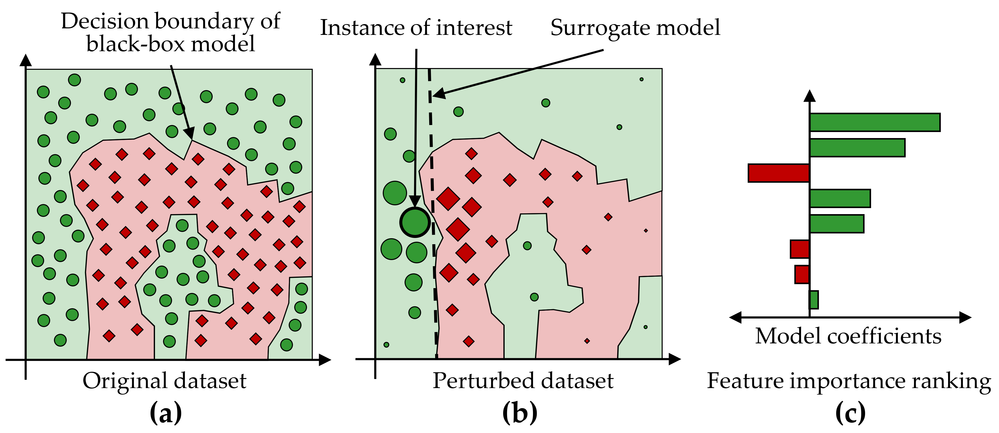
```

_Model-specific_ interpretation methods are limited to specific model families, while _model-agnostic_ interpretation methods can be applied to any model type.
Model-specific methods are based on model internals and are widely used for neural networks [@samek2020toward], e.g., layered relevance propagation [@bach2015pixel], which explicitly uses a neural network's layered structure to infer explanations.
In contrast, model-agnostic methods are decoupled from the actual learning process and do not have access to algorithmic internals.
Since they only consider the model's output, i.e., the predictions, most model-agnostic methods are also post-hoc.
For example, LIME is a representative of a model-agnostic, post-hoc interpretability method.

`r start_paragraph("SHAP.")` Closely related to LIME is the _Shapley Additive Explanations_ [@Lundberg:SHAP2017] (SHAP) framework, which derives additive feature attributions to a model's predictions.
SHAP is based on _Shapley values_ [@lipovetsky2001analysis; @vstrumbelj2014explaining; @shapley1953value], originally developed for game theory.
The term "additive" denotes that for a given observation, the model output should be equal to the sum of attributions over all features.
More specifically, for observation $x$, the model output $\zeta(x)$ is
\begin{equation}
\zeta(x)=\phi(\zeta,x)_0 + \sum_{j=1}^M \phi(\zeta,x)_j
(\#eq:shap-additivity)
\end{equation}

where $\phi(\zeta,x)_0=E(\zeta(x))$ is the expected value of the model over the training data, $\phi(\zeta,x)_j$ is the attribution of feature $j$ for $x$, and $M$ is the total number of features.
Then, for each combination of feature $j$ and observation $x$, the Shapely value $\phi$ represents the impact of each predictor being added, aggregated by a weighted average over all possible feature subsets $S\subseteq S_{all}$:

\begin{equation}
\phi_{j}(x)=\sum_{S\subseteq S_{all}\setminus\left\{j\right\}}\frac{|S|!(M-|S|-1)!}{M!}\left(\zeta_{S\cup{j}}(x)-\zeta_S(x)\right).
(\#eq:shapley)
\end{equation}

The SHAP feature importance estimates offer several practical properties:

* The sum of the feature attributions for an observation is equal to the difference between the model's average prediction and the actual prediction for that observation (_local accuracy_).
* If a feature is more important in one model than in another, regardless of which other features are also present, then the importance attributed to that feature should also be higher (_symmetry/monotonicity_).
* If a feature value is missing, the associated feature importance should be 0 (_missingness_).

Several approaches have been proposed to reduce the complexity of Shapley value estimation from exponential to polynomial time, including KernelSHAP [@Lundberg:SHAP2017], which works on any model type, and TreeShap [@Lundberg:TreeSHAP2019] for tree-based models.

<!-- @lundberg2020local -->

<!-- **INSERT REFERENCES FROM** -->
<!-- file:///E:/Dropbox/KMD/Data_Science_with_R/DataSciR/12_Interpretable_ML/12_Interpretable_ML.html#p63 -->

<!-- PB 16.11.2020 -->

<!-- Als Ihr dazu kamt, wussten wir anhand des von Euch aber auch anderen ausgewerteten Datensätzen schon, dass sich Tinnitusdistress durch unsere 7-tägige multimodale Therapie verbessert. Der primäre Outcome war also beschrieben. Klinisch war und ist klar, dass Tinnitusdistress bei depressiven Symptomen erhöht ist. Wir wussten aber nicht genau, in welchem (subklinischen) Maße Depression - als skundärrer outcome zum Tinnitusdistress beiträgt und wie sich die Therapie auf depressive Symptome auswirkt. Diese Fragen hast Du in dem im März bei Sci Rep. herausgekommen paper beantwortet. -->

<!-- Weiter wollten wir die bisher notwendige sehr große Anzahl bei Diagnostik vor und nach Therapie effizienter gestalten, deshalb folgte die Frage, ob wir Therapieeffekte auch über wenige, aber aussagekräftige Items abbilden können und in der Diagnostik darüber effizienter werden können (Antwort Plos One-paper). -->

<!-- Die Frage nach Patientenuntergruppen mit speziellen und möglichen unterschiedlichen Ansprüchen an Therapie ging in dieselbe Richtung individualisierte Therapie. Therapiebausteine effizienter und ausgewählter anbieten macht Sinn (cluster paper Sci Rep vom Oktober). -->

<!-- Die Frage nach dem Geschlecht  spezifiziert die große Strategie  individuelles Vorgehen in der Therapie. In großen Datensätzen fanden wir bei unseren Patienten keine Geschlechtsunterschiede vor und nach der Therapie; die wir aber an anderen Datensätzen schon zeigen konnten. Auch die Literatur lieferte unterschiedliche Aussagen. Du konntest mit dem Frontiers-Paper da zur Klärung beitragen. -->

<!-- ### Feature Selection -->

<!-- Generally, feature selection algorithms can be roughly divided into embedded methods, filter methods and wrapper methods. % -->
<!-- Intrinsic methods describe classification methods that internally handle feature selection during model training, e.g., tree- and rule-based classifiers and regularised methods like LASSO. % -->
<!-- Filter methods are classifier-independent and quantify the \textit{relevance} of a feature before model training by a scoring function. % -->
<!-- Popular filter approaches are Relief-based methods~\cite{Kira:Relief1992,Urbanowicz:Relief2018}, correlation-based feature selection~\cite{Hall:CFS2000} and simple statistical scores, e.g., p-value of $t$-test, chi-squared test or Wilcoxon signed-rank test. % -->
<!-- (Search-based) wrapper methods define a ``space'' of candidate feature sets. % -->
<!-- Each candidate feature set is evaluated by a search algorithm which is wrapped around the classifier. % -->
<!-- To prevent exhaustive search, the search algorithm usually utilises a heuristic to guide the search from the previous best feature set to next best candidate set. % -->
<!-- Well-known wrapper methods include simple forward/backward selection, recursive feature elimination~\cite{Guyon:RFE2003}, simulated annealing~\cite{Kirkpatrick:SA1983, VanLaarhoven:SA1987} and genetic algorithms~\cite{Mitchell:Genetic1998}. % -->
<!-- The novel feature selection mechanism that is used in this study can be categorised as wrapper method. % -->

<!-- TODO: BESSERE ÜBERLEITUNGs -->

`r start_paragraph("Feature Selection.")`
In Section&nbsp;\@ref(phenotypes-motivation), we discuss dimensionality reduction techniques and conclude that these methods can only be used to a limited extent since the original dimensions' semantics are lost during the projection.
An interpretation of the transformed data space in the application context is thus hardly possible. 
Feature selection (FS) can help with this limitation.
In the context of predictive modeling, FS methods reduce the number of predictors to either (a) maximize model performance or (b) affect model performance as little as possible. 
Some modeling families are sensitive to predictors that are irrelevant to the target feature, such as support vector machines [@Boser:SVM1992] and neural networks [@nnet; @Goodfellow:DL2016].
Others, such as linear and logistic regression models, are susceptible to correlated predictors.
Often domain experts require intrinsically interpretable models [@tonekaboni2019clinicians], which requires eliminating predictors that do not contribute substantially to the model performance.

Traditionally, FS methods are broadly classified into three categories: embedded, filter, and wrapper [@Guyon:RFE2003].
Embedded FS refers to internal mechanisms of modeling algorithms that evaluate the usefulness of features.
Examples of such algorithms include tree- and rule-based models [@Quinlan:C451993; @kuhn2013applied], regularization methods such as _least absolute shrinkage and selection operator_ [@lasso] (LASSO), and Ridge [@ridge] regression. 
Filtering methods rank predictors only once based on some measure of importance, e.g., correlation with the target feature. 
<!-- Fast and simple; tends to oversample predictors. -->
Popular examples include correlation-based feature selection [@Hall:CFS2000] (cf. the application in Section&nbsp;\@ref(evo-concept-feature-selection)) and Relief [@kira1992feature].
Wrapper methods rank and refine candidate feature subsets through an iterative search driven by model performance.
Examples include sequential forward search, recursive backward elimination, and genetic search [@chandrashekar2014survey].

<!-- In contrast to the above-mentioned methods which assess the importance of predictors before or during model training, post-hoc approaches aim to elucidate the importance of the predictors of a complex "black-box" model after it has been built. -->
<!-- Individual predictor attributions and interaction effects between multipel predictors towards the model decisions are quantified on a global level (i.e., across all observations) and/or a local level (i.e. for a specific observation of interest). -->
<!-- Popular approaches include LIME [@RibeiroEtAl:KDD2016], SHAP [@Lundberg:SHAP2017, lundberg2020local], Anchors [@ribeiro2018anchors], permutation-based Model Reliance [@Fisher:ModelReliance2019], Accumulated Local Effects (ALE) plots [@apley2019visualizing] and Friedman's $H$-statistic [@Friedman:H-statistic2008]. -->
<!-- SHAP has been applied to the medical domain. -->
<!-- For example, in [@lundberg2020local] the authors of SHAP showcase their method on three medical datasets to identify mortality risk factors in the US population, distinct subpopulations with shared risk characteristics, interaction effects among risk factors for chronic kidney disease and features that are degrading the performance of a model deployed in a hospital over time. -->
<!-- The same authors used SHAP to explain the patient- and surgery-specific factors that led to the risk of hypoxaemia during anaesthesia care  [@lundberg2018explainable]. -->
<!-- In \cite{Niemann:PONE2020}, we used SHAP to explain the reasoning of a model that predicts tinnitus-related distress from self-report questionnaire answers by ranking predictors by their global importance, depicting patient-individual predictor attribution distributions and to find patient subgroups by similar feature attribution patterns. -->

## Overview of the Mining Workflow {#iml-workflow}

In this section, we describe the four components of our mining workflow, which are:

1. Data augmentation, including the construction of new features and correlation analysis between features (Section&nbsp;\@ref(iml-workflow-data-augmentation)),
2. Modeling of the learning task (Section&nbsp;\@ref(iml-workflow-modeling)),
3. Interleaving model training and feature elimination (Section&nbsp;\@ref(iml-workflow-fe)), and
4. Post-hoc analysis of the learned models (Section&nbsp;\@ref(iml-workflow-iml)).

### Data Augmentation {#iml-workflow-data-augmentation}

To increase model performance, manual derivation of predictive features (feature engineering) is required in many applications (recall the evolution features presented in Chapter&nbsp;\@ref(evo)). 
For example, with image data, a general approach is first to derive descriptive features and transform the data into a tabular format to use off-the-shelve classifiers.
Therefore, we derive predictive features from image data in the first step of our workflow.
We also explore correlations between the (derived) predictors as a step of exploratory data analysis.

### Modeling of the Learning Task {#iml-workflow-modeling}

In order not to be limited to a particular classification algorithm but to create a model with the highest possible predictive power, we examine a total of eleven classifiers: 

- Least absolute shrinkage and selection operator [@lasso] (_LASSO_) and _Ridge_ [@ridge] are extensions of ordinary least squares (OLS) regression that perform feature selection and regularization to improve both predictive performance and interpretability.
For a dataset with $n$ observations, $p$ predictor features and a target $y$, the objective of LASSO and Ridge is to solve
\begin{equation}
\underset{\beta}{\text{argmin}} \underbrace{\sum_{i=1}^n \left( y_i - \left( \beta_0 + \sum_{j=1}^p x_{ij}\beta_j \right) \right)^2}_{\text{Residual Sum of Squares}} + \alpha \lambda \underbrace{\sum_{j=1}^p |\beta_j|}_{\text{L1 Penalty}} + (1-\alpha) \lambda \underbrace{\sum_{j=1}^p \beta_j^2}_{\text{L2 Penalty}}
(\#eq:regression-with-shrinkage)
\end{equation}
where $\beta$ are the to be determined model coefficients, and $\lambda$ is a tuning hyperparameter that controls the amount of regularization.
LASSO uses the L1 norm penalty term, i.e., $\alpha$ = 1, which "shrinks" the coefficients' absolute values, often forcing some of them to be exactly equal to 0.
Ridge uses the L2 norm penalty term, i.e., $\alpha = 0$, which shrinks the coefficient magnitudes.
In general, LASSO performs better than Ridge when there is a relatively small number of predictors with substantial coefficients and the remaining predictors have coefficients that are close or equal to zero. 
Ridge performs better in settings where the response depends on many predictors, each with approximately equal importance. 
From the perspective of interpretability, LASSO has the advantage of producing sparser models by reducing the values of some of the predictors' coefficients to exactly zero. 
- Partial least squares is another derivative of OLS regression, which first performs a projection to extract latent variables that capture as much variability among the predictors as possible while modeling the response well.
A linear regression is then fit on a preferably small number of latent features from this projection.
We use the generalized partial least squares (_GPLS_) implementation from Ding and Gentleman [@DingEtAl:GPLS2005].
<!-- accounts for multinomial logit classification scenarios -->
- A support vector machine (_SVM_) [@Boser:SVM1992] learns linear or non-linear decision boundaries in the feature space to separate the classes.
The decision boundary is represented by the training observations that are most difficult to classify, i.e., the _support vectors_.
The goal is to find the _maximum margin hyperplane_, i.e., the separating hyperplane with the maximum margin to the support vectors. 
In case a linear decision boundary does not exist, non-linear SVM approaches can be used, which apply the so-called _kernel trick_ to transform the original feature space into a new, higher-dimensional space in which a linear hyperplane can be found to separate the classes.
- An artificial neural network (_NNET_) consists of a structure of nodes connected by directed edges.
Each node performs a basic unit of computation.
Nodes are supplied by data values that are passed over via incoming edges from other nodes.
Each edge holds a weight that controls the impact on the node to which it forwards values.
The main goal of a NNET is to adjust the weights of the edges such that the relationship between predictors and response in the underlying data is represented.
Neural networks extract new useful features from the original predictors that are relevant for classification.
By combining interconnected nodes to complex predictive features, NNETs can extract more classification-relevant feature sets compared to expert-driven feature engineering or dimension reduction techniques.
NNETs have undergone widespread adoption in the last decade and led to various success stories in computer vision and natural language processing [@Goodfellow:DL2016]. We used a feed-forward NNET with one intermediary layer (_hidden unit_) [@nnet].
- Weighted k-nearest neighbor [@Hechenbichler:wknn2004] (_WKNN_) is a variant of KNN classification.
To classify an observation with an unknown response value, the k _nearest_ training observations are identified, and the modus of their response values are used as the prediction.
The proximity between observations is quantified by a distance measure such as Euclidean distance.
Whereas in ordinary KNN, all neighbors have equal influence on the prediction, weighted KNN considers the actual distance magnitudes.
As a result, WKNN assigns weights to training observations that are inversely proportional to their distance from the observation being classified.
- A Na&iuml;ve Bayes classifier (_NB_) uses Bayes' theorem to calculate class membership probabilities.
<!-- \"i -->
The naive property refers to the assumption of class-conditional independence among the predictors, which is employed to reduce computational complexity and obtain more reliable class-conditional probability estimates.
- Classification and regression trees [@BreimanEtAl:CART1984] (CART),
C5.0 [@Quinlan:C451993],
random forests [@Breiman:RandomForests2001] (RF) and
gradient boosted trees (GBT) [@Friedman:PDP2001] are tree-based models.
Algorithms from this model family partition the predictor space into a set of non-overlapping hyperrectangles based on combinations of predictor-value conditions, such as "IF age \> 52 \& body-mass index \< 25".
A new observation is classified based on the majority class of training data associated with the hyperrectangle to which it belongs.
Random forests and gradient boosted trees are ensembles of different decision trees, with each tree casting a vote for the final prediction.
In a random forest, the base trees are created independently.
In a gradient boosted model, the base trees are constructed and added to the composite model so that any new tree reduces the error of the current set of trees.

`r start_paragraph("Classifier evaluation and hyperparameter tuning.")` 
We use 10-fold stratified cross-validation (CV) for classifier evaluation.
In k-fold CV, the observations are split into k disjunct partitions.
Each partition serves once as the test set for a model trained on the remainder of the partitions.
The k performance estimates are aggregated to obtain an overall performance score.
We performed a grid search for hyperparameter selection (cf. Table&nbsp;\@ref(tab:08-hyper-tab)).
Because the three applications have dichotomous responses with different skew, accuracy might be inappropriate to estimate generalization performance.
Instead, we used the area under the receiver operating characteristic curve (AUC) as the performance measure. 
A receiver operating characteristic curve (ROC) shows the relationship between sensitivity (true positive rate (TPR)) and false positive rate (FPR) for a binary classifier.
The area under the ROC curve (AUC) takes values from 0 (0% TPR, 100% FPR) to 1 (100% TPR, 0 %FPR).
A higher AUC suggests that the classifier is better at separating the classes.

(ref:08-hyper-tab) **Overview of hyperparameter tuning grid.** All classifiers were implemented with the statistical programming language R [@rlanguage] using the package `mlr` [@Bischl:mlr2016], which provides a uniform interface to the listed machine learning algorithms from other R packages. A grid search was used to tune the hyperparameters using area under the ROC curve (AUC) as the evaluation measure. The table provides an overview of each classifier, including the R package used, the tuned hyperparameters, and their value ranges. All other hyperparameters were set to default values. \* = {linear, polynomial, radial, sigmoid}

```{r 08-hyper-tab, echo=FALSE}
`%>%` <- dplyr::`%>%`
tibble::tribble(
  ~algo, ~hyper, ~min, ~max, ~num_values,
  "LASSO, Ridge (`glmnet` [@lasso])", "`lambda`", "10^-2^", "10^10^", "100",
  "GPLS (`caret` [@caret])", "`ncomp`", "1", "5", "5",
  "SVM (`e1071` [@e1071])", "`cost`", "0.01", "3", "6",
  "", "`gamma`", "0", "3", "4",
  "", "`kernel`", "--", "--", "4\\*",
  "NNET (`nnet` [@nnet])", "`size`", "1", "13", "7",
  "", "`decay`", "10^-4^", "1", "6",
  "WKNN (`kknn` [@Hechenbichler:wknn2004])", "`k`", "1", "77", "20",
  "NB (`e1071` [@e1071])", "`laplace`", "1", "5", "5",
  "CART (`rpart` [@rpart])", "`cp`", "0.001", "0.1", "5",
  "C5.0 (`C50` [@c50])", "`CF`", "0", "0.35", "7",
  "", "`winnow`", "`FALSE`", "`TRUE`", "2",
  "", "`rules`", "`FALSE`", "`TRUE`", "2",
  "RF (`ranger` [@ranger])", "`mtry`", "4", "100", "7",
  "", "`min.node.size`", "1", "25", "6",
  "GBT (`xgboost` [@xgboost])", "`eta`", "0.01", "0.4", "4",
  "", "`max_depth`", "1", "3", "3",
  "", "`colsample_bytree`", "0.2", "1", "5",
  "", "`min_child_weight`", "0.5", "2", "3",
  "", "`subsample`", "0.2", "1", "3",
  "", "`nrounds`", "50", "250", "3",
  ) %>%
  purrr::set_names(c("**Algorithm (R package)**", "**Parameter**", "**Min.**", "**Max.**", "**No. of values**")) %>%
  kableExtra::kbl(
    escape = TRUE, booktabs = TRUE, linesep = "",
                  caption = "(ref:08-hyper-tab)",
    format = "markdown"
    ) #%>%
  # kableExtra::add_footnote(label = c("* = {linear, polynomial, radial, sigmoid}"), notation = "symbol")
```

### Iterative Feature Elimination {#iml-workflow-fe}

<!-- Although some of the utilized classification algorithms are insensitive to a high number of features, there are several reasons to remove superfluous predictors. -->
<!-- For example, the selection of a feature subset contributes to the prevention of overfitting, the avoidance of multicollinearity and the identification of a model with good tradeoff between high predictive performance and low complexity, i.e., a low number of features. -->

<!-- https://stats.stackexchange.com/questions/450703/is-feature-importance-in-random-forest-useless -->

We employ a feature selection wrapper that successively eliminates a subset of predictors that do not _positively_ contribute to a model's performance.
A predictor's contribution is computed using _model reliance_ [@Fisher:ModelReliance2019], which is a generalization of random forest permutation feature importance [@Breiman:RandomForests2001].
Model reliance estimates the merit of a predictor $f$ toward a model $\zeta$ by comparing the classification error of $\zeta$ on the original training set $\mathbf{X}_{orig}$ with the classification error of $\zeta$ on a modified version of the training set $\mathbf{X}_{perm}$ where the values of $f$ are randomly permuted.
Shuffling a predictor's values removes any relationship between the predictor and the target variable. 
Hence, it is assumed that permuting a more important predictor leads to a higher decrease in accuracy as opposed to a predictor with a lower model contribution.

The model reliance $MR$ of a model $\zeta$ on a predictor $f\in F$ is calculated as

\begin{equation}
MR(f,\zeta) = \frac{CE(y,\zeta(\mathbf{X}_{perm}))}{CE(y,\zeta(\mathbf{X}_{orig}))}
(\#eq:model-reliance)
\end{equation}

where $CE$ is the classification error function that takes the true class labels $y$ and a vector of predicted class labels and returns the fraction of incorrectly classified observations.
A high MR score represents a high dependence of the model on $f$, since shuffling the values of $f$ increases the classification error.
Conversely, a $MR$ score smaller than 1 suggests that $f$ is potentially adversarial to the model performance, and its removal could increase model performance. Thus, our feature elimination wrapper starts by training a model on the full set of predictors, followed by an iterative step where the subset of adversarial predictors according to model reliance is removed, and a new model on the remaining predictors is trained.
In the first iteration $i$ = 1, an initial model $\zeta_1$ is calculated on the full set of predictors $F_1 = F$.
For each predictor $f \in F_i$, the model reliance $MR(f,\zeta_i)$ is calculated.
Predictors with $f\in F_i:MR(f,\zeta_i)>1$ are kept for iteration $i$ + 1 while the remaining predictors are removed.
This procedure is repeated until all $MR$ are smaller or equal to 1, i.e., $\forall f \in F_i: MR(f,\zeta_i) \leq 1$, or $F_{i+1} = F_i$.
As random feature permutation introduces some statistical variability, we compute mean $MR$ over 10 runs to obtain a more stable estimate.

### Post-Hoc Interpretation {#iml-workflow-iml}

`r start_paragraph("SHAP.")` To facilitate model interpretation, we use the model-agnostic post-hoc framework SHAP [@Lundberg:SHAP2017; @Lundberg:TreeSHAP2019] to assess feature importance for the CHA data.
Briefly, the SHAP value $\phi_f(\zeta,x)$ expresses the estimated importance of a feature $f$ to the prediction of model $\zeta$ for an instance $x$ as the change in the expected value of the prediction if for $f$ the feature vector of $x$ is observed instead of being random.
The SHAP framework composes the model prediction as the sum of SHAP values of each feature, i.e.,  $\zeta(x)=\phi_0(\zeta,x)+\sum_{i=1}^M \phi_i(\zeta,x)$, where $\phi_0(\zeta,x)$ is the expected value of the model (bias), and $M$ is the number of features.

SHAP values are calculated for the best model $\zeta_{opt}$ according to AUC.
A ranking of each feature's attribution towards $\zeta_{opt}$ is determined by calculating the average SHAP value magnitude over all instances, i.e., $A(j)=\sum_{i=1}^N |\phi_j(\zeta_{opt},x)|$,
where $A(j)$ is the attribution of the $j$-th feature.
The $N\times M$ SHAP matrix is clustered with agglomerative hierarchical clustering to identify subgroups of patients with similar SHAP values.

`r start_paragraph("PDP feature importance.")` We derive a _global_ feature importance measure from the PD of a predictor.
We assume that predictors with high PD variability are important.
Consider the two PD curves in Figure&nbsp;\@ref(fig:08-pd-intro-2): the predicted response changes considerably with different predictor values for the blue PD curve, whereas the green PD curve is a flat line.
Therefore, the predictor with the blue PD curve should have a higher importance score than the predictor with the green PD curve.
We define partial dependence importance $I$ of a predictor $f$ as the average of the magnitude of differences between consecutive values along the distribution of $f$, i.e.,

\begin{equation}
I_f = \frac{1}{k-1}\sum_{i}^{k-1} |PD(Q=s_i) - PD(Q=s_{i+1})|
(\#eq:pdp-imp)
\end{equation}

where $k$ is the number of (sampled) values from the distribution of $f$.
<!-- and $\forall i,j>i: s_i < s_{j}$.  -->

(ref:08-pd-intro-2) **Illustration of partial dependence importance.** Partial dependence importance \(I_f\) for two exemplary PD curves.

```{r 08-pd-intro-2, echo=FALSE, fig.align='center', out.width="100%", fig.cap="(ref:08-pd-intro-2)"}
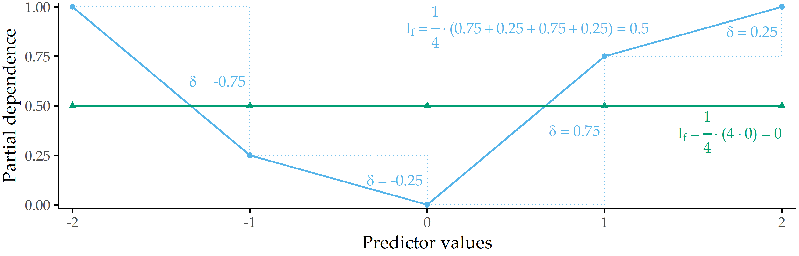
```


<!-- Originally developed for gradient boosting, the concept of a PDP has been adopted to various other model families, for example **TODO (ggrandomforests)**. -->

<!-- **Discussion:** -->
<!-- PD assumes that the features in $Q$ are uncorrelated with the features in $R$. -->
<!-- In case this assumption is violated, the calculated averages are partially based on unlikely or even impossible feature value combinations. -->

<!-- For classification where the machine learning model outputs probabilities, the partial dependence plot displays the probability for a certain class given different values for feature(s) in S. An easy way to deal with multiple classes is to draw one line or plot per class. -->

<!-- **What did WE do?** -->

<!-- **goldstein: ice** -->

## Validation on Three Datasets {#iml-validation}

We validate our workflow on three datasets: 

- _CHA-Tinnitus_: CHA data (recall Section&nbsp;\@ref(background-data-cha)) with tinnitus-related distress at baseline (T0) as target variable,
- _CHA-Depression_: CHA data with depression after treatment (T1) as target variable, and
- _ANEUR_: ANEUR data (Section&nbsp;\@ref(background-data-aneur)) with rupture status as the target variable. 

Figure&nbsp;\@ref(fig:08-iml-workflow) illustrates our workflow adapted to the datasets. 

(ref:08-iml-workflow) **The (dataset-specific) mining workflow.** For the CHA dataset, we select patients with complete data for each of the two classification tasks. For ANEUR, we segment the aneurysms from the raw image data, perform automated centerline and neck curve extraction, and generate the morphological features. We perform correlation analysis to identify relevant correlations between predictors, correlations between predictors and response, and significant differences in correlation between predictors and response between T0 and T1. We embed model training in an iterative feature elimination wrapper that retains predictors identified as important to the model. We select the best overall model based on AUC and used post-hoc interpretation methods to identify predictors with the highest attribution to the model prediction on a global, subpopulation and observation level.

```{r 08-iml-workflow, echo=FALSE, fig.align='center', out.width="100%", fig.cap="(ref:08-iml-workflow)"}
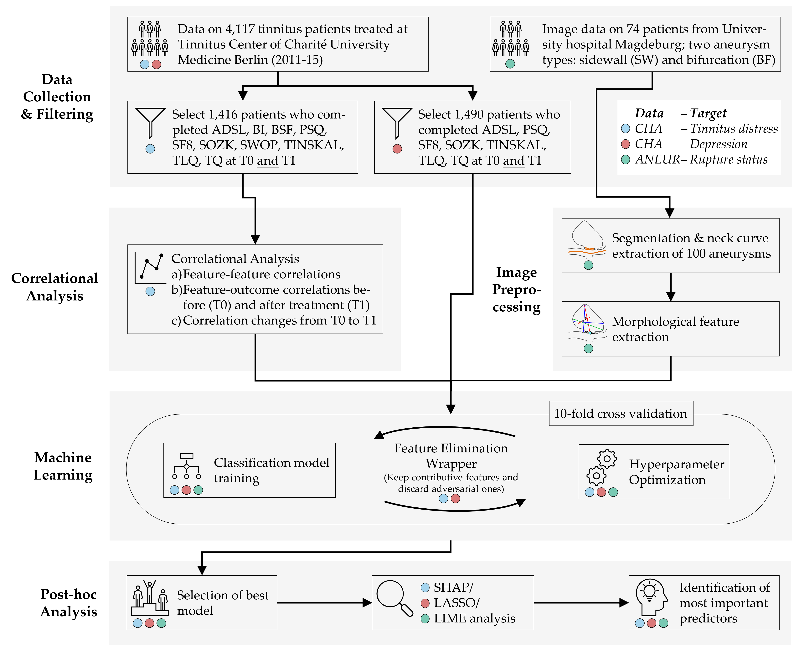
```

Hereafter, we report our results on all three learning tasks, i.e., regarding CHA-Tinnitus (Section&nbsp;\@ref(iml-results-tinnitus)), 
CHA-Depression (Section&nbsp;\@ref(iml-results-depression)) and 
ANEUR (Section&nbsp;\@ref(iml-results-aneur)).

### Results for CHA-Tinnitus {#iml-results-tinnitus}

`r start_paragraph("The learning problem.")`
We use baseline (T0) data to predict the tinnitus patients' distress at the end of the therapy (T1).
We derive our target variable TQ\_distress from the total score of "the Tinnitus Questionnaire" [@GoebelHiller:TF1998]. 
The mean tinnitus-related distress score decreased between T0 to T1 from 38.3 &plusmn; 17.1 to 31.7 &plusmn; 17.2, indicating a positive effect of the multimodal treatment.
We apply the cutoff at 46 suggested by Goebel and Hiller [@GoebelHiller:TF1998] to distinguish between patients with _compensated_ or _decompensated_ tinnitus. 

`r start_paragraph("Correlational analysis.")` We calculate the Spearman correlation coefficient between each pair of predictors.
Using agglomerative hierarchical clustering with complete linkage, we arrange predictors in a correlation heat map visually identify predictor subgroups with similar intra-group and inter-group correlations.
We calculate the median correlation between the response and the predictors from the same questionnaire at T0 and T1 to obtain potential candidate predictors important in the later modeling step.
Also, we identify predictors with the highest absolute correlation with the response at T0 and T1, respectively.
Finally, we examine predictors whose correlation values with the TQ distress score differ most between T0 and T1.
Figure \@ref(fig:08-cor)&nbsp;(a) shows all pairwise correlations among the predictors in T0.
We identified two major subgroups with moderate to high intra-group correlations and low or negative inter-group correlations.
The larger group (cf. upper black square in Figure \@ref(fig:08-cor)&nbsp;(a)) comprises 114 predictors (ca. 55.6%) representing negatively worded items and scores where higher values represent a higher disease burden, e.g., the ADSL\_depression and BI\_overallcomplaints.
Consequently, the smaller group (cf. lower black square in Figure \@ref(fig:08-cor)&nbsp;(a)) contains 47 predictors (ca. 22.9%) with positive wording, e.g., the SF8 mental health score (SF8\_mentalhealth) and the BSF elevated mood score (BSF\_elevatedmood).
Predictors of one of the two subgroups exhibit a moderate to high negative correlation with the other subgroup predictors.
<!-- For the subsequent classification, these highly correlated and thus redundant  features all victim to the feature selection wrapper.   -->
<!-- Consequently, removing redundant features for classification reduces multicollinearity and potentially increases the effectiveness of the trained models.}  -->
Figure \@ref(fig:08-cor)&nbsp;(b) compares the correlation of the predictors with  TQ\_distress before (x-axis) and after treatment (y-axis).
Overall, only low to moderate bivariate correlations are observed, as all values are between -0.6 and +0.6.
The average absolute correlation change between T0 and T1 is 0.031.
The change in absolute correlation is smaller than 0.067 for ca. 95% of the predictors (compare the distance of the points to the diagonal line in Figure \@ref(fig:08-cor)&nbsp;(b)).
For 137 out of 205 predictors (66.8\%), absolute correlation decreased from T0 to T1.
Median target-correlations of the questionnaires ADSL, BSF, and BI (SF8) are greater (smaller) than +0.3 (-0.3) at both moments, respectively, and thus greater than for the remaining questionnaires.
Figures \@ref(fig:08-cor)&nbsp;(c) and (d) reveal that predictors from ADSL, BSF, BI, SF8, TINSKAL, and PSQ are among the top 20 predictors ranked by absolute correlation with TQ\_distress in T0 and T1.
The general depression score ADSL\_depression shows the largest correlation magnitude before (\(\rho\) = 0.630) and after treatment (\(\rho\) = 0.564).
Figure \@ref(fig:08-cor)&nbsp;(e) shows the ten predictors with the largest differences in correlation magnitudes between T0 and T1.
Correlation before treatment is larger for each of these predictors.

(ref:08-cor) **Spearman correlation among predictors and correlation of predictors with TQ_distress in T0 and T1.** (a) The heatmap depicts the correlation coefficients for all pairs of predictors in T0. Predictors are arranged by the result of agglomerative hierarchical clustering with complete linkage. The two black squares depict two major subgroups of correlated predictors. (b) The relationship between each predictor with TQ_distress in T0 (x-axis) and T1 (y-axis). The diamond symbol represents the median correlation of the predictors from the same questionnaire. (c) Top 20 predictors that exhibit the highest absolute correlation with TQ_distress in T0. (d) Top 20 predictors which exhibit the highest absolute correlation with TQ_distress in T1. (e) Top 10 predictors with the highest change in absolute correlation with TQ_distress from T0 to T1.

```{r 08-cor, echo=FALSE, fig.align='center', out.width="100%", fig.cap="(ref:08-cor)"}
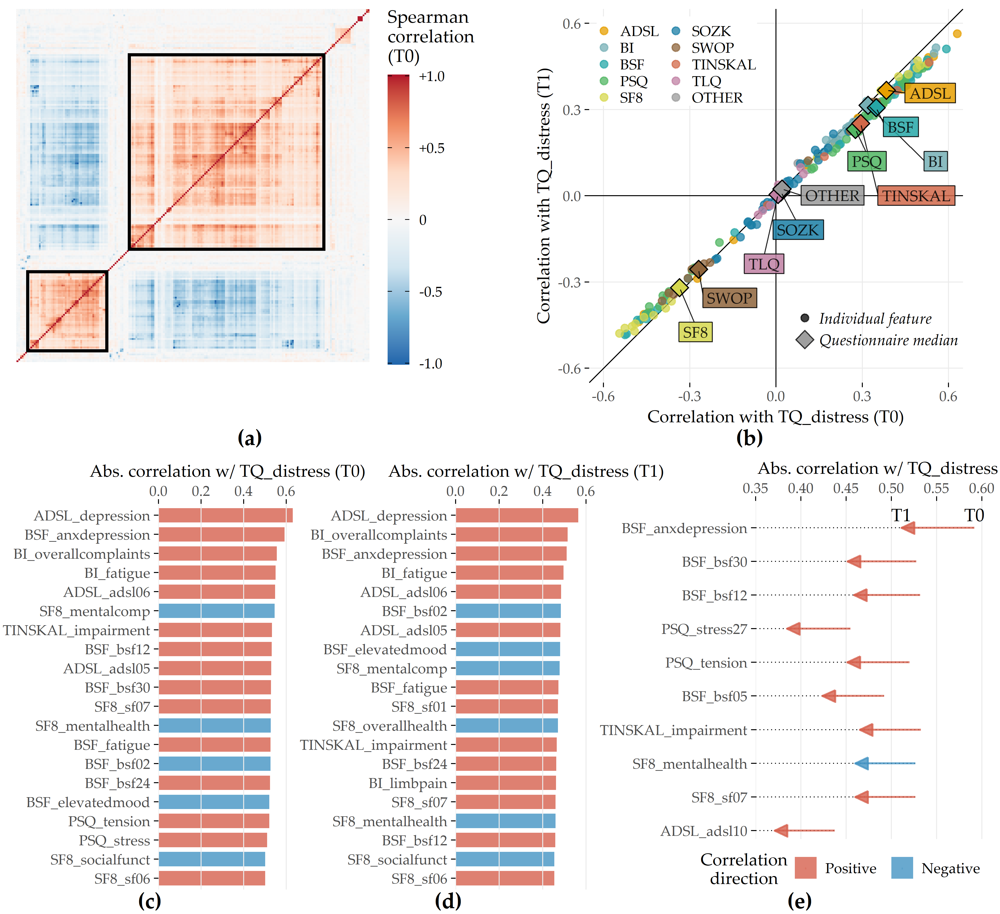
```

`r start_paragraph("Predictive performance of classification models.")` The performances of all 11 classifiers across each feature elimination iterations are shown in Figure&nbsp;\@ref(fig:08-results-pone).
The gradient boosted trees model (GBT) yields highest AUC (iteration i = 7, AUC = 0.890 &plusmn; 0.04; mean &plusmn; SD), using only 26 predictors (ca. 13%).
<!-- % (cf.~\nameref{appendix:features-best}).  -->
The RIDGE classifier achieves second-best performance (i = 2, AUC: 0.876 &plusmn; 0.05), relying on 127 features, followed by the random forest model (i = 3, AUC: 0.872 &plusmn; 0.05) using 77 features.
Classification using the best model (GBT, i = 7) based on a probability threshold of 0.5 result in an accuracy of 0.86, a true positive rate (sensitivity) of 0.72, a true negative rate (specificity) of 0.88, a precision of 0.48, and a negative predictive value of 0.95.

(ref:08-results-pone) **Classification results for CHA-Tinnitus**. Average cross-validation AUC and relative number of retained predictors for each classifier with optimal hyperparameter configuration and each feature selection iteration. Yellow ribbons depict standard deviation. Points highlight each classifier's run with maximum AUC. Classifiers are ordered by their maximum AUC from left to right.

<!-- All methods induced at least one model with AUC of -->
<!-- 0.790 or higher. Cells with a "/" indicate that the feature elimination wrapper had already been terminated after a previous iteration. -->

```{r 08-results-pone, echo=FALSE, fig.align='center', out.width="100%", fig.cap="(ref:08-results-pone)"}
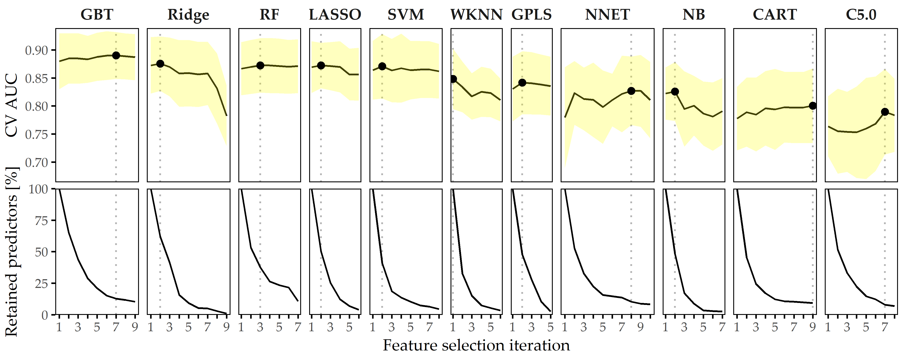
```

When trained using a smaller feature space, each classifier generates at least one model with similar or even improved performance compared to the respective model learned on the whole set of predictors.
In fact, except for WKNN, all classification methods benefit from feature elimination as they produce their best model on a predictor subset (cf. Figure&nbsp;\@ref(fig:08-results-pone)).
For GBT, the gain in AUC from 185 features to 26 features (i = 11) is 0.01.
This model achieves both maximum AUC and a good tradeoff between high predictive performance and low model complexity, and therefore, we decide to investigate this model further.

`r start_paragraph("Feature importance.")` For the best model, the attributions of the 26 selected features are shown in Figure \@ref(fig:08-tq-xgboost)&nbsp;(a).
Among the 26 features are 6 compound scores, 12 single items, 4 demographic features (number of visited doctors, university-level education, lower secondary education, tinnitus duration), and 4 features measuring the average time spent completing an item.
The TINSKAL tinnitus impairment score (TINSKAL\_impairment) represents the predictor with the highest model attribution as it exhibits the highest average absolute SHAP value (change in log odds) of 0.448.
The ADSL depression score (ADSL\_depression) and a single question from ADSL (ADSL\_adsl11: _"During the past week my sleep was restless."_) are ranked second and third most important, respectively.
Remarkably, from each of the 9 questionnaires, at least 1 feature is selected.
Figure \@ref(fig:08-tq-xgboost)&nbsp;(b) shows the patient-individual SHAP values for each predictor, where point color depicts predictor value magnitude.
The high attribution of TINSKAL\_impairment is highlighted by the high range of the SHAP value distribution.
For this predictor, high values generally correspond to an increased predicted probability of tinnitus decompensation.
However, this trend is non-linear since small values (light green to yellow) are associated with a SHAP value just slightly smaller than or equal to 0.
Moreover, there is a large spread in SHAP value between ca. 0.7 and 1.2 for patients with high TINSKAL\_impairment values, unlike the somewhat more dense bulk of points representing patients with SHAP values between ca. -0.7 and -0.4.
This could indicate that patients who report high tinnitus impairment are more challenging to classify.
Further, it may suggest that visual analog scales are not robust enough to quantify tinnitus-related distress.
This inference is supported by the SHAP feature dependence plot in \@ref(fig:08-tq-xgboost-shap-per-feature)&nbsp;(1), which juxtaposes the predictor's actual values with the corresponding SHAP values for all patients and reveals a J-shaped relationship between them. 
More specifically, the predicted tinnitus-related distress decreases from 0 to 2.5, remains at a plateau from 2.5 to 4 and increases from 4 to its maximum value of 10.
Besides TINSKAL\_impairment, the features ADSL\_depression, TINSKAL\_loudness, BI\_overallcomplaints, BSF\_timestamp, and SWOP\_pessimism also show a non-linear relationship with respect to their SHAP values.

<!-- The long right tails in the summaryplot are from rare but high-magnitude risk factors.  -->

<!-- **TODO: (c) x-axis: Patients, arranged by explanation similarity** -->

(ref:08-tq-xgboost) **SHAP analysis results for the best model (GBT, feature elimination iteration i = 7)**. (a) Global feature importance based on the mean absolute SHAP magnitude over all observations. Values depict the absolute change in log odds where higher values indicate higher feature attribution towards the model. (b) Patient-individual SHAP values. A point represents the SHAP value of the predictor (y-axis) for an individual patient. The further afar a point from the vertical 0-baseline, the larger the attribution of the corresponding predictor value to the model prediction. Vertically offset points depict high-density regions (similar to a violin plot), i.e., there are more patients with similar SHAP values. Actual predictor values are mapped to point color. (c) Stacked patient-individual SHAP values for the six predictors with the highest mean absolute SHAP values. Patients are ordered according to hierarchical clustering with Ward linkage. Black horizontal lines depict the average sum of SHAP values of the cluster members for k = 5 clusters. The inset plot shows that the Bayesian information criterion (BIC) is minimal for this number of clusters.

```{r 08-tq-xgboost, echo=FALSE, fig.align='center', out.width="100%", fig.cap="(ref:08-tq-xgboost)"}
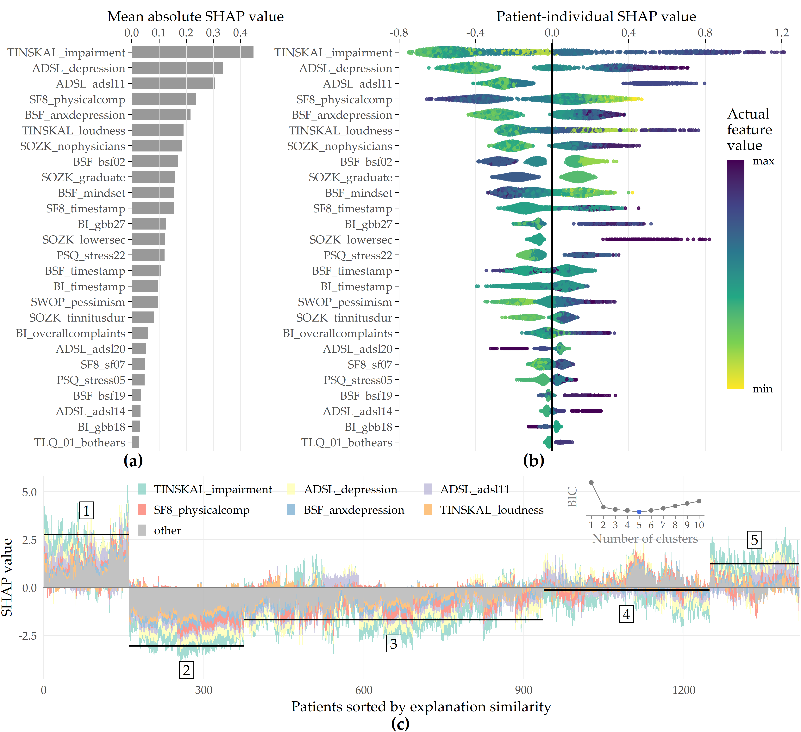
```

(ref:08-tq-xgboost-shap-per-feature) **SHAP feature dependence.** The relationship between the actual values of a predictor (x-axis) and corresponding SHAP values (y-axis) is shown as points representing a patient and as locally weighted scatterplot smoothing (LOWESS) [@Cleveland:LOWESS1981] curves indicating the overall trend. Predictors are ordered by mean absolute SHAP value (see Figure&nbsp;\@ref(fig:08-tq-xgboost)&nbsp;(a)). Gray histograms and bar charts depict the distributions of the predictors.

<!-- todo: ncol = 4 statt 5 -->

```{r 08-tq-xgboost-shap-per-feature, echo=FALSE, fig.align='center', out.width="100%", fig.cap="(ref:08-tq-xgboost-shap-per-feature)"}
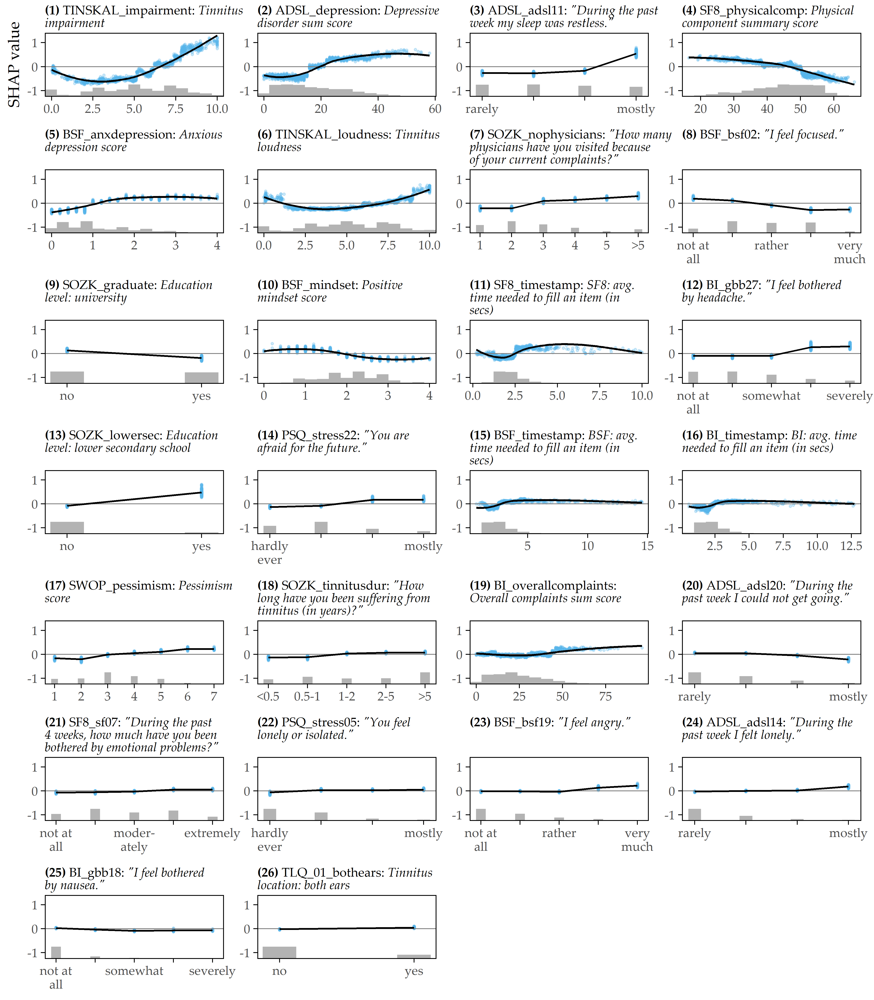
```

Even though several predictors exhibit only a low to moderate global importance, some have a high attribution towards model prediction for specific subgroups.
For example, considering SOZK\_lowersec, patients with lower secondary education have an average SHAP value of +0.5, whereas patients with different education levels have an average SHAP value of -0.1 and hence are closer to the population average (cf. Figure \@ref(fig:08-tq-xgboost)&nbsp;(b), Figure \@ref(fig:08-tq-xgboost-shap-per-feature)&nbsp;(13)).
Most features show a monotonic relationship between actual values and SHAP values.
For example, increasing values of the SF8 physical component score (SF8\_physicalcomp) exhibit decreasing likelihood of predicted decompensated tinnitus with increasing physical health (cf. Figure \@ref(fig:08-tq-xgboost)&nbsp;(b), Figure \@ref(fig:08-tq-xgboost-shap-per-feature)&nbsp;(14)).

To investigate whether there are subgroups of patients with similar model explanations, we cluster the patients based on their SHAP values.
Figure \@ref(fig:08-tq-xgboost)&nbsp;(c) shows stacked patient-individual SHAP values for the six predictors with the highest average absolute SHAP values and the remaining predictors combined.
According to the Bayesian information criterion (cf. inset plot in Figure \@ref(fig:08-tq-xgboost)&nbsp;(c)), the optimal number of patients clusters with similar SHAP value patterns is 5.
Clusters 1 and 5 comprise subgroups where the sum of SHAP values over all predictors is positive; see the horizontal lines in Figure \@ref(fig:08-tq-xgboost)&nbsp;(c).
Hence, these patients are more likely to be predicted with decompensated tinnitus.

In comparison with the other subgroups, patients of clusters 1 and 5 reported higher degrees of tinnitus impairment, depression, anxiety, tinnitus loudness, sleeplessness, pessimism, psychosomatic complaints, and perceived levels of stress and social isolation. 
In general, patients of cluster 1 have slightly higher values across all predictors than patients of cluster 2. 
Also, cluster 1 contains a higher fraction of patients with lower secondary education ("Hauptschule"), report more frequently occurring headaches, higher levels of fears for the future, and a longer tinnitus duration.
Cluster 3 is the largest subgroup comprising 39.6% of all patients.
Together with cluster 2, these subgroups have the lowest predicted probability of tinnitus decomposition.
Patients of cluster 2 and 3 report the highest physical health and levels of determination.
Cluster 4 is somewhat close to the prediction average, which means that positive and negative SHAP values nearly even out.
Concerning the average patient-sum of SHAP values, cluster 3 lies in between cluster 2 and cluster 4.
<!-- df_facet %>% select(.id, feature, actual_value) %>% inner_join(df_order %>% select(.id, cluster = hc_cluster), by = ".id") %>% mutate(cluster = as.factor(cluster)) %>% ggplot(aes(cluster, actual_value)) + geom_violin() + geom_boxplot(alpha = 0.5) + facet_wrap(~ feature, scales = "free_y") -->

### Results for CHA-Depression {#iml-results-depression}

`r start_paragraph("The learning problem.")`
We use baseline (T0) data to classify the tinnitus patients' depression severity.
We derive our target variable from the total score of the _General Depression Scale_ [@Radloff:adsl1977; @Hautzinger:ADSL2003] (ADSL).
The mean depression score at T0 is 18.2 &plusmn; 11.7.
Our target variable "depression status" is the dichotomized ADSL score.
Following the recommendation of Hautzinger and Bailer [@Hautzinger:ADSL2003], we distinguish between patients with _subclinical_ (0-15) or _clinical_ (16-60) depression. 

`r start_paragraph("Predictive performance of classification models.")`
Figure&nbsp;\@ref(fig:08-results-srep) depicts the performance of all classification methods across iterations.
The LASSO classifier achieves maximum AUC over all classification algorithms (iteration i = 1, AUC = 0.867 &plusmn; 0.037; mean &plusmn; SD), followed by Ridge (i = 1, AUC = 0.864 &plusmn; 0.040) and GBT (i = 1, AUC = 0.862 &plusmn; 0.038).
When considering only the best model per classifier, the models are similar in performance, ranging in AUC from 0.809 (C5.0) to 0.867 (LASSO).

(ref:08-results-srep) **Classification results for CHA-Depression.** Average cross-validation AUC and relative number of retained predictors for each classifier with optimal hyperparameter configuration and each feature selection iteration. Yellow ribbons depict standard deviation. Points highlight each classifier's run with maximum AUC. Classifiers are ordered by their maximum AUC from left to right.

```{r 08-results-srep, echo=FALSE, fig.align='center', out.width="100%", fig.cap="(ref:08-results-srep)"}
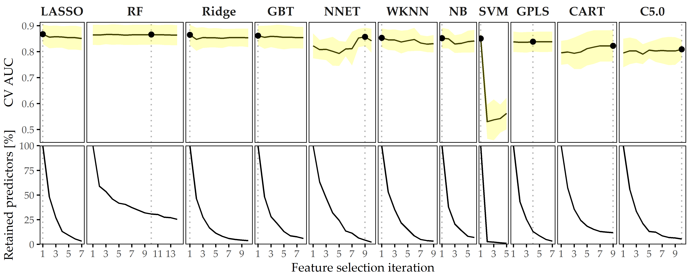
```

The best model (LASSO, i = 1) achieves an accuracy of 79%, a true positive rate (sensitivity) of 61%, a true negative rate (specificity) of 88%, a precision of 72%, and a negative predictive value of 82% based on a probability threshold of 0.5.
This final model includes 40 predictors with non-zero coefficients.
Figure&nbsp;\@ref(fig:08-lasso-depression) shows the median model coefficient for these features across ten cross-validation folds.
From the ADSL questionnaire alone, 16 single items are included in the final model, including indicators of depression (ADSL\_adsl09, ADSL\_adsl18, ADSL\_adsl12) perceived antipathy received from other people (ADSL\_adsl19), sleeplessness (ADSL\_adsl11), dejectedness (ADSL\_adsl03), lack of appetite (ADSL\_adsl02), confusion (ADSL\_adsl05), anxiety (ADSL\_adsl10, ADSL\_adsl08), absence of self-respect (ADSL\_adsl04, ADSL\_adsl09), lack of vitality (ADSL\_adsl09, ADSL\_adsl09), taciturnity (ADSL\_adsl13) and irritability (ADSL\_adsl01).
Thus, this questionnaire contributes the highest number of predictors to the model. From the tinnitus-distress-oriented TQ, five predictors are selected.
Further, the model uses another five predictors from the socio-demographics questionnaire (SOZK), including German nationality (SOZK\_nationality), which has the highest absolute model coefficient, university-level graduation (SOZK\_graduate), tinnitus duration (SOZK\_tinnitusdur), employment status (SOZK\_job), marital status (SOZK\_unmarried) and partnership status (SOZK\_partnership).

(ref:08-lasso-depression) **Coefficients of LASSO model.** Cross-validation (CV) median &plusmn; median absolute deviation (line ranges) of coefficients for the best LASSO model (i = 1). The frequency of non-zero coefficients in 10-fold CV is given in parentheses right to the predictor name. From 185 features in total, 40 features exhibit a non-zero model coefficient for at least one CV fold.

```{r 08-lasso-depression, echo=FALSE, fig.align='center', out.width="100%", fig.cap="(ref:08-lasso-depression)"}
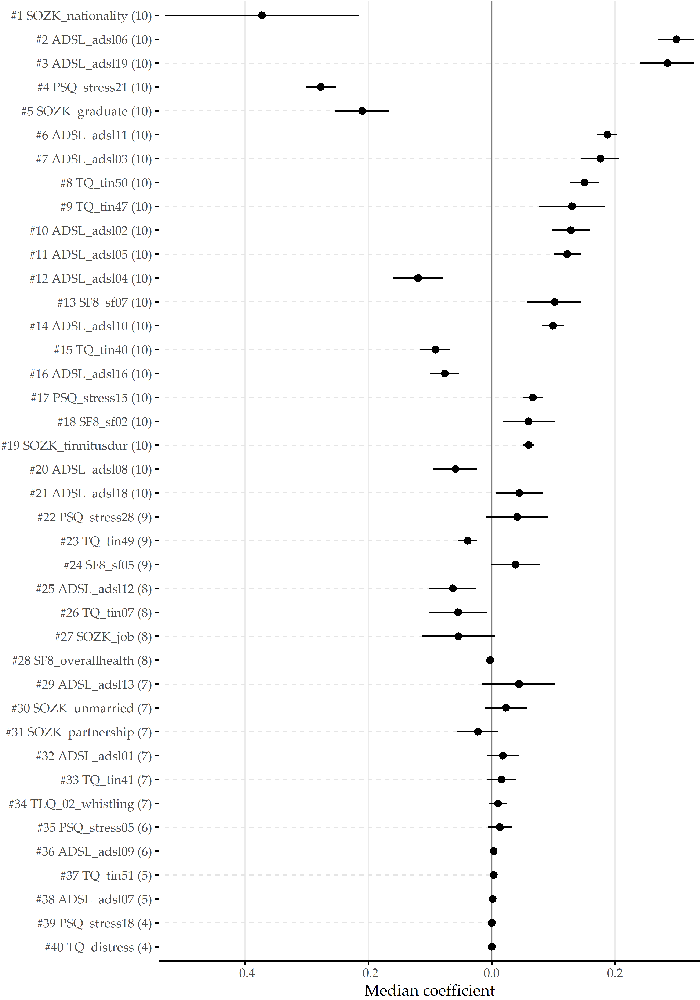
```

Table&nbsp;\@ref(tab:08-lasso-depression-tab) provides a description for each predictor from Figure&nbsp;\@ref(fig:08-lasso-depression).

`r start_paragraph("Effect of feature elimination on classification performance.")` All classifiers but SVM show high stability in performance on smaller feature subsets.
From Figure&nbsp;\@ref(fig:08-results-srep), we see that for LASSO the difference in AUC when trained on 185 features (i = 1) vs. when trained on 6 features (i = 7) is only -0.017.
Several classifiers benefit from feature selection in terms of predictive performance.
For GPLS, NNET, CART, C5.0 and RF, max. AUC is achieved on a feature subset.
Both decision tree variants CART and C5.0 gain the most in performance from feature removal since their respective maximum AUC is obtained on the smallest predictor subset, with a cardinality of 22 and 10, respectively.

<!-- **!!! TODO: item descriptions: partnership status: unmarried** -->

(ref:08-lasso-depression-tab) **Most important features of LASSO model.**  Predictors with the highest absolute coefficient in the final LASSO model (iteration i = 1). From 185 predictors in total, these 40 predictors exhibit a non-zero model coefficient in at least one out of ten cross-validation folds.

```{r 08-lasso-depression-tab, echo=FALSE}
`%>%` <- dplyr::`%>%`
tibble::tribble(
                                                              ~name,                                                                                                                              ~description,   ~coeff,
                                                 "SOZK_nationality",                                                                                                                      "German nationality", "-0.370",
                                                      "ADSL_adsl06",                                                                                              "\"During the past week I felt depressed.\"", " 0.309",
                                                      "ADSL_adsl19",                                                                                "\"During the past week I felt that people disliked me.\"", " 0.288",
                                                     "PSQ_stress21",                                                                                                                 "\"You enjoy yourself.\"", "-0.284",
                                                    "SOZK_graduate",                                                                                                             "Education level: university", "-0.210",
                                                      "ADSL_adsl11",                                                                                         "\"During the past week my sleep was restless.\"", " 0.196",
                                                      "ADSL_adsl03",                          "\"During the past week I felt that I could not shake off the blues even with help from my family or friends.\"", " 0.175",
                                                         "TQ_tin50",                                                                 "\"Because of the noises I am unable to enjoy the radio or television.\"", " 0.151",
                                                         "TQ_tin47",                                                                                                         "\"I am a victim of my noises.\"", " 0.137",
                                                      "ADSL_adsl02",                                                              "\"During the past week I did not feel like eating; my appetite was poor.\"", " 0.132",
                                                      "ADSL_adsl05",                                                             "\"During the past week I had trouble keeping my mind on what I was doing.\"", " 0.132",
                                                         "SF8_sf07",                                              "\"During the past 4 weeks, how much have you been bothered by emotional problems (...) ?\"", " 0.125",
                                                      "ADSL_adsl10",                                                                                                "\"During the past week I felt fearful.\"", " 0.107",
                                                      "ADSL_adsl04",                                                                     "\"During the past week I felt I was just as good as other people.\"", "-0.107",
                                                         "TQ_tin40",                                                         "\"I am able to forget about the noises when I am doing something interesting.\"", "-0.104",
                                                      "ADSL_adsl16",                                                                                                "\"During the past week I enjoyed life.\"", "-0.085",
                                                     "PSQ_stress15",                                                                                                 "\"Your problems seem to be piling up.\"", " 0.081",
                                                         "TQ_tin07",                                                                                       "\"Most of the time the noises are fairly quiet.\"", "-0.069",
                                                      "ADSL_adsl08",                                                                               "\"During the past week I felt hopeful about the future.\"", "-0.064",
                                                         "SF8_sf02", "\"During the past 4 weeks, how much did physical health problems limit your physical activities (such as walking or climbing stairs)?\"", " 0.059",
                                                 "SOZK_tinnitusdur",                                                                          "\"How long have you been suffering from tinnitus (in years)?\"", " 0.058",
                                                     "PSQ_stress28",                                                                                           "\"You feel loaded down with responsibility.\"", " 0.055",
                                                      "ADSL_adsl18",                                                                                                    "\"During the past week I felt sad.\"", " 0.053",
                                                         "SOZK_job",                                                                                                          "Job status: currently employed", "-0.050",
                                                      "ADSL_adsl13",                                                                                      "\"During the past week I talked less than usual.\"", " 0.049",
                                                         "TQ_tin49",                                                                 "\"The noises are one of those problems in life you have to live with.\"", "-0.048",
                                                      "ADSL_adsl12",                                                                                                   "\"During the past week I was happy.\"", "-0.046",
                                                         "SF8_sf05",                                                                              "\"During the past 4 weeks, how much energy did you have?\"", " 0.040",
                                                   "SOZK_unmarried",                                                                                                                               "Unmarried", " 0.033",
                                                 "SOZK_partnership",                                                                                                                          "In partnership", "-0.032",
                                                         "TQ_tin41",                                                                        "\"Because of the noises life seems to be getting on top of me.\"", " 0.031",
                                                     "PSQ_stress05",                                                                                                        "\"You feel lonely or isolated.\"", " 0.025",
                                                      "ADSL_adsl01",                                                         "\"During the past week I was bothered by things that usually don't bother me.\"", " 0.017",
                                                         "TQ_tin51",                                                                                        "\"The noises sometimes produce a bad headache.\"", " 0.015",
                                                 "TLQ_02_whistling",                                                                                                               "Tinnitus noise: whistling", " 0.010",
                                                      "ADSL_adsl07",                                                                    "\"During the past week I felt that everything I did was an effort.\"", " 0.010",
                                                      "ADSL_adsl09",                                                                          "\"During the past week I thought my life had been a failure.\"", " 0.005",
                                                "SF8_overallhealth",                                                                                                                    "Overall health score", "-0.003",
                                                     "PSQ_stress18",                                                                                                              "\"You have many worries.\"", " 0.001",
                                                      "TQ_distress",                                                                                                           "Total tinnitus distress score", " 0.001"
                                                ) %>%
  purrr::set_names(c("Feature", "Description", "Coef.")) %>%
  kableExtra::kbl(booktabs = TRUE, linesep = "", longtable = TRUE,
                  align = "llr",
                  caption = "(ref:08-lasso-depression-tab)") %>%
  kableExtra::kable_classic() %>%
  kableExtra::row_spec(0, bold = TRUE) %>%
  kableExtra::column_spec(2, width = "10cm")
```


<!-- \begin{figure}[htbp] -->
<!-- \centering -->
<!-- \includegraphics[]{fig3.pdf} -->
<!-- \caption{\label{fig:glm}\textbf{Coefficients and relative inclusion of features in cross-validation of \texttt{lasso} model.} Median coefficients (top) and absolute frequency of inclusion of features (bottom) over 10 cross-validation iterations for the best \texttt{lasso} model. From 185 features, the depicted 40 features exhibit a nonzero model coefficient. The average frequency of feature inclusion is represented as horizontal line in the bottom subplot. Line ranges depict MAD (right). %The letter ``F'' indicates features that were retained in the model of the terminal feature selection iteration.  -->
<!-- TQ: German version of the Tinnitus Questionnaire~\cite{GoebelHiller:TF1998};  -->
<!-- PSQ: Perceived Stress Questionnaire~\cite{Fliege:PSQ2005};  -->
<!-- SF8: Short Form 8 Health Survey~\cite{Bullinger:SF2008};  -->
<!-- ADSL: General Depression Scale Questionnaire - long form~\cite{Hautzinger:ADSL2003};  -->
<!-- SOZK: socio-demographics questionnaire~\cite{brueggemann:sozk-reference}. -->
<!-- } -->
<!-- \end{figure} -->

<!-- \begin{table}[htbp] -->
<!-- \small -->
<!-- \centering -->
<!-- \begin{tabular}{lp{11cm}r} -->
<!-- \toprule -->
<!-- Feature & Description & Coefficient \\  -->
<!--   \midrule -->
<!-- SOZK\_nationality & German nationality & -0.370 \\  -->
<!--   ADSL\_adsl06 & ``During the past week I felt depressed.'' & 0.309 \\  -->
<!--   ADSL\_adsl19 & ``During the past week I felt that people disliked me.'' & 0.288 \\  -->
<!--   PSQ\_stress21 & ``You enjoy yourself.'' & -0.284 \\  -->
<!--   SOZK\_graduate & Graduation: university & -0.210 \\  -->
<!--   ADSL\_adsl11 & ``During the past week my sleep was restless.'' & 0.196 \\  -->
<!--   ADSL\_adsl03 & ``During the past week I felt that I could not shake off the blues even with help from my family or friends.'' & 0.175 \\  -->
<!--   TQ\_tin50 & Because of the noises I am unable to enjoy the radio or television. & 0.151 \\  -->
<!--   TQ\_tin47 & I am a victim of my noises. & 0.137 \\  -->
<!--   ADSL\_adsl02 & ``During the past week I did not feel like eating; my appetite was poor.'' & 0.132 \\  -->
<!--   ADSL\_adsl05 & ``During the past week I had trouble keeping my mind on what I was doing.'' & 0.132 \\  -->
<!--   SF8\_sf07 & ``During the past 4 weeks, how much have you been bothered by emotional problems (such as feeling anxious, depressed or irritable)?'' & 0.125 \\  -->
<!--   ADSL\_adsl10 & ``During the past week I felt fearful.'' & 0.107 \\  -->
<!--   ADSL\_adsl04 & ``During the past week I felt I was just as good as other people.'' & -0.107 \\  -->
<!--   TQ\_tin40 & I am able to forget about the noises when I am doing something interesting. & -0.104 \\  -->
<!--   ADSL\_adsl16 & ``During the past week I enjoyed life.'' & -0.085 \\  -->
<!--   PSQ\_stress15 & ``Your problems seem to be piling up.'' & 0.081 \\  -->
<!--   TQ\_tin07 & Most of the time the noises are fairly quiet. & -0.069 \\  -->
<!--   ADSL\_adsl08 & ``During the past week I felt hopeful about the future.'' & -0.064 \\  -->
<!--   SF8\_sf02 & ``During the past 4 weeks, how much did physical health problems limit your physical activities (such as walking or climbing stairs)?'' & 0.059 \\  -->
<!--   SOZK\_tinnitusdur & ``How long have you been suffering from tinnitus (in years)?'' & 0.058 \\  -->
<!--   PSQ\_stress28 & ``You feel loaded down with responsibility.'' & 0.055 \\  -->
<!--   ADSL\_adsl18 & ``During the past week I felt sad.'' & 0.053 \\  -->
<!--   SOZK\_job & Job status: currently employed & -0.050 \\  -->
<!--   ADSL\_adsl13 & ``During the past week I talked less than usual.'' & 0.049 \\  -->
<!-- \bottomrule -->
<!-- \end{tabular} -->
<!-- \caption{\label{tab:lasso_features}\textbf{Top-25 features.} Features with highest absolute coefficient in \texttt{lasso} model (iteration $i=1$).  -->
<!-- TQ: German version of the Tinnitus Questionnaire~\cite{GoebelHiller:TF1998};  -->
<!-- PSQ: Perceived Stress Questionnaire~\cite{Fliege:PSQ2005};  -->
<!-- SF8: Short Form 8 Health Survey~\cite{Bullinger:SF2008};  -->
<!-- ADSL: General Depression Scale Questionnaire - long form~\cite{Hautzinger:ADSL2003};  -->
<!-- SOZK: socio-demographics questionnaire~\cite{brueggemann:sozk-reference}. -->
<!-- } -->
<!-- \end{table} -->

<!-- \begin{figure}[htbp] -->
<!-- \centering -->
<!-- \includegraphics[width=\textwidth]{fig4.pdf} -->
<!-- % \begin{minipage}{.32\linewidth} -->
<!-- % \includegraphics[width=\textwidth]{fig4_1.pdf} -->
<!-- % \end{minipage} -->
<!-- % \begin{minipage}{.32\linewidth} -->
<!-- % \includegraphics[width=\textwidth]{fig4_2.pdf} -->
<!-- % \end{minipage} -->
<!-- % \begin{minipage}{.32\linewidth} -->
<!-- % \includegraphics[width=\textwidth]{fig4_3.pdf} -->
<!-- % \end{minipage} -->
<!-- % \begin{minipage}{.32\linewidth} -->
<!-- % \includegraphics[width=\textwidth]{fig4_4.pdf} -->
<!-- % \end{minipage} -->
<!-- % \begin{minipage}{.32\linewidth} -->
<!-- % \includegraphics[width=\textwidth]{fig4_5.pdf} -->
<!-- % \end{minipage} -->
<!-- % \begin{minipage}{.32\linewidth} -->
<!-- % \includegraphics[width=\textwidth]{fig4_6.pdf} -->
<!-- % \end{minipage} -->
<!-- %\hfill -->
<!-- \caption{\label{fig:lasso_features}\textbf{Predictive features.} Distribution of features included in the \texttt{lasso} model of iteration $i=7$ for the patients with subclinical and clinical depression. Green squares and labels represent mean of continuous features. ADSL: General Depression Scale Questionnaire - long form\cite{Hautzinger:ADSL2003}; PSQ: Perceived Stress Questionnaire~\cite{Fliege:PSQ2005}; SF8: Short Form 8 Health Survey~\cite{Bullinger:SF2008}; TQ: German version of the Tinnitus Questionnaire~\cite{GoebelHiller:TF1998};. -->
<!-- } -->
<!-- \end{figure} -->

<!-- Classification using the best model (\texttt{lasso}, $i=1$) based on a probability threshold of 0.5 resulted in an accuracy of 0.79, a true positive rate (sensitivity) of 0.61, a true negative rate (specificity) of 0.88, a precision of 0.72 and a negative predictive value of 0.82. -->
<!-- The final model retained 40 features with nonzero coefficients. % -->
<!-- Figure~\ref{fig:glm} shows the median model coefficient of these features across 10 cross-validation folds. % -->
<!-- From the ADSL questionnaire, 16 single items were included in the final model. % -->
<!-- Thus, this questionnaire contributed most to the model prediction. % -->
<!-- Notably, 5 items from the tinnitus-tailored TQ questionnaire were also included in the model. % -->
<!-- Further, the model utilised 5 items from the socio-demographics questionnaire (SOZK), including nationality (SOZK\_nationality) which appeared to have the highest absolute model coefficient, graduation (SOZK\_graduate), tinnitus duration (SOZK\_tindur), employment (SOZK\_job), marital status (SOZK\_unmarried) and partnership status (SOZK\_partnership). %  -->
<!-- Table~\ref{tab:lasso_features} provides a description for each of the 25 features with the largest model coefficient for the \texttt{lasso} model ($i=1$). %  -->
<!-- The complete list of features included in the final model can be consulted in Supplementary-C. % -->


<!-- \paragraph{Stability of classifiers on smaller feature sets.} -->
<!-- With the exception of \texttt{svm}, all classifiers showed high stability when trained on smaller feature subsets. %  -->
<!-- For example, the difference between \texttt{lasso} on 185 features ($i=1$) and the same on 6 features ($i=7$) was only 0.017 (2\% drop). % -->
<!-- Several classifiers even benefitted from feature selection with respect to predictive performance. %  -->
<!-- For five classifiers (\texttt{gpls}, \texttt{nnet}, \texttt{cart}, \texttt{c5.0} and \texttt{rf}), the AUC of the model at second or later iteration was larger than the AUC of the first iteration model that used all 185 features. % -->
<!-- The two decision tree variants \texttt{cart} and \texttt{c5.0} profited the most from feature selection, since their best performance was reached on the smallest feature subset with a cardinality of 22 and 10, respectively. % -->

<!-- \paragraph{Complexity-interpretability tradeoff.} -->
<!-- Our incremental feature selection wrapper reduces the number of features from 185 to 6 without substantial quality loss. % -->
<!-- The \texttt{lasso} model of iteration $i=7$ provides a reasonable tradeoff between a clinically useful predictive quality (AUC: 0.85&plusmn;0.05) and a low model complexity (6 features) in comparison with the best overall \texttt{lasso} model (AUC: 0.87&plusmn;0.04). % -->
<!-- Figure~\ref{fig:lasso_features} depicts a graphical representation of the distribution of these 6 features with respect to depression\_status.  % -->
<!-- Patients with clinical depression report a significantly higher mean tinnitus severity score \texttt{TQ\_tf} (33.15&plusmn;15.2) than patients with subclinical depression (49.8&plusmn;15.4) (t-test, $\alpha=0.05$). % -->
<!-- Analogous, the mean of the stress sum score PSQ\_psq\_sum (clinical dep.: 0.58&plusmn;0.16 vs. subclinical dep.: 0.40&plusmn;0.17) and the demand score PSQ\_demand (clinical dep.: 0.56&plusmn;0.16 vs. subclinical dep.: 0.46&plusmn;0.17) were significantly higher for patients with clinical depression. % -->
<!-- Additionally, three single items were included in the model which showed significant differences with respect to depression\_status (Chi-square test, $\alpha=0.05$). %   -->
<!-- For the seventh and tenth question of the ADSL questionnaire (ADSL\_adsl07: \textit{``During the past week I felt that everything I did was an effort.''}; ADSL\_adsl10: \textit{``During the past week I felt fearful.''}), the portion of patients with clinical depression ticking answers \textit{``occasionally''} and \textit{``most''} were higher than for \textit{``rarely''} and \textit{``some''}. % -->
<!-- Accordingly, patients with clinical depression answered the fifth question of the SF8 questionnaire  (SF8\_sf05: \textit{``During the past 4 weeks, how much energy did you have?''}) rather with \textit{``a little''} or \textit{``none''} instead of \textit{``very much''}, \textit{``quite a lot''} or \textit{``some''}. -->

<!-- % \paragraph{Important features.} The strong association between \texttt{tq\_tf} and \texttt{depression\_status} indicate a high association between tinnitus and depressive disorder. % ~\cite{Langguth:TinnitusDepression2011}. -->
<!-- % In addition, large model coefficients for \texttt{psq} overall and demand scores suggest stress as major comorbidity of depression. %  -->
<!-- % From  a clinical point of view, the inclusion of features from different questionnaires indicates the importance of combining items from several questionnaire types for accurate depression status prediction. % -->
<!-- % Hence, optimally managing patients with tinnitus requires addressing comorbidities and other sequelae. % -->
<!-- % In general, caution has to be taken when interpreting model coefficients. % -->
<!-- % For example, the \texttt{lasso} model (i 1) identified a positive relationship (coefficient: -0.370) between foreignership and depression severity (Table~\ref{tab:lasso_features}, Figure~\ref{fig:glm}). % -->
<!-- % Although racial/ethnical differences in depression were reported in literature~\cite{Riolo:DepressionEthnicity2005, Weinberger:DepressionEthnicity2018}, this result of our study may be an effect of overfitting, since only 5.0\% of the study population were non-German citizens. % -->
<!-- % Moreover, the feature had a model reliance score of %just 0.97  -->
<!-- % under 1.0 and consequently was dropped for iteration 2. % -->
<!-- % Although the age feature is included in 8 of the 11 feature sets associated with the best model per classifier, the effect of age on the predicted depression status remains unclear. -->


### Results for ANEUR {#iml-results-aneur}

`r start_paragraph("The learning problem.")`
We predict the rupture status for a total of 100 intracranial aneurysms with morphological parameters. 
We learn different models for the subset of sidewall aneurysms (SW; 9 of 24 ruptured), for the subset of bifurcation aneurysms (BF; 29 of 62 ruptured), and on a combined group (43 of 100 ruptured) with 14 additional samples that could not be determined to be either SW or BF. 
For ANEUR, it is necessary to extract morphological features from raw image data first. 

`r start_paragraph("Segmentation and neck curve extraction.")` 
Aneurysms and vessels are segmented using a threshold-based approach [@Glasser2015] from digital subtraction data reconstructed from 3D rotational angiography images.
Subsequently, the centerline of the vessel is extracted using the _Vascular Modeling Toolkit_ (VMTK, vmtk.org) [@Antiga2008].
Subsequently, the plane separating the aneurysm from its parent vessel is determined using the automatic ostium detection of Saalfeld et al. [@Saalfeld2018].

`r start_paragraph("Morphological feature extraction.")` 
For each 3D surface mesh, we obtain the neck curve, the dome point $D$, and the two base points $B_1$ and $B_2$.
As described in [@Saalfeld2018], $B_1$ and $B_2$ are approximated as points on the centerline with the largest distance where the rays from $B_1$ and $B_2$ to $D$ do not intersect the surface mesh.
Figure&nbsp;\@ref(fig:08-morph-parameters) illustrates the extracted parameters, where $H_{max}$, $W_{max}$, $H_{ortho}$, $W_{ortho}$, and $D_{max}$ (Figure \@ref(fig:08-morph-parameters)&nbsp;(a)) describe the aneurysm shape [@Dhar2008; @LauricEtAl:Neurosurgery2012].
The angle parameters $\alpha$, $\beta$, and $\gamma$ (Figure \@ref(fig:08-morph-parameters)&nbsp;(b)) are extracted based on $B_1$, $B_2$, and $D$, respectively.
The absolute difference between $\alpha$ and $\beta$ is denoted as $\Delta_{\alpha\beta}$.
By separating the aneurysm from its parent vessel by the neck curve, we derive an estimate for the surface area $A_A$ and volume $V_A$ of the aneurysm (Figure \@ref(fig:08-morph-parameters)&nbsp;(c)).
We provide two variants for the surface area of the ostium, $A_{O1}$, and $A_{O2}$ (Figure \@ref(fig:08-morph-parameters)&nbsp;(d)).
$A_{O1}$ is the area of the ostium, i.e., the area of the triangulated ostium surface resulting from the connection of the neck curve points with their centroid $C_{NC}$, and $A_{O2}$ denotes the area of the neck curve when projected into a plane [@Saalfeld2018].
Therefore, $A_{O2}$ is extracted as a parameter comparable to other studies that often use a cutting plane to determine the ostium.
Our method achieves a local optimum for highly lobulated aneurysms and considers only one of the many dome points.
Although the estimated positions of $B_1$ and $B_2$ may vary slightly, neck curve detection is still performed, and morphological parameters are calculated. Table&nbsp;\@ref(tab:08-morphological-features) provides an overview of all extracted morphological features.

(ref:08-morph-parameters) **Illustration of the extracted morphological features.** (a) Features that describe aneurysm width, height, and diameter. (b) The angles $\alpha$, $\beta$ and $\gamma$ are extracted from the base points $B_1$, $B_2$ and the dome point $D$. (c) After separating the aneurysm from its parent vessel via the neck curve, the area $A_A$ and volume $V_A$ are computed. (d) The area of the ostium $A_{O1}$ and the area of the projected ostium $A_{O2}$ are extracted after estimating the center of the neck curve $C_{NC}$.

```{r 08-morph-parameters, echo=FALSE, fig.align='center', out.width="100%", fig.cap="(ref:08-morph-parameters)"}
knitr::include_graphics("figures/08-MorphParameters5.png")
```

<!-- Table&nbsp;\ref{tab:features} provides a brief description, summary statistics and a visualization of the distribution for each extracted parameter. Additionally, the statistical significance of multiple parameters w.r.t. rupture risk status, including $D_{max}$, $H_{max}$, $H_{ortho}$, $AR_1$, $AR_2$, $\beta$ and $\gamma$, is shown in  Table&nbsp;\ref{tab:features}. -->

(ref:08-morphological-features) **Overview of morphological features extracted for ANEUR**. 

```{r 08-morphological-features, echo=FALSE}
`%>%` <- dplyr::`%>%`
kableExtra::kbl(
  tibble::tribble(
    ~"Feature", ~"Description", 
    "$A_A$", "area of the aneurysm (without the ostium) (mm$^2$)",
    "$V_A$", "volume of the aneurysm (mm$^3$)",
    "$A_{O1}$", "area of the ostium (variant 1) (mm$^2$)",
    "$A_{O2}$", "area of the ostium (variant 2) (mm$^2$)",
    "$D_{max}$", "max. diameter of the aneurysm (mm)",
    "$H_{max}$", "max. height of the aneurysm (mm)",
    "$W_{max}$", "max. width of the aneurysm perpendicular to $H_{max}$ (mm)",
    "$H_{ortho}$", "height of the aneurysm approximated as length of the ray perpendicular to the ostium plane starting from $C_{NC}$ (mm)",
    "$W_{ortho}$", "max. width parallel to the projected ostium plane (mm)",
    "$N_{max}$", "max. $NC$ diameter, i.e., the max. possible distance between two $NC$ points (mm)",
    "$N_{avg}$", "average $NC$ diameter, i.e., the mean distance between $C_{NC}$ and the $NC$ points (mm)",
    "$AR_1$", "aspect ratio (variant 1): $H_{ortho}/N_{max}$",
    "$AR_2$", "aspect ratio (variant 2): $H_{ortho}/N_{avg}$",
    "$V_{CH}$", "volume of the convex hull of the aneurysm vertices (mm$^3$)",
    "$A_{CH}$", "area of the convex hull of the aneurysm vertices (mm$^2$)",
    "$EI$", "ellipticity index $EI=1-\\left(18\\pi\\right)^{\\frac{1}{3}}V_{CH}^{\\frac{2}{3}}/A_{CH}$",
    "$NSI$", "non-sphericity index, i.e.,  $NSI=1-\\left(18\\pi\\right)^{\\frac{1}{3}}V^{\\frac{2}{3}}/A$",
    "$UI$", "undulation index. $UI=1-\\frac{V}{V_{CH}}$",
    "$\\alpha$", "min. of $\\measuredangle DB_1B_2$ and $\\measuredangle DB_2B_1$ (deg)",
    "$\\beta$", "max. of $\\measuredangle DB_1B_2$ and $\\measuredangle DB_2B_1$ (deg)",
    "$\\gamma$", "angle at $D$, i.e., $\\measuredangle B_1DB_2$ $(deg)$",
    "$\\Delta_{\\alpha\\beta}$", "abs. difference between $\\alpha$ and $\\beta$ (deg)"
  ) %>% dplyr::mutate(`\\#` = dplyr::row_number(), .before = 1),
  booktabs = TRUE, escape = FALSE, linesep = "",
  caption = "(ref:08-morphological-features)"
) %>%
  kableExtra::kable_classic() %>%
  kableExtra::column_spec(3, width = "12cm") %>%
  kableExtra::row_spec(0, bold = TRUE)
```


Figure&nbsp;\@ref(fig:08-results-cbms) shows the classification results on each data subset.
GBT achieves maximum AUC on _ALL_ (cross-validation average 67.2% &plusmn; 1.8% standard deviation), followed by C5.0 (AUC 64.6% &plusmn; 1.9%) and GPLS (AUC 63.3% &plusmn; 1.2%).
On the subset _SW_, SVM comes up best with 75.2% &plusmn; 5.7% AUC, slightly superior to GPLS (AUC 73.6% &plusmn; 4.4%) and NNET (AUC 71.6% &plusmn; 5.5%).
For _BF_, WKNN yields the best (AUC 64.0% &plusmn; 1.1%) model, while GPLS (AUC 62.9% &plusmn; 2.6%) and RF (AUC 62.7% &plusmn; 2.3%) have similar yet slightly inferior generalization performances.
Our results indicate that all classifiers yield better performance on the subset of sidewall aneurysms.
Overall, none of the classification algorithms outperforms all others across all three subsets.

(ref:08-results-cbms) **Classification results for ANEUR.** For each combination of data subset and classification algorithm, the performance of the run with the preprocessing transformation that achieves the highest AUC is shown. SW = sidewall; BF = bifurcation.

```{r 08-results-cbms, echo=FALSE, fig.align='center', out.width="100%", fig.cap="(ref:08-results-cbms)"}
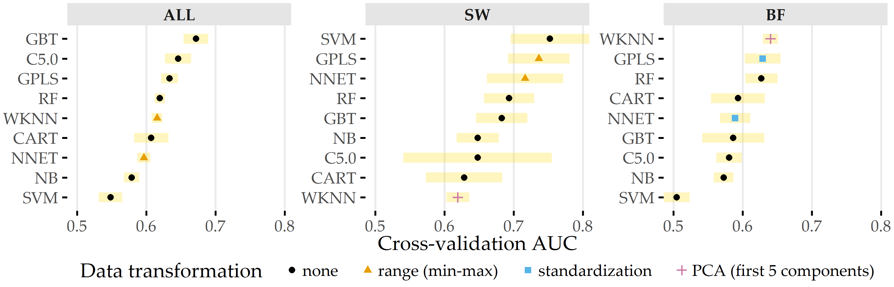
```

Concerning PD importance, Figure&nbsp;\@ref(fig:08-pd-global-aneur) illustrates the high attribution of the angle parameter $\gamma$ towards rupture status classification, as this feature is ranked first and third for the best models of _ALL_ and _BF_.
On the SVM model trained on the _SW_ subset, ellipticity index (EI) is most important.

(ref:08-pd-global-aneur) **Relative PD importance (ANEUR).** PD importance for the best model of each data subset. Values are relative to the maximum PD importance. SW = sidewall; BF = bifurcation.

```{r 08-pd-global-aneur, echo=FALSE, fig.align='center', out.width="100%", fig.cap="(ref:08-pd-global-aneur)"}
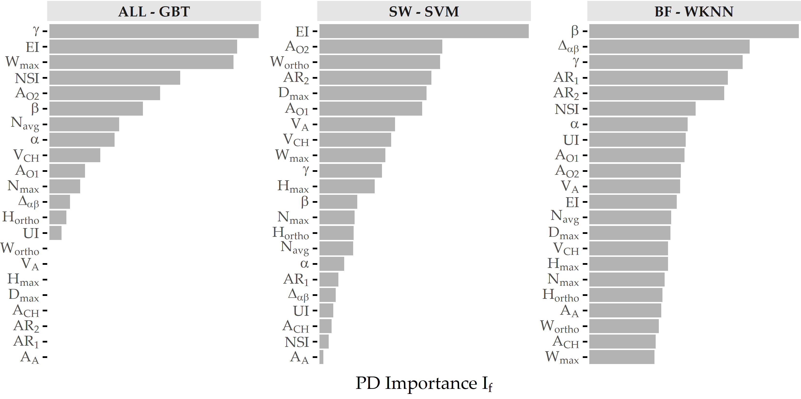
```

Figure&nbsp;\@ref(fig:08-pd-local-aneur) shows PDP and ICE curves for the most important predictors according to $I_f$ for the best models on each data subset.
All ICE curves of the GBT model and the SVM model (Figure \@ref(fig:08-pd-local-aneur)&nbsp;(a) and&nbsp;(b)) exhibit nearly identical trends but different intercepts.
In contrast, the ICE curves of WKNN (Figure \@ref(fig:08-pd-local-aneur)&nbsp;(c)) appear more jittery.
The plots summarize some of the idiosyncrasies of the different model families.
The GBT model (Figure \@ref(fig:08-pd-local-aneur)&nbsp;(a)) produces jagged curves with distinct vertical cuts, representing the splits in the base decision trees of this tree ensemble.
For example, the plot for $\gamma$ shows 4 of such splits at {16.54, 49.26, 54.42, 64.35}.
The SVM classifier (Figure \@ref(fig:08-pd-local-aneur)&nbsp;(b)) is a linear model; hence the ICE and PD curves are lines with a fixed slope.
The marginal model posterior of aneurysm rupture increases with higher values of ellipticity index, max. width of the aneurysm body, aspect ratio $H_{ortho}/N_{avg}$ and max. aneurysm diameter, whereas for the area of the ostium (variant 2), lower values are more indicative of a high rupture likelihood.
For WKNN, the PDP is better able to clearly show the marginal posteriors of individual predictors than the ICE curves.
This could be due to the property of WKNN being a "lazy" learner, which does not produce an actual model but makes its predictions based on observation-individual similarity.

(ref:08-pd-local-aneur) **PDP and ICE curves for the top 5 predictors of each data subset's best model.** ICE curves show the marginal predicted rupture probability for each individual aneurysm; PD curves is depicts the average across all ICE curves. Rugs above the x-axis line represent the marginal distribution of the predictor. SW = sidewall; BF = bifurcation.

```{r 08-pd-local-aneur, echo=FALSE, fig.align='center', out.width="100%", fig.cap="(ref:08-pd-global-aneur)"}
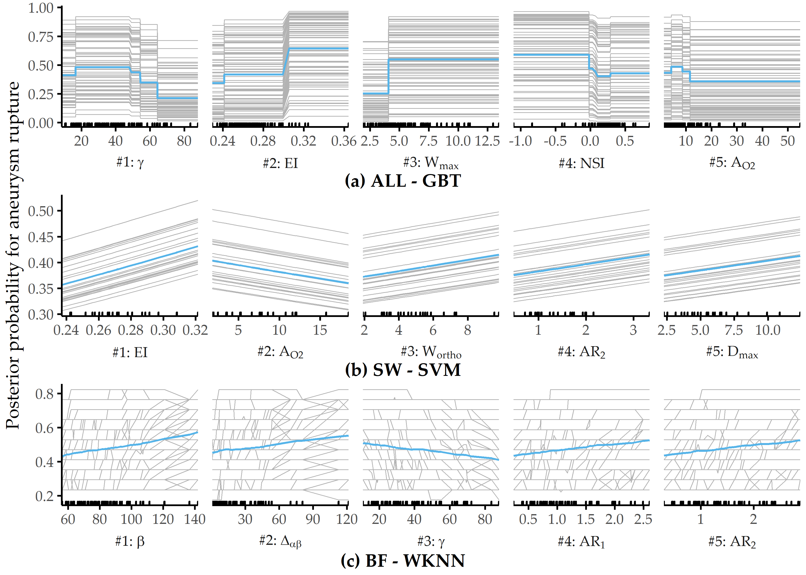
```

<!-- **UNCOMMENT, modify and put on AWS server** -->
<!-- We integrated the three best models per data subset in an interactive web-application\footnote{Available at \url{https://rbsenzaehler.shinyapps.io/RUSTiC/}.}, allowing the user to study how a change in the choice of the values for a feature affects the model confidence. % provides the values of the morphological features and gets a class prediction. % -->
<!-- The user may select a sample from the training set, but she is also allowed to freely modify each feature value with the respective slider widget, whereupon the prediction confidence gets immediately updated. % -->
<!-- A horizontal bar chart visualizes the supporting or contradicting contribution of each input feature to the model's prediction, based on the method of Ribeiro et al.~\cite{RibeiroEtAl:KDD2016}.  -->

<!-- % Short summary of LIME:  -->
<!-- % 1. Select an instance i -->
<!-- % 2. Replicate slightly permuted versions of i; keep track of the magnitude of permutations, i.e., how different the permuted version is to i  -->
<!-- % 3. Apply our trained model on the permuted instances and get its predictions -->
<!-- % 4. Fit a simple model (e.g. ridge regression) to the predictions of 3. Permutated instances are weighted w.r.t. the distance to i, i.e., the closer the instance is to i, the higher weight it gets. The simple model uses less features (usually between 5 and 10). The feature selection can be manifold, e.g. by choosing the featurres with the highest weights in the regression fit on the predicitons mady by the complex model, OR via a forward selection, where features are iteratively added to improve the regression fit on the predictions, OR etc. -->


<!-- A partial dependence plot visualizes the relationship between a feature $f$ and a model's prediction while incorporating the average effect of the remaining features in the model. % prediction on the training data for a fixed value of a feature $f$. % -->
<!-- Thus, by providing an estimation of how the model's prediction changes for each value of %is influenced by changing values of  -->
<!-- $f$, it is particularly useful for interpreting the models of complex non-parametric classification algorithms. %  -->
<!-- In Fig.~\ref{fig:pdp}, we show the partial dependence plots of the five most important features of the best models per subset from Table~\ref{tab:performance}. % -->

## Interpretation of the Findings from the Medical Perspective {#iml-discussion}

In this section, we discuss our findings with respect to all three classification tasks, i.e., regarding 
CHA-Depression (Section&nbsp;\@ref(iml-discussion-depression)), CHA-Tinnitus (Section&nbsp;\@ref(iml-discussion-tinnitus)) and 
ANEUR (Section&nbsp;\@ref(iml-discussion-aneur)).

### CHA-Depression {#iml-discussion-depression}

Machine learning is used to build predictive models of depression severity based on structured patient interviews [@VanLoo:depression_pred2014; @Kessler:MLDepression2016].
We refrain from quantitative comparison with these studies due to differences in population characteristics and measurements.
_But how good is the best of our models actually?_
A reasonable baseline is a classifier that carries over the depression status at T0 as prediction for T1; such as model yields 79% accuracy.
Our models outperform this baseline, although they are likely to provide a good fit only for our sample, with patient subgroups from other centers yet to be studied.
However, our models are a promising first step in supporting a timely prediction of depression severity and selecting appropriate treatment with only a few questionnaire items.

Consistent with previous studies [@Langguth:TinnitusDepression2011], we have found a strong association between tinnitus distress and depression severity.
Furthermore, predictors measuring perceived stress and demands are significant contributors to depression in tinnitus patients [@Trevis:TinnitusReview2018].
The fact that predictors are selected from different questionnaires confirms the multifactoriality of depression, whose assessment requires the inclusion of different measurements.
Therefore, concomitant emotional symptoms and other comorbidities must be taken into account to meet patient-specific needs.
In a previous study [@Whooley:2q_depression1997], high sensitivity in detecting depression was achieved using only a two-item questionnaire.
One of the two items was _"During the past month, have you often been bothered by feeling down, depressed, or hopeless."_ [@Whooley:2q_depression1997], which is similar to the ADSL\_adsl06 (_"In the past week, I have felt depressed."_), which has the second-largest absolute coefficient in our best LASSO model.

Generally, care must be taken when interpreting the model coefficients:
for example, we have identified a strong relationship between non-German citizenship and depression severity (cf. Figure&nbsp;\@ref(fig:08-lasso-depression) and Table&nbsp;\@ref(tab:08-lasso-depression-tab)).
Although some studies reported ethnic differences in depression [@Riolo:DepressionEthnicity2005; @Weinberger:DepressionEthnicity2018], this item's occurrence tends to suggest higher perceived social stress in patients of predominantly Turkish origin due to higher unemployment rates, larger families, and lower housing conditions in this demographic group.
Because only 5.0% of the cohort population were non-German citizens, these results could also result from overfitting.
Since the associated predictor in the first iteration of feature elimination has a model reliance score of less than 1.0, it is omitted from the sparser models.

Regarding the stability of the models on smaller feature sets, our results show that simpler models are only slightly inferior to the most predictive model.
More specifically, most classification methods show an improvement in AUC as the number of predictors decreases.
In fact, 5 of 11 classifiers improve by feature selection, i.e., the AUC in the second or later iteration is superior to the AUC in the first iteration (where all 205 predictors are used).
For example, the two decision tree variants achieve the highest performance on the smallest feature subset in each case.
Regarding the LASSO classifier, which performs best, it is encouraging that only 6 predictors from 4 questionnaires show similar performance (AUC = 0.850) compared to the best overall model (AUC = 0.867).
It is noteworthy that neither predictors of tinnitus localization and quality nor socio-demographic predictors are included in this model.
This finding could be used to reduce the number of questions or entire questionnaires that patients must answer before and after treatment.
Costs can be measured not only by the financial expense of an examination, but also by the psychological or physical burden for a subject undergoing an examination (e.g., a painful biopsy vs. a blood test). 
For example, Yu et al. [@yu2020controlling] performed feature selection under a budget, where the cost of feature acquisition was derived from medical experts' suggestions based on the total financial burden, patient privacy, and patient inconvenience.
Kachuee et al. [@kachuee2019costsensitive] derived feature costs based on the convenience of answering questions, performing medical exams, and blood and urine tests.

In terms of clinical relevance, our results should be a first step to guide clinicians in making treatment decisions regarding clinical depression in patients with chronic tinnitus.
The models could be used to design an appropriate treatment pathway.
However, before using the models in practice, one must be aware that they are trained on cross-sectional data, i.e., the models separate subclinical and clinical depression based on questionnaire responses and socio-demographic data before treatment.
Also, one must keep in mind that the treatment was a 7-day treatment, and the response is depression status _after treatment_.

There are also some limitations to our approach.
First, our models might be subject to selection bias because patients who did not complete all seven questionnaires both at admission _and_ after treatment were excluded from our analyses.
However, we do not consider these data as "missing values" because this could lead to the problematic suggestion of using imputation methods.
We cannot use imputation because (i) a proportion of patients did not complete the entire questionnaire (rather than individual items) and (ii) we do not know whether the data are missing at random.
However, because the number of patients is large, we believe our results are sufficiently robust.
In future work, we will investigate possible systematic differences between included and excluded patients.
The exclusion of patients who dropped out of completing the questionnaires prematurely, partly because of a gradual loss of motivation, technical unfamiliarity with the computer, or possible interruptions by staff to complete other baseline assessments, could lead to selection bias.
Because the patient population was from only one hospital, future work involves external validation of the models on data from different populations and hospitals.
Because cross-sectional data limits the interpretation of the prediction of depression severity beyond the end of therapy, future work will need to validate the models with longitudinal data.

Another potential limitation is the greedy process of our iterative feature selection wrapper, which can miss global optima as a result.
At each iteration, predictors that prevent the model from correctly classifying are removed from the feature set.
Once a predictor is eliminated, it cannot be included in any subsequent iteration. 
However, it is possible that including a predictor that is removed in an early iteration could lead to a better model in a later iteration.
A possible solution would be to backtrack or revisit earlier iterations if it turns out that some of the removed predictors actually contributed positively to the model performance.
Alternatively, the $MR$ cutoff value for discarding features (set to 1 in our experiments) could be subjected to hyperparameter tuning.
Therefore, future work includes a comparison with other feature selection algorithms.

### CHA-Tinnitus {#iml-discussion-tinnitus}

We have trained classification models to predict tinnitus-related distress after multimodal treatment (T1) in patients with chronic tinnitus based on self-report questionnaires data acquired before treatment (T0).
The gradient boosted trees model, which uses 26 (12.7%) from a total of 205 predictors, separates patients with "compensated" vs. "decompensated" tinnitus with best AUC.
<!-- By feature selection, 87% -->
<!-- While a considerable reduction in dimensionality was achieved by removing approx. 87\% of the original features, none of the 9 questionnaires appeared to be negligible for the prediction of tinnitus-related distress, as each questionnaire contributed at least one feature to the optimal feature space.  -->

Among these features are measurements that describe a variety of psychological and psychosomatic patient characteristics and socio-demographics, therefore confirming the multi-factorial nature of tinnitus-related distress.
These characteristics were used for the phenotyping in Chapter&nbsp;\@ref(phenotypes).
Additionally, the predictors can be investigated in a follow-up study of how such characteristics influence treatment success.
<!-- % Although the present approach does not allow for causal interpretation, the best model utilizes features that describe a variety of psychological and psychosomatic patient characteristics as well as socio-demographics thereby confirming the multi-factorial nature of tinnitus-related distress.  -->
As expected, predictors directly linked to tinnitus quality show high model attribution, such as the degree of perceived tinnitus impairment and loudness.
At the same time, depression, attitudinal factors (self-efficacy, pessimism, complaint tendency), sleep problems, educational level, tinnitus location, and duration also emerged as highly important for the model prediction.

Quantitative predictors, such as tinnitus impairment and loudness, show non-monotonic relationships with respect to the predicted outcome.
Notably, very low self-reported impairment or loudness measured by visual analog scales do not generally indicate low tinnitus-related distress measured by the TQ.
One explanation is that simple measurements like TINSKAL\_impairment and TINSKAL\_loudness are less robust and show higher variability than a compound scale that combines multiple single questionnaire items.
These findings could be investigated further, e.g., whether there is a relationship towards a subgroup of more fatigued patients who fill some questionnaires less thoroughly.

Our results confirm the intricate interplay between depression and tinnitus-related distress, elucidated by numerous previous studies [@Dobie:DepressionTinnitus2003; @Folmer:Tinnitus1999; @Halford:AnxietyDepressionTinnitus1991; @Langguth:TinnitusDepression2011; @Salazar:Depression2019].
For our best model, an ADSL score of more than 20 is associated with an increased predicted risk of tinnitus decompensation (cf. Figure \@ref(fig:08-tq-xgboost-shap-per-feature)&nbsp;(2)), which is close to the cutoff of the clinical relevance of depression [@Hautzinger:ADSL2003].

<!-- % Besides depression, other associations towards the outcome were identified, including discomfort, sleep problems, graduation, tinnitus duration, loneliness, anger, tinnitus loudness and physical well-being.  -->

<!-- Some predictors exhibit higher model attribution for  subset of patients, including the two selected features on educational level (SOZK\_graduate and SOZK\_lowersec).  -->
<!-- This finding is consistent with the clustering on patients based on explanation similarity (cf. Fig~\ref{fig:shap}~C) which revealed two subgroups (clusters 1 and 4) that are characterized by a lower school degree and high degree of reported tinnitus impairment in comparison with the other clusters, including one large subgroup (50\%) that exhibits low depression scores.  -->

In the context of parsimonious learning, a general strategy is to determine the set of predictors which is as small as possible and where the inclusion of any other predictor does not yield a considerable performance improvement.
So how many predictors are really necessary for an accurate tinnitus distress prediction?
Figure \@ref(fig:08-tq-xgboost-parsimonious)&nbsp;(a) illustrates the change in performance for a GBT classifier when predictors are iteratively added to the feature space in the order of their SHAP values with respect to our best model.
A model that uses only the TINSKAL\_impairment achieves AUC = 0.79 &plusmn; 0.06.
Adding ADSL\_depression leads to an improvement in AUC of 0.06.
However, none of the remaining 24 predictors results in an improvement of more than 0.01, respectively.
Moreover, only 3 predictors are necessary for a model with AUC = 0.85, 8 predictors for a model with AUC = 0.87 and 15 predictors for a model with AUC = 0.89 (cf. Figure \@ref(fig:08-tq-xgboost-parsimonious)&nbsp;(a)).

(ref:08-tq-xgboost-parsimonious) **Cumulative feature contribution and correlation network.** (a) Cross-validation AUC (average &plusmn; standard deviation) of a GBT model trained on the feature subset comprising the predictors denoted on the y-axis up to that iteration. The ordering of features is according to the mean absolute SHAP value (cf. Figure \@ref(fig:08-tq-xgboost)&nbsp;(a)). (b) Network illustrating 3 groups of features among the 26 selected predictors of the best model with high intra-group correlation ($|\rho| \geq$ 0.5). Eight predictors (predominantly from SOZK) without any moderate to high pairwise correlation are not shown.

```{r 08-tq-xgboost-parsimonious, echo=FALSE, fig.align='center', out.width="100%", fig.cap="(ref:08-tq-xgboost-parsimonious)"}
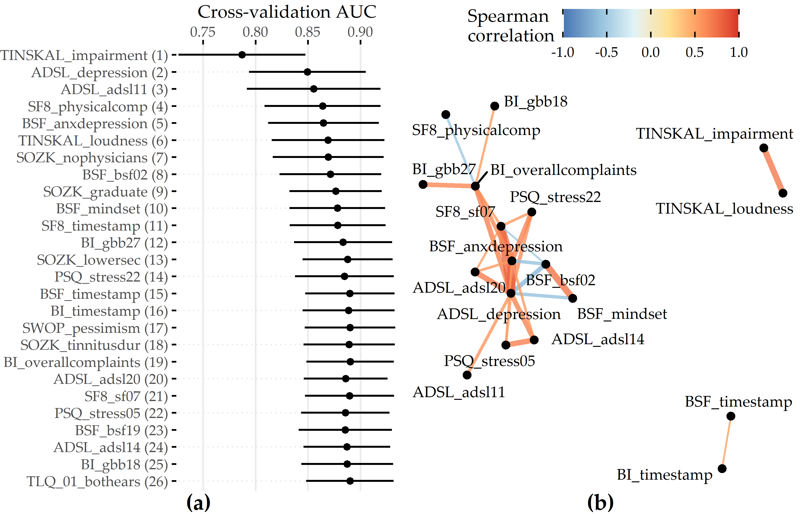
```


One potential explanation could be multicollinearity among groups of predictors.
Figure \@ref(fig:08-tq-xgboost-parsimonious)&nbsp;(b) shows a network of 3 predictor groups among the 26 features of the best model.
For example, the features TINSKAL\_impairment and TINSKAL\_loudness are moderately correlated (Spearman correlation $\rho$ = 0.69), which raises the question of whether one of the two predictors could be removed without a considerable loss in AUC.
The largest subgroup spanning 14 features involves descriptors of depression, perceived stress, and reported physical health.
In future work, an investigation of possible interaction effects among these moderately to strongly correlated features could be investigated to understand better why all of them were selected and to determine whether some of them could be removed to achieve a better tradeoff between model accuracy and complexity.

Our workflow leverages the potential of machine learning for identifying key predictors from a variety of features collected before treatment for post-treatment tinnitus compensation by ensuring that every potential predictor is included in the analysis and by the internal validation of the classification models using cross-validation and hyperparameter tuning.
Furthermore, by selecting various classification algorithm families, both linear and non-linear relationships between a feature and outcome could be identified.
A limitation of this hypothesis-free approach is that the learned models could contain features that quantify the same or similar patient characteristics.
For example, the best model in this study included the two highly correlated features ADSL\_depression and BSF\_anxdepression (anxious depressiveness score).
While the inclusion of both features contributed to the model performance, from a medical perspective, a predictive model with only certain features might be more beneficial. 
Preselecting features to avoid multicollinearity could be a direction for future work.

Finally, the exclusion of 2701 out of 4117 patients (65.6%) who did not complete _all_ 10 questionnaires could have resulted in selection bias.
Many patients spent more than one hour completing the questionnaire on a dedicated minicomputer and were, therefore, more likely to drop out of the completion process.
<!-- , partly because of a gradual loss of motivation to provide answers to a large number of questions, technical unfamiliarity with a computer, or interruptions by hospital staff who requested to continue with other baseline examinations. -->
Completers were slightly younger than non-completers (mean age 49.8 &plusmn; 12.2 vs. 51.7 &plusmn; 13.8), were more likely to have the highest German school degree "Abitur" (48.2% vs. 42.0%) and had been suffering from tinnitus longer (\> 5 years: 33.3% vs. 25.1%).
<!-- A detailed comparison between completers and non-completers can be found in \nameref{appendix:comparison-non-completers}.  -->
<!-- To our knowledge, no study has as yet investigated differential treatment responses in completers vs. non-completers;  -->
<!-- this can be explained by the absence of adequate information on the latter.  -->
In future work, we intend to investigate to what extent insights from completers can be used on subsamples of non-completers.
Therefore, we can use the DIVA framework of Hielscher et al. [@Hielscher2018].
However, psychological treatment approaches are likely to benefit only those who report psychological problems before tinnitus perception or associated with tinnitus perception.

### ANEUR {#iml-discussion-aneur}

Our classification results are promising, as morphological parameters alone can provide models with moderate power.
Because previous studies found that hemodynamic parameters are also predictive [@CebralEtAl:Neuroradiology2011; @BergBeuing:CARS2018], future work includes exploring the potential of combining morphologic and hemodynamic features for the classification of rupture status.
Because our focus, for now, has been on quantifying the merit of morphologic parameters, we have ignored demographic characteristics, such as age and sex, which also correlate strongly with aneurysm rupture  [@detmer2018development].
We expect that adding these patient characteristics will further improve classification performance.
<!-- tentative todo: könnte man gut bei verteidigung zeigen -->

PDP analysis shows that for the best model (gradient boosted trees), the parameters angle at the dome point $\gamma$, ellipticity index $EI$, maximum aneurysm width $W_{max}$, nonsphericity index $NSI$, and aneurysm area $A_{O2}$ have the highest attribution (see Figure \@ref(fig:08-pd-global-aneur)&nbsp;(a)).
These differ from those found for two subsets of sidewall and bifurcation aneurysms, respectively.
Figure&nbsp;\@ref(fig:08-pd-local-aneur) shows that none of the features appear among the top 5 predictors for sidewall aneurysms, bifurcation aneurysms, and the overall data set.
This is also partly because the family of the best model is different for each of the subsets.
Consequently, Figure&nbsp;\@ref(fig:08-pd-local-aneur-discussion) shows that the PDP curves for the top 5 features on ALL differ substantially.
Therefore, we argue that PDPs are more appropriate for _intra_-model comparisons of feature attributions.

(ref:08-pd-local-aneur-discussion) **PDP curves for top 5 predictors on ALL - GBT for each data subset's best model.**

```{r 08-pd-local-aneur-discussion, echo=FALSE, fig.align='center', out.width="100%", fig.cap="(ref:08-pd-local-aneur-discussion)"}
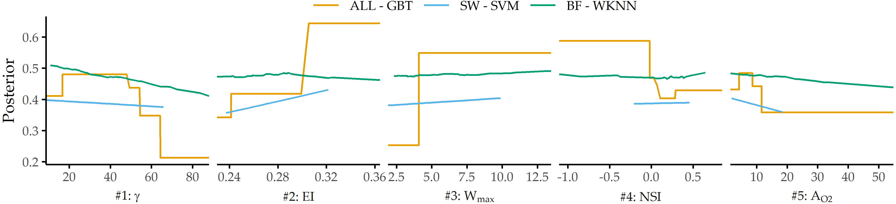
```

We observe that classification performance is consistently higher for the subset of sidewall aneurysms vs. bifurcation aneurysms and that different parameters are found to have high model attribution.
This could be partially due to the relatively small sample size or the already mentioned differences in model families.
However, Baharoglu et al. [@BaharogluEtAl:Neurosurgery2012] identified significant differences between sidewall and bifurcation aneurysms for morphological parameters and how they can predict rupture status.

Some of our findings also suggest some form of higher-level interactions between groups of features.
For example, the ellipticity index (\(EI\)) is found second most important for ALL - GBT and most important for SW - SVM, although differences in $EI$ between unruptured and ruptured aneurysms are not significant (p = 0.323, Wilcoxon rank-sum test, $\alpha$ = 0.01).

There are some limitations to our analysis.
The small sample size, especially for the subset of sidewall aneurysms (N=24), could lead to overfitting.
In future work, we would like to retrain our models on a larger number of datasets and incorporate a wider variety of predictors, such as hemodynamic and demographic features, as mentioned above.
A further limitation concerns the validity of the class label.
Samples that were labeled as unruptured could have ruptured at a later moment.
Further, we would like to investigate samples with a high classification error in more detail.
Here, our goal is to derive descriptions of aneurysms subgroups that are hard to classify to understand reasons for misclassification better and signalize to the medical expert that a manual diagnosis is necessary.

## Conclusion {#iml-conclusion}

The previous chapters present methods for subpopulation discovery that yield interpretable results.  
In the last years, more accurate black-box models have gained traction.
However, additional post-learning steps are required to interpret their behavior and extract actionable insights due to their opacity.

In this chapter, we have complemented the previous chapters' approaches by proposing an end-to-end data analysis workflow for high-dimensional medical data that includes steps for data augmentation, modeling, interleaving model training with feature elimination, and post-hoc analysis of the trained models. 
The post-mining step of the workflow removes the limitation for medical researchers of being limited to intrinsically interpretable model families by determining the key variables and the corresponding value ranges at the model-, subpopulation-, and observation-level _after_ model training.
Future work includes investigating the robustness and uncertainty the interpretability methods bring, described as "application-grounded" evaluation by Doshi-Velez and Kim [@Doshi-Velez:arxiv2017].

For some applications, there are already predefined subpopulations, e.g., female and male patients. 
It is interesting to study their differences regarding the relationship between features and the target variable for a black-box model. 
We tackle this issue in Chapter&nbsp;\@ref(gender).


<!-- **TODO: some discussion on the robustness**  -->

<!-- > Discussion of our approach: findings and outlook -->
<!-- > s What has been achieved for the support of the med experts -->
<!-- > What has been learned from the interaction with the medical experts -->
<!-- > What are promising next steps -->
<!-- > s robustness, pointer to ch9 -->
