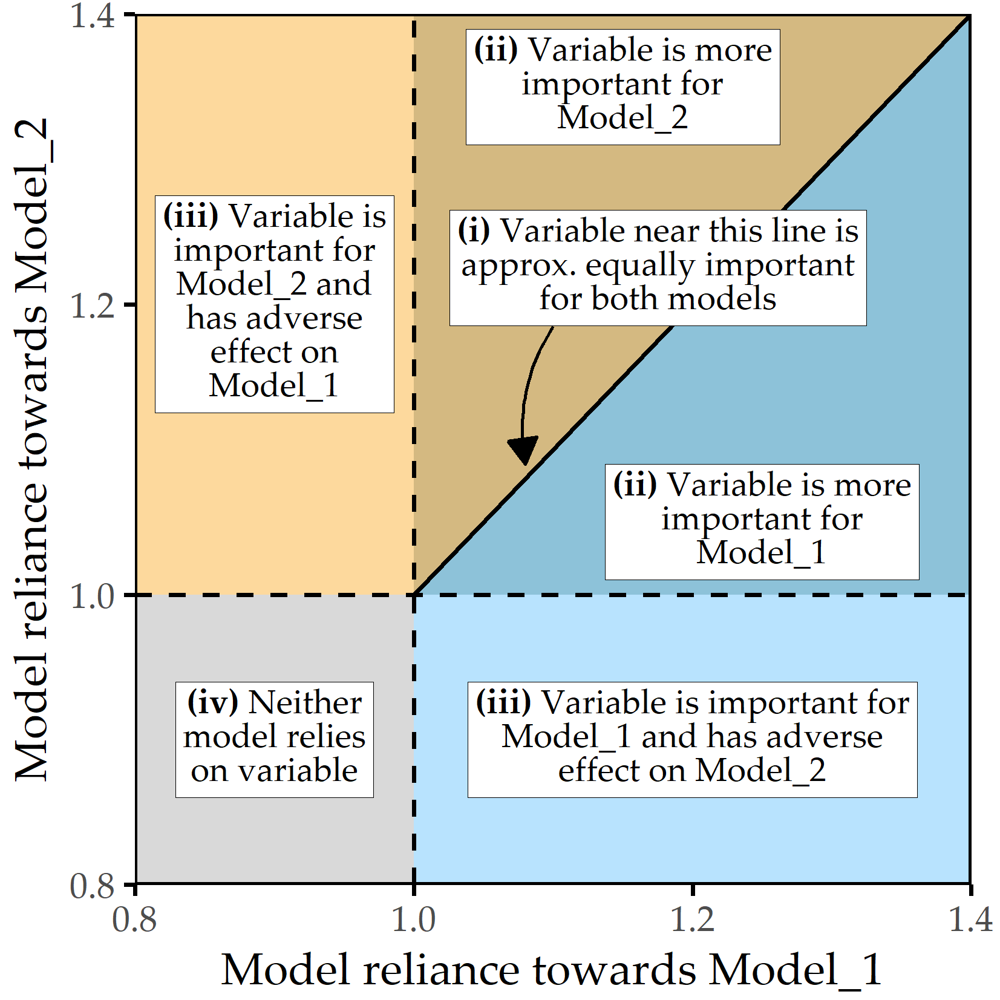
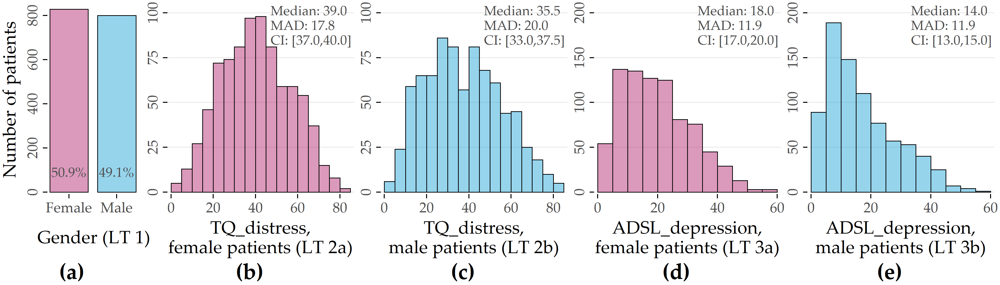
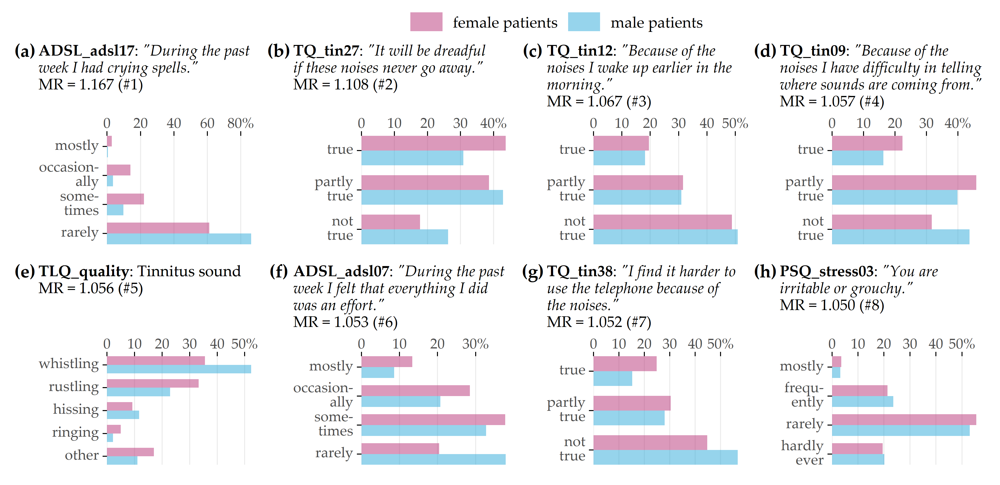
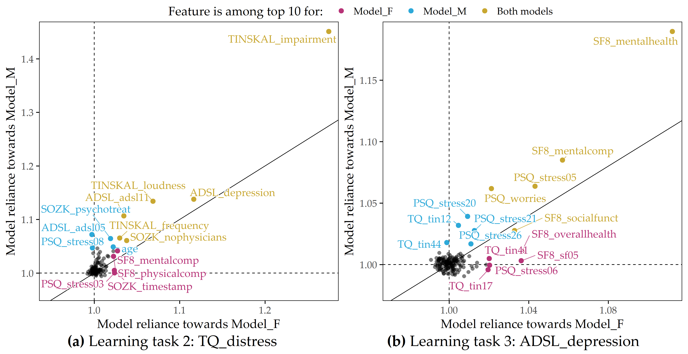
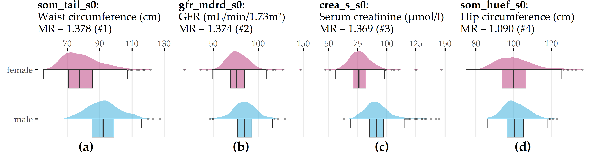
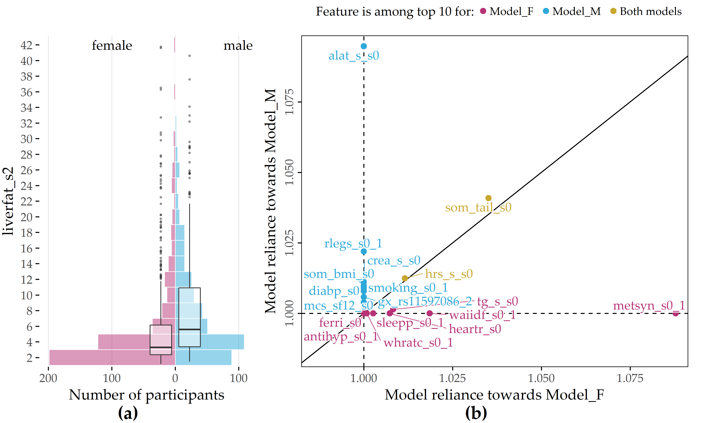

# Subpopulation-Specific Learning and Post-Hoc Model Interpretation {#gender}

```{r 09-setup, eval = TRUE, echo = FALSE, message = FALSE, results='asis'}
# source("code/00-chapter-start-bib.R")
# print_bib("Niemann:Frontiers2020", bib = bib)

# helper function for results tables (09-performance...)
library(dplyr)
library(stringr)
fix_table_entries <- function(x) {
  if(knitr::is_latex_output()) {
    x <- x %>%
      str_replace_all(" ", " \\\\textpm{} ") %>%
      str_replace_all("^b(.*)", "\\\\textbf{\\1}")
  } else {
    x <- x %>%
      str_replace_all(" ", " &#177; ") %>%
      str_replace_all("^b(.*)", "<b>\\1</b>")
  }
  return(x)
}

```

:::: {.infobox .chapter-summary data-latex="{tasks.pdf}"}

#### Brief Chapter Summary {-}

We present a workflow to examine differences between _two_ a priori defined subpopulations in temporal data. 
For this purpose, we derive a post-hoc interpretation measure to visually assess the difference in the features' relationship with the predicted target variable between two subpopulations. 
We validate our approach on two data samples and the target variables tinnitus distress (CHA), depression (CHA), and liver fat concentration (SHIP).
We determine gender-specific differences, i.e., we separate between discriminating features (i) for both, (ii) for one of the two, and (iii) neither of the subpopulations.

::::

:::: {.lit .chapter-literature data-latex=""}
This chapter is partly based on:

Uli Niemann, Benjamin Boecking, Petra Brueggemann, Birgit Mazurek, and Myra Spiliopoulou. "Gender-Specific Differences in Patients With Chronic Tinnitus -- Baseline Characteristics and Treatment Effects". In: _Frontiers in Neuroscience_ 14 (2020), pp. 1-11. DOI: [10.3389/fnins.2020.00487](https://doi.org/10.3389%2Ffnins.2020.00487).

::::

The previous chapter describes a workflow for the post-hoc analysis of models built on the entire population.
For several medical applications, there are either already established subpopulations that need further investigation, or it is unclear whether there are indeed differences between predefined subgroups of interest.

This chapter presents a workflow to explore how two disjoint subpopulations differ concerning their most predictive features.
First, we build machine learning models that separate between two subpopulations to identify informative features associated with either subpopulation. 
Then, for each subpopulation separately, we train models that predict the value of a target variable. 
We use a quantitative and a qualitative mechanism to compare differences in feature importance between the subpopulations. 
We validate our workflow on CHA and SHIP data samples.
For CHA, we investigate questionnaire items and scores predictive of tinnitus-related distress and depression. 
For SHIP, we identify variables from the baseline examinations that are potentially long-term determinants of fatty liver measured at the second follow-up ten years later.

This chapter is organized as follows. 
In Section&nbsp;\@ref(gender-intro), we motivate for subpopulation-specific model interpretation by discussing gender differences in tinnitus. 
Section&nbsp;\@ref(gender-workflow) presents the workflow.
Section&nbsp;\@ref(gender-measure) describes the measure to quantify and visualize subpopulation-specific model differences. 
Section&nbsp;\@ref(gender-learning-tasks) explains the validation setup, including learning tasks, selected learning algorithms, and dataset-specific preprocessing steps.
In Section&nbsp;\@ref(gender-results), we report our results and main findings. 
The chapter closes with a summary and a brief discussion in Section&nbsp;\@ref(gender-conclusion).

## Motivation and Comparison to Related Work {#gender-intro}

One example where the relationship between subpopulation membership on the target variable is not well understood yet is gender differences in tinnitus patients.
Female gender has been identified as an important risk factor for psychological comorbidities in many studies: women show higher prevalence rates regarding depression, anxiety, and other psychosomatic diseases [@Nolen:GenderDepression2001; @Piccinelli:GenderDepression2000; @Matud:GenderStress2004; @Jaussent:GenderInsomnia2011; @McLean:GenderAnxiety2011; @Asher:GenderAnxiety2017; @Langguth:Lancet2013]. 
However, previous studies presented conflicting results on the relationship between gender and tinnitus severity and distress.
Some studies found no gender differences with respect to tinnitus severity [@Erlandsson:Gender2001], annoyance [@Pinto:Gender2010], and similar tinnitus-related scores [@Meric:Gender1998]. 
Others found higher tinnitus distress in women [@Seydel:Gender2013], higher loudness and annoyance in men [@Hiller:Gender2006], a high association of severe tinnitus with suicide attempts only in women [@Lugo:Sex2019], and a high correlation of tinnitus severity with life quality, depression, and stress only in men [@Han:Gender2019].
Overall, there is no consensus on gender-specific determinants of prevalence rates or accompanying symptoms of chronic tinnitus such as depression or anxiety.
However, gender differences in psychological response profiles and coping strategies could substantially influence tinnitus chronification and treatment success rates [@vanderwal2020].
Understanding gender differences may therefore facilitate a more detailed identification of symptom profiles, increase treatment response rates, and help provide access for vulnerable populations who may be less visible in the clinical setting.

## Workflow {#gender-workflow}

We present a workflow consisting of a modeling component and a post-modeling component, extending the approach presented in Chapter&nbsp;\@ref(iml). 
More specifically, we (i) build machine learning models capable of predicting the values of a target variable while performing hyperparameter optimization in a cross-validation scheme, and (ii) use post-hoc interpretation mechanisms to identify variables that contributed most to the prediction of the best model. 
We deviate from the workflow presented earlier because we are interested in comparing a priori defined disjoint subpopulations instead of determining them. 

We proceed as follows. 
First, we train a model for each population where subpopulation membership is the target variable. 
Then, we build models for each subpopulation separately and compare model reliance values 
<!-- (recall Section&nbsp;\@ref(iml-workflow-fe))  -->
between the best performing models.
More specifically, we compare which variables appear to be important (i) for both subpopulations, (ii) for one of the two subpopulations, or (iii) for neither subpopulation. 
For example, we split a dataset into two non-overlapping based on the variable defining the subpopulations and validate our workflow by examining factors that discriminate between subpopulations and factors predictive for the response variable in both or either of the two subpopulations.

## Comparing Differences in Feature Importance between Two Subpopulations {#gender-measure}

To measure feature-individual attributions to a model's predictions and to compare them between two subpopulations, we use model reliance (MR; [@Fisher:ModelReliance2019]), which is described in the context of iterative feature elimination in Section&nbsp;\@ref(iml-workflow-fe). 
Recall that $MR(f,\zeta)$ is a permutation-based variable importance measure that calculates the increase in the error of a model $\zeta$ when the values of the variable of interest $f$ are randomly shuffled within the training set.
If $f$ is important for the prediction of $\zeta$, $MR(f,\zeta)$ \> 1.
If random permutation of the feature values leads to a higher performance of the model, then the feature's attribute to model quality is low, whereupon $MR$ \< 1.

For models that predict subpopulation membership, we rank features by MR value and report on the most important features.
For subpopulation-specific models, we use scatterplots (see Figure&nbsp;\@ref(fig:09-mr-legend)) depicting a feature's contribution (as $MR$ value) to the model Model\_1 (x-axis), which is trained on one subpopulation, and to the model Model\_2 (y-axis), trained on the other subpopulation.
Features that contribute equally to both models are on the diagonal line, while higher $MR$ values for one model are further from the diagonal.
The variables with the highest average $MR$ score or the highest difference magnitude between subpopulation-specific $MR$ scores are colored and labeled.

(ref:09-mr-legend) **Subpopulation-specific variable importance.** The position of a point represents the model reliance score of a variable for the best model trained on the respective subpopulation, denoted as Model\_1 (x-axis) and Model\_2 (y-axis). Higher values represent a higher attribution of a variable relative to the model prediction. There are four characteristic areas: (i) important variables with similar attributions to Model\_1 and Model\_2; (ii) important variables with higher attribution to one of the subpopulation-specific models; (iii) variables important to _either_ Model\_1 _or_ Model\_2 but adversarial to the other model; (iv) variables that are adversarial to both models.

```{r 09-mr-legend, echo=FALSE, fig.align='center', out.width=if(knitr::is_latex_output()){"50%"}else{"70%"}, fig.cap="(ref:09-mr-legend)"}

```

## Learning Tasks and Evaluation Setup {#gender-learning-tasks}

We validate our workflow on the Charité tinnitus patient dataset (CHA, Section&nbsp;\@ref(background-data-cha)) and the SHIP dataset (Section&nbsp;\@ref(background-data-ship)). 
We define five _learning tasks_ (LT) for the following response variables and subpopulations:

<!-- `r if(!knitr:::is_latex_output()) "\\begin{comment}"` -->
<!-- \begin{enumerate} -->
<!--   \item[\textbf{LT 1:}] gender (CHA) -->
<!--   \item[\textbf{LT 2:}] tinnitus-related distress (CHA) -->
<!--   \begin{enumerate} -->
<!--     \item[\textbf{LT 2a:}] female subpopulation -->
<!--     \item[\textbf{LT 2b:}] male subpopulation -->
<!--   \end{enumerate} -->
<!--   \item[\textbf{LT 3:}] depression (CHA) -->
<!--   \begin{enumerate} -->
<!--     \item[\textbf{LT 3a:}] female subpopulation -->
<!--     \item[\textbf{LT 3b:}] male subpopulation -->
<!--   \end{enumerate} -->
<!--   \item[\textbf{LT 4:}] gender (SHIP) -->
<!--   \item[\textbf{LT 5:}] liver fat concentration at second follow-up (SHIP) -->
<!--   \begin{enumerate} -->
<!--     \item[\textbf{LT 5a:}] female subpopulation -->
<!--     \item[\textbf{LT 5b:}] male subpopulation -->
<!--   \end{enumerate} -->
<!-- \end{enumerate} -->

<!-- `r if(!knitr:::is_latex_output()) "\\end{comment}"` -->

<!-- `r if(knitr:::is_latex_output()) "\\begin{comment}"` -->
- LT 1: gender (CHA)
- LT 2: tinnitus-related distress (CHA)
  - LT 2a: female subpopulation
  - LT 2b: male subpopulation
- LT 3: depression (CHA)
  - LT 3a: female subpopulation
  - LT 3b: male subpopulation
- LT 4: gender (SHIP)
- LT 5: liver fat concentration at second follow-up (SHIP)
  - LT 5a: female subpopulation
  - LT 5b: male subpopulation

<!-- `r if(knitr:::is_latex_output()) "\\end{comment}"` -->
LT 1 and LT 4 have gender as the target variable, and characteristics are identified that are predictive for one of the genders.
For each learning task, we use variables from the first study as predictors. 
For the learning tasks LT 2, LT 3, and LT 5, we build separate models for each of the two gender subpopulations. 
We refer to these models as "F\_model" and "M\_model", respectively; the learning task is explicitly stated if it cannot be inferred from the context.

`r start_paragraph("Selection of algorithms and evaluation.")`
Based on their encouraging performances relative to other classifiers in Chapter&nbsp;\@ref(iml), we use the following five algorithms:
least absolute shrinkage and selection operator (LASSO [@lasso]),
RIDGE [@ridge], support vector machine (SVM [@Boser:SVM1992]), random forest (RF [@Breiman:RandomForests2001]) and gradient boosted trees (GBT [@Friedman:PDP2001]), see Section&nbsp;\@ref(iml-workflow-modeling) for a description.
We use 10-fold cross-validation to evaluate model generalization performance and perform a grid search for hyperparameter selection (cf. listing of parameter candidates in Table&nbsp;\@ref(tab:08-hyper-tab)).
We choose the evaluation measures based on the type of the target variable. 
For LT 1, we employ accuracy and sensitivity for each gender.
For LT 2, we use root mean squared error (RMSE) and the coefficient of determination R^2^, defined as $R^2=1-\frac{\sum_{i=1}^N (\hat{y}_i-y_i)^2}{\sum_{i=1}^N(\bar{y}-y_i)^2}$, where $\bar{y}$ is the average response value. 
Higher values are better for all measures except RMSE.

For each learning task, we define a baseline performance. 
For the classification problem of LT 1 and LT 4, the baseline is equal to a model that always predicts the majority class over all training observations.
Similarly, for the regression problems of LT 2, 3, and 5, the average value of a target variable over all training observations is used to predict every test instance's response value. 

`r start_paragraph("Data preparation for CHA.")`
For CHA, we use baseline data collected before the start of therapy. 
To make the learning tasks nontrivial, we remove variables from the same questionnaire as the response variable for each task.
For example, for LT 2, we exclude all variables from the TQ questionnaire because the target variable is calculated from them.
We include 1628 patients (828 female, 800 male) with complete data for the ADSL, PSQ, SF8, SOZK, TINSKAL, TQ, and TLQ questionnaires (cf. Table&nbsp;\@ref(tab:02-cha-questionnaires)). 
The selection of these questionnaires is motivated to obtain a comprehensive assessment of tinnitus, comorbid conditions (e.g., depression), general quality of life, and socio-demographic data. 
For CHA and SHIP, multinomial variables, i.e., variables that take three or more symbolic values, such as reported gender, marital status, and education level, are encoded as dummy variables.
For example, smoking status smoking\_s0 can be one of the following values: 0 = never a smoker, 1 = ex-smoker, 2 = current smoker.
The dummy variable smoking\_s0\_1 then indicates whether a study participant is an ex-smoker.
To avoid multicollinearity, we remove the first dummy of each variable, leaving only n-1 dummies. 
For the smoking status example, we keep smoking\_s0_1 and smoking\_s0_2, and we remove smoking\_s0_0.
Finally, a total of 181 variables from the baseline measurements are used as predictors, including responses to individual questionnaire items, subscale scores, total scores, and, for each questionnaire, the average time taken to complete an item. 
Tinnitus-related distress is measured by the TQ total score (TQ\_distress).
The severity of depression is measured by the ADSL total score (ADSL\_depression).

`r start_paragraph("Data preparation for SHIP.")`
For the SHIP data, we consider only the variables recorded in SHIP-0 and use the liver fat concentration (liverfat\_s2) measured via MRT in SHIP-2. 
We use the same subset of 886 labeled participants as in Chapter&nbsp;\@ref(sdclu), of which 460 are female and 426 male. 
We remove the variables related to the ultrasound diagnosis of hepatic steatosis, stea\_s0 and stea\_alt75\_s0, because we have already identified their high correlation to the target in Chapters&nbsp;\@ref(imm) and&nbsp;\@ref(sdclu).
Furthermore, we remove "near-zero" variance variables where the most frequent value occurs at least 19 times more frequently than the second most frequent value. 
Typical examples include the ATC_\* medication variables where few participants report taking them. 
Variables with a variance near zero can lead to resampling problems because some of the resamples may have constant values for that variable. 
Besides, it is difficult to infer significant correlations from them, as it is unclear whether the measured effects can be generalized to the overall population or whether they are just an artifact of this small and thus unrepresentative sample. 
<!-- As an additional preprocessing step, we dummify multinomial variables, i.e., we extract multiple binary columns for variables that take three or more symbolic values.  -->
<!-- For example, smoking status smoking\_s0 can be one of the following values: 0 = never a smoker, 1 = ex-smoker, 2 = current smoker.  -->
<!-- The dummy variable smoking\_s0\_1 then indicates whether a study participant is an ex-smoker.  -->
<!-- To avoid problems related to multicollinearity in models, we remove the first dummy of each variable, leaving only n-1 dummies.  -->
<!-- For the smoking status example, we keep smoking\_s0_1 and smoking\_s0_2, and remove smoking\_s0_0. -->

Finally, we remove highly correlated features using the algorithm of Kuhn and Johnson [@kuhn2013applied]. 
We first compute the Pearson correlation coefficient for each pair of features. 
For feature pairs with an absolute correlation value of $r \geq$ 0.9, we keep the feature that has the lower average correlation with the other features. 
We repeat this process until none of the correlation values exceed the specified threshold. 
Of the original 350 variables, 118 remain to be used for modeling. 
Since determining the appropriate type of missingness for each variable is beyond our workflow's scope, we assume that missingness occurs completely at random (MCAR). 
Missing values are thus imputed by random sampling with replacement.

## Validation on Two Datasets {#gender-results}

### Results for CHA

`r start_paragraph("Distribution of the target variables.")`
Figure&nbsp;\@ref(fig:09-mr-lt23) shows the target variables' distributions for the CHA learning tasks (LTs) 1-3. 
There are slightly more female than male patients.
In general, female patients report higher levels of tinnitus-related distress (median &plusmn; median absolute deviation (MAD) 39.0 &plusmn; 17.8 vs. 35.5 &plusmn; 20.0) and depression (18.0 &plusmn; 11.9 vs. 14.00 &plusmn; 11.9). 
TQ\_distress and ADSL\_depression are right-skewed in each subpopulation.
Using the TQ cutoff of 46 for tinnitus distress [@GoebelHiller:TF1998], 34.1% of females and 30.8% of males show decompensated tinnitus.
Using the ADSL cutoff of 15 for depression severity [@Hautzinger:ADSL2003], 57.4% of female and 45.0% of male subjects exhibit clinical depression.

(ref:09-targets) **Distribution of target variables (LT 1-3)**. For the numerical targets, median, median absolute deviation (MAD), and non-parametric 95% confidence interval (CI) using bootstrap sampling [@DiCissio:Bootstrap1996] with 2000 samples are presented. 

```{r 09-targets, echo=FALSE, fig.align='center', out.width="100%", fig.cap="(ref:09-targets)"}

```

Tables&nbsp;\@ref(tab:09-performance-1)-\@ref(tab:09-performance-5) provide an overview of the generalization performances of each method for each learning task.

(ref:09-performance-1) **Classifier performance (LT 1).** Performance values are cross-validation mean &plusmn; standard deviation. The best performance for each measure is highlighted in bold. Sens. = Sensitivity.

```{r 09-performance-1, echo=FALSE}
kableExtra::kbl(
  tibble::tribble(
    ~algo, ~lt1_acc, ~lt1_sens_female, ~lt1_sens_male,
    "LASSO", "71.3 3.0", "69.5 4.2", "b73.2 4.9",
    "Ridge", "b72.2 2.9", "b71.4 5.5", "73.0 4.3",
    "SVM", "71.8 3.7", "70.9 5.2", "72.7 6.0",
    "RF", "68.6 5.2", "68.7 6.0", "68.6 7.1",
    "GBT", "70.4 3.4", "70.9 5.1", "69.7 6.2",
    "Baseline", "50.9 2.9", "100.0 0.0", "0.0 0.0"
  ) %>%
    mutate(across( everything(), fix_table_entries))
    ,
  escape = FALSE, booktabs = TRUE, 
  col.names = c("Algorithm", "Accuracy (\\%)", "Sens. female (\\%)", "Sens. male (\\%)"),
  align = "lrrr",
  caption = "(ref:09-performance-1)"
) %>%
  kableExtra::kable_classic() %>%
  kableExtra::row_spec(0, bold = TRUE) %>%
  kableExtra::row_spec(5, hline_after = TRUE, extra_css = "border-bottom: 1px solid #cdd0d4;") %>%
  kableExtra::row_spec(6, italic = TRUE)
```


`r start_paragraph("Learning task 1 (CHA, gender classification).")`
Ridge achieves best cross-validation accuracy (mean: 72.2% &plusmn; standard deviation: 2.9%) with a sensitivity of 71.4% &plusmn; 5.5% for female patients and 73.0 &plusmn; 4.3% for male patients.
Figure&nbsp;\@ref(fig:09-lt1-imp-features) illustrates the item response frequencies for the variables among the top 5% with respect to model reliance (MR), i.e., the 8 variables with the highest attribution to the model prediction. 
For each variable, the horizontal legend shows the corresponding text of the questionnaire item.
The vertical axis shows the responses to that item, and the horizontal axis depicts the relative frequency by gender. 
These frequencies are shown as bars, red-violet for female patients and blue for male patients.
A difference in the length of the two bars for the same answer means that the percentage of giving that response is different for each gender; thus, the variable is contributing to class separation.

The item ADSL\_adsl17 (Figure \@ref(fig:09-lt1-imp-features)&nbsp;(a)) is the most discriminating variable for the model (MR = 1.167): while 16% of female patients report having had crying spells either "mostly" or "occasionally" in the past week, only 4% of male patients do; they predominantly give the answer "rarely" (86.2%).
Female patients tend to express higher levels of worry (see Figures \@ref(fig:09-lt1-imp-features)&nbsp;(b) and \@ref(fig:09-lt1-imp-features)&nbsp;(f)) and subjective stress (see Figure&nbsp;\@ref(fig:09-lt1-imp-features)&nbsp;(h)).
Besides, there are gender-differences in tinnitus quality: More than half (52.4%) of all male patients report the tinnitus sound (MR = 1.056) as "whistling", which is substantially more frequent than in female patients (35.6%), who describe their tinnitus as "rustling" noise more often (33.3%) than male patients (22.9%).

(ref:09-lt1-imp-features) **Top 8 variables on gender (LT 1).** Gender-specific item response frequencies for the top 5% variables with the highest attribution towards model prediction according to model reliance (MR). 

```{r 09-lt1-imp-features, echo=FALSE, fig.align='center', out.width="100%", fig.cap="(ref:09-lt1-imp-features)"}

```


<!-- \subsection{Learning task 2: variables measuring depression, sleep problems, tinnitus frequency and loudness were associated with tinnitus-related distress in both genders (RQ3)} -->

`r start_paragraph("Learning task 2 (CHA, tinnitus distress prediction).")`
For LT 2, we ran the five algorithms once for the female patients (LT 2a) and once for the male patients (LT 2b). 
Table&nbsp;\@ref(tab:09-performance-2) shows RMSE and R^2^ for each algorithm.
For both LT 2a and LT 2b, GBT exhibits the best performance in terms of RMSE (LT 2a: 10.92 &plusmn; 0.68, LT 2b: 10.11 &plusmn; 1.12) and R^2^ (LT 2a: 0.55 &plusmn; 0.04, LT 2b: 0.68 &plusmn; 0.06).
It is noticeable that GBT and the other models are slightly more accurate for male patients than for females.
The highest MR feature attribution is achieved by TINSKAL\_impairment, i.e., the TINSKAL visual analog scale for tinnitus impairment. 
Figure \@ref(fig:09-mr-lt23)&nbsp;(a) illustrates that MR scores are higher for male patients (MR = 1.42 vs. 1.24).
Furthermore, the variables ADSL\_depression (depression), ADSL\_adsl11 (sleep problems), and TINSKAL\_loudness (tinnitus loudness) appear to be important for both models.
It is noteworthy that the MR scores of most of the 120 variables are close to 1, which is visualized by the clump of points in Figure \@ref(fig:09-mr-lt23)&nbsp;(a).
In fact, only 8 variables exhibit a substantial attribution with MR \> 1.05 for either of the gender-specific models.

(ref:09-performance-2) **Regression model performance (LT 2a, LT 2b).** Performance values are cross-validation mean &plusmn; standard deviation. The best performance for each measure is highlighted in bold. 

```{r 09-performance-2, echo=FALSE}
kableExtra::kbl(
  tibble::tribble(
    ~algo, ~lt2_female_rmse, ~lt2_female_r2, ~lt2_male_rmse, ~lt2_male_r2,
    "LASSO", "11.55 0.70", "0.50 0.04", "10.59 0.98", "0.65 0.05",
    "Ridge", "11.59 0.63", "0.50 0.04", "10.72 1.05", "0.64 0.06",
    "SVM", "11.97 0.51", "0.46 0.03", "11.21 1.02", "0.61 0.06",
    "RF", "11.38 0.74", "0.51 0.05", "10.58 1.01", "0.65 0.06",
    "GBT", "b10.92 0.68", "b0.55 0.04", "b10.11 1.12", "b0.68 0.06",
    "Baseline", "16.22 1.38", "0.00 0.00", "17.77 1.00", "0.00 0.00",
  ) %>%
    mutate(across( everything(), fix_table_entries))
  ,
  escape = FALSE, booktabs = TRUE, 
  col.names = c("Algorithm", "RMSE", "R²", "RMSE", "R²"),
  align = "lrrrr",
  caption = "(ref:09-performance-2)"
) %>%
  kableExtra::kable_classic() %>%
  kableExtra::row_spec(0, bold = TRUE) %>%
  kableExtra::add_header_above(
    header = c(" " = 1, 
               "LT 2a (female)" = 2, 
               "LT 2b (male)" = 2), bold = TRUE) %>%
  kableExtra::row_spec(5, hline_after = TRUE, extra_css = "border-bottom: 1px solid #cdd0d4;") %>%
  kableExtra::row_spec(6, italic = TRUE)
```

(ref:09-mr-lt23) **Juxtaposition of variable importance (LT 2 and LT 3)**. Each scatterplot shows the model reliance (MR) score for each predictor for the best model for each of the subpopulations of female (x-axis) and male (y-axis) patients and for each learning task; see Figure&nbsp;\@ref(fig:09-mr-legend). Variables among the top 10 highest-ranking variables by MR in the F\_model (red-violet), M\_model (blue), or both models (yellow) are highlighted. (a) LT 2 (CHA, response: tinnitus-related distress); (b) LT 3 (CHA, response: depression severity).

```{r 09-mr-lt23, echo=FALSE, fig.align='center', out.width="100%", fig.cap="(ref:09-mr-lt23)"}

```

<!-- \subsection{Learning task 3: indicators of mental health, stress and worries associated with depression in both genders (RQ3)} -->
`r start_paragraph("Learning task 3  (CHA, depression prediction).")`
For depression severity, LASSO provides the best model for both female patients (RMSE = 5.80 &plusmn; 0.73; R^2^ = 0.74 &plusmn; 0.06) and male patients (RMSE = 5.10 &plusmn; 0.38; R^2^ = 0.81 &plusmn; 0.03), as depicted in Table&nbsp;\@ref(tab:09-performance-3).
Similar to LT2, the RMSE and R^2^ estimates for the models are consistently better for the subgroup of male patients.
Figure \@ref(fig:09-mr-lt23)&nbsp;(b) shows that the mental health indicator SF8\_mentalhealth is the most important predictor for both the F\_model and the M\_model.
Furthermore, features measuring subjective stress (PSQ\_stress05: _"You feel lonely or isolated."_), worry (PSQ\_worries score), and vitality (SF8\_sf05: _"How much energy have you had in the last 4 weeks?"_) contribute substantially to the predictions of both genders' models.

(ref:09-performance-3) **Regression model performance (LT 3a, LT 3b).** Performance values are cross-validation mean &plusmn; standard deviation. The best performance for each measure is highlighted in bold. 

```{r 09-performance-3, echo=FALSE}
kableExtra::kbl(
  tibble::tribble(
    ~algo, ~lt3_female_rmse, ~lt3_female_r2, ~lt3_male_rmse, ~lt3_male_r2,
    "LASSO", "b5.80 0.73", "b0.74 0.06", "b5.10 0.38", "b0.81 0.03",
    "Ridge", "5.88 0.65", "b0.74 0.06", "5.14 0.38", "0.80 0.03",
    "SVM", "6.12 0.72", "0.71 0.06", "5.29 0.38", "0.79 0.03",
    "RF", "6.02 0.62", "0.72 0.05", "5.29 0.46", "0.79 0.04",
    "GBT", "6.10 0.65", "0.72 0.06", "5.16 0.42", "0.80 0.04",
    "Baseline", "11.36 0.78", "0.00 0.00", "11.52 0.47", "0.00 0.00"
  ) %>%
    mutate(across( everything(), fix_table_entries))
    ,
  escape = FALSE, booktabs = TRUE, 
  col.names = c("Algorithm", "RMSE", "R²", "RMSE", "R²"),
  align = "lrrrr",
  caption = "(ref:09-performance-3)"
) %>%
  kableExtra::kable_classic() %>%
  kableExtra::row_spec(0, bold = TRUE) %>%
  kableExtra::add_header_above(
    header = c(" " = 1, 
               "LT 3a (female)" = 2, 
               "LT 3b (male)" = 2), bold = TRUE) %>%
  kableExtra::row_spec(5, hline_after = TRUE, extra_css = "border-bottom: 1px solid #cdd0d4;") %>%
  kableExtra::row_spec(6, italic = TRUE)
```

<!-- While all models of LT 1, 2a, 2b, 3a and 3b outperformed the baselines, neither of the models predicting the treatment effect of tinnitus-related distress (LT4a and LT4b) or depression (LT5a and LT5b) was significantly better than the baselines. -->

### Results for SHIP

`r start_paragraph("Learning task 4 (SHIP, gender classification).")`
Table&nbsp;\@ref(tab:09-performance-4) shows that LASSO performs best in terms of accuracy (99.4% &plusmn; 0.8%) and sensitivity for the male class (99.5% &plusmn; 1.0%), while GBT achieves the highest sensitivity for the female class (99.6% &plusmn; 0.9%). 
All regression models outperform the baseline, which constantly predicts the female majority class (51.9% &plusmn; 4.8%).
Figure&nbsp;\@ref(fig:09-lt4-imp-features) depicts the distributions of the 4 features with an MR score of at least 1.05 for the LASSO model. 
The two anthropometric measures, waist circumference (som\_tail\_s0) and hip circumference (som\_huef\_s0), appear to be predictive of the gender of the study participant. 
From Figure \@ref(fig:09-lt4-imp-features)&nbsp;(a), it can be inferred that, in general, men have a higher waist circumference than women (median: 92.2 cm vs. 77.5 cm).
While the median hip circumferences are similar (f: 99.8 cm, m: 100.0 cm), it can be seen in Figure \@ref(fig:09-lt4-imp-features)&nbsp;(d) that the distribution of women has a wider spread and more values beyond the distribution tails of men, i.e., values below 86 cm and above 123 cm.
The second most important feature, gfr\_mdrd\_s0, is the glomerular filtration rate, a measure of overall renal function that describes the flow rate of filtered fluid through the kidney. 
Figure \@ref(fig:09-lt4-imp-features)&nbsp;(b) shows that gfr\_mdrd\_s0 is generally higher in men, consistent with the literature [@hannemann2012age]. 
The third most important feature, crea\_s\_s0 (Figure \@ref(fig:09-lt4-imp-features)&nbsp;(c)), measures serum creatinine concentration, another indicator of renal function, which is higher in men [@crea]. 

(ref:09-performance-4) **Classifier performance (LT 4).** Performance values are cross-validation mean &plusmn; standard deviation. The best performance for each measure is highlighted in bold. Sens. = Sensitivity.

<!-- Asterisks signify models with significantly better cross-validation performance compared to the baseline with respect to accuracy using independent right-tailed Student's t-test with \[\alpha\] = 0.05. -->

<!-- using independent one-tailed Student's t-test (right-tailed for accuracy; left-tailed for RMSE) -->

```{r 09-performance-4, echo=FALSE}
kableExtra::kbl(
  tibble::tribble(
    ~algo, ~lt1_acc, ~lt1_sens_female, ~lt1_sens_male,
    "LASSO", "b99.4 0.8", "99.4 1.0", "b99.5 1.0",
    "Ridge", "98.2 1.9", "98.1 2.0", "98.3 2.3",
    "SVM", "99.1 0.9", "98.9 1.1", "99.3 1.2",
    "RF", "96.6 2.5", "98.3 1.9", "94.9 4.1",
    "GBT", "99.3 0.8", "b99.6 0.9", "99.1 1.2",
    "Baseline", "51.9 4.8", "100.0 0.0", "0.0 0.0"
  ) %>%
    mutate(across( everything(), fix_table_entries))
    ,
  escape = FALSE, booktabs = TRUE, 
  col.names = c("Algorithm", "Accuracy (\\%)", "Sens. female (\\%)", "Sens. male (\\%)"),
  align = "lrrr",
  caption = "(ref:09-performance-4)"
) %>%
  kableExtra::kable_classic() %>%
  kableExtra::row_spec(0, bold = TRUE) %>%
  kableExtra::row_spec(5, hline_after = TRUE, extra_css = "border-bottom: 1px solid #cdd0d4;") %>%
  kableExtra::row_spec(6, italic = TRUE)
```

(ref:09-lt4-imp-features) **Top 4 variables on gender (LT 4).** Gender-specific item response frequencies for the 4 variables with the highest attribution towards model prediction according to model reliance (MR). For crea\_s\_s0, an outlier (creas\_s\_s0 = 281) was removed to preserve plot readability. GFR = glomerular filtration rate.

```{r 09-lt4-imp-features, echo=FALSE, fig.align='center', out.width="100%", fig.cap="(ref:09-lt4-imp-features)"}

```

`r start_paragraph("Learning task 5 (SHIP, prediction of liver fat concentration).")`
The target variable liver fat\_s2 is highly right-skewed in each gender subpopulation (Figure \@ref(fig:09-ship)&nbsp;(a)).
For example, whereas the lower half of the females' distribution lies between 1.18% and 3.29%, the upper half has a much wider spread, ranging between 3.29% and 41.8%. 
Males have a higher median liver fat concentration (5.57%) than females (3.29%). 
In the female subpopulation (LT 5a), LASSO performs best in terms of RMSE (5.76 &plusmn; 1.05) and R^2^ (0.23 &plusmn; 0.12), whereas GBT achieves a minimum RMSE (6.02 &plusmn; 1.11) and a maximum R^2^ (0.20 &plusmn; 0.16) in the male subpopulation (LT 5b), see Table&nbsp;\@ref(tab:09-performance-5). 
All regression models for LT 5a outperform the baseline predicting subpopulation mean liver fat concentration. 
Only SVM performs worse on the RMSE than the baseline for LT 5b.

Figure \@ref(fig:09-ship)&nbsp;(b) visualizes the LASSO models' MR scores for the female and male subpopulations. 
Waist circumference (som\_tail\_s0) and serum uric acid concentration (hrs\_s\_s0) are the only predictors that appear among the top 10 features in both subpopulations. 
Of note, several features are considerably responsible for model predictions in one subpopulation but not the other, as illustrated by the points near the horizontal and vertical dashed lines. 
Recall that these lines indicate MR = 1, which expresses that a feature neither contributes to nor hinders model performance. 

Waist circumference (som\_tail\_s0) and serum uric acid concentration (hrs\_s\_s0) are the only predictors that appear among the top 10 features in both subpopulations. 
The feature metabolic syndrome (metsyn\_s0\_1) appears to be predictive only for the female subpopulation. 
Indeed, the Pearson point biserial correlation of metsyn\_s0\_1 and liverfat\_s2 is $r$ = 0.44 for the female subpopulation, which is considerably larger than for the male subpopulation, where $r$ = 0.22. 
Similarly, the feature alat\_s_s0, which measures alanine aminotransferase (ALAT) concentration, is more informative of liver fat concentration in the male subpopulation ($r$ = 0.38 in men vs $r$ = 0.16 in women). 
Furthermore, important characteristics for women are increased waist circumference categorization (waiidf\_s0\_1; waist circumference $\geq$ 80 cm; cutoff is 94 cm for men), serum triglyceride concentration (tq\_s\_s0), heart rate (heartr\_s0), sleep problems (sleepp\_s0\_1), waist-to-hip ratio (whratc\_s0\_1), antihypertensive medication (antihyp\_s0\_1), and ferritin concentration (ferri\_s0).
In men, other features with the highest model attribution include restless legs syndrome (rlegs\_s0\_1), serum creatinine concentration (crea\_s0\_s0), body mass index (som\_bmi\_s0), diastolic blood pressure (diabp\_s0), smoking status (smoking\_s0\_1), the genetic marker rs11597086 (gx\_rs11597086\_2) which is associated with ALAT concentration [@yuan2008population], and the "SF-12 Physical and Mental Health Summary Scale" score (mcs\_sf12\_s0; [@bullinger1995german]).
In females (males), for 10 (16) of 116 features, it holds that MR $\geq$ 1. These numbers are identical to the number of features with a nonzero coefficient in the respective LASSO models.

<!-- s0_Transformierte_Variablen_20150311_v06.pdf -->
<!-- ship_data_dictionary.json -->

(ref:09-ship) **Distribution of target variable and variable importance (LT 5)**. (a) Distribution of liverfat\_s2 for the subset of female and male SHIP participants. (b) Each scatterplot shows the model reliance (MR) score for each predictor for the best model for each of the subpopulations of female (x-axis) and male (y-axis) patients and each learning task; see Figure&nbsp;\@ref(fig:09-mr-legend). Variables among the top 10 highest-ranked variables by MR in the F\_model (red-violet), M\_model (blue), or both models (yellow) are highlighted. alat\_s\_s0: alanine aminotransferase (ALAT) concentration; antihyp\_s0\_1: antihypertensive medication; crea\_s\_s0: serum creatinine concentration; diabp\_s0: diastolic blood pressure; ferri\_s0: ferritin concentration; gx\_rs11597086\_2: genetic marker associated with ALAT concentration [@yuan2008population]; heartr\_s0: heart rate; hrs\_s\_s0: serum uric acid concentration; mcs\_sf12\_s0: SF-12 Physical and Mental Health Summary Scale [@bullinger1995german]; metsyn\_s0\_1: metabolic syndrome; rlegs\_s0\_1: restless legs syndrome; sleepp\_s0\_1: sleep problems; smoking\_s0\_1: ex-smoker; som\_bmi\_s0: body mass index; som\_tail\_s0: waist circumference; tg\_s\_s0: serum triglycerides concentration; waiidf\_s0\_1: increased waist circumference; whratc\_s0\_1: waist to hip ratio.

<!-- (ref:09-mr-lt23) **Juxtaposition of variable importance (LT 2 and LT 3)**. Each scatterplot shows the model reliance (MR) score for each predictor for the best model for each of the subpopulations of female (x-axis) and male (y-axis) patients and for each learning task; see Figure&nbsp;\@ref(fig:09-mr-legend). Variables among the top-10 highest-ranking variables by MR in the F\_model (red-violet), M\_model (blue), or both models (yellow) are highlighted. (a) LT 1 (response: tinnitus-related distress TQ\_distress); (b) LT 2 (response: depression severity ADSL\_depression). -->

```{r 09-ship, echo=FALSE, fig.align='center', out.width="100%", fig.cap="(ref:09-ship)"}

```

(ref:09-performance-5) **Regression model performance (LT 5a, LT 5b).** Performance values are cross-validation mean &plusmn; standard deviation. The best performance for each measure is highlighted in bold. 

<!-- Asterisks signify models with significantly better cross-validation performance compared to the baseline with respect to RMSE using independent left-tailed Student's t-test with \[\alpha\] = 0.05. -->

```{r 09-performance-5, echo=FALSE}
kableExtra::kbl(
  tibble::tribble(
    ~algo, ~lt2_female_rmse, ~lt2_female_r2, ~lt2_male_rmse, ~lt2_male_r2,
    "LASSO", "b5.76 1.05", "b0.23 0.12", "6.18 1.18", "0.16 0.22",
    "Ridge", "5.89 1.09", "0.20 0.11", "6.39 1.13", "0.11 0.17",
    "SVM", "6.03 1.09", "0.17 0.13", "6.76 1.29", "0.02 0.09",
    "RF", "5.88 1.06", "0.20 0.10", "6.18 1.06", "0.16 0.17",
    "GBT", "6.02 0.88", "0.14 0.16", "b6.02 1.11", "b0.20 0.16",
    "Baseline", "6.48 1.04", "0.00 0.00", "6.71 1.21", "0.00 0.00"
  ) %>%
    mutate(across( everything(), fix_table_entries))
  ,
  escape = FALSE, booktabs = TRUE, 
  col.names = c("Algorithm", "RMSE", "R²", "RMSE", "R²"),
  align = "lrrrr",
  caption = "(ref:09-performance-5)"
) %>%
  kableExtra::kable_classic() %>%
  kableExtra::row_spec(0, bold = TRUE) %>%
  kableExtra::add_header_above(
    header = c(" " = 1, 
               "LT 5a (female)" = 2, 
               "LT 5b (male)" = 2), bold = TRUE) %>%
  kableExtra::row_spec(5, hline_after = TRUE, extra_css = "border-bottom: 1px solid #cdd0d4;") %>%
  kableExtra::row_spec(6, italic = TRUE)
```

## Conclusion {#gender-conclusion}

We have presented a workflow to juxtapose the most important predictors between two a priori defined subpopulations based on black-box models.
We have adapted model reliance to estimate a feature's attribution regarding the model and to investigate subpopulation-specific differences in this respect. 
Compared to the workflow in Chapter&nbsp;\@ref(iml), our goal was not to find a parsimonious model; hence we did not perform feature selection. 

Our goals are related to _causal inference_, which aims to measure the true, _unconfounded_ effect between variables.
Current efforts include building methods to detect causal relationships in observational data [@Pearl:BookOfWhy2018; @scholkopf2019causality], opposed to a randomized clinical trial (RCT) in clinical research. 
RCTs are considered the gold standard for inferring causal effects of treatment [@hariton2018].
In an RCT, individual patients of a patient population are randomly assigned to one of two subgroups: a _treatment_ subgroup and a _control_ subgroup.
Only the former receives the treatment.
Randomization of subgroup membership serves to minimize the effects of potential confounders and selection bias. 
The two subgroups are as similar as possible before the intervention so that it is possible to calculate the _average treatment effect_ to quantify the true causal efficacy of the treatment [@Hernan:CausalityBook2020]. 
Translated to our application, an appropriate causality question is: _What is the effect of gender on tinnitus severity and depression?_
However, our goal was different: we wanted to exploratively examine similarities and differences between subpopulations regarding factors that are predictive of a response of interest. 
Thus, we were interested not only in the relationship of gender on the response, but also in differences between the female and male subpopulations in the predictability of other variables on the response. 
With the generation of new hypotheses as the main goal in mind, our focus is on providing exploratory methods for comparing differences between predefined subpopulations. 
