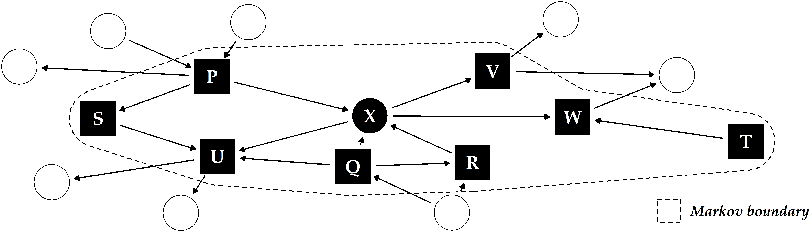

# (PART) CONCLUSION {-}

# Summary and Future Work {#conclusion}

_Data-driven_ machine learning solutions can complement the traditionally _hypothesis-driven_ workflows of medical research by discovering characteristic _subpopulations_ of patients and study participants.
Knowledge about characteristic subpopulations can be the starting point for further investigation, e.g., identifying (long-term) risk factors, determining differences in treatment response, and building robust statistical models that explain cause-effect relationships for a medical condition of interest.

This thesis has proposed solutions to assist expert-driven subpopulation discovery in high-dimensional timestamped medical data. 
Section&nbsp;\@ref(conclusion-summary) reviews whether we have addressed our core research question and the three challenges presented in Chapter&nbsp;\@ref(intro).
Finally, we discuss directions for future work in&nbsp;Section&nbsp;\@ref(conclusion-future-work).

## Summary {#conclusion-summary}

Our solutions for subpopulation discovery in Part&nbsp;`r if(knitr::is_latex_output()){"\\ref{part-subpopulation-discovery-in-high-dimensional-data}"}else{"I"}` have tackled the challenge:

**GOAL1:** _Comprehensibility and distinctiveness of subpopulations_

We have dealt with this challenge by proposing the three workflows presented in Chapters&nbsp;\@ref(imm), \@ref(sdclu), and&nbsp;\@ref(phenotypes).

Chapter&nbsp;\@ref(imm) has presented a workflow and an interactive application for subpopulation discovery in cohort data. 
By leveraging classification rules, our workflow enables building self-explaining and concise descriptions of subpopulations with distributions regarding the target variable.
Our application _Interactive Medical Miner_ allows for interactive expert-driven subpopulation discovery with features to drill-down on the derived models and explore subpopulations worthy of further investigation.
As a proof of concept, we have validated our workflow on a SHIP dataset, focusing on hepatic steatosis ("fatty liver") as the target variable.
We have confirmed variables and value ranges shown to be associated with the target variable, including obesity, age, sex, high serum concentrations of the liver enzyme Gamma-glutamyltransferase (GGT), and genetic markers. 

Chapter&nbsp;\@ref(sdclu) has extended this workflow by tackling the problem of redundancy in large rule sets, introducing an algorithm that extracts a small number of representative classification rules.
These so-called _proxy rules_ minimize instance overlap across rule groups, thus covering different subpopulations. 
We have demonstrated that our algorithm delivers _more distinct_ rules compared to the baselines on SHIP data samples with hepatic steatosis and goiter as target variables, respectively. 
Besides the variables found in Chapter&nbsp;\@ref(imm), the conditions of proxy rules involve hypertension and low physical health for hepatic steatosis, and high intima-media thickness and angiotensin II receptor blocker intake for goiter.

The solutions in Chapters&nbsp;\@ref(imm) and&nbsp;\@ref(sdclu) assume the availability of a target variable, which in many medical applications is unknown or too costly to obtain. 
Hence, Chapter&nbsp;\@ref(phenotypes) has proposed a workflow for unsupervised subpopulation discovery, visualization, and interactive exploration in the absence of a ground truth. 
This workflow (i) exploits a clustering algorithm that automatically determines an appropriate number of clusters, (ii) provides visualization techniques that show essential characteristics of high-dimensional clusters compactly, and (iii) serves medical experts with a web application to further investigate and juxtapose the found subpopulations further, including treatment effect indicators. 
We have showcased our workflow's efficacy by identifying and juxtaposing four distinct tinnitus patient _phenotypes_ in the CHA dataset.

While the aforementioned solutions are designed primarily for static data, Part&nbsp;`r if(knitr::is_latex_output()){"\\ref{part-exploiting-dynamics}"}else{"II"}` of this thesis has addressed the exploitation of temporal information in medical data, translated to the challenge:  

**GOAL2:** _Exploitation of time_

We have presented our solutions to this challenge in Chapters&nbsp;\@ref(evo) and&nbsp;\@ref(diabfoot).

Chapter&nbsp;\@ref(evo) has proposed a framework to extract evolution features from timestamped medical data, i.e., tiny streams with up to five time points that are months or years apart (which is often the case in population studies). 
These change descriptors quantify the study participants' change over time. 
We have shown that augmenting the original feature space with evolution features improves classification performance.
Using a SHIP data sample, 
we have shown that somatic changes and changes of cluster quality indices over time are associated with hepatic steatosis. 

Chapter&nbsp;\@ref(diabfoot) has focused on data with many recordings over a short time period and proposes a clustering approach to build representations from new similarity measures applicable to raw multivariate (sensor) timeseries. 
We have validated our approach by identifying plantar pressure patterns in patients with diabetic foot syndrome and healthy volunteers. 

Part `r if(knitr::is_latex_output()){"\\ref{part-post-mining-for-interpretation}"}else{"III"}` has presented solutions for models that cannot be interpreted intrinsically. 
Because medical decisions have serious consequences, more accurate models are increasingly preferred in research as they suggest a higher degree of confidence in their output.
However, post-modeling methods are needed to translate the findings of these black-box models into an expert-understandable form, leading to the challenge:

**GOAL3:** _Post-hoc interpretation of complex black-box models_

Chapter&nbsp;\@ref(iml) has proposed an end-to-end data analysis workflow with steps for data augmentation, modeling, interleaving model training with feature elimination, and post-hoc analysis of the trained models.
Our workflow yields (for any type of model) statistics and visualizations representing global feature importance, instance-individual feature importance, and subpopulation-specific feature importance.
We have validated our workflow on three modeling tasks: (i) tinnitus-related distress after treatment in tinnitus patients, (ii) depression at baseline in tinnitus patients, and (iii) rupture risk in intracranial aneurysms.

Finally, Chapter&nbsp;\@ref(gender) has presented a solution to examine how pre-defined subpopulations differ concerning their most predictive characteristics. 
We have derived a post-hoc interpretation measure to assess differences in the predictors' associations between two subpopulations. 
We have validated our solution by finding gender and sex differences (subpopulations of female and male patients) for the target variables tinnitus-related distress, depression, and liver fat concentration.

## Future Work {#conclusion-future-work}

`r start_paragraph("Causal subpopulation discovery.")`
While our machine learning solutions can initiate the generation of new hypotheses, 
they are limited to discovering mere _associations_ between variables, not _cause-effect relationships_.
For example, we have shown that depression strongly correlates with distress in tinnitus patients (recall Chapters&nbsp;\@ref(phenotypes) and&nbsp;\@ref(iml)). 
The _direction_ of the relationship cannot be inferred -- does tinnitus distress cause depression or vice versa? 
Or can the correlation instead be explained by a _confounder_, i.e., a "lurking" third variable, such as low physical health or socioeconomic status?
Pearl and Mackenzie&nbsp;[@Pearl:BookOfWhy2018] give an example of the _Simpson's paradox_, a phenomenon where traditional correlation analysis even contradicts true cause-effect relationships.
When considering only pairwise relationships, the data suggested that people who exercise more had increased cholesterol levels. 
However, this relationship was masked by age.
Older participants exhibited higher activity levels in the study population.
In an age-stratified analysis, it became evident that more exercise leads to a decrease in cholesterol levels. 

In causal inference, relationships between variables are modeled as a directed acyclic graph (DAG) where the nodes represent the variables and the edges the direction of causality [@Hernan:CausalityBook2020; @Pearl:BookOfWhy2018].
Schölkopf&nbsp;[@scholkopf2019causality] described potential links between machine learning and causal inference. 
Yu et al.&nbsp;[@yu2020causality] reviewed causal feature selection methods, which assume that the optimal feature subset for a target variable is equal to its _Markov boundary_. 
The Markov boundary comprises nodes with outgoing (_parents_) or incoming (_children_) edges to the target and other parents of child nodes (_spouses_) in the DAG (Figure&nbsp;\@ref(fig:10-markov-boundary)). 
The assumption is that by conditioning on a target variable's Markov boundary, all other variables in the DAG become independent of the target [@yu2020causality]. 
Hence, a possible direction for future work is to investigate the potential of combining our methods with causal inference, for example, by leveraging causal feature selection for predictive modeling. 
Here, we are interested in determining whether features in the Markov boundary are sufficient to predict the response and how causal approaches compare against their non-causal counterparts regarding classification performance.

(ref:10-markov-boundary) **Illustrative example of a directed acyclic graph and Markov boundary for the target X.** The other labeled variables P-W constitute the Markov boundary of X, consisting of its parents, children and any additional parents of its children ("spouses").

```{r 10-markov-boundary, echo=FALSE, fig.align='center', out.width="100%", fig.cap="(ref:10-markov-boundary)"}

```

`r start_paragraph("Domain adaption.")`
For the time being, the findings on the datasets investigated in this thesis cannot be replicated on other datasets.
For example, we expect that the models of our evolution feature framework (Chapter&nbsp;\@ref(evo)) built for SHIP will perform poorly when applied to data samples from other population studies, such as MONICA [@who1988world], KORA [@holle2005kora], or the Rotterdam Study [@hofman2009rotterdam]. 
_Domain adaption_ deals with transferring knowledge from the _source_ to the _target domain_. 
Lemberger and Panico [@lemberger2020primer] summarized four major challenges in domain adaption:

- _Prior shift_ refers to a difference between the source (A) and the target (B) domain in the target variable's distribution. For example, in this situation, the liver fat concentration in A is (on average) higher than in B. This could be due to differences in sampling, e.g., when for A, a higher percentage of subjects with pre-existing conditions were drawn. 
- _Covariate shift_ refers to a difference in the predictors' distributions in A and B, while the relationships between the predictors and the target variable are assumed to be the same. For example, subjects in A are older than subjects in B, while at the same time, a high body mass index is predictive in both domains.
- _Concept shift_ refers to a difference in the relationship between the predictors and the target variable. For example, while in A, smoking is observed in subjects with increased liver fat concentration, smokers in B generally exhibit lower liver fat values than non-smokers.
- _Subspace mapping_ refers to the situation where the feature sets in A and B are different. For example, hepatic steatosis is determined by ultrasound in A and by MRT in B. Besides, different questionnaires were used in A and B to assess life quality, and neither of the questionnaires in A was used in B and vice versa. 

Future efforts include leveraging methods from domain adaption, for example, to transfer the tinnitus phenotypes from Chapter&nbsp;\@ref(phenotypes) detected in CHA to patient data of other tinnitus centers with different baseline characteristics.

`r start_paragraph("Parsimonious and cost-aware learning.")` Our methods disregard the fact that features are not always available for free. 
Feature acquisition in medical research is associated with certain _costs_, divided into the financial expense and the health burden for the patient undergoing a potentially painful and invasive examination [@kachuee2019costsensitive].
<!-- Costs can be measured not only by the financial expense of a test, but also by the inconvenience for a subject undergoing an examination.  -->
For example, a biopsy usually has a higher diagnostic value than a simple blood test but is also more expensive and physically and mentally stressful for the patient. 
Yu et al. [@yu2020controlling] perform feature selection under a budget to balance model performance and feature acquisition cost. 
Consequently, their models favor cheaper features like demographics and questionnaire responses over costly ones requiring more expensive or strenuous physical examinations or laboratory tests. 
Recall Chapters&nbsp;\@ref(imm) and&nbsp;\@ref(sdclu), where both somatic and ultrasound variables appeared in the classification rules describing subpopulations with increased liver fat concentration. 
Our methods do not distinguish between variables of simple body measurements (e.g., to obtain a participant's waist circumference or body weight) and elaborate imaging procedures. 
Future research includes implementing mechanisms to enable cost-aware learning.

