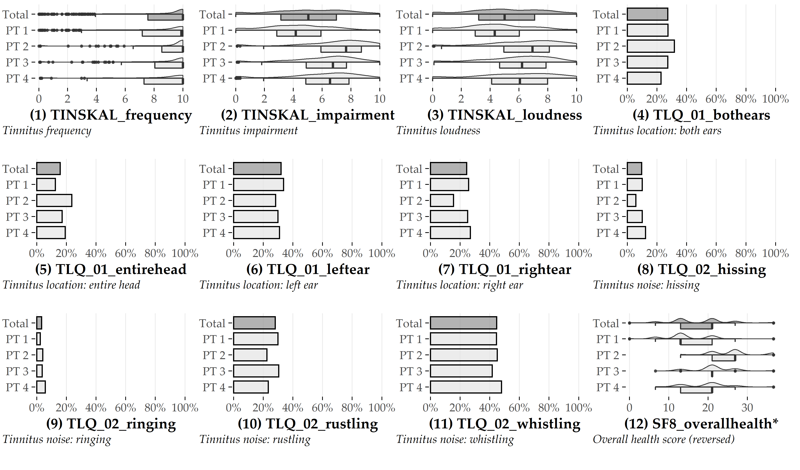
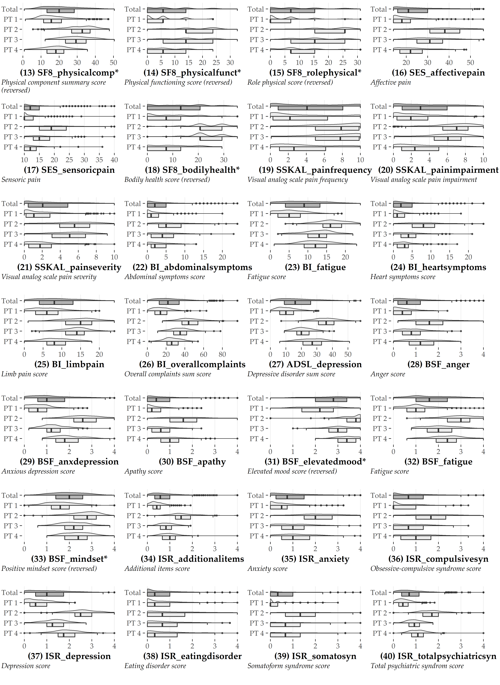
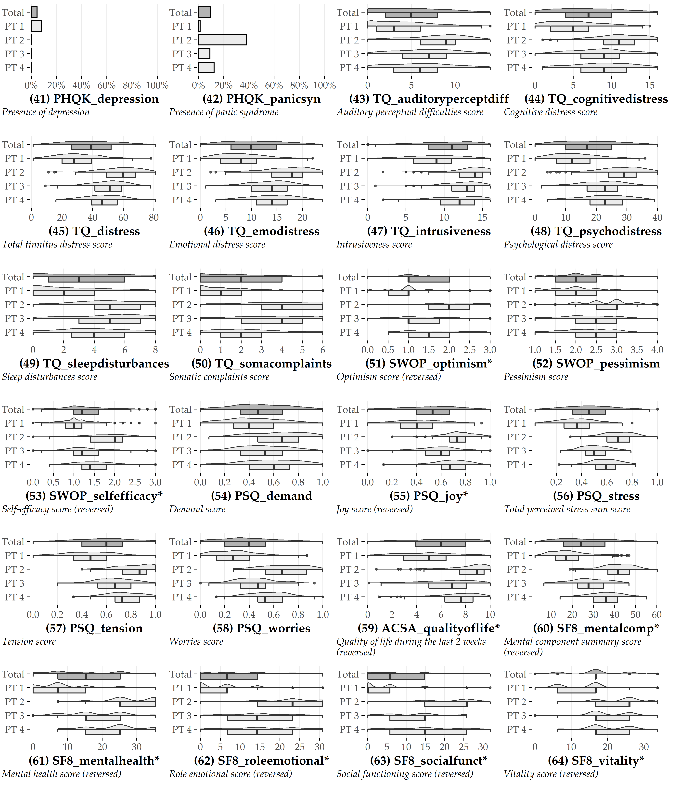

# Overview of Variables Selected for Phenotyping {#appx-pheno}

For each of the 64 variables selected for phenotyping in Chapter&nbsp;\@ref(phenotypes), phenotype-stratified distributions and a brief description are shown below.
Half-violin/half-boxplot geometries represent numerical variables; 
bar graphs represent categorical variables.
The order of the variables is analogous to the clockwise arrangement in Figures&nbsp;\@ref(fig:05-all-radial-barcharts-export) and&nbsp;\@ref(fig:05-radar).
Variables with an asterisk at the end of their name were reversed to ensure higher scores consistently represent higher health burden across all variables. 

The prefix of a variable's name denotes the respective questionnaire: 
ACSA: Anamnestic Comparative Self-Assessment [@Bernheim:ACSA1993]; 
ADSL: General Depression Scale [@Radloff:adsl1977; @Hautzinger:ADSL2003];
BI: Berlin Complaint Inventory [@Horhold:BI1997];
BSF: Berlin Mood Questionnaire [@Horhold:BSF1993];
ISR: ICD-10 Symptom Rating [@Tritt:ICD2008];
PHQK: (Short-form) Patient Health Questionnaire [@Spitzer:PHQK1999];
PSQ: Perceived Stress Questionnaire [@Fliege:PSQ2005];
SES: Pain Perception Scale [@Geissner:SES1996];
SF8: Short Form 8 Health Survey [@Bullinger:SF2008];
SOZK: A socio-demographics questionnaire [@brueggemann:sozk-reference];
SWOP: Self-Efficacy- Optimism-Pessimism Scale questionnaire [@Scholler:SWOP1999];
TINSKAL: Visual analog scales;
TLQ: Tinnitus Localization and Quality questionnaire [@Goebel:TLQ1992];
TQ: Tinnitus Questionnaire (German version) [@GoebelHiller:TF1998].

```{r 93-p1, echo=FALSE, fig.align='center', out.width="100%"}

```

```{r 93-p2, echo=FALSE, fig.align='center', out.width="100%"}

```

```{r 93-p3, echo=FALSE, fig.align='center', out.width="100%"}

```

<!-- - ACSA\_qualityoflife\*: Quality of life during the last 2 weeks -->
<!-- - ADSL\_depression: Depressive disorder sum score -->
<!-- - BI\_abdominalsymptoms: Abdominal symptoms score -->
<!-- - BI\_fatigue: Fatigue score -->
<!-- - BI\_heartsymptoms: Heart symptoms score -->
<!-- - BI\_limbpain: Limb pain score -->
<!-- - BI\_overallcomplaints: Overall complaints sum score -->
<!-- - BSF\_anger: Anger score -->
<!-- - BSF\_anxdepression: Anxious depression score -->
<!-- - BSF\_apathy: Apathy score -->
<!-- - BSF\_elevatedmood\*: Elevated mood score -->
<!-- - BSF\_fatigue: Fatigue score -->
<!-- - BSF\_mindset\*: Positive mindset score -->
<!-- - ISR\_additionalitems: Additional items score -->
<!-- - ISR\_anxiety: Anxiety score -->
<!-- - ISR\_compulsivesyn: Obsessive-compulsive syndrome score -->
<!-- - ISR\_depression: Depression score -->
<!-- - ISR\_eatingdisorder: Eating disorder score -->
<!-- - ISR\_somatosyn: Somatoform syndrome score -->
<!-- - ISR\_totalpsychiatricsyn: Total psychiatric syndrome score -->
<!-- - PHQK\_depression: Presence of depression -->
<!-- - PHQK\_panicsyn: Presence of panic syndrome -->
<!-- - PSQ\_demand: Demand score -->
<!-- - PSQ\_joy\*: Joy score -->
<!-- - PSQ\_stress: Total perceived stress sum score -->
<!-- - PSQ\_tension: Tension score -->
<!-- - PSQ\_worries: Worries score -->
<!-- - SES\_affectivepain: Affective pain -->
<!-- - SES\_sensoricpain: Sensoric pain -->
<!-- - SF8\_bodilyhealth\*: Bodily health score -->
<!-- - SF8\_mentalcomp\*: Mental component summary score -->
<!-- - SF8\_mentalhealth\*: Mental health score -->
<!-- - SF8\_overallhealth\*: Overall health score -->
<!-- - SF8\_physicalcomp\*: Physical component summary score -->
<!-- - SF8\_physicalfunct\*: Physical functioning score -->
<!-- - SF8\_roleemotional\*: Role emotional score -->
<!-- - SF8\_rolephysical\*: Role physical score -->
<!-- - SF8\_socialfunct\*: Social functioning score -->
<!-- - SF8\_vitality\*: Vitality score -->
<!-- - SSKAL\_painfrequency: Visual analog scale pain frequency -->
<!-- - SSKAL\_painimpairment: Visual analog scale pain impairment -->
<!-- - SSKAL\_painseverity: Visual analog scale pain severity -->
<!-- - SWOP\_optimism\*: Optimism score -->
<!-- - SWOP\_pessimism: Pessimism score -->
<!-- - SWOP\_selfefficacy\*: Self-efficacy score -->
<!-- - TINSKAL\_frequency: Tinnitus frequency -->
<!-- - TINSKAL\_impairment: Tinnitus impairment -->
<!-- - TINSKAL\_loudness: Tinnitus loudness -->
<!-- - TLQ\_01\_bothears: Tinnitus location: both ears -->
<!-- - TLQ\_01\_entirehead: Tinnitus location: entire head -->
<!-- - TLQ\_01\_leftear: Tinnitus location: left ear -->
<!-- - TLQ\_01\_rightear: Tinnitus location: right ear -->
<!-- - TLQ\_02\_hissing: Tinnitus noise: hissing -->
<!-- - TLQ\_02\_ringing: Tinnitus noise: ringing -->
<!-- - TLQ\_02\_rustling: Tinnitus noise: rustling -->
<!-- - TLQ\_02\_whistling: Tinnitus noise: whistling -->
<!-- - TQ\_auditoryperceptdiff: Auditory perceptual difficulties score -->
<!-- - TQ\_cognitivedistress: Cognitive distress score -->
<!-- - TQ\_distress: Total tinnitus distress score -->
<!-- - TQ\_emodistress: Emotional distress score -->
<!-- - TQ\_intrusiveness: Intrusiveness score -->
<!-- - TQ\_psychodistress: Psychological distress score -->
<!-- - TQ\_sleepdisturbances: Sleep disturbances score -->
<!-- - TQ\_somacomplaints: Somatic complaints score -->
