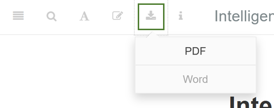

`r if(!knitr:::is_html_output()) '<!--'`

# Preface {.unnumbered}

`r rmarkdown::metadata$description`

Use the navigation bar at the top to download the complete manuscript as PDF or Word document.

```{r 00_navigation-download, echo=FALSE, out.width="50%", include=knitr::is_html_output(), out.extra='style="background-color: #000000; padding:1px;"'}

```

## Timeline {.unnumbered}

<iframe width="600px" max-width="100%" height="300px" src="https://docs.google.com/spreadsheets/d/e/2PACX-1vRPYVbwFC1moei3kda9ONwnIonZLVXU1rczkQZ-1wS2rfHxdgN5FSfwE-G5sHv33WZUcdnTXuictySO/pubhtml?gid=0&amp;single=true&amp;widget=true&amp;headers=false"></iframe>

[Google Spreadsheet](https://docs.google.com/spreadsheets/d/1GYhEgQLxlNm5qJtD7QhNaAR1s7wsV_A-FDOLP6hFAA0/edit?usp=sharing)

`r if(!knitr:::is_html_output()) '-->'`


## Structure {.unnumbered}

1 Thesis Overview\
1.1 Motivation\
1.2 Medical Applications\
1.3 Open Challenges\
1.4 Structure and Summary of Contributions\

**PART I SUBPOPULATION DISCOVERY**

2 Interactive discovery and inspection of subpopulations\
2.1 The SHIP dataset\
2.2 Motivation and comparison with related work\
2.3 Subpopulation discovery workflow and interactive mining assistant\
2.4 Experiments and findings\
2.5 Benefits of our workflow\

3 Identifying diverse subpopulations\
3.1 Motivation and comparison with related work\
3.2 Finding diverse classification rules\
3.3 Experiments and findings\
3.4 Benefits our our method\

**PART II EXPLOITING TEMPORAL INFORMATION**

4 Constructing evolution features to capture change over time\
4.1 Motivation and comparison with related work\
4.2 Overview of the mining workflow\
4.3 Generating evolution features\
4.4 Experiments and findings\
4.5 Benefits our our method\

5 Feature extraction from short temporal sequences for clustering\
5.1 The diabatic foot dataset\
5.1 Motivation and comparison with related work 5.2 Overview of the mining workflow\
5.3 Experiments and findings\
5.4 Benefits our our method\

**PART III POST-MINING FOR INTERPRETATION**

6 Post-hoc interpretation of classification models\
6.1 Motivation and comparison with related work\
6.2 The aneurysm dataset\
6.3 The tinnitus dataset\
6.2 Overview of the mining workflow\
6.3 Experiments and findings on aneurysm data\
6.4 Experiments and findings on tinnitus data\
6.5 Benefits our our method\

**PART IV SUMMARY**

7 Conclusion and future work\
7.1 Research results for medical expert-guided knowledge discovery\
7.2 Future work\

**PART V APPENDIX**

Bibliography\
List of publications\
Abbreviations\

<!-- # Prerequisites {-} -->

<!-- This is a _sample_ book written in **Markdown**. You can use anything that Pandoc's Markdown supports, e.g., a math equation $a^2 + b^2 = c^2$. -->

<!-- The **bookdown** package can be installed from CRAN or Github: -->

```{r prereq-install-bookdown, echo = FALSE, eval=FALSE}
install.packages("bookdown")
install.packages("citr")
# or the development version
# devtools::install_github("rstudio/bookdown")
```

<!-- Remember each Rmd file contains one and only one chapter, and a chapter is defined by the first-level heading `#`. -->

<!-- To compile this example to PDF, you need XeLaTeX. You are recommended to install TinyTeX (which includes XeLaTeX): <https://yihui.name/tinytex/>. -->

```{r prereq-write-bib, include=FALSE, eval=FALSE}
# automatically create a bib database for R packages
knitr::write_bib(c(
  .packages(), 'bookdown', 'knitr', 'rmarkdown'
), 'packages.bib')
```
